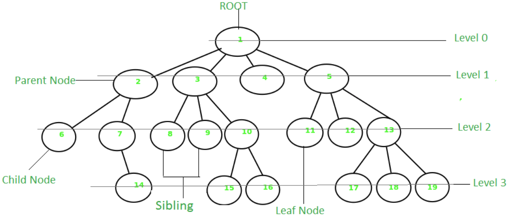
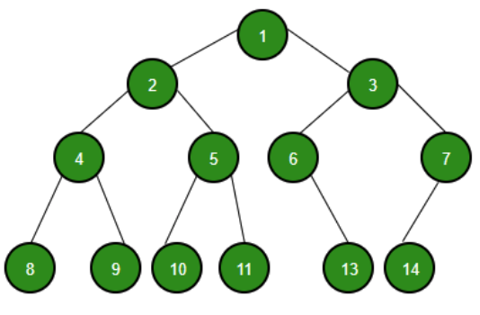
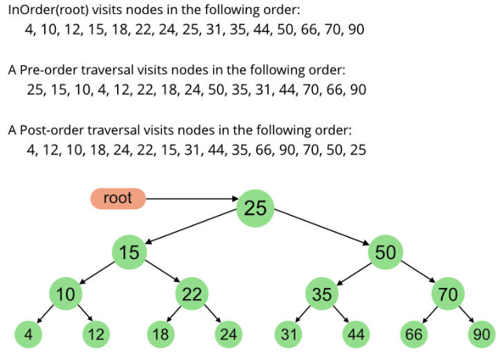

- [Basic](#basic)
- [Binary Tree](#binary-tree)
  - [Representation](#representation)
  - [Operations](#operations)
  - [Traversals](#traversals)
    - [Inorder, Preorder and Postorder](#inorder-preorder-and-postorder)
    - [Inorder Tree Traversal without Recursion](#inorder-tree-traversal-without-recursion)
    - [Inorder Tree Traversal without Recursion & Stack*](#inorder-tree-traversal-without-recursion--stack)
    - [Level Order Binary Tree Traversal](#level-order-binary-tree-traversal)
    - [Iterative Preorder Traversal](#iterative-preorder-traversal)
    - [Morris Traversal for Preorder](#morris-traversal-for-preorder)
    - [Iterative Postorder Traversal](#iterative-postorder-traversal)
    - [BFS vs DFS for Binary Tree](#bfs-vs-dfs-for-binary-tree)
    - [Inorder Successor of a node in Binary Tree](#inorder-successor-of-a-node-in-binary-tree)
    - [Diagonal Traversal of Binary Tree](#diagonal-traversal-of-binary-tree)
  - [Binary Search Tree](#binary-search-tree)
  - [AVL Tree](#avl-tree)
  - [Red-Black Tree](#red-black-tree)
  - [Huffman Tree](#huffman-tree)
  - [Heap](#heap)
    - [Operations of Heap](#operations-of-heap)
    - [Application of Heap Data Structure](#application-of-heap-data-structure)
    - [Advantages of Heap Data Structure:](#advantages-of-heap-data-structure)
    - [Disadvantages of Heap Data Structure:](#disadvantages-of-heap-data-structure)
    - [Heap Package in Go](#heap-package-in-go)
      - [heap.Init](#heapinit)
      - [heap.Push](#heappush)
      - [heap.Pop](#heappop)
      - [heap.Fix](#heapfix)
      - [heap.Remove](#heapremove)
  - [Thread Binary Tree](#thread-binary-tree)
- [B Tree](#b-tree)

# Basic

`Tree` data structure is similar to a tree we see in nature but it is upside down. It also has a `root` and `leaves`. The root is the first node of the tree and the leaves are the ones at the bottom-most level. The special characteristic of a tree is that there is only one path to go from any of its nodes to any other node.



Based on the maximum number of children of a node of the tree it can be – 

- Binary tree – This is a special type of tree where each node can have a maximum of `2` children.
- Ternary tree – This is a special type of tree where each node can have a maximum of `3` children.
- N-ary tree – In this type of tree, a node can have at most `N` children.

Based on the configuration of nodes there are also several classifications. Some of them are:

- Complete Binary Tree – In this type of binary tree all the levels are filled except maybe for the last level. But the last level elements are filled as left as possible.
- Perfect Binary Tree – A perfect binary tree has all the levels filled
- [Binary Search Tree](#binary-search-tree) – A binary search tree is a special type of binary tree where the smaller node is put to the left of a node and a higher value node is put to the right of a node
- Ternary Search Tree – It is similar to a binary search tree, except for the fact that here one element can have at most 3 children.

# Binary Tree

Binary Tree is defined as a Tree data structure with at most `2` children. Since each element in a binary tree can have only 2 children, we typically name them the left and right child.



## Representation

A Binary tree is represented by a pointer to the topmost node of the tree. If the tree is empty, then the value of the root is NULL.

Binary Tree node contains the following parts:

- Data
- Pointer to left child
- Pointer to right child

In Go, we can represent a tree node using structures. Below is an example of a tree node with integer data.

```go
type Node struct {
    Val   int
    Left  *Node
    Right *Node
}
```

## Operations

> Basic Operation On Binary Tree:

- Inserting an element.
- Removing an element.
- Searching for an element.
- Traversing an element. There are three types of traversals in a binary tree which will be discussed ahead.

> Auxiliary Operation On Binary Tree:

- Finding the height of the tree
- Find the level of the tree
- Finding the size of the entire tree.

> Applications of Binary Tree:

- In compilers, Expression Trees are used which is an application of binary tree.
- Huffman coding trees are used in data compression algorithms.
- Priority Queue is another application of binary tree that is used for searching maximum or minimum in O(1) time complexity.

> Binary Tree Traversals:

- PreOrder Traversal: Here, the traversal is: `root – left child – right child`. It means that the root node is traversed first then its left child and finally the right child.
- InOrder Traversal: Here, the traversal is: `left child – root – right child`.  It means that the left child is traversed first then its root node and finally the right child.
- PostOrder Traversal: Here, the traversal is: `left child – right child – root`.  It means that the left child is traversed first then the right child and finally its root node.

## Traversals

Unlike linear data structures (`Array`, `Linked List`, `Queues`, `Stacks`, etc) which have only one logical way to traverse them, trees can be traversed in different ways. Following are the generally used methods for traversing trees:



### Inorder, Preorder and Postorder

Inorder Traversal:

Algorithm Inorder(tree)

- Traverse the left subtree, i.e., call Inorder(left->subtree)
- Visit the root.
- Traverse the right subtree, i.e., call Inorder(right->subtree)

Uses of Inorder Traversal:

In the case of `binary search trees (BST)`, Inorder traversal gives nodes in non-decreasing order. To get nodes of BST in non-increasing order, a variation of Inorder traversal where Inorder traversal is reversed can be used. 

Example: In order traversal for the above-given figure is 4 2 5 1 3.

```go
// TreeNode Definition for a binary tree node.
type TreeNode struct {
	Val   int
	Left  *TreeNode
	Right *TreeNode
}

func printInOrder(root *TreeNode) {
	if root == nil {
		return
	}
	
	printInOrder(root.Left)
	fmt.Printf("%d ", root.Val)
	printInOrder(root.Right)
}
```

Preorder Traversal: 

Algorithm Preorder(tree)

- Visit the root.
- Traverse the left subtree, i.e., call Preorder(left->subtree)
- Traverse the right subtree, i.e., call Preorder(right->subtree) 
  
Uses of Preorder:

Preorder traversal is used to create a copy of the tree. Preorder traversal is also used to get `prefix expressions` on an expression tree.

Example: Preorder traversal for the above-given figure is 1 2 4 5 3.

```go
func printPreOrder(root *TreeNode) {
	if root == nil {
		return
	}

	fmt.Printf("%d ", root.Val)
	printPreOrder(root.Left)
	printPreOrder(root.Right)
}
```

Postorder Traversal: 

Algorithm Postorder(tree)

- Traverse the left subtree, i.e., call Postorder(left->subtree)
- Traverse the right subtree, i.e., call Postorder(right->subtree)
- Visit the root

Uses of Postorder:

Postorder traversal is used to delete the tree. Please see the question for the deletion of a tree for details. Postorder traversal is also useful to get the postfix expression of an expression tree

Example: Postorder traversal for the above-given figure is 4 5 2 3 1

```go
func printPostOrder(root *TreeNode) {
	if root == nil {
		return
	}

	fmt.Printf("%d ", root.Val)
	printPostOrder(root.Left)
	printPostOrder(root.Right)
}
```

output:

```go
Preorder traversal of binary tree is 
1 2 4 5 3 
Inorder traversal of binary tree is 
4 2 5 1 3 
Postorder traversal of binary tree is 
4 5 2 3 1 
```

Time Complexity: O(N)

Auxiliary Space: If we don’t consider the size of the stack for function calls then O(1) otherwise O(h) where h is the height of the tree. 

Note: The height of the skewed tree is n (no. of elements) so the worst space complexity is O(N) and the height is (Log N) for the balanced tree so the best space complexity is O(Log N).

### Inorder Tree Traversal without Recursion

### Inorder Tree Traversal without Recursion & Stack*

### Level Order Binary Tree Traversal

### Iterative Preorder Traversal

### Morris Traversal for Preorder

### Iterative Postorder Traversal

### BFS vs DFS for Binary Tree

### Inorder Successor of a node in Binary Tree

### Diagonal Traversal of Binary Tree

## Binary Search Tree
## AVL Tree
## Red-Black Tree
## Huffman Tree
## Heap

`Heap` is a special `tree-based` data structure where the tree is always a `complete binary tree`. Heaps are of two types: `Max heap` and `Min heap`. In the case of the max-heap, the root node will have a higher value than its subtree, and for the min-heap, the root node will have a lower value than its subtree.

### Operations of Heap

- Heapify: a process of creating a heap from an array.
- Insertion: process to insert an element in existing heap time complexity $O(log N)$.
- Deletion: deleting the top element of the heap or the highest priority element, and then organizing the heap and returning the element with time complexity $O(log N)$.
- Peek: to check or find the most prior element in the heap, (max or min element for max and min heap).

### Application of Heap Data Structure

- Heap is used to construct a `priority queue`.
- Heap sort is one of the fastest sorting algorithms with time complexity of $O(N* log(N)$, and it’s easy to implement.
- `Best First Search (BFS)` is an informed search, where unlike the queue in Breadth-First Search, this technique is implemented using a priority queue.
- Patient treatment: In a hospital, an emergency patient, or the patient with more injury is treated first. Here the priority is the degree of injury.
- Systems concerned with security use heap sort, like the Linux kernel.

### Advantages of Heap Data Structure:

- Less time complexity, for inserting or deleting an element in the heap the time complexity is just $O(log N)$.
- It helps to find the minimum number and greatest number.
- To just peek at the most prior element the time complexity is constant $O(1)$.
- Can be implemented using an array, it doesn’t need any extra space for pointer.
- A binary heap is a balanced binary tree, and easy to implement.
- Heap can be created with $O(N)$ time.

### Disadvantages of Heap Data Structure:

- The time complexity for searching an element in Heap is $O(N)$.
- To find a successor or predecessor of an element, the heap takes $O(N)$ time, whereas BST takes only $O(log N)$ time.
- To print all elements of the heap in sorted order time complexity is $O(N*log N)$, whereas, for BST, it takes only $O(N)$ time.
- Memory management is more complex in heap memory because it is used globally. Heap memory is divided into two parts-old generations and the young generation etc. at java garbage collection.

### Heap Package in Go

`container/heap` package 為 `heap.Interface` 型別實現了 heap methods:

- Init
- Push
- Pop
- Remove
- Fix

```go
type Interface interface {
	sort.Interface
	Push(x interface{}) // add x as element Len()
	Pop() interface{}   // remove and return element Len() - 1.
}
```

`container/heap` 為 `minimum-heap`, 即:

> A heap is a tree with the property that each node is the minimum-valued node in its subtree

由於 `heap.Interface` 包含了 `sort.Interface`, 所以目標型別需要包含如下方法:

- Len, Less, Swap
- Push, Pop

`cointainer/heap` package 主要用於構建 priority queue:

```go
// An Item is something we manage in a priority queue.
type Item struct {
	value    string // The value of the item; arbitrary.
	priority int    // The priority of the item in the queue.
	// The index is needed by update and is maintained by the heap.Interface methods.
	index int // The index of the item in the heap.
}

// A PriorityQueue implements heap.Interface and holds Items.
type PriorityQueue []*Item

func (pq PriorityQueue) Len() int { return len(pq) }

func (pq PriorityQueue) Less(i, j int) bool {
	// We want Pop to give us the highest, not lowest, priority so we use greater than here.
	return pq[i].priority > pq[j].priority
}

func (pq PriorityQueue) Swap(i, j int) {
	pq[i], pq[j] = pq[j], pq[i]
	pq[i].index = i
	pq[j].index = j
}

func (pq *PriorityQueue) Push(x interface{}) {
	n := len(*pq)
	item := x.(*Item)
	item.index = n
	*pq = append(*pq, item)
}

func (pq *PriorityQueue) Pop() interface{} {
	old := *pq
	n := len(old)
	item := old[n-1]
	item.index = -1 // for safety
	*pq = old[0 : n-1]
	return item
}

// update modifies the priority and value of an Item in the queue.
func (pq *PriorityQueue) update(item *Item, value string, priority int) {
	item.value = value
	item.priority = priority
	heap.Fix(pq, item.index)
}
```

`PriorityQueue` 本質上為一個 `*item` slice, 其中 `Len/Less/Swap` 為常見的 slice/array sorting 需要定義的方法, 而 `Push/Pop` 則用於 slice 元素插入與取出

實現以上方法後 `PriorityQueue` 即可使用 `container/heap`

如以下程式碼, 先定義一個 `pq` slice, 並調用 `heap.Init` 初始化 `pq` slice

向 `pq` 新增一個 priority 為 1 的 `item`, 並更新 `item` priority 為 5, 最後從 `pq` 中依次 `Pop` 取出元素, 元素依照 `decreasing priority` 排序

```go
// This example creates a PriorityQueue with some items, adds and manipulates an item,
// and then removes the items in priority order.
func Example_priorityQueue() {
	// Some items and their priorities.
	items := map[string]int{
		"banana": 3, "apple": 2, "pear": 4,
	}

	// Create a priority queue, put the items in it, and
	// establish the priority queue (heap) invariants.
	pq := make(PriorityQueue, len(items))
	i := 0
	for value, priority := range items {
		pq[i] = &Item{
			value:    value,
			priority: priority,
			index:    i,
		}
		i++
	}
	heap.Init(&pq)

	// Insert a new item and then modify its priority.
	item := &Item{
		value:    "orange",
		priority: 1,
	}
	heap.Push(&pq, item)
	pq.update(item, item.value, 5)

	// Take the items out; they arrive in decreasing priority order.
	for pq.Len() > 0 {
		item := heap.Pop(&pq).(*Item)
		fmt.Printf("%.2d:%s ", item.priority, item.value)
	}
	// Output:
	// 05:orange 04:pear 03:banana 02:apple
}
```

#### heap.Init

```go
// A heap must be initialized before any of the heap operations
// can be used. Init is idempotent with respect to the heap invariants
// and may be called whenever the heap invariants may have been invalidated.
// Its complexity is O(n) where n = h.Len().
//
func Init(h Interface) {
	// heapify
	n := h.Len()
	for i := n/2 - 1; i >= 0; i-- {
		down(h, i, n)
	}
}
```

關鍵在於 `down` function:

```go
func down(h Interface, i0, n int) bool {
	i := i0
	for {
		j1 := 2*i + 1
		if j1 >= n || j1 < 0 { // j1 < 0 after int overflow
			break
		}
		j := j1 // left child
		if j2 := j1 + 1; j2 < n && h.Less(j2, j1) {
			j = j2 // = 2*i + 2  // right child
		}
		if !h.Less(j, i) {
			break
		}
		h.Swap(i, j)
		i = j
	}
	return i > i0
}
```

#### heap.Push

#### heap.Pop

#### heap.Fix

#### heap.Remove

## Thread Binary Tree

# B Tree