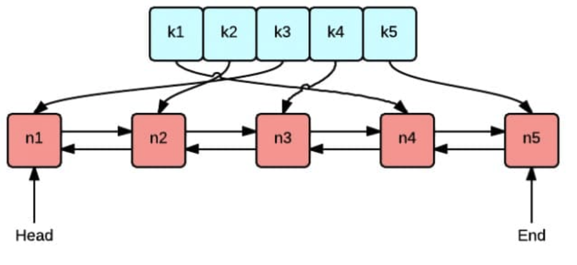

# Distributed Caching

> 商業世界中現金為王; 架構世界中緩存為王

在計算機系統中, cahce 無處不在: 

當我們訪問一個網頁, 網頁和引用的 js/css 等靜態文件會依據不同策略cache 在 browser local 或 CDN server, 當第二次再進行訪問時就會覺得加載速度快了很多

或是在 twitter 的按讚數量, 不可能每個人每次訪問都要從資料庫中查找所有點讚的紀錄再統計, 資料庫操作十分耗時, 無法支撐如此龐大的流量, 所以一般點讚這種資料是 cache 在 Redis server 中實現的

Caching 最簡單的莫過於儲存在記憶體中的 key-value pair, 在 Go 中為 map, 那直接使用 map 來做 cache 會有什麼問題?

- 記憶體不足怎麼辦?

    那就需要刪除一些資料, 重點是該怎麼刪? 應該隨機刪除還是按照時間順序刪除? 不同資料的請求頻率不同, 是否應該優先刪除請求頻率低的資料? 資料的請求頻率也可能隨著時間變化

- 併發寫入 conflict 怎麼辦?

    對於 cache request 一般不可能 Serializabe, map 操作並不是 thread-safe, 針對 concurrency 的場景做修改操作需要加鎖

- Standalone 性能不足怎麼辦?

    Standalone 資源有限, 隨著業務需求及請求增加很容易遇到瓶頸, 大部分情況下會選擇利用多台 server 資源並行處理以提升性能

...

# GeeCache

設計一個 distributed caching system 需要考慮資源控制, 淘汰策略, 併發, distributed nodes communication 等各方面問題

而且針對不同的應用場景還需要在不同特性間權衡, 如是否需要支持 cache update? 還是假設 cache 在淘汰前不允許改變?

[groupcache](https://github.com/golang/groupcache) 是用 Go 實現的 memcached, 目的是在某些特定場合替代 memcached, 其作者也是 memcached 的作者

GeeCache 旨在模仿 [groupcache](https://github.com/golang/groupcache) 實現並淬煉其中精華, 支持的特性如下:
- standalone cache 和基於 HTTP 的 distributed cache
- LRU cache strategy
- 使用 Go lock 防止 cache breakdown
- 使用 Consistent hashing 選擇節點以實現 load balance
- 使用 protobuf 優化 nodes communication
- ...

# LRU Cache Eviction Strategy

GeeCache cache 全部都儲存在 memory 中, 存儲空間十分有限, 因此不可能無限制地新增資料, 當記憶體中資料量達到一定 threshold 就需要從 cache 淘汰資料, 那應該怎麼訂淘汰策略?

下面簡單介紹最常用的三種 cache eviction strategies: FIFO, LFU 和 LRU

## FIFO(First In First Out)

FIFO 即淘汰 cache 中最老的資料, 其認為越早被新增的資料不再被使用的可能性可能比最新增加的資料高, 其實現也非常簡單: 創建一個 queue 將新增資料 push, 當記憶體不夠時再從 queue 中 pop data

但是大多數場景下部分資料雖然最早被新增進 cache 但也是最常被請求, 卻因為 FIFO 的關係被淘汰, 頻繁的新增到 cache 中又被淘汰而導致 hit ratio 降低

## LFU(Least Frequently Used)

將 Cache 中請求頻率最低的資料淘汰, 其認為資料在過去被請求越多次則在將來被請求的頻率也會越高, 實現需要維護一個按照請求次數排序的 list, 每次請求則請求數加一, 且 **list re-sorting**, 淘汰時直接選擇請求數最少的資料即可

LFU 演算法的 **hit ratio 較高**, 但缺點為需要維護每個資料的請求次數, 對記憶體的需求很高; 另外如果資料請求模式發生變化, LFU 需要較長時間適應, 受歷史資料的影響比較大, 如某個資料歷史上請求數很高, 但某個時間點之後幾乎不再被請求, 但因為之前請求數很高而遲遲無法被淘汰

## LRU(Least Recently Used)

淘汰最近最少被請求的資料, 相對於僅考慮時間因素的 FIFO 和僅考慮請求頻率的 LFU, LRU 相對是較為平衡的一種 eviction algo

LRU 認為如果資料最近被請求過, 那將來請求的機率也會更高, 其實現只需要維護一個 list, 如果某筆資料被請求則移到尾端, 只需要淘汰 HEAD 的資料即可



上圖很好地展示了 LRU 最核心的兩個資料結構:

- 綠色的是 `map`, 儲存 key-value 的映射關係, 如此一來根據 key 查找對應的 value 時間複雜度為 O(1), 插入一筆資料的時間複雜度也是 O(1)
- 紅色的為 `double linked list`, 將所有的值放在 `double linked list` 中, 如此一來當請求某個值時將其移到尾端的複雜度是 O(1), 在尾端插入一筆資料及刪除一筆資料的時間複雜度均為 O(1)

# LRU Implementation

接著來實現 LRU 演算法, 首先需要創建一個包含 map 及 double linked list 的 struct `Cache`, 方便實現後續的 CRUD operations

lru.go

```go
package lru

import "container/list"

// Cache is a LRU cache. It is not safe for concurrent access.
type Cache struct {
	maxBytes int64
	nbytes   int64
	ll       *list.List
	cache    map[string]*list.Element
	// optional and executed when an entry is purged.
	OnEvicted func(key string, value Value)
}

type entry struct {
	key   string
	value Value
}

// Value use Len to count how many bytes it takes
type Value interface {
	Len() int
}
```

- 使用 Go 標準庫的 `list.List`
- `map[string]*list.Element` 儲存 list 中節點的指針
- `maxBytes` 為允許使用的最大記憶體空間, `nBytes` 為當前使用記憶體空間, `OnEvicted` 指某筆資料被淘汰時的 callbace function
- `entry` 是 linked list 節點的資料結構, 在 linked list 中儲存每個 value 對應的 key 好處在於淘汰 HEAD element 時需要使用 key 從 map 中刪除對應的映射值
- 考量通用性允許 `entry.value` 為實現 `Value` interface 的任意型別, 此 interface 只有一個 `Len()` 方法用於返回 value 所佔用的記憶體大小

實現 `Cache` 構造函數 `New()`:

```go
// New is the Constructor of Cache
func New(maxBytes int64, onEvicted func(string, Value)) *Cache {
	return &Cache{
		maxBytes:  maxBytes,
		ll:        list.New(),
		cache:     make(map[string]*list.Element),
		OnEvicted: onEvicted,
	}
}
```

## Search Entry

查找 linked list 節點可以分兩步, 第一步是從 map 中找到對應的 linked list element, 第二步是將該 element 移到 linked list 尾端

```go
// Get look ups a key's value
func (c *Cache) Get(key string) (value Value, ok bool) {
	if ele, ok := c.cache[key]; ok {
		c.ll.MoveToFront(ele)
		kv := ele.Value.(*entry)
		return kv.value, true
	}
	return
}
```

- 若 key 對應的 element 存在則將對應 element 移動到 list 尾端並返回找到的 value
- `c.ll.MoveToFront(ele)` 即將 linked list element `ele` 移動到 list 尾端

## Delete Entry

這裡的刪除實際指的是 cache eviction, 即移除最近最少訪問的 element

```go
// RemoveOldest removes the oldest item
func (c *Cache) RemoveOldest() {
	ele := c.ll.Back()
	if ele != nil {
		c.ll.Remove(ele)
		kv := ele.Value.(*entry)
		delete(c.cache, kv.key)
		c.nbytes -= int64(len(kv.key)) + int64(kv.value.Len())
		if c.OnEvicted != nil {
			c.OnEvicted(kv.key, kv.value)
		}
	}
}
```

- `c.ll.Back()` 取得 HEAD element, `c.ll.Remove()` 將 element 從 linked list 中刪除
- `delete(c.cache, kv.key)` 從 map `c.cache` 刪除 element 映射關係
- 更新當前所用的記憶體空間 `c.nbytes`
- 若 callbace func `OnEvicted` 不為 nil 實則調用

## Insert & Update Entry

```go
// Add adds a value to the cache.
func (c *Cache) Add(key string, value Value) {
	if ele, ok := c.cache[key]; ok {
		c.ll.MoveToFront(ele)
		kv := ele.Value.(*entry)
		c.nbytes += int64(value.Len()) - int64(kv.value.Len())
		kv.value = value
	} else {
		ele := c.ll.PushFront(&entry{key, value})
		c.cache[key] = ele
		c.nbytes += int64(len(key)) + int64(value.Len())
	}
	for c.maxBytes != 0 && c.maxBytes < c.nbytes {
		c.RemoveOldest()
	}
}
```

- 若 key 存在則更新對應 element value 並將其移到 linked list 尾端
- 不存在則插入資料, 首先 linked list 尾端新增 element `&entry{key, value}`, 並在 map 中新增 key 和 element 映射關係
- 更新 `c.nbytes`, 如果超過預設 threshold `c.maxBytes` 則移除最少請求的 element

最後為了方便測試, 實現 `Value` interface 用來獲取新增了多少筆資料

```go
// Len the number of cache entries
func (c *Cache) Len() int {
	return c.ll.Len()
}
```

## Unit Test

測試使用 `Get()` 方法新增資料:

lru_test.go

```go
type String string

func (d String) Len() int {
	return len(d)
}

func TestGet(t *testing.T) {
	lru := New(int64(0), nil)
	lru.Add("key1", String("1234"))
	if v, ok := lru.Get("key1"); !ok || string(v.(String)) != "1234" {
		t.Fatalf("cache hit key1=1234 failed")
	}
	if _, ok := lru.Get("key2"); ok {
		t.Fatalf("cache miss key2 failed")
	}
}
```

測試當記憶體超過了 default threshhold 是否會觸發 element eviction:

```go
func TestRemoveoldest(t *testing.T) {
	k1, k2, k3 := "key1", "key2", "k3"
	v1, v2, v3 := "value1", "value2", "v3"
	cap := len(k1 + k2 + v1 + v2)
	lru := New(int64(cap), nil)
	lru.Add(k1, String(v1))
	lru.Add(k2, String(v2))
	lru.Add(k3, String(v3))

	if _, ok := lru.Get("key1"); ok || lru.Len() != 2 {
		t.Fatalf("Removeoldest key1 failed")
	}
}
```

測試 callback function 是否能被調用:

```go
func TestOnEvicted(t *testing.T) {
	keys := make([]string, 0)
	callback := func(key string, value Value) {
		keys = append(keys, key)
	}
	lru := New(int64(10), callback)
	lru.Add("key1", String("123456"))
	lru.Add("k2", String("k2"))
	lru.Add("k3", String("k3"))
	lru.Add("k4", String("k4"))

	expect := []string{"key1", "k2"}

	if !reflect.DeepEqual(expect, keys) {
		t.Fatalf("Call OnEvicted failed, expect keys equals to %s", expect)
	}
}
```