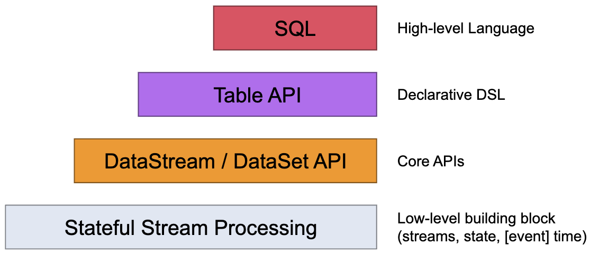
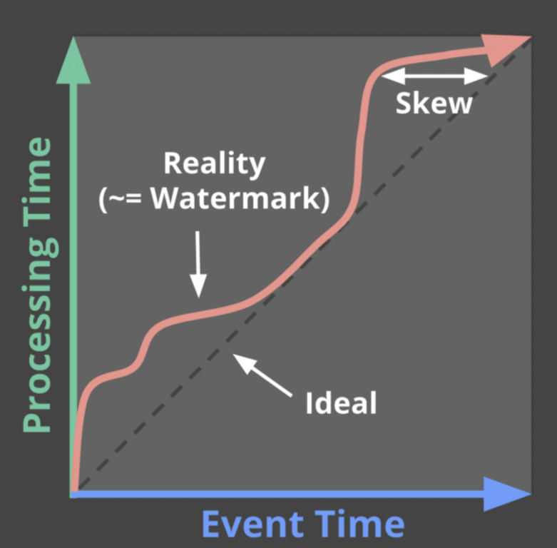

- [Flink Runtime](#flink-runtime)
- [Flink API](#flink-api)
  - [DataStream API](#datastream-api)
    - [Execution Mode](#execution-mode)
    - [Data Source API](#data-source-api)
      - [Bounded File Source](#bounded-file-source)
      - [Unbounded Streaming File Source](#unbounded-streaming-file-source)
      - [Bounded Kafka Source](#bounded-kafka-source)
      - [Unbounded Streaming Kafka Source](#unbounded-streaming-kafka-source)
    - [Event Time](#event-time)
      - [Overview](#overview)
    - [Operators](#operators)
      - [DataStream Transformation](#datastream-transformation)
        - [Map](#map)
        - [FlatMap](#flatmap)
        - [Filter](#filter)
        - [KeyBy](#keyby)
        - [Reduce](#reduce)
      - [Windows](#windows)
        - [Window Lifecycle](#window-lifecycle)
        - [Keyed vs Non-Keyed Windows](#keyed-vs-non-keyed-windows)
        - [Window Assigners](#window-assigners)
          - [Tumbling Windows](#tumbling-windows)
          - [Sliding Windows](#sliding-windows)
          - [Session Windows](#session-windows)
          - [Global Windows](#global-windows)
        - [Window Functions](#window-functions)
          - [ReduceFunction](#reducefunction)
          - [AggregateFunction](#aggregatefunction)
          - [ProcessWindowFunction with Incremental Aggregation](#processwindowfunction-with-incremental-aggregation)
        - [Triggers](#triggers)
          - [Fire and Purge](#fire-and-purge)
          - [Default Triggers of WindowAssigners](#default-triggers-of-windowassigners)
          - [Built-in and Custom Triggers](#built-in-and-custom-triggers)
        - [Evictors](#evictors)
        - [Allowed Latenness](#allowed-latenness)
          - [Getting Late Data as a Side Output](#getting-late-data-as-a-side-output)
          - [Late Elements Considerations](#late-elements-considerations)
        - [Working with Window Results](#working-with-window-results)
          - [Interaction of Watermarks and Windows](#interaction-of-watermarks-and-windows)
          - [Consecutive Windowed Operations](#consecutive-windowed-operations)
        - [Useful State Size Considerations](#useful-state-size-considerations)
      - [Physical Partitioning](#physical-partitioning)
      - [Task Chaining and Resource Groups](#task-chaining-and-resource-groups)
      - [Name And Description](#name-and-description)
    - [Event Time](#event-time-1)
  - [Table API & SQL](#table-api--sql)
  - [Python API](#python-api)
- [Flink Data Type](#flink-data-type)
  - [Java Tuples and Scala Case Classes](#java-tuples-and-scala-case-classes)
  - [Java POJOs](#java-pojos)
  - [Primitive Types](#primitive-types)
  - [Regular Classes](#regular-classes)
  - [Values](#values)
  - [Hadoop Writables](#hadoop-writables)
  - [Special Types](#special-types)
- [Glossary](#glossary)
  - [Fact](#fact)
    - [Types of Facts](#types-of-facts)
    - [Types of Fact Table](#types-of-fact-table)
      - [1. Transaction Fact Table](#1-transaction-fact-table)
      - [2. Snapshot Fact Table](#2-snapshot-fact-table)
      - [3. Accumulated Fact Sheet](#3-accumulated-fact-sheet)
  - [Dimension](#dimension)
  - [ODS(Operation Data Store)[**private**]](#odsoperation-data-storeprivate)
  - [CDM(Common Data Model)[**public**]](#cdmcommon-data-modelpublic)
    - [DWD(Data Warehouse Detail)](#dwddata-warehouse-detail)
    - [DWS(Data Warehouse Service)](#dwsdata-warehouse-service)
    - [DIM](#dim)
    - [DWB(Data Warehouse Base)[**optional**]](#dwbdata-warehouse-baseoptional)
    - [ADS[**product**]](#adsproduct)

# Flink Runtime

# Flink API

## DataStream API

### Execution Mode

### Data Source API

#### Bounded File Source

#### Unbounded Streaming File Source

#### Bounded Kafka Source

#### Unbounded Streaming Kafka Source

### Event Time

#### Overview

《Streaming Systems》中關於 `watermarks` 描述的原文:

> Watermarks are temporal notions of input completeness in the event-time domain. Worded differently, they are the way the system measures progress and completeness relative to the event times of the records being processed in a stream of events (either bounded or unbounded, though their usefulness is more apparent in the unbounded case).

Flink document 對於 `watermarks` 定義如下:

> The mechanism in Flink to measure progress in event time is watermarks. Watermarks flow as part of the data stream and carry a timestamp t. A Watermark(t) declares that event time has reached time t in that stream, meaning that there should be no more elements from the stream with a timestamp t' <= t (i.e. events with timestamps older or equal to the watermark).

綜上所述, `watermarks` 在事件時間域衡量數據完整性的概念, 其作為數據流的一部分流動並攜帶時間戳 t, **`Watermark(t)` 斷言數據流中不會再有小於時間戳 t** 的事件出現

真實資料流往往會因為許多不可預期因素產生一定程度的延遲與偏差

### Operators

#### DataStream Transformation

##### Map

##### FlatMap

##### Filter

##### KeyBy

##### Reduce

#### Windows

##### Window Lifecycle

A window is created as soon as the first element that should belong to this window arrives, and the window is **completely removed** when the time (event or processing time) passes its end timestamp plus the user-specified `allowed lateness`.

For example, with an `event-time-based` windowing strategy that creates `non-overlapping (or tumbling)` windows **every 5 minutes** and has an `allowed lateness` of **1 min**, Flink will create a new window for the interval between **12:00** and **12:05** when the first element with a timestamp that falls into this interval arrives, and it will remove it when the watermark passes the **12:06** timestamp.

##### Keyed vs Non-Keyed Windows

##### Window Assigners

###### Tumbling Windows

###### Sliding Windows

###### Session Windows

###### Global Windows

##### Window Functions

###### ReduceFunction

###### AggregateFunction

###### ProcessWindowFunction with Incremental Aggregation

##### Triggers

###### Fire and Purge

###### Default Triggers of WindowAssigners

###### Built-in and Custom Triggers

##### Evictors

##### Allowed Latenness

###### Getting Late Data as a Side Output

###### Late Elements Considerations

##### Working with Window Results

###### Interaction of Watermarks and Windows

###### Consecutive Windowed Operations

##### Useful State Size Considerations

#### Physical Partitioning

#### Task Chaining and Resource Groups

#### Name And Description

### Event Time

## Table API & SQL

## Python API

# Flink Data Type

## Java Tuples and Scala Case Classes

## Java POJOs

## Primitive Types

## Regular Classes

## Values

## Hadoop Writables

## Special Types

# Glossary

## Fact

> **Note**
> A fact is a value, or measurement, which represents a fact about the managed entity or system.

### Types of Facts

1. **Summative facts:** Summative facts are used with aggregation functions such as **sum (), average ()**, etc.()(sales fact)
2. **Semi summative facts:** There are small numbers of **quasi-summative** fact aggregation functions that will apply.For example, consider bank account details. We also cannot also apply () for a bank balance which will not have useful results, but the **minimum()** and **maximum()** functions return useful information.
3. **Non-additive facts:** We cannot use numerical aggregation functions such as **sum (), average (),** on non-additive facts. For non-additive **facts, ratio** or **percentage** is used.

### Types of Fact Table

There are three types of fact tables:

#### 1. Transaction Fact Table

The transaction fact table is a basic approach to operate the businesses. These fact tables represent an event that occurs at the primary point. A line exists in the fact table for the customer or product when the transaction occurs.

Many rows in a fact table connect to a customer or product because they are involved in multiple transactions. Transaction data is often structured quickly in a one-dimensional framework. The lowest-level data is the rawest dimensional data that cannot be done by summarized data.

#### 2. Snapshot Fact Table

The snapshot fact table describes the state of things at a particular time and contains many **semi-additive** and **non-additive** facts.

**Example:** The daily equilibrium fact is expressed by the customer dimension but not by the time dimension.

Periodic snapshots require the performance of the business at regular and estimated time intervals. Unlike a transaction fact table where we load a row for each event, with periodic snapshots, we take a picture of the activity at the end of the day, week, or month, and then another picture at the end of the next period.

**Example:** Performance summary of a salesman during the previous month.

#### 3. Accumulated Fact Sheet

The accumulated fact table is used to show the activity of a process that has a beginning and an end.

For example, we are processing an order. An order remains in the process until it will be processed. As the step towards completing the order is completed, the corresponding row in the fact table is updated.

**Example:**

- order user id
- order vip level(non-additive)
- order total amount(additive)
    - sum of amount of total order
    - sum of amount of total region
    - sum of amount of tomorrow
    - …
- user account balance(semi additive)
    - sum of balance of total user

## Dimension

> **Note**
> Dimensions are companions to facts, and describe the objects in a fact table

- time dimension
- region dimension
- brand dimension
- category dimension
- …

## ODS(Operation Data Store)[**private**]

Data Source

## CDM(Common Data Model)[**public**]

### DWD(Data Warehouse Detail)

以業務過程作為建模驅動, 基於每個具體業務過程特點構建最細粒度的 `transaction fact table`, 可以結合企業數據使用特點, 將 `detail fact table` 某些重要維度屬性字段做適當冗余, 即寬表化處理

- Transaction Fact Table
- Snapshot Fact Table
- Accumulated Fact Table

### DWS(Data Warehouse Service)

以分析主題對象作為建模驅動, 基於上層應用和產品指標需求, 構建公共粒度的 `snapshot fact table`

### DIM

基於維度建模觀念, 建立整個企業一致性維度, 降低數據計算口徑和算法不統一風險

### DWB(Data Warehouse Base)[**optional**]

儲存大量客觀資料, 一般作為中間層

### ADS[**product**]

存放數據產品統計指標數據, 根據 `CDM` 與 `ODS` 加工而成