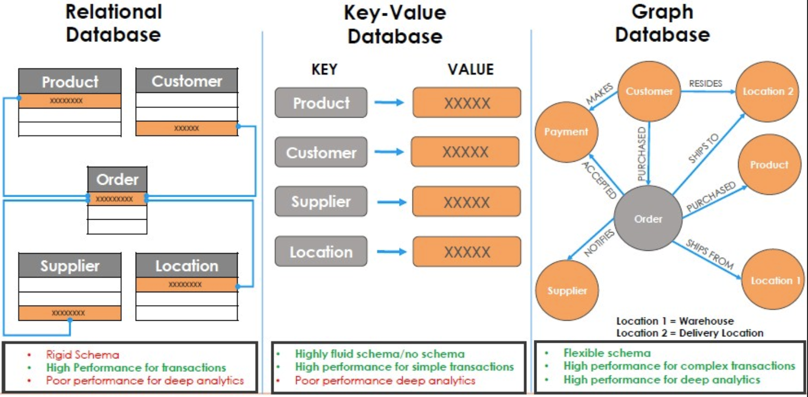
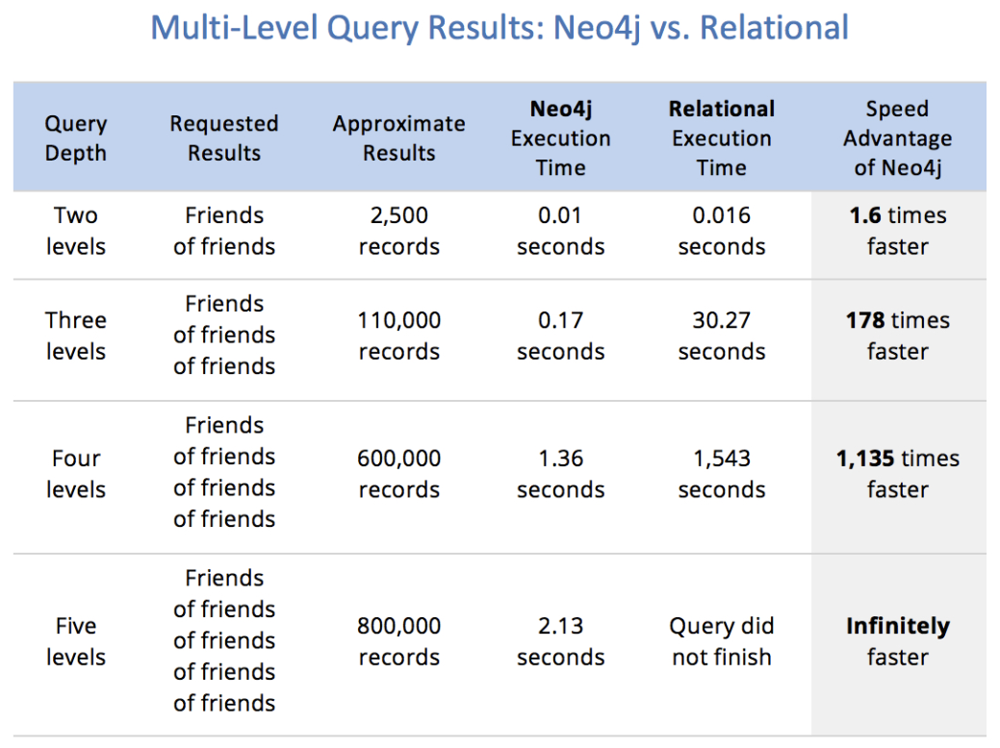
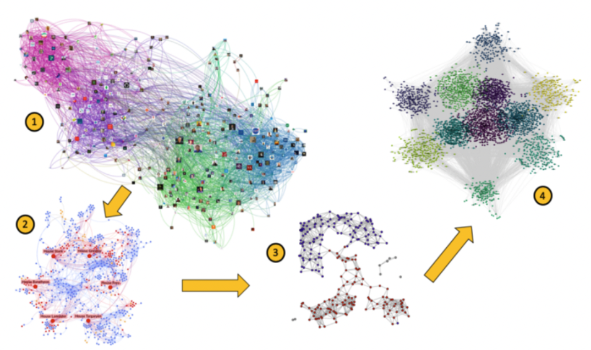

近年來在大數據處理過程中, `Graph Database` 被廣泛提及和應用, `Graph Database` 並非指儲存圖片的圖像資料庫, 而是指儲存 `Graph` 這種資料結構的資料庫, 基於 `Graph Theory`, 利用 `nodes`, `edges` 和 `properties` 來表達並查詢資料

許多大型企業的應用都是使用 `Graph Database` 實現, 如:
- 社交: Facebook, twitter, linkedin 利用其來管理社交關係, 實現好友推薦
- 零售: eBay, Walmart 利用其實現商品實時推薦
- 金融: JPMorgan, Citibank, 瑞銀等銀行利用其實現風控處理
- 汽車製造: Volvo, Toyota 利用其推動創新製造解決方案
- 電信: Verizon, Orange, AT&T 利用其管理網絡, 連線控制訪問

# Why Graph Database?

為何 graph database 能夠解決大數據趨勢下傳統資料庫在查詢運算時的複雜度問題呢? 

解答這個問題前應先來了解一下 graph database 與一般資料庫在儲存結構上的差異:

`Relational Database` 結構性最強, 在 `data trasactions` 的效能表現最佳, 能夠完全滿足 `ACID` 應用需求

但結構性太強也使得結構不夠彈性, 會導致資料不易擴展, 且對於關聯型資料的效果不佳, 當關聯查詢逐漸複雜時會發生查詢性能不符預期, 因此不適合拿來做深度資料分析應用

隨著資料量不斷增長, 單機架構已經無法負荷系統運作, 技術發展趨勢逐漸向分散式架構轉移, 於是 `Key-Value NoSQL Database` 就誕生了

相較於 `Relational`, `Key-Value` 在結構上較為彈性, 也較容易進行分散式水平擴展, 但依照 `CAP Theory`, 資料庫設計先天上無法同時滿足 `Consistent`, `Availability` 和 `Partition Tolerance`, 大多 `NoSQL` 資料庫選擇的是 `CP` 的設計, 但其中 `Consistent` 的部分是採用 `Eventually Consistency Model`, 屬於 `Consistent Model` 中最弱的一致性模型, 其結構同樣不適合應用於深度資料分析應用

在 `Graph Database` 中, `Relationship` 是一等公民, 關聯的節點的物理意義為`指向`彼此, 遍歷搜尋時可以直接基於指針直接找到關聯資料, 不需像前兩者依賴 `foreign key relationship` 將兩張 table join search, 免去了 `Index Scan` 的成本, 實現 `O(logn) -> O(1)` 的效能提升, 這種搜尋方式稱為 `Index Free Adjacency(免索引鄰接)`

下圖為 `Neo4j` 官方釋出的 `Multi-Level Query Results`:

可以看到在 `Relational Database` 中隨著關聯的數量及深度增加會導致關聯查詢效率急遽下降, 甚至崩潰; 而 `Graph Database` 性能幾乎不會隨著資料量增加而改變

# Where is Neo4j Used?

> 當然沒有技術是銀彈, 其都有各自適當發揮最大化效益的場景

接下來介紹一些適合 `Graph Database` 的一些應用場景

## Graph Traversal

從給定連通圖的某一節點出發, 沿著邊訪問途中所有節點, 且使每個節點僅被訪問一次即稱為 `Graph Traversal`, 大家熟知的 `Tree Traversal` 也是一種特殊的 `Graph Traversal`

其最經典應用包含 `Minimum Spanning Tree`, `Find Shortest Path`, `Topological Ordering`, `Critical path method` 等

## Community Detection

`Community Detection` 是指在 `Graph` 資料結構中發現密集連接的 sub network

如在蛋白質網絡中發現具有相似生物學功能的蛋白質; 在企業網絡中, 通過研究公司內部關係將員工分組為社群; 在 Twitter 或 Facebook 等社交網絡中具有相同興趣或共同朋友的使用者可能是同一社群的成員等

利用 `Graph` 結構資訊及節點特徵進行歸因及聚類演算, 以實現將大網絡分成兩個以上不同的社群, 進而達成分類/分群的目的:

## Centrality

`Centrality` 是社交網絡分析(Social Network Analysis, SNA) 中用以衡量網絡中一個個體在整個網絡中接近中心程度的一個概念, 這個程度量化後的數字即被稱作 `Centrality`

因此可以通過判斷一個節點的 centrality, 從而判斷這個節點在網絡中所佔據的重要性

在圖論和網絡分析中, `Centrality` 可以判斷圖中最重要的節點, 其應用包含識別社交網絡中最具影響力的人, 城市網絡中最關鍵的基礎設施或是病毒的超級傳播者等

## Similarity

即資料集的相似度計算, 在現有的 AI 演算法中, 大多數為基於概率的近似計算, 然後取最大可能性的近似值

`Similarity` 在現實中有著極高的應用需求, 如社群網絡中的好友推薦, 電商平台的商品推薦, 人臉辨識或語音辨識等都是類似的應用

# Conclusion

> 不以應用為目的的技術都是耍流氓

本文主要介紹了 `Graph Database` 的發展脈絡, 與傳統資料庫的結構差異及在各個領域的應用, 希望讓大家更能一窺 `Graph` 的本質及全貌, 也為後續介紹 `Graph Database` 領域的翹楚 `Neo4j` 做鋪墊, 感謝閱讀