- [What is Elasticsearch?](#what-is-elasticsearch)
- [Elasticsearch Basic Concept](#elasticsearch-basic-concept)
- [What is Lucene?](#what-is-lucene)
  - [Inverted Index](#inverted-index)
  - [Stored Field](#stored-field)
  - [Document Values](#document-values)
  - [When Search Occur](#when-search-occur)
  - [Caching](#caching)
  - [Search in Shard](#search-in-shard)
  - [Scale Out](#scale-out)
  - [A Real Query](#a-real-query)
  - [Index Structure](#index-structure)
- [Elastic Stack](#elastic-stack)
  - [Beats](#beats)
  - [Logstash](#logstash)
  - [Elasticsearch](#elasticsearch)
  - [Kibana](#kibana)
  - [X-Pack](#x-pack)
- [Index Modules](#index-modules)
- [Inverted Index](#inverted-index-1)
  - [Index Management](#index-management)
  - [Index Format](#index-format)
  - [Create Index](#create-index)
  - [Search Index](#search-index)
  - [Update Index](#update-index)
  - [Delete Index](#delete-index)
  - [Open/Close Index](#openclose-index)
- [Document Operations](#document-operations)
  - [Create Document](#create-document)
  - [Search Document](#search-document)
  - [Update Document](#update-document)
  - [Delete Document](#delete-document)
  - [Bulk Operations](#bulk-operations)
- [Query DSL](#query-dsl)
  - [Term Query](#term-query)
    - [If Field Exist: exist](#if-field-exist-exist)
    - [Search _id: ids](#search-_id-ids)
    - [Search Prefix: prefix](#search-prefix-prefix)
    - [Precise Search: term](#precise-search-term)
    - [Multiple Precise Serach: terms](#multiple-precise-serach-terms)
    - [Minimum Number of Multiple Precise Search: terms_set](#minimum-number-of-multiple-precise-search-terms_set)
    - [Wildcard Query: wildcard](#wildcard-query-wildcard)
    - [Range Query: range](#range-query-range)
    - [Regular Expression Query: regexp](#regular-expression-query-regexp)
    - [Fuzzy Query: fuzzy](#fuzzy-query-fuzzy)

# What is Elasticsearch?

> Elasticsearch 是一個非常強大的 real-time distributed serach engine, 基於 Lucene 實現

其主要被應用於 `full-text search`, `structural search` 及 `analytics`

除了 search, 結合 `Kibana`, `Logstash`, `Beats` 等 open source 產品, Elastic Stack(ELK) 還被廣泛運用在大數據實時分析領域, 包括 log analysis, metrics monitor, infomation security 等

ELK 可以完成海量結構化/非結構化資料搜尋, 創建可視化報表, 對監控資料設定報警閾值, 或通過 mechina learning 來自動識別異常狀況

Elasticsearch 是基於 `Restful API`, 使用 `Java` 開發的 search engine, 並作為 `Apache Lisence` release

> 根據 [DB Engine](https://db-engines.com/en/ranking) 排名顯示, Elasticsearch 為最受歡迎的企業級搜尋引擎


- 在當前軟體產業中, 搜尋為一個軟體系統或平台最基本的功能, 使用 Elasticsearch 可以創造出良好的搜尋體驗
- Elasticsearch 具備非常強大的大數據分析能力
- Elasticsearch 方便易用, 且可進行水平擴展
- Development community 活躍, 使用者基數龐大
- 擁有接近 real-time 的搜尋及分析能力

`Lucene` 可以算是當前最先進, 高性能且全功能的 search engine

但是 `Lucene` 僅為一個 library, 需要使用 Java 將 `Lucene` 集成到 application 中, 另外 `Lucene` 的工作原理十分的複雜

`Elasticsearch` 內部使用 `Lucene` 實現索引及搜尋, 透過 `RESTful API` 來封裝 `Lucene` 的複雜性, 使 `full-text search` 變得簡單易用

然而 Elasticsearch 不僅僅為 Lucene, 且也不僅僅為一個 full-text search engine, 其可以被以下三點精準定位:
- distributed real-time documents storage, 每個 field 都可以被索引及搜尋
- distributed real-time analytic search engine
- 能支撐上百個節點擴充, 並支持 PB 級結構化或非結構化資料儲存

# Elasticsearch Basic Concept

- Near Realtime(NRT): 接近 real-time, 資料在 summit index 後馬上就可以搜尋到
- Cluster: 一個 cluster 有一個 unique identifier, default 為 `elasticsearch`, 具有相同 cluster name 的 nodes 才會組成一個 cluster
- Node: 儲存 cluster data, 參與 cluster 索引和搜尋功能, node name default 為啟動時以一個隨機的 UUID 前七個字符, 通過 cluster name 在網絡中發現 member 並組成 cluster, single node 也可以為 cluster
- Index: 一個 index 為一個 document 集合, 每個 index 有 unique name, 一個 cluster 中可以有任意多個 index
- Document: 被索引的一筆資料, 索引的基本資料單元, 以 `sh` 格式表示
- Shard: 在創建一個 index 時可以指定分成多少個 shard 來儲存, 每個 shard 本身也是一個功能完善且獨立的 `"index"`, 可以被放置在 cluster 的任意 node 上

| RDBMS               | Elasticserach          |
| ------------------- | ---------------------- |
| database            | index                  |
| table               | type(6.0.0 deprecated) |
| row                 | document               |
| column              | field                  |
| schema              | mapping                |
| index               | reverse index          |
| SQL                 | DSL                    |
| SELECT * FROM table | GET http://...         |
| UPDATE table SET    | PUT http://...         |
| DELETE              | DELETE http://...      |

這邊先提出以下問題, 介紹完 ElasticSearch 底層工作原理再回來一一解答:
- 為什麼搜尋 `*foo-bar*` 無法匹配 `foo-bar`?
- 為什麼增加更多的 document 會壓縮 index?
- 為什麼 ElasticSearch 需要佔用很大的記憶體空間?

`Cluster` in the cloud:


Cloud 中每個正方形都代表一個 es `node`:


在一個或多個 node 之間, 多個綠色方塊組合成一個 `index`:


在一個 `index` 中, 分布在多個 `node` 裡的綠色方塊稱為 `shard`:


一個 `Elasticsearch Shard` 本質上為一個 `Lucene Index`


> `Lucene` 為一個 search library, Elasticsearch 是基於 Lucene 建立的, 接下來的故事要說明 Elasticsearch 是如何基於 Lucene 工作

# What is Lucene?

Lucene 中有許多小的 `segment`, 可以將其看成 Lucene 內部的 mini-index:


Segment 中有許多種類的資料結構: `Inverted Index`, `Stored Fields`, `Document Values`, `Cache`:

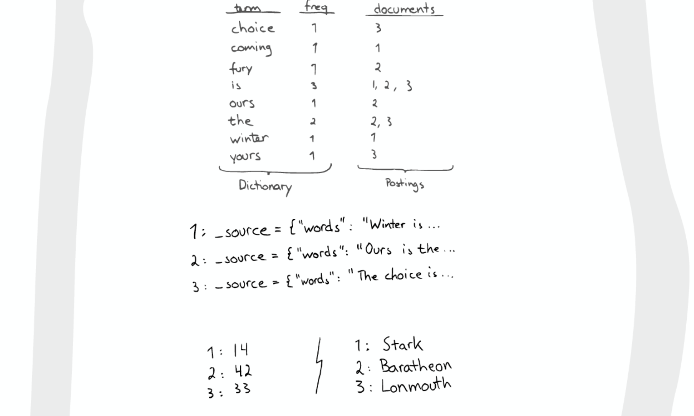

## Inverted Index

最重要的 `Inverted Index`:

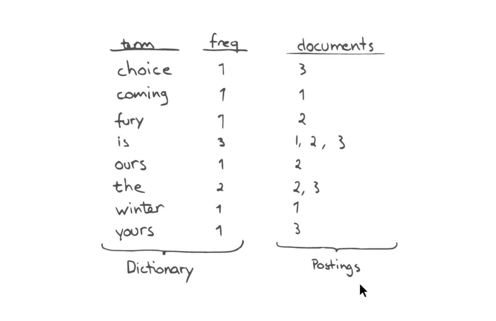

`Inverted Index` 主要包含兩部分:
- 有序的 `Dictionary` (包含 term & frequency)
- 與 `Term` 對應的 `Postings` (即存在這個 term 的文件)

搜尋時會先將搜尋的內容分解, 然後在 `Dictionary` 中找到對應的 `Term`, 進而查找到與搜尋內容相關的文件內容:


查詢 `the fury`:

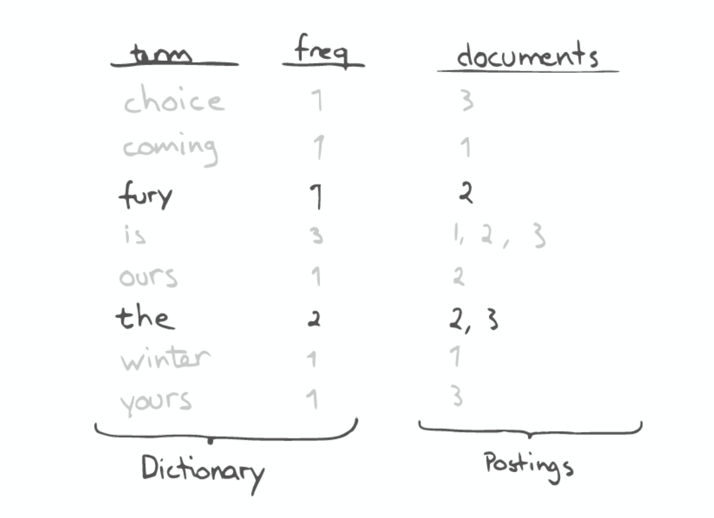

`AutoCompletion-Prefix`: 若想查找以字母 `c` 開頭的 term, 可以簡單地通過 `Binary Search` 在 `Inverted Index` 中找到如 `choice`, `coming` 這樣的 term

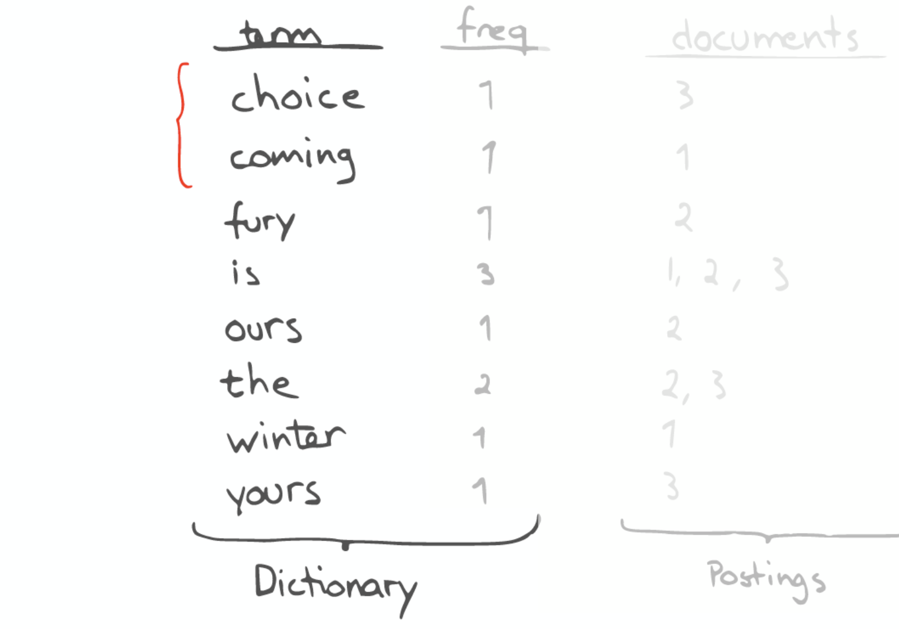

昂貴搜尋: 若想要搜尋所有包含 `our` 的 term, 則需要 scan 整個 `Inverted Index`

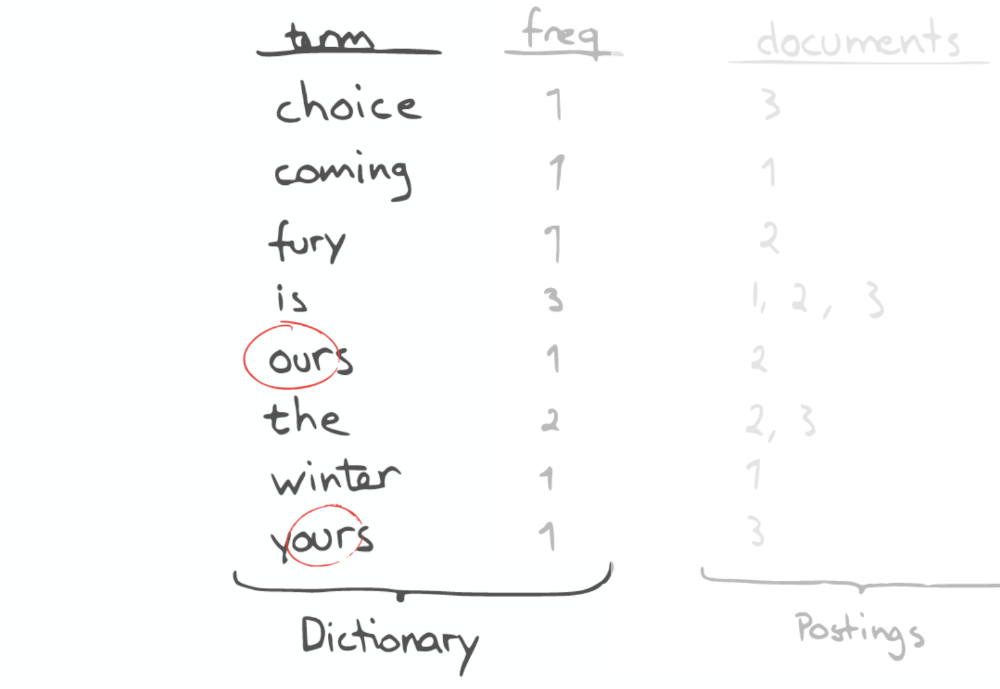

這種情況若想優化, 可以思考如何生成合適的 term:

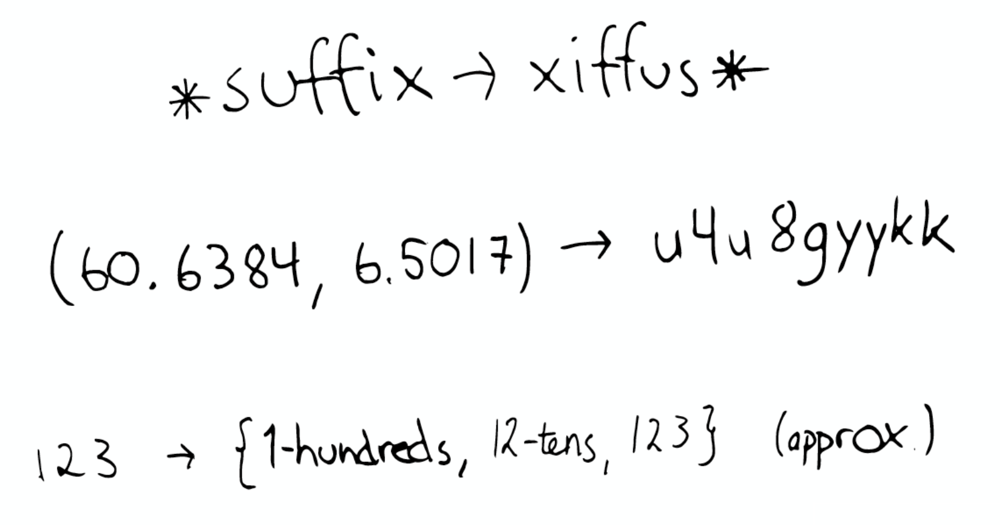

1. 若想以 `postfix` 作為查詢條件, 可以為 term 做反向處理:

    `* suffix -> xiffus *`
2. 可以將 `GEO` 資訊轉換為 `GEO Hash`:
   
    `(60.6384, 6.5017) -> u4u8gyykk`
3. 對於簡單數字可以為其生成多種形式的 term:
    
    `123 -> {1-hundreds, 12-tens, 123}`

## Stored Field

若想要搜尋包含某個特定內容的文件時, `Inverted Index` 就無法很好的解決問題, 因此 `Lucene` 另外提供了一種資料結構 `Stored Fields` 來解決這個問題

本質上 `Stored Fields` 是一個簡單的 `key-value`, 默認情況下 Elasticsearch 會儲存整個文件的 JSON source

## Document Values

上述兩種資料結構仍無法解決如排序, 聚合, facet 等問題, 因為可能會需要讀取大量不需要使用的資料

`Document Values` 主要被設計來解決以上問題, 其本質上是一個 `Column-oriented Storage`, 高度優化了具有相同型別資料的儲存結構

為了提升效率, Elasticsearch 可以將 index 中某個 document value 全部讀到記憶體中進行操作, 如此一來大大提升訪問速度, 但同時也會消耗大量記憶體空間

> 以上資料結構包括 `Inverted Index`, `Stored Fields`, `Document Values` 及其 cache, 都在 `segment` 內部

## When Search Occur

搜尋時 Lucene 會搜尋所有的 segment, 並將每個 segment 的搜尋結果合併返回

Lucene 的一些特性使得這個過程非常重要:
- Segments are `immutable`
  - 當刪除 documents 時, Lucene 只是將其標誌為刪除, 但檔案本身不會發生改變
  - 當更新 documents 時, 本質上 Lucene 是先將 document 刪除, 再 `Re-index`
- Lucene 非常擅長資料壓縮
- Cache everything

## Caching

當 Elasticsearch index 一個 document 時, 會為 document 建立對應的 cache, 並定期(s) 刷新資料:


segments 會隨著時間越來越多...


Elasticsearch 會將這些 segment 合併為新的 segment:


## Search in Shard

Elasticsearch 在 shard 中的搜尋過程與 Lucene Segment 搜尋過程類似:


與 Lucene Segment 搜尋不同在於, shard 可以分佈在不同的 node 上, 所以在搜尋並返回結果時所有的資料都需通過網絡傳輸

還有一點需要特別注意:

> 一次搜尋查照兩個 shard 等價於兩次分別搜尋 shard


## Scale Out

Cluster 擴充時 shard 不會進行更近一步的拆分, 但是可能會被轉移到不同的 node 上:


可以為更重要的 index node 分配行能更佳的機器, 並確保每個 shard 都有 replication:


## A Real Query

Query request 可能被分發到 cluster 中任意一個 node:


此時這個 node 就成為當前 request 的 `coordinator`:


`Coordinator` 會根據 index 資訊判斷 request routing 到哪個 node, 及判斷哪個 replication 為可用:


Elasticsearch 會將 Query 轉換成 Lucene Query:

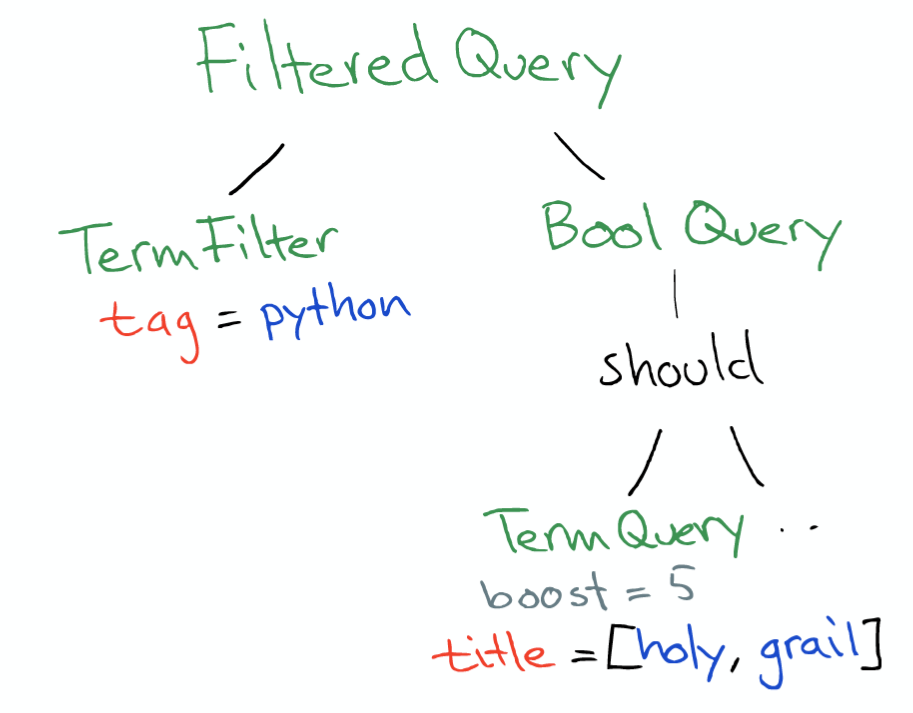

並在所有的 segment 中執行計算:

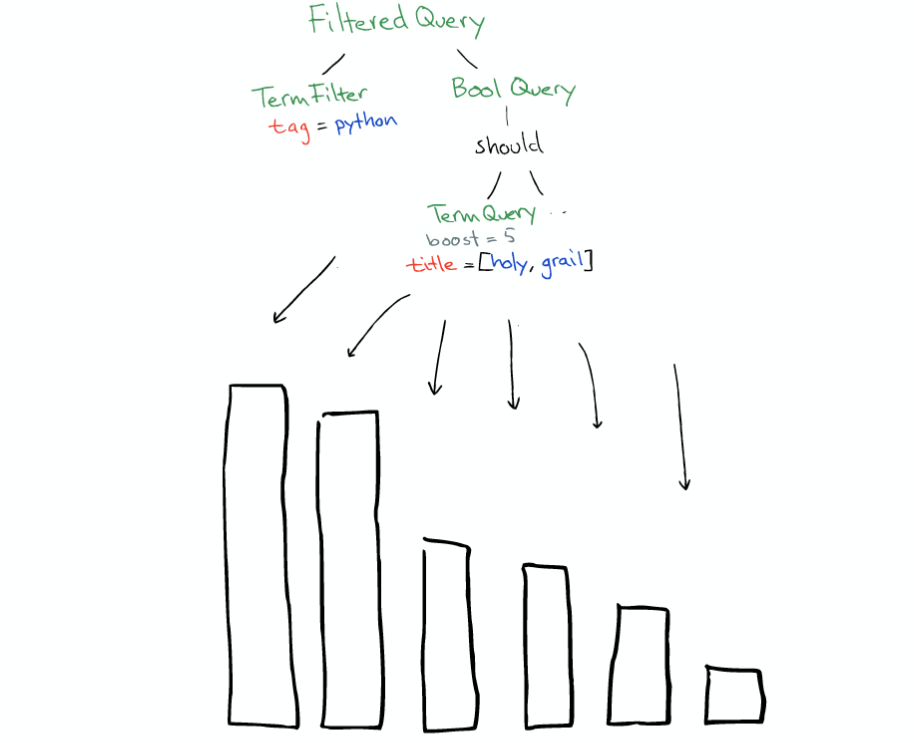

Lucene 對於 filter 也會產生 cache(`Filter PerSegment Cache`):

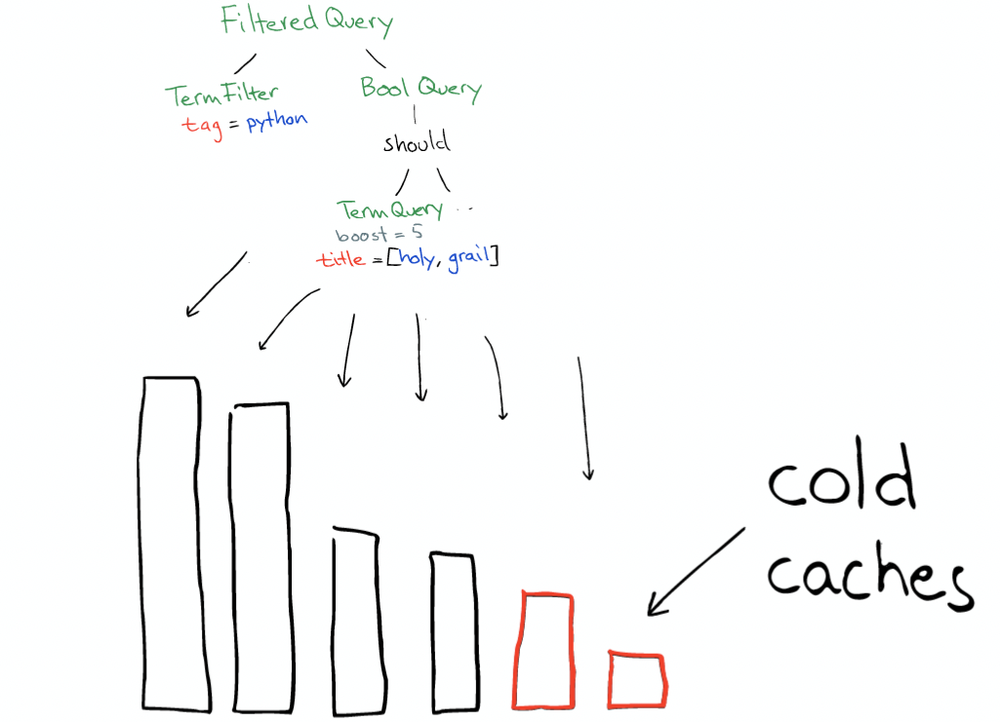

查詢結束後, 結果會沿著下行路徑向上逐層返回:

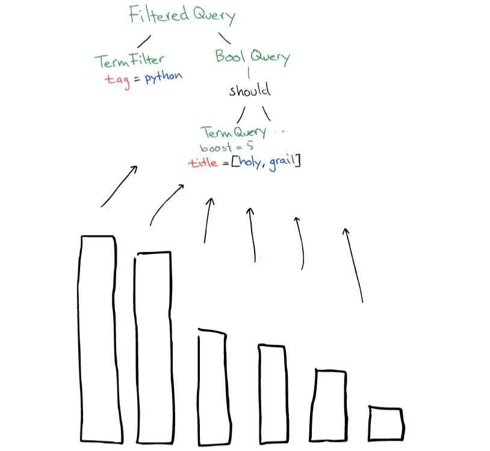


## Index Structure

Index structure in Lucene:

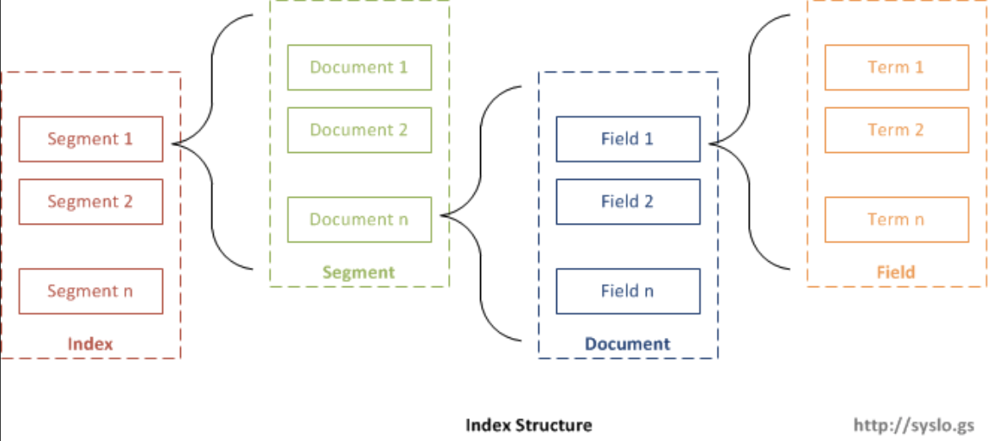

Index structure files:

| Name                | Extension  | Brief Description                                                                                                       |
| ------------------- | ---------- | ----------------------------------------------------------------------------------------------------------------------- |
| Segments File       | segments_N | Stores                                                                                                                  | information about a commit point |
| Lock File           | write.lock | The Write lock prevents multiple IndexWriters from writing to the same file.                                            |
| Segment Info        | .si        | Stores metadata about a segment                                                                                         |
| Compound File       | .cfs, .cfe | An optional "virtual" file consisting of all the other index files for systems that frequently run out of file handles. |
| Fields              | .fnm       | Stores information about the fields                                                                                     |
| Field Index         | .fdx       | Contains pointers to field data                                                                                         |
| Field Data          | .fdt       | The stored fields for documents                                                                                         |
| Term Dictionary     | .tim       | The term dictionary, stores term info                                                                                   |
| Term Index          | .tip       | The index into the Term Dictionary                                                                                      |
| Frequencies         | .doc       | Contains the list of docs which contain each term along with frequency                                                  |
| Positions           | .pos       | Stores position information about where a term occurs in the index                                                      |
| Payloads            | .pay       | Stores additional per-position metadata information such as character offsets and user payloads                         |
| Norms               | .nvd, .nvm | Encodes length and boost factors for docs and fields                                                                    |
| Per-Document Values | .dvd, .dvm | Encodes additional scoring factors or other per-document information.                                                   |
| Term Vector Index   | .tvx       | Stores offset into the document data file                                                                               |
| Term Vector Data    | .tvd       | Contains term vector data.                                                                                              |
| Live Documents      | .liv       | Info about what documents are live                                                                                      |
| Point values        | .dii, .dim | Holds indexed points, if any                                                                                            |

Index files relationship:

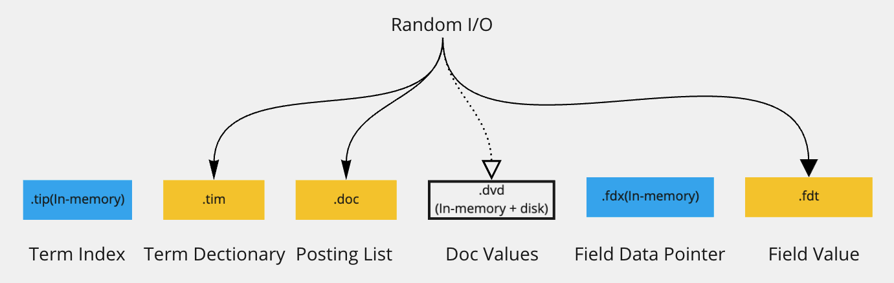


# Elastic Stack

> Beats + Logstash + Elasticsearch + Kibana

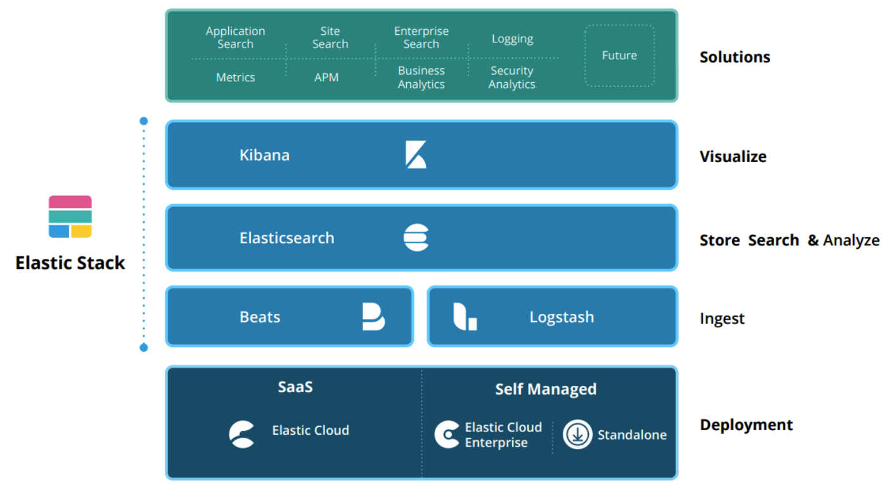

## Beats

`Beats` 是一個輕量型採集器平台, 這些採集器可以從 edge mechine 向 `Logstash` 或 `Elasticsearch` 發送資料, 期由 Go 進行開發, 運行效率較高, 不同的 beats 套件針對不同的 data source

## Logstash

`Logstash` 是動態資料收集管道, 擁有可擴充的 plugin 生態, 支持從不同來源收集資料並轉換, 最後將資料發送到不同的資料庫中, 能與 Elasticsearch 產生強大的協同作用, 在 2013 年被 Elastic 公司收購

其具有以下特性:
- 實時解析與轉化資料
- 可擴展性
- 可用性, 會通過持久話隊列來保證至少將運行中的事件送達一次
- 安全性, 可對資料進行傳輸加密
- 可監控

## Elasticsearch

`Elasticsearch` 可對資料進行搜尋, 分析和儲存, 其是基於 `sh` 的分散式搜尋和分析引擎, 專門為了實現水平擴展性, 高可用性及管理便攜性而設計

其實現原理主要分為以下幾個步驟:
- 將資料提交到 Elasticsearch 中
- 通過分詞器將對應語句分詞
- 將分詞結果及權重一並存入, 在搜尋資料時根據權重將結果排名並返回

## Kibana

`Kibana` 實現資料可視化, 其作用為將 Elasticsearch 中的資料以圖表的形式呈現, 且具有可擴展的使用者介面, 可以配置並管理 Elasticsearch

Kibana 最早是基於 Logstash 創建的工具, 後被 Elastic 公司於 2013 年收購

## X-Pack


- Security
  - Authentication
  - Authorization
  - Encryption
  - Layerd security
- Alerting
- Monitoring
- Reporting
- Graph analytics
- dedicated APM UIs
- Machine Learning

# Index Modules

> Index Modules are modules created per index and control all aspects related to an index.

# Inverted Index

當一段文字導入到 Elasticsearch 中, 會需要經過一段 `indexing` 的過程

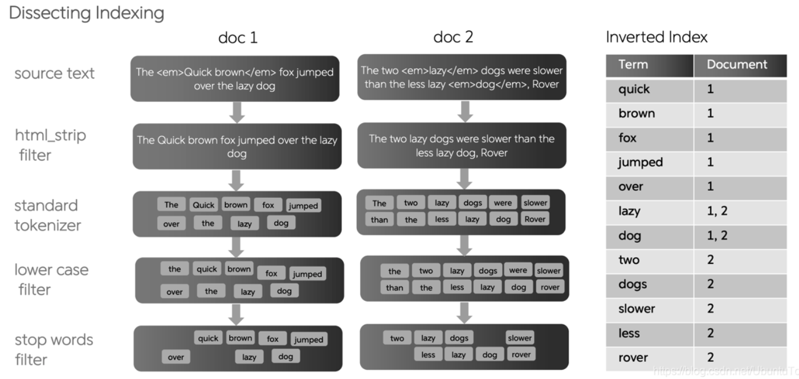

`Inverted Index` 類似於在書結尾處所看到的 index, 其主要負責將 document 中出現過的 term 映射到 document:


舉例來說, 可以從以下字符串來構建 `Inverted Index`:


Elasticsearch 會根據建立 index 的三個 documents 中來構建 `Inverted Index`:

| Term     | Frequency | Document (postings) |
| -------- | --------- | ------------------- |
| choice   | 1         | 3                   |
| day      | 1         | 2                   |
| is       | 3         | 1,2,3               |
| it       | 1         | 1                   |
| last     | 1         | 2                   |
| of       | 1         | 2                   |
| sunday   | 2         | 1,2                 |
| the      | 3         | 2,3                 |
| tomorrow | 1         | 1                   |
| week     | 1         | 2                   |
| yours    | 1         | 3                   |

與常規的根據 document id 來查詢 term 相反, `Inverted Index` 是根據 term 來查詢對應的 document ids

需注意以下幾點:
- 刪除符號並小寫後, document 會按照 term 進行細分
- term 會以字母順序排序
- `Frequency` 代表該 term 在整個 document set 中出現的次數
- `Posting list` 主要紀錄該 term 的確切位置 (document offset)

默認情況下 Elasticsearch 會為 document 中所有的 field 構建 `Inverted Index`, 並指向該 field 所在的 document

## Index Management

在之前新增 document 時, 使用下面的方式會動態創建一個 customer 的 index:

```shell
curl -X POST "localhost:9200/customer/_doc/1?pretty" -H 'Content-Type: application/sh' -d'
{
  "name": "John Doe"
}
'
```

這個 index 實際上已經自動創建了一個 mapping:

```sh
{
  "mappings": {
    "_doc": {
      "properties": {
        "name": {
          "type": "text",
          "fields": {
            "keyword": {
              "type": "keyword",
              "ignore_above": 256
            }
          }
        }
      }
    }
  }
}
```

如果需要對建立 index 的過程做更多的控制, 如想要確保這個 index 有數量適中的主分片, 且在新增任何資料之前分析器和 mapping 都已經被建立好, 就需要 import 兩點:
- 禁止自動創建 index
- 手動設定並創建 index

可以通過在 `config/elasticsearch.yaml` 的每個節點下添加下面的配置:

```yaml
action.auto_create_index: false
```

## Index Format

在 request body 中添加設置或是型別 mapping, 如下所示:

```sh
PUT /my_index
{
    "settings": { ... any settings ... },
    "mappings": {
        "properties": { ... any properties ... }
    }
}
```

- settings: 設置 shards, replications 等配置資訊
- mappings: field mapping, type 等
  - properties: object fields or nested fields

## Create Index

```sh
# create index test_index
PUT /test_index?pretty
{
# index settings
  "settings": {
    "index": {
      "number_of_shards": 1, # shard 數量為 1, default 5
      "number_of_replicas": 1 # replication 數量 1, default 1
    }
  },
# index mapping
  "mappings": {
    "_doc": { # 型別, 建議設置為 _doc
      "dynamic": false, # 動態映射配置
# field properties
      "properties": {
        "id": {
          "type": "integer"  # 表示 field id 型別為 integer
        },
        "name": {
          "type": "text",
          "analyzer": "ik_max_word", # 儲存時使用的分詞器
          "search_analyzer": "ik_smart"  # 查詢時使用的分詞器
        },
        "createAt": {
          "type": "date"
        }
      }
    }
  }
}
```

>❗️NOTE: `dynamic` 為動態映射配置, 有三種狀態: true, 動態新增新的 field; false, 忽略新的 field, 不會新增 field mapping, 但會存在於 `_source` 中; strict, 若遇到新 field 會拋出 exception

output:

```sh
{
  "acknowledged": true, # 是否在 cluster 中成功創建 index
  "shards_acknowledged": true,
  "index": "test_index"
}
```

## Search Index

```sh
# 查看 index
GET /test_index

# 可以同時查看多個 index
GET /test_index,other_index

# 查看所有 index
GET /_cat/indices?v
```

output:

```sh
{
  "test_index": {
    "aliases": {},
    "mappings": {
      "_doc": {
        "dynamic": "false",
        "properties": {
          "createAt": {
            "type": "date"
          },
          "id": {
            "type": "integer"
          },
          "name": {
            "type": "text",
            "analyzer": "ik_max_word",
            "search_analyzer": "ik_smart"
          }
        }
      }
    },
    "settings": {
      "index": {
        "creation_date": "1589271136921",
        "number_of_shards": "1",
        "number_of_replicas": "1",
        "uuid": "xueDIxeUQnGBQTms65wA6Q",
        "version": {
          "created": "6050499"
        },
        "provided_name": "test_index"
      }
    }
  }
}
```

## Update Index

> ES 提供了一系列針對 index 修改的語法, 包括 replication 數量, 新增 field, refresh_interval, index parser, aliases 等配置的修改

```sh
# 修改 replication
PUT /test_index/_settings
{
    "index" : {
        "number_of_replicas" : 2
    }
}

# 修改 shard 刷新時間, default 為 1s
PUT /test_index/_settings
{
    "index" : {
        "refresh_interval" : "2s"
    }
}

# 新增 field age
PUT /teset_index/_mapping/_doc
{
  "properties": {
    "age": {
      "type": "integer"
    }
  }
}
```

修改完成後再次查看 index config:

```sh
GET /test_index
{
  "test_index": {
    "aliases": {},
    "mappings": {
      "_doc": {
        "dynamic": "false",
        "properties": {
          "age": { #
            "type": "integer"
          },
          "createAt": {
            "type": "date"
          },
          "id": {
            "type": "integer"
          },
          "name": {
            "type": "text",
            "analyzer": "ik_max_word",
            "search_analyzer": "ik_smart"
          }
        }
      }
    },
    "settings": {
      "index": {
        "refresh_interval": "2s", #
        "number_of_shards": "1", #
        "provided_name": "test_index",
        "creation_date": "1589271136921",
        "number_of_replicas": "2",
        "uuid": "xueDIxeUQnGBQTms65wA6Q",
        "version": {
          "created": "6050499"
        }
      }
    }
  }
}
```

## Delete Index

```sh
# 刪除 index
DELETE /test_index

# 驗證 index 是否存在
HEAD test_index
return: 404 - Not Found
```

## Open/Close Index

一旦 index 被關閉, 則此 index 只能顯示 metadata, 無法進行任何讀寫操作:

```sh
POST /test-index-users/_close
```

關閉 index 後再插入資料:

```sh
POST /test-index-users/_doc
{
    "name" : "test user2",
    "age" : 18,
    "remarks" : "hello user2"
}
```

會報 `index_closed_exception` 錯誤

再打開 index:

```sh
POST /test-index-users/_open
```

output:

```sh
{
    "acknowledged" : true,
    "shards_acknowledged" : true
}

此時又可以重新寫入資料:

```sh
POST /test-index-users/_doc
{
    "name" : "test user2",
    "age" : 18,
    "remarks" : "hello user2"
}
```

# Document Operations

可以通過 RESTful API 的方式對 Elasticsearch document 進行操作

## Create Document

```sh
# 新增單筆資料並指定 document id 為 1
PUT /test_index/_doc/1?pretty
{
  "name": "Regy"
}

# 新增單筆資料並自動生成 document id
POST /test_index/_doc?pretty
{
  "name": "Regy2"
}

# 使用 op_type 属性，强制执行某种操作
PUT test_index/_doc/1?op_type=create
{
  "name": "Regy3"
}
```
>❗️NOTE: `op_type=create` 強制執行時若 id 已存在, ES 會報`version_conflict_engine_exception`, `op_type` 主要應用於同步資料場景

此時可以查詢資料:

```sh
GET /test_index/_doc/_search
{
  "took": 1,
  "timed_out": false,
  "_shards": {
    "total": 1,
    "successful": 1,
    "skipped": 0,
    "failed": 0
  },
  "hits": {
    "total": 2,
    "max_score": 1,
    "hits": [
      {
        "_index": "test_index",
        "_type": "_doc",
        "_id": "1",
        "_score": 1,
        "_source": {
          "name": "Regy"
        }
      },
      {
        "_index": "test_index",
        "_type": "_doc",
        "_id": "P7-FCHIBJxE1TMY0WNGN",
        "_score": 1,
        "_source": {
          "name": "Regy2"
        }
      }
    ]
  }
}
```

## Search Document

```sh
# 根據 id 查詢單筆資料
GET /test_index/_doc/1

# output--->
{
  "_index": "test_index",
  "_type": "_doc",
  "_id": "1",
  "_version": 5,
  "found": true,
  "_source": {
    "name": "Regy-update",
    "age": 18
  }
}

# 獲取 index 中所有資料
GET /test_index/_doc/_search

# output--->
{
  "took": 1,
  "timed_out": false,
  "_shards": {
    "total": 1,
    "successful": 1,
    "skipped": 0,
    "failed": 0
  },
  "hits": {
    "total": 3,
    "max_score": 1,
    "hits": [
      {
        "_index": "test_index",
        "_type": "_doc",
        "_id": "P7-FCHIBJxE1TMY0WNGN",
        "_score": 1,
        "_source": {
          "name": "Regy2"
        }
      },
      {
        "_index": "test_index",
        "_type": "_doc",
        "_id": "_update",
        "_score": 1,
        "_source": {
          "name": "Regy3"
        }
      },
      {
        "_index": "test_index",
        "_type": "_doc",
        "_id": "1",
        "_score": 1,
        "_source": {
          "name": "Regy-update",
          "age": 18
        }
      }
    ]
  }
}

# 條件查詢
GET /test_index/_doc/_search
{
  "query": {
    "match": {
      "name": "2"
    }
  }
}

# output--->
{
  "took": 1,
  "timed_out": false,
  "_shards": {
    "total": 1,
    "successful": 1,
    "skipped": 0,
    "failed": 0
  },
  "hits": {
    "total": 1,
    "max_score": 0.9808292,
    "hits": [
      {
        "_index": "test_index",
        "_type": "_doc",
        "_id": "P7-FCHIBJxE1TMY0WNGN",
        "_score": 0.9808292,
        "_source": {
          "name": "Regy2"
        }
      }
    ]
  }
}
```

## Update Document

```sh
# 根據 id 修改單筆資料
PUT /test_index/_doc/1?pretty
{
  "name": "Regy-update-after"
}
# 根據查詢條件 id=10, 修改 name=after name
POST test_index/_update_by_query
{
  "script": {
    "source": "ctx._source.name = params.name",
    "lang": "painless",
    "params":{
      "name":"after name"
    }
  },
  "query": {
    "term": {
      "id": "10"
    }
  }
}
```

>❗️NOTE: 修改語法和新增語法相同, 可以理解為根據 ID, 資料存在則更新; 不存在則新增

## Delete Document

```sh
# 根據 id 刪除單筆資料
DELETE /test_index/_doc/1

# delete by query
POST test_index/_delete_by_query
{
  "query": {
    "match": {
     "name": "2"
    }
  }
}
```

## Bulk Operations

```sh
POST _bulk
{ "index" : { "_index" : "test_test1", "_type" : "_doc", "_id" : "1" } }
{ "this_is_field1" : "this_is_index_value" }
{ "delete" : { "_index" : "test_test1", "_type" : "_doc", "_id" : "2" } }
{ "create" : { "_index" : "test_test1", "_type" : "_doc", "_id" : "3" } }
{ "this_is_field3" : "this_is_create_value" }
{ "update" : {"_id" : "1", "_type" : "_doc", "_index" : "test_test1"} }
{ "doc" : {"this_is_field2" : "this_is_update_value"} }

# 查詢所有資料
GET /test_test1/_doc/_search

# output--->
{
  "took": 33,
  "timed_out": false,
  "_shards": {
    "total": 5,
    "successful": 5,
    "skipped": 0,
    "failed": 0
  },
  "hits": {
    "total": 2,
    "max_score": 1,
    "hits": [
      {
        "_index": "test_test1",
        "_type": "_doc",
        "_id": "1",
        "_score": 1,
        "_source": {
          "this_is_field1": "this_is_index_value",
          "this_is_field2": "this_is_update_value"
        }
      },
      {
        "_index": "test_test1",
        "_type": "_doc",
        "_id": "3",
        "_score": 1,
        "_source": {
          "this_is_field3": "this_is_create_value"
        }
      }
    ]
  }
}
```

>💡 POST _bulk 做了哪些操作?
- 若 index `test_test1` 不存在則創建, 同時若 id=1 document 存在則更新
- 刪除 id=2 document
- 新增 id=3 document; 若 document 存在則報 exception
- 更新 id=1 document

> 實際環境中 bulk operation 使用較多, 其可大幅縮減 IO 以提升效率

# Query DSL

## Term Query

`Term-level queries` 即根據結構化資料中的精確值來查找 document, 與 `Full text queries` 的不同之處在於, `Term-level queries` 不會對查詢值進行分詞, 直接於 `Inverted Index` 中進行精準查詢

而 `Full text queries` 則會先對查詢的詞進行分詞, 並對分詞結果一一於 `Inverted Index` 進行模糊查詢

以下設計一個測試資料集以範例說明:

```sh
PUT /test-dsl-term-level
{
  "mappings": {
    "properties": {
      "name": {
        "type": "keyword"
      },
      "programming_languages": {
        "type": "keyword"
      },
      "required_matches": {
        "type": "long"
      }
    }
  }
}

POST /test-dsl-term-level/_bulk
{ "index": { "_id": 1 }}
{"name": "Jane Smith", "programming_languages": [ "c++", "java" ], "required_matches": 2}
{ "index": { "_id": 2 }}
{"name": "Jason Response", "programming_languages": [ "java", "php" ], "required_matches": 2}
{ "index": { "_id": 3 }}
{"name": "Dave Pdai", "programming_languages": [ "java", "c++", "php" ], "required_matches": 3, "remarks": "hello world"}
```

### If Field Exist: exist

由於種種原因, document field 的值可能不存在:
- 原 sh 中 field 為 `null` 或 `[]`
- 該 field 在 mapping 中被設置為 `"index": false`
- field length 超出 mapping 中 `ignore_above` 設置長度
- field 格式錯誤, 且 mapping 中定義 `ignore_malformed`

可使用 `exist` 來查詢 field 是否存在:

```sh
GET /test-dsl-term-level/_search
{
  "query": {
    "exists": {
      "field": "remarks"
    }
  }
}
```

### Search _id: ids

`ids` 即為 search id:

```sh
GET /test-dsl-term-level/_search
{
  "query": {
    "ids": {
      "values": [3, 1]
    }
  }
}
```

### Search Prefix: prefix

通過 `prefix` 查找某個 field:

```sh
GET /test-dsl-term-level/_search
{
  "query": {
    "prefix": {
      "name": {
        "value": "Jan"
      }
    }
  }
}
```

### Precise Search: term

`term` 根據 `Postings lists` 進行精準查詢:

```sh
GET /test-dsl-term-level/_search
{
  "query": {
    "term": {
      "programming_languages": "php"
    }
  }
}
```

### Multiple Precise Serach: terms

依照每個查詢值進行 `term query`, 每個查詢值之間為 `OR` 關係:

```sh
GET /test-dsl-term-level/_search
{
  "query": {
    "terms": {
      "programming_languages": ["php","c++"]
    }
  }
}
```

###  Minimum Number of Multiple Precise Search: terms_set

The `terms_set` query is the same as the terms query, except you can define the number of matching terms required to return a document.

```sh
GET /test-dsl-term-level/_search
{
  "query": {
    "terms_set": {
      "programming_languages": {
        "terms": [ "java", "php" ],
        "minimum_should_match_field": "required_matches"
      }
    }
  }
}
```

### Wildcard Query: wildcard

Returns documents that contain terms matching a wildcard pattern.

```sh
GET /test-dsl-term-level/_search
{
  "query": {
    "wildcard": {
      "name": {
        "value": "D*ai",
        "boost": 1.0,
        "rewrite": "constant_score"
      }
    }
  }
}
```

### Range Query: range

Returns documents that contain terms within a provided range.

```sh
GET /test-dsl-term-level/_search
{
  "query": {
    "range": {
      "required_matches": {
        "gte": 3,
        "lte": 4
      }
    }
  }
}
```

### Regular Expression Query: regexp

Returns documents that contain terms matching a regular expression.

```sh
GET /test-dsl-term-level/_search
{
  "query": {
    "regexp": {
      "name": {
        "value": "Ja.*",
        "case_insensitive": true
      }
    }
  }
}
```

### Fuzzy Query: fuzzy

Returns documents that contain terms similar to the search term, as measured by a Levenshtein edit distance.

```sh
GET /test-dsl-term-level/_search
{
  "query": {
    "fuzzy": {
      "remarks": {
        "value": "hell"
      }
    }
  }
}
```