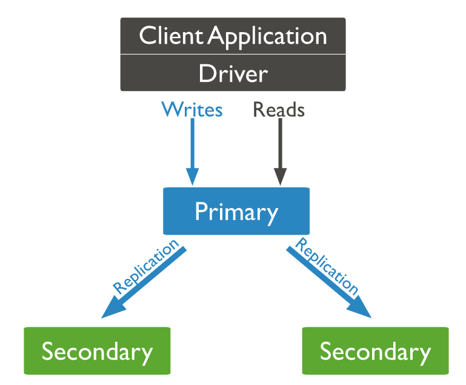

- [Introduction](#introduction)
  - [Document-base Feature](#document-base-feature)
  - [JSON Feature](#json-feature)
  - [High Avaliability](#high-avaliability)
  - [High Scalability](#high-scalability)
- [Replica Set](#replica-set)
  - [Feature](#feature)
  - [Replica Set Members](#replica-set-members)
  - [How Replica Set Work](#how-replica-set-work)
  - [Replica Set Elections](#replica-set-elections)
  - [Replication Methods](#replication-methods)
- [Sharding](#sharding)
  - [Why Sharding?](#why-sharding)
  - [Sharded Cluster](#sharded-cluster)
  - [Chunks](#chunks)
    - [Jumbo Chunk](#jumbo-chunk)
    - [Chunk size](#chunk-size)
  - [Shard Key](#shard-key)
    - [Ranged Sharding](#ranged-sharding)
    - [Hashed Sharding](#hashed-sharding)
    - [Zones / Tag](#zones--tag)
    - [Performance Tips](#performance-tips)
  - [**Balancer**](#balancer)
  - [Config Server](#config-server)
- [CRUD → aggregation](#crud--aggregation)
- [Transaction-Multiple document](#transaction-multiple-document)
  - [w: writeConcern](#w-writeconcern)
  - [readConcern: 決定節點上哪些數據可讀(isolation level)](#readconcern-決定節點上哪些數據可讀isolation-level)
  - [readPreference: 決定讀請求節點](#readpreference-決定讀請求節點)
  - [j: journal](#j-journal)
- [Security](#security)
  - [Authentication](#authentication)
    - [Replica Set](#replica-set-1)
    - [Sharded Cluster](#sharded-cluster-1)
  - [Backup](#backup)
    - [Feature](#feature-1)
    - [Methods](#methods)
  - [Auditing](#auditing)
- [Indexes](#indexes)
  - [Performance Tips](#performance-tips-1)
- [Storage Engine - WiredTiger](#storage-engine---wiredtiger)
  - [Document Level Concurrency](#document-level-concurrency)
  - [Snapshot & Checkpoints (ACID)](#snapshot--checkpoints-acid)
  - [Journal](#journal)
  - [Compression](#compression)
  - [Memory Use](#memory-use)
  - [Data Structure](#data-structure)
- [Monitor](#monitor)
  - [Performance](#performance)
  - [Ops Manager](#ops-manager)
    - [Replica Set](#replica-set-2)
- [Exception Handling](#exception-handling)
  - [Rollback](#rollback)
- [Document Design Patterns](#document-design-patterns)
- [No Usage](#no-usage)
- [Ref](#ref)
- [mongod.conf](#mongodconf)
- [for documentation of all options, see:](#for-documentation-of-all-options-see)
- [http://docs.mongodb.org/manual/reference/configuration-options/](#httpdocsmongodborgmanualreferenceconfiguration-options)
- [where to write logging data.](#where-to-write-logging-data)
- [Where and how to store data.](#where-and-how-to-store-data)
- [engine:](#engine)
- [wiredTiger:](#wiredtiger)
- [how the process runs](#how-the-process-runs)
- [network interfaces](#network-interfaces)
  - [Enterprise-Only Options](#enterprise-only-options)
- [Official Tips](#official-tips)

# Introduction

> MongoDB vs. RDB

| Item              |                                 MongoDB                                 |                            RDBMS |
| :---------------- | :---------------------------------------------------------------------: | -------------------------------: |
| Data Model        |                                Document                                 |                       Relational |
| DB Type           |                                  OLTP                                   |                             OLTP |
| CRUD Operation    |                                 MQL/SQL                                 |                              SQL |
| High Avaliability |                               Replica Set                               |                          Cluster |
| High Scalability  |                             Native Sharding                             | Partition or third-party plugins |
| Index             | B+Tree、MultiKey、Geospatial、Text Indexes、Hashed Indexes、TTL indexes |                          B+ Tree |
| Data Volume       |                                 Unlimit                                 |                               TB |

## Document-base Feature

- 多形性：同一個 Collection 可包含不同 filed 的 document object
- 動態性：線上修改數據模式，應用與資料庫無須 shutdown
- 數據治理：支持 JSON Schema 來規範數據結構

## JSON Feature

- 集中存儲讀寫(seek time >> transfer time ~= 95 : 5)
- 反正規化、無關聯的組織資料優化查詢速度
- 開發效率提升，減少 ORM Layer 成本

## High Avaliability

- Replica Set - 2 to 50 members
- automatic failover
- multi center tolerant

## High Scalability

- 無縫擴展
- 應用透明
- 多種分布策略
- 輕鬆支援 TB - PB 級資料

# Replica Set

## Feature

- Content Distribution
- Read / Write Splitting
- Remote backup

## Replica Set Members

> Primary
> 
- replica set can have at most one primary
- only member in the replica set that receives write operations
- by default, an application directs its read operations to the primary member  [#readPreference](https://www.notion.so/MongoDB-1c59d82feff7495384b6582411565283)

> Two or more Secondary
> 
- maintains a copy of the primary’s data set
- secondary applies operations from the primary’s oplog to its own data set in an asynchronous process
- If the current primary becomes unavailable, the replica set holds an election to choose which of the secondaries becomes the new primary
- Configuration
    - Prevent it from becoming a primary in an election, which allows it to reside in a secondary data center or to serve as a cold standby. See [Priority 0 Replica Set Members](https://docs.mongodb.com/manual/core/replica-set-priority-0-member/).
    - Prevent applications from reading from it, which allows it to run applications that require separation from normal traffic. See [Hidden Replica Set Members](https://docs.mongodb.com/manual/core/replica-set-hidden-member/).
    - Keep a running “historical” snapshot for use in recovery from certain errors, such as unintentionally deleted databases. See [Delayed Replica Set Members](https://docs.mongodb.com/manual/core/replica-set-delayed-member/).
    

> Arbiter
> 
- Does not have a copy of data set and cannot become a primary
- Participates in elections for primary. An arbiter has exactly 1 election vote

⚠️ Changed in version 3.6: Starting in MongoDB 3.6, arbiters have priority 0. When you upgrade a replica set to MongoDB 3.6, if the existing configuration has an arbiter with priority 1, MongoDB 3.6 reconfigures the arbiter to have priority 0.

## How Replica Set Work

> Asynchronous Replication
> 
- Creat、Update、Delete operations were recorded in oplog.
- Uses tailable cursors to tail the primary’s oplog.
- Slow Operations
- Replication Lag and Flow Control
- Initial Sync Process
    - 全量同步開始，獲取同步源最新時間戳 t1
    - 全量同步集合數據，建立索引(較耗時)
    - 獲取同步源最新時間戳 t2
    - 重放 t1 - t2 oplog
    - 全量同步結束

> Elections
> 
- Replica set members send heartbeats (pings) to each other every two seconds
- If a heartbeat does not return within 10 seconds, the other members mark the delinquent member as inaccessible.
- If the primary is unavailable, an eligible secondary will hold an election to elect itself the new primary.
- If the secondary is unavailable, wouldn't trigger an new election.
- Election uses Raft-Like Consensus Algorithm.
- A replica set can have up to 50 members but only 7 voting members.

> Automatic Failover
> 
- electionTimeoutMillis period (10 seconds by default)
- Replica set cannot process write operations until the election completes successfully
- The replica set can continue to serve read queries if such queries are configured to run on secondaries while the primary is offline
- Starting in MongoDB 3.6 providing additional built-in handling of automatic failovers and elections:
    - MongoDB 4.2-compatible drivers enable retryable writes by default
    - MongoDB 4.0 and 3.6-compatible drivers must explicitly enable retryable writes by including [retryWrites=true](https://docs.mongodb.com/manual/reference/connection-string/#urioption.retryWrites) in the [connection string](https://docs.mongodb.com/manual/reference/connection-string/#mongodb-uri).
    
    
    >💡 Starting in version 4.4, MongoDB provides [#mirrored reads](https://www.notion.so/MongoDB-1c59d82feff7495384b6582411565283) to pre-warm electable secondary members’ cache with the most recently accessed data. Pre-warming the cache of a secondary can help restore performance more quickly after an election.
    
    
    
- MongoDB failover process:
    - [Replica Set Elections](https://docs.mongodb.com/manual/core/replica-set-elections/#replica-set-elections)
    - [Retryable Writes](https://docs.mongodb.com/manual/core/retryable-writes/#retryable-writes)
    - [Rollbacks During Replica Set Failover](https://docs.mongodb.com/manual/core/replica-set-rollbacks/#replica-set-rollback)
        
        
        ⚠️ Rollback is necessary only if the primary had accepted write operations that the secondaries had not successfully replicated before the primary stepped down
        
        
        
    

> Read Operations
> 
- [Read Preference](https://www.notion.so/MongoDB-1c59d82feff7495384b6582411565283)
- [Data Visibility](https://docs.mongodb.com/manual/replication/#data-visibility)
- [Mirrored Reads](https://docs.mongodb.com/manual/replication/#mirrored-reads)
- [Supported Operations](https://docs.mongodb.com/manual/replication/#supported-operations)
- [Enable/Disable Support for Mirrored Reads](https://docs.mongodb.com/manual/replication/#enable-disable-support-for-mirrored-reads)
- [Mirrored Reads Metrics](https://docs.mongodb.com/manual/replication/#mirrored-reads-metrics)

> Transactions
> 
- Starting in MongoDB 4.0, multi-document transactions are available for replica sets
- Until a transaction commits, the data changes made in the transaction are not visible outside the transaction
- Transaction writes to multiple shards, not all outside read operations need to wait for the result of the committed transaction to be visible across the shards

> Change Streams
> 
- Starting in MongoDB 3.6, change streams are available for replica sets and sharded clusters
- Allow applications to access real-time data changes

## Replica Set Elections

Normal startup process:

- 節點初始化為 Startup 狀態, 加載 Replica Set Config 後啟動 Heartbeat, 狀態切換為 Startup2 成為 Follower
- 節點開始初始化數據同步, 狀態切換為 Recovering, 當數據同步到集群的最小一致性時間戳(minValid)後切換到 Secondary
- 當 Secondary / Follower heartbeat process 發現一定時間後(electionTimeoutMillis) , 當前 Replica Set 中沒有 Primary / Leader 時, 會切換為 Secondary / Follower 發起選舉
- 選舉分為兩部分: dry-run election & real election
    - Dry-run Election: Candidate 構造 replSetVoteRequest 命令發送到其他節點, 試探自己能否赢贏得選舉, 這個過程不增加任期, 如果有 primary 收到 replSetVoteRequest 發現任期比自身新，就會開始 stepdown
    - Real Election: Candidate 贏得 dry-run election後, 就會發起正式選舉, 首先增加任期並給自己投票, 然後發起 replSetVoteRequest 命令發送到其他節點, 獲得大多數投票成為 Leader
- 作為 Follower 節點在收到 replSetVoteRequest 後, 會刷新自己的任期, 然後判斷是否給候選人投票, 投票時會判斷：
    - 任期是否新
    - 協議版本是否匹配
    - Replica Set 名稱是否匹配
    - 本節點最近提交的 Optime 是否舊於候選人的 Optime
    - 在該任期內是否投過票

Replica sets can trigger an election in response to a variety of events, such as:

- Adding a new node to the replica set,
- [initiating a replica set](https://docs.mongodb.com/manual/reference/method/rs.initiate/#rs.initiate),
- performing replica set maintenance using methods such as [rs.stepDown()](https://docs.mongodb.com/manual/reference/method/rs.stepDown/#rs.stepDown) or [rs.reconfig()](https://docs.mongodb.com/manual/reference/method/rs.reconfig/#rs.reconfig), and
- the [secondary](https://docs.mongodb.com/manual/reference/glossary/#term-secondary) members losing connectivity to the primary for more than the configured [timeout](https://docs.mongodb.com/manual/reference/replica-configuration/#rsconf.settings.electionTimeoutMillis) (10 seconds by default).

> Factors and Conditions that Affect Elections
> 
- Replication Election Protocol
    - MongoDB 4.0 removes the deprecated replication protocol version 0
    - Replication protocolVersion: 1 reduces replica set failover time and accelerate the detection of multiple simultaneous primaries
    - Ref: [Replica Set Protocol Version](https://docs.mongodb.com/manual/reference/replica-set-protocol-versions/)
- Heartbeats
    
    
    >💡 Replica set members send heartbeats (pings) to each other every two seconds. If a heartbeat does not return within 10 seconds, the other members mark the delinquent member as inaccessible.
    
    
    
- Member Priority
- Mirrored Reads
- Loss of a Data Center
- Network Partition

> Voting Members
> 
- Non-voting (i.e. [votes](https://docs.mongodb.com/manual/reference/replica-configuration/#rsconf.members[n].votes) is 0) members must have [priority](https://docs.mongodb.com/manual/reference/replica-configuration/#rsconf.members[n].priority) of 0.
- Members with [priority](https://docs.mongodb.com/manual/reference/replica-configuration/#rsconf.members[n].priority) greater than 0 cannot have 0 [votes](https://docs.mongodb.com/manual/reference/replica-configuration/#rsconf.members[n].votes).
- Only voting members in the following states are eligible to vote:
    - [PRIMARY](https://docs.mongodb.com/manual/reference/replica-states/#replstate.PRIMARY)
    - [SECONDARY](https://docs.mongodb.com/manual/reference/replica-states/#replstate.SECONDARY)
    - [STARTUP2](https://docs.mongodb.com/manual/reference/replica-states/#replstate.STARTUP2)
    - [RECOVERING](https://docs.mongodb.com/manual/reference/replica-states/#replstate.RECOVERING)
    - [ARBITER](https://docs.mongodb.com/manual/reference/replica-states/#replstate.ARBITER)
    - [ROLLBACK](https://docs.mongodb.com/manual/reference/replica-states/#replstate.ROLLBACK)

> Non-Voting Members
> 
- Although non-voting members do not vote in elections, these members hold copies of the replica set’s data and can accept read operations from client applications
- Non-voting (i.e. votes is 0) members must have priority of 0

## Replication Methods

> rs.secondaryOk()
> 

Allows read operations on secondary members for the MongoDB connection.

# Sharding

## Why Sharding?

- Storage Capacity bottleneck
    - I/O capacity challenge, maybe CPU、RAM or NIC bottleneck

## Sharded Cluster

- [shard](https://docs.mongodb.com/manual/core/sharded-cluster-shards/): Each shard contains a subset of the sharded data. Each shard can be deployed as a [replica set](https://docs.mongodb.com/manual/reference/glossary/#term-replica-set).
- [mongos](https://docs.mongodb.com/manual/core/sharded-cluster-query-router/): The mongos acts as a query router, providing an interface between client applications and the sharded cluster. Starting in MongoDB 4.4, mongos can support [hedged reads](https://docs.mongodb.com/manual/core/sharded-cluster-query-router/#mongos-hedged-reads) to minimize latencies.

>💡 Recommend at least 2 node

- [config servers](https://docs.mongodb.com/manual/core/sharded-cluster-config-servers/): Config servers store metadata and configuration settings for the cluster.

---

## Chunks

### Jumbo Chunk

> If MongoDB cannot split a chunk that exceeds the specified chunk size or contains a number of documents that exceeds the max, MongoDB labels the chunk as jumbo.
> 

### Chunk size

---

## Shard Key

### Ranged Sharding

- Default sharding methodology
- Dividing data into contiguous ranges determined by the shard key values

### Hashed Sharding

- Uses either a single field hashed index or a compound hashed index (New in 4.4) as the shard key to partition data across your cluster

⚠️ MongoDB hashed indexes truncate floating point numbers to 64-bit integers before hashing. For example, a hashed index would store the same value for a field that held a value of 2.3, 2.2, and 2.9. To prevent collisions, do not use a hashed index for floating point numbers that cannot be reliably converted to 64-bit integers (and then back to floating point). MongoDB hashed indexes do not support floating point values larger than 253.

To see what the hashed value would be for a key, see convertShardKeyToHashed().

### Zones / Tag

### Performance Tips

- key 分布足夠離散(sufficient cardinality)
- write operations 分布均勻 (evenly distributed write)
- 盡量避免 scatter-gather 查詢(targeted read)

## **Balancer**

## Config Server

# CRUD → aggregation

# Transaction-Multiple document

## w: writeConcern

- writeConcern 決定一個寫入同步到多少節點上算成功
- 0： 發起寫操作，不在乎是否成功
- 1 ~ n
- majority：more than half (≥ n / 2 + 1)

## readConcern: 決定節點上哪些數據可讀(isolation level)

- available: 讀取所有可用數據
- local: 讀取所有可用且屬於當前 shard 的數據
    - majority: 讀取在大多數節點上提交完成的數據
- linearizable: 可線性化讀取文檔
- snapshot: 讀取最近快照數據

## readPreference: 決定讀請求節點

- primary
- paimaryPreferred
- secondary
- secondaryPreferred
- nearest

## j: journal

- true: write operation was recorded in journal return success
- false: write operation load in memory return success

---

# Security

## Authentication

[User Roles](https://www.notion.so/f8230524313a4810965844c06a29e448)

### Replica Set

> Overview
> 
- Security between members of the replica set using Internal Authentication, and
- Security between connecting clients and the replica set using User Access Controls.

💭 When possible, use a logical DNS hostname instead of an ip address, particularly when configuring replica set members or sharded cluster members. The use of logical DNS hostnames avoids configuration changes due to ip address changes.

> Keyfile Security
> 
- bare-minimum forms of security
- production environments we recommend using x.509 certificates
- Only mongod instances with the correct keyfile can join the replica set

> x.509 Certification
> 

X.509 Certificate-Based Authentication

- Member Certification in MongoDB uses x.509 must have some properties:
    - 單一 CA 必須為 Cluster Members issue 所有 x.509 certification
    - Member certification subject 找到的專有名稱 (Distinguished Name, DN), 必須為以下至少一個屬性指定一個非空值：
        - 組織 (Organization, O)
        - 組織單位 (Organization Unit, OU)
        - 網域元件 (Domain Component, DC)

### Sharded Cluster

## Backup

### Feature

- 防止人為誤刪資料
- 時間回朔
- 法遵監管

### Methods

**File System Snapshot (LVM, Amazon's EBS storage system for EC2)**

**Copy Data File (lock database)**

**mongoexport / mongoimport (JSON, CSV)**

**MongoDB cloud service Atlas (incremental backup / snapshot)**

**mongodump / mongorestore (BSON)**

⛔ MongoDB 4.2 起不能將 mongodump or mongorestore 用來作為備份分片叢集策略，這些工具無法保證跨分片交易的原子性

**Delayed Replica Set Members**

>💡 Safe scope random point status = delayed secondary status + oplog

- 全量備份 + Oplog
- 常見全量備份方式:
    - mongodump
    - copy database file
        - must shutdown member
        - Uses db.fsynLock( ) lock member, after that uses db.fsyncUnlock( )
        - At secondary
        - N
    - Filesystem Snapshot

## Auditing

- edit config file (mongod.conf):
    - auditLog
        - destination - syslog/file/console
        - format - JSON/BSON
        - path
        - (option)filter

# Indexes

## Performance Tips

- Follow the ESR rule
    - Index building order by Equality, Sort, Range
- Use Covered Queryies When Possible
    - Can get data directly from index
    - Query include only the indexed fields
- Use Caution When Considering Indexes on Low-Cardinality Fields
    - nReturned: Numbers of documents returned by the query
    - totalKeysExamined: Index keys examined
    - totalDocsExamined: Documents touched during the query
    - totalKeysExamined / nReturned, 1 : 1 is the best
    - totalKeysExamined or totalDocsExamined value much highter than nReturned indicates we need a better index
- Eliminate Unnecessary Indexes

# Storage Engine - WiredTiger

## Document Level Concurrency

## Snapshot & Checkpoints (ACID)

- Uses MultiVersion Concurrency Control (MVCC)
- WiredTiger provides a point-in-time snapshot of the data to the operation
- A snapshot presents a consistent view of the in-memory data
- Using WiredTiger, even without journaling, MongoDB can recover from the last checkpoint; however, to recover changes made after the last checkpoint, run with journaling.
- Occur in WiredTiger on user data at an interval of 60 seconds or when 2 GB of journal data has been written

## Journal

- uses a write-ahead log (i.e. transaction log) in combination with checkpoints to ensure data durability
- uses the journal to replay all data modified since the last checkpoint
- using the snappy compression library
- storage.wiredTiger.engineConfig.journalCompressor
- Every 100ms since last sync

⚠️ Starting in MongoDB 4.0, you cannot specify --nojournal option or storage.journal.enabled: false for replica set members that use the WiredTiger storage engine.

## Compression

- By default, WiredTiger uses block compression with the snappy compression library for all collections and prefix compression for all indexes
- For collections, the following block compression libraries are also available:
    - [zlib](https://docs.mongodb.com/manual/reference/glossary/#term-zlib)
    - [zstd](https://docs.mongodb.com/manual/reference/glossary/#term-zstd) (Available starting in MongoDB 4.2)
    - To specify an alternate compression algorithm or no compression, use the storage.wiredTiger.collectionConfig.blockCompressor setting
- For indexes, to disable prefix compression, use the storage.wiredTiger.indexConfig.prefixCompression setting
- The WiredTiger journal is also compressed by default

## Memory Use

- Internal cache & filesystem cache
- By default, internal cache 50% of (RAM - 1 GB) of memory
- WiredTiger keeps all of the indexes plus the documents and index pages as the working set

## Data Structure

- WiredTiger can support B-Tree & LSM Tree, MongoDB uses B+ Tree by default

# Monitor

## Performance

- CPU
    - cpu (idel) time (I/O wait)
- Memory
    - Memory Usage
    - follow page fault statistics
    - working set
        - indexes in memory
        - index working set in memory
        - avoid no useful data subset
- Disk
    - disk capacity threshold: 80%
        - extend shard in sharding cluster
        - cancel unuseful index ($indexStatus)
        - shutdown replica set members and copy data to more bigger disk
        - add new replica set member for bigger disk
    - disk loading (avoid disk overloading page fault)
- Throughput
    - If write throughput in shard exceed 3.5W/s (SSD Server) extend shard
    - If read throughput in each node exceed 4W/s (SSD Server, read over disk IO) extend secondary node (notice read/write splitting)
- WiredTiger
    - serverStatus().wiredTiger.concurrentTransactions.read.available
    - serverStatus().wiredTiger.concurrentTransactions.write.available
- Replica Set
    - copy delay (approaching 0)
    - oplog length (as long as well)

## Ops Manager

### Replica Set

**Automation-Setup**

- Add New → New Replica Set
- Key-in Replica Set Id、Data Directory、Log File、Member Configuration、Replica Settings(Protocol Version: 1(pv1))
- Create Replica Set
- Confirm & Deploy to deploy your changes

**Automation-Update**

[Conponents](https://www.notion.so/1953ca6a11c54cbeb5d0c99e55850a46)

# Exception Handling

## Rollback

>💡 The primary had accepted write operations that the secondaries had not successfully replicated before the primary stepped down

- Server 開始與另一個 Member 同步，並發現無法在同步來源上找到最新動作
- 進入 ROLLBACK 狀態開始 ROLLBACK Process
- 找到兩個 oplog 間共同點，發生在26秒之前
- 開始撤銷 oplog 最後26秒動作
- 完成後轉換為 RECOVERING 狀態並開始正常同步
- 將這些動作所影響的文件版本寫入資料目錄內的 rollback 目錄 .bson 檔案中

# Document Design Patterns

# No Usage

- 8字段以上的隨機組合查詢，由於mongodb、mysql等數據庫都需要自己手動創建索引，8字段以上的組合情況太大，因此索引不容易建
- 非前綴匹配的模糊查詢
- 全文檢索

# Ref

bash
# mongod.conf

# for documentation of all options, see:
#   http://docs.mongodb.org/manual/reference/configuration-options/

# where to write logging data.
systemLog:
  destination: file
  logAppend: true
  path: /var/log/mongodb/mongod.log

# Where and how to store data.
storage:
  dbPath: /mongo/data/db
  journal:
    enabled: true
#  engine:
#  wiredTiger:

# how the process runs
processManagement:
  fork: true  # fork and run in background
  pidFilePath: /var/run/mongodb/mongod.pid  # location of pidfile
  timeZoneInfo: /usr/share/zoneinfo

# network interfaces
net:
  port: 27017
  bindIp: 0.0.0.0  # Enter 0.0.0.0,:: to bind to all IPv4 and IPv6 addresses or, alternatively, use the net.bindIpAll setting.

#security:

#operationProfiling:

#replication:

#sharding:

## Enterprise-Only Options

#auditLog:

#snmp:

(mongodb replicaset安裝教學影片)
[https://youtu.be/lTt-pwJ4jvE](https://youtu.be/lTt-pwJ4jvE)

(mongodb replicaset版本手動升級影片)

[https://www.youtube.com/watch?v=6cCJU1CQ2iw](https://www.youtube.com/watch?v=6cCJU1CQ2iw)

(mongodb ops manager安裝教學管控現有replicaset集群)
[https://youtu.be/E6wMahYdCco](https://youtu.be/E6wMahYdCco)

利用Ops Manager將ReplicaSet執行自動升級(3.6.16至4.0 .12)
[https://youtu.be/63Hk3gmDBlw](https://youtu.be/63Hk3gmDBlw)

(利用ops manager自動部署ReplicaSet)
[https://youtu.be/dajQacEsOsE](https://youtu.be/dajQacEsOsE)

(ops manager升級步驟流程)
[https://youtu.be/iMjf77A-dWA](https://youtu.be/iMjf77A-dWA)

# Official Tips

- Avoid massive number of collections: recommend limiting collections to 10000 per replica set.
    
    [MongoDB Schema Design Anti-Pattern: Massive Number of Collections](https://www.mongodb.com/developer/article/schema-design-anti-pattern-massive-number-collections/)
    
- Avoid massive arrays
    
    [MongoDB Schema Design Anti-Pattern: Massive Arrays](https://www.mongodb.com/developer/article/schema-design-anti-pattern-massive-arrays/)
    
- Avoid **Bloated Documents**
    
    [MongoDB Schema Design Anti-Pattern: Bloated Documents](https://www.mongodb.com/developer/article/schema-design-anti-pattern-bloated-documents/)