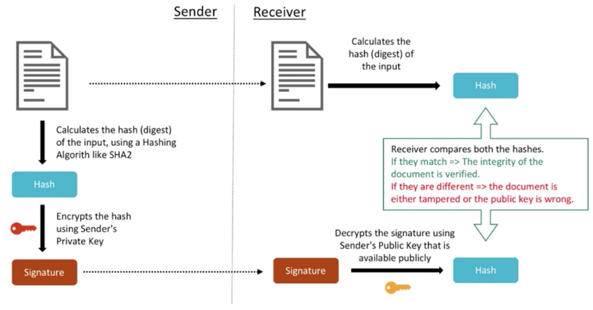
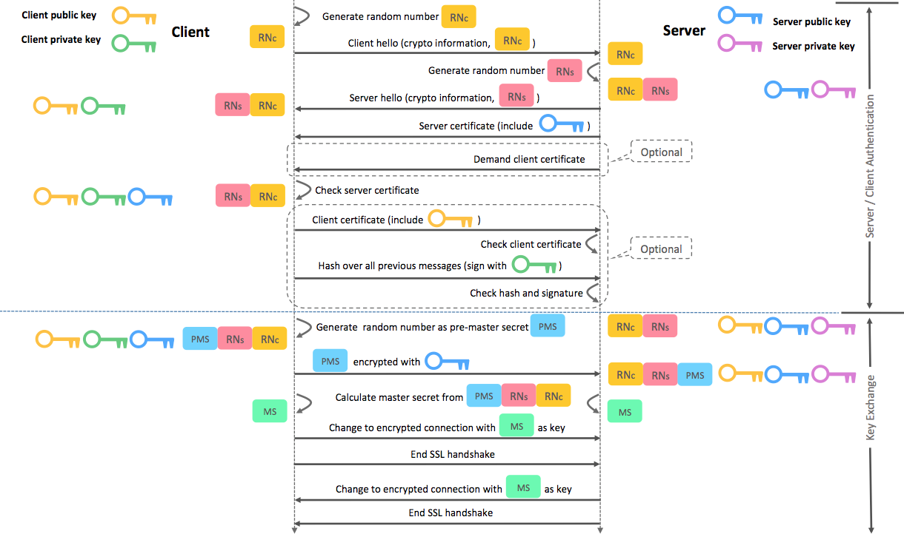
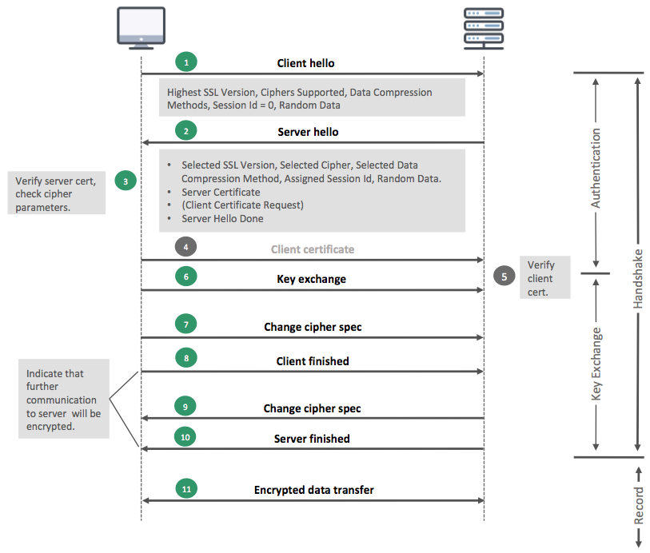
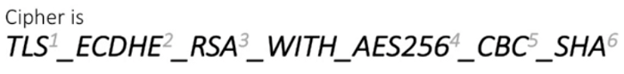
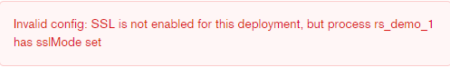

- [Introduction](#introduction)
  - [Document-base Feature](#document-base-feature)
  - [JSON Feature](#json-feature)
  - [High Avaliability](#high-avaliability)
  - [High Scalability](#high-scalability)
- [Replica Set](#replica-set)
  - [Feature](#feature)
  - [Replica Set Members](#replica-set-members)
  - [How Replica Set Work](#how-replica-set-work)
  - [Replica Set Elections](#replica-set-elections)
  - [Replication Methods](#replication-methods)
- [Sharding](#sharding)
  - [Why Sharding?](#why-sharding)
  - [Sharded Cluster](#sharded-cluster)
  - [Chunks](#chunks)
    - [Jumbo Chunk](#jumbo-chunk)
    - [Chunk size](#chunk-size)
  - [Shard Key](#shard-key)
    - [Ranged Sharding](#ranged-sharding)
    - [Hashed Sharding](#hashed-sharding)
    - [Zones / Tag](#zones--tag)
    - [Performance Tips](#performance-tips)
  - [**Balancer**](#balancer)
  - [Config Server](#config-server)
- [CRUD → aggregation](#crud--aggregation)
- [Transaction-Multiple document](#transaction-multiple-document)
  - [w: writeConcern](#w-writeconcern)
  - [readConcern: control the consistency and isolation properties of the data read(isolation level)](#readconcern-control-the-consistency-and-isolation-properties-of-the-data-readisolation-level)
  - [readPreference: how MongoDB clients route read operations to the members of a replica set](#readpreference-how-mongodb-clients-route-read-operations-to-the-members-of-a-replica-set)
  - [j: journal](#j-journal)
- [Security](#security)
  - [Authentication](#authentication)
    - [Replica Set](#replica-set-1)
    - [Sharded Cluster](#sharded-cluster-1)
  - [Auditing](#auditing)
  - [TLS/SSL](#tlsssl)
    - [Create SSL/TLS Certificate](#create-ssltls-certificate)
    - [SSL/TLS Communication](#ssltls-communication)
      - [Authentication Phase](#authentication-phase)
      - [Key Exchage Phase](#key-exchage-phase)
      - [Encrypted Data Transfer (Record) Phase](#encrypted-data-transfer-record-phase)
    - [Certificate Requirement](#certificate-requirement)
    - [Configure Internal X.509 certificate-based Encryption](#configure-internal-x509-certificate-based-encryption)
    - [Configure TLS Connections to Ops Manager](#configure-tls-connections-to-ops-manager)
      - [Configure Ops Manager Application for TLS](#configure-ops-manager-application-for-tls)
      - [Configure MongoDB Agent to Use TLS](#configure-mongodb-agent-to-use-tls)
    - [Enable TLS for a Deployment](#enable-tls-for-a-deployment)
      - [Enable TLS for the project](#enable-tls-for-the-project)
      - [Set Existing Deployments to Use TLS](#set-existing-deployments-to-use-tls)
    - [OTHER](#other)
      - [Enable x.509 Authentication](#enable-x509-authentication)
      - [Credential Encrypted](#credential-encrypted)
      - [MongoDB Driver TLS Connection String](#mongodb-driver-tls-connection-string)
    - [Config MongoDB Java Driver (v3.9)](#config-mongodb-java-driver-v39)
      - [Convert Certificate Format To JVM Compatible](#convert-certificate-format-to-jvm-compatible)
    - [FAQ](#faq)
      - [Should use the correct SAN(subject alternative name) to establish connection over TLS](#should-use-the-correct-sansubject-alternative-name-to-establish-connection-over-tls)
- [Backup](#backup)
  - [Feature](#feature-1)
  - [Methods](#methods)
- [Indexes](#indexes)
  - [Performance Tips](#performance-tips-1)
- [Storage Engine - WiredTiger](#storage-engine---wiredtiger)
  - [Document Level Concurrency](#document-level-concurrency)
  - [Snapshot & Checkpoints (ACID)](#snapshot--checkpoints-acid)
  - [Journal](#journal)
  - [Compression](#compression)
  - [Memory Use](#memory-use)
  - [Data Structure](#data-structure)
- [Monitor](#monitor)
  - [Performance](#performance)
  - [Ops Manager](#ops-manager)
    - [Replica Set](#replica-set-2)
- [Exception Handling](#exception-handling)
  - [Rollback](#rollback)
- [Aggregation Operations](#aggregation-operations)
  - [Aggregation Pipeline Stages](#aggregation-pipeline-stages)
    - [$lookup](#lookup)
      - [Perform a Single Equality Join with $lookup](#perform-a-single-equality-join-with-lookup)
      - [Use $lookup with an Array](#use-lookup-with-an-array)
      - [Use $lookup with $mergeObjects](#use-lookup-with-mergeobjects)
- [Data Model Design Pattern](#data-model-design-pattern)
  - [Approximation](#approximation)
  - [Attribute](#attribute)
  - [Bucket](#bucket)
  - [Computed](#computed)
  - [Document Versioning](#document-versioning)
  - [Extended Reference](#extended-reference)
  - [Outlier](#outlier)
  - [Pre-allocation](#pre-allocation)
  - [Polymorphic](#polymorphic)
  - [Schema Versioning](#schema-versioning)
  - [Subset](#subset)
  - [Tree](#tree)
- [No Usage](#no-usage)
- [Reference](#reference)
- [Official Tips](#official-tips)

# Introduction

> MongoDB vs. RDB

| Item              |                                 MongoDB                                 |                            RDBMS |
| :---------------- | :---------------------------------------------------------------------: | -------------------------------: |
| Data Model        |                                Document                                 |                       Relational |
| DB Type           |                                  OLTP                                   |                             OLTP |
| CRUD Operation    |                                 MQL/SQL                                 |                              SQL |
| High Avaliability |                               Replica Set                               |                          Cluster |
| High Scalability  |                             Native Sharding                             | Partition or third-party plugins |
| Index             | B+Tree、MultiKey、Geospatial、Text Indexes、Hashed Indexes、TTL indexes |                          B+ Tree |
| Data Volume       |                                 Unlimit                                 |                               TB |

## Document-base Feature

- 多形性：同一個 Collection 可包含不同 filed 的 document object
- 動態性：線上修改數據模式，應用與資料庫無須 shutdown
- 數據治理：支持 JSON Schema 來規範數據結構

## JSON Feature

- 集中存儲讀寫(seek time >> transfer time ~= 95 : 5)
- 反正規化、無關聯的組織資料優化查詢速度
- 開發效率提升，減少 ORM Layer 成本

## High Avaliability

- Replica Set - 2 to 50 members
- automatic failover
- multi center tolerant

## High Scalability

- 無縫擴展
- 應用透明
- 多種分布策略
- 輕鬆支援 TB - PB 級資料

# Replica Set


## Feature

- Content Distribution
- Read / Write Splitting
- Remote backup

## Replica Set Members

> Primary
> 
- replica set can have at most one primary
- only member in the replica set that receives write operations
- by default, an application directs its read operations to the primary member  [#readPreference](https://www.notion.so/MongoDB-1c59d82feff7495384b6582411565283)

> Two or more Secondary
> 
- maintains a copy of the primary’s data set
- secondary applies operations from the primary’s oplog to its own data set in an asynchronous process
- If the current primary becomes unavailable, the replica set holds an election to choose which of the secondaries becomes the new primary
- Configuration
    - Prevent it from becoming a primary in an election, which allows it to reside in a secondary data center or to serve as a cold standby. See [Priority 0 Replica Set Members](https://docs.mongodb.com/manual/core/replica-set-priority-0-member/).
    - Prevent applications from reading from it, which allows it to run applications that require separation from normal traffic. See [Hidden Replica Set Members](https://docs.mongodb.com/manual/core/replica-set-hidden-member/).
    - Keep a running “historical” snapshot for use in recovery from certain errors, such as unintentionally deleted databases. See [Delayed Replica Set Members](https://docs.mongodb.com/manual/core/replica-set-delayed-member/).
    

> Arbiter
> 
- Does not have a copy of data set and cannot become a primary
- Participates in elections for primary. An arbiter has exactly 1 election vote


⚠️ Changed in version 3.6: Starting in MongoDB 3.6, arbiters have priority 0. When you upgrade a replica set to MongoDB 3.6, if the existing configuration has an arbiter with priority 1, MongoDB 3.6 reconfigures the arbiter to have priority 0.


## How Replica Set Work

> Asynchronous Replication
> 
- Creat、Update、Delete operations were recorded in oplog.
- Uses tailable cursors to tail the primary’s oplog.
- Slow Operations
- Replication Lag and Flow Control
- Initial Sync Process
    - 全量同步開始，獲取同步源最新時間戳 t1
    - 全量同步集合數據，建立索引(較耗時)
    - 獲取同步源最新時間戳 t2
    - 重放 t1 - t2 oplog
    - 全量同步結束

> Elections
> 
- Replica set members send heartbeats (pings) to each other every two seconds
- If a heartbeat does not return within 10 seconds, the other members mark the delinquent member as inaccessible.
- If the primary is unavailable, an eligible secondary will hold an election to elect itself the new primary.
- If the secondary is unavailable, wouldn't trigger an new election.
- Election uses Raft-Like Consensus Algorithm.
- A replica set can have up to 50 members but only 7 voting members.

> Automatic Failover
> 
- electionTimeoutMillis period (10 seconds by default)
- Replica set cannot process write operations until the election completes successfully
- The replica set can continue to serve read queries if such queries are configured to run on secondaries while the primary is offline
- Starting in MongoDB 3.6 providing additional built-in handling of automatic failovers and elections:
    - MongoDB 4.2-compatible drivers enable retryable writes by default
    - MongoDB 4.0 and 3.6-compatible drivers must explicitly enable retryable writes by including [retryWrites=true](https://docs.mongodb.com/manual/reference/connection-string/#urioption.retryWrites) in the [connection string](https://docs.mongodb.com/manual/reference/connection-string/#mongodb-uri).
    
    
    >💡 Starting in version 4.4, MongoDB provides [#mirrored reads](https://www.notion.so/MongoDB-1c59d82feff7495384b6582411565283) to pre-warm electable secondary members’ cache with the most recently accessed data. Pre-warming the cache of a secondary can help restore performance more quickly after an election.
    
    
    
- MongoDB failover process:
    - [Replica Set Elections](https://docs.mongodb.com/manual/core/replica-set-elections/#replica-set-elections)
    - [Retryable Writes](https://docs.mongodb.com/manual/core/retryable-writes/#retryable-writes)
    - [Rollbacks During Replica Set Failover](https://docs.mongodb.com/manual/core/replica-set-rollbacks/#replica-set-rollback)
        
        
        ⚠️ Rollback is necessary only if the primary had accepted write operations that the secondaries had not successfully replicated before the primary stepped down
        
        
        
    

> Read Operations
> 
- [Read Preference](https://www.notion.so/MongoDB-1c59d82feff7495384b6582411565283)
- [Data Visibility](https://docs.mongodb.com/manual/replication/#data-visibility)
- [Mirrored Reads](https://docs.mongodb.com/manual/replication/#mirrored-reads)
- [Supported Operations](https://docs.mongodb.com/manual/replication/#supported-operations)
- [Enable/Disable Support for Mirrored Reads](https://docs.mongodb.com/manual/replication/#enable-disable-support-for-mirrored-reads)
- [Mirrored Reads Metrics](https://docs.mongodb.com/manual/replication/#mirrored-reads-metrics)

> Transactions
> 
- Starting in MongoDB 4.0, multi-document transactions are available for replica sets
- Until a transaction commits, the data changes made in the transaction are not visible outside the transaction
- Transaction writes to multiple shards, not all outside read operations need to wait for the result of the committed transaction to be visible across the shards

> Change Streams
> 
- Starting in MongoDB 3.6, change streams are available for replica sets and sharded clusters
- Allow applications to access real-time data changes

## Replica Set Elections


Normal startup process:

- 節點初始化為 Startup 狀態, 加載 Replica Set Config 後啟動 Heartbeat, 狀態切換為 Startup2 成為 Follower
- 節點開始初始化數據同步, 狀態切換為 Recovering, 當數據同步到集群的最小一致性時間戳(minValid)後切換到 Secondary
- 當 Secondary / Follower heartbeat process 發現一定時間後(electionTimeoutMillis) , 當前 Replica Set 中沒有 Primary / Leader 時, 會切換為 Secondary / Follower 發起選舉
- 選舉分為兩部分: dry-run election & real election
    - Dry-run Election: Candidate 構造 replSetVoteRequest 命令發送到其他節點, 試探自己能否赢贏得選舉, 這個過程不增加任期, 如果有 primary 收到 replSetVoteRequest 發現任期比自身新，就會開始 stepdown
    - Real Election: Candidate 贏得 dry-run election後, 就會發起正式選舉, 首先增加任期並給自己投票, 然後發起 replSetVoteRequest 命令發送到其他節點, 獲得大多數投票成為 Leader
- 作為 Follower 節點在收到 replSetVoteRequest 後, 會刷新自己的任期, 然後判斷是否給候選人投票, 投票時會判斷：
    - 任期是否新
    - 協議版本是否匹配
    - Replica Set 名稱是否匹配
    - 本節點最近提交的 Optime 是否舊於候選人的 Optime
    - 在該任期內是否投過票

Replica sets can trigger an election in response to a variety of events, such as:

- Adding a new node to the replica set,
- [initiating a replica set](https://docs.mongodb.com/manual/reference/method/rs.initiate/#rs.initiate),
- performing replica set maintenance using methods such as [rs.stepDown()](https://docs.mongodb.com/manual/reference/method/rs.stepDown/#rs.stepDown) or [rs.reconfig()](https://docs.mongodb.com/manual/reference/method/rs.reconfig/#rs.reconfig), and
- the [secondary](https://docs.mongodb.com/manual/reference/glossary/#term-secondary) members losing connectivity to the primary for more than the configured [timeout](https://docs.mongodb.com/manual/reference/replica-configuration/#rsconf.settings.electionTimeoutMillis) (10 seconds by default).

> Factors and Conditions that Affect Elections
> 
- Replication Election Protocol
    - MongoDB 4.0 removes the deprecated replication protocol version 0
    - Replication protocolVersion: 1 reduces replica set failover time and accelerate the detection of multiple simultaneous primaries
    - Ref: [Replica Set Protocol Version](https://docs.mongodb.com/manual/reference/replica-set-protocol-versions/)
- Heartbeats
    
    
    >💡 Replica set members send heartbeats (pings) to each other every two seconds. If a heartbeat does not return within 10 seconds, the other members mark the delinquent member as inaccessible.
    
    
    
- Member Priority
- Mirrored Reads
- Loss of a Data Center
- Network Partition

> Voting Members
> 
- Non-voting (i.e. [votes](https://docs.mongodb.com/manual/reference/replica-configuration/#rsconf.members[n].votes) is 0) members must have [priority](https://docs.mongodb.com/manual/reference/replica-configuration/#rsconf.members[n].priority) of 0.
- Members with [priority](https://docs.mongodb.com/manual/reference/replica-configuration/#rsconf.members[n].priority) greater than 0 cannot have 0 [votes](https://docs.mongodb.com/manual/reference/replica-configuration/#rsconf.members[n].votes).
- Only voting members in the following states are eligible to vote:
    - [PRIMARY](https://docs.mongodb.com/manual/reference/replica-states/#replstate.PRIMARY)
    - [SECONDARY](https://docs.mongodb.com/manual/reference/replica-states/#replstate.SECONDARY)
    - [STARTUP2](https://docs.mongodb.com/manual/reference/replica-states/#replstate.STARTUP2)
    - [RECOVERING](https://docs.mongodb.com/manual/reference/replica-states/#replstate.RECOVERING)
    - [ARBITER](https://docs.mongodb.com/manual/reference/replica-states/#replstate.ARBITER)
    - [ROLLBACK](https://docs.mongodb.com/manual/reference/replica-states/#replstate.ROLLBACK)

> Non-Voting Members
> 
- Although non-voting members do not vote in elections, these members hold copies of the replica set’s data and can accept read operations from client applications
- Non-voting (i.e. votes is 0) members must have priority of 0

## Replication Methods

> rs.secondaryOk()
> 

Allows read operations on secondary members for the MongoDB connection.

# Sharding

## Why Sharding?

- Storage Capacity bottleneck
    - I/O capacity challenge, maybe CPU、RAM or NIC bottleneck

## Sharded Cluster

- [shard](https://docs.mongodb.com/manual/core/sharded-cluster-shards/): Each shard contains a subset of the sharded data. Each shard can be deployed as a [replica set](https://docs.mongodb.com/manual/reference/glossary/#term-replica-set).
- [mongos](https://docs.mongodb.com/manual/core/sharded-cluster-query-router/): The mongos acts as a query router, providing an interface between client applications and the sharded cluster. Starting in MongoDB 4.4, mongos can support [hedged reads](https://docs.mongodb.com/manual/core/sharded-cluster-query-router/#mongos-hedged-reads) to minimize latencies.


>💡 Recommend at least 2 node


- [config servers](https://docs.mongodb.com/manual/core/sharded-cluster-config-servers/): Config servers store metadata and configuration settings for the cluster.


---

## Chunks

### Jumbo Chunk

> If MongoDB cannot split a chunk that exceeds the specified chunk size or contains a number of documents that exceeds the max, MongoDB labels the chunk as jumbo.
> 

### Chunk size

---

## Shard Key

### Ranged Sharding

- Default sharding methodology
- Dividing data into contiguous ranges determined by the shard key values


### Hashed Sharding

- Uses either a single field hashed index or a compound hashed index (New in 4.4) as the shard key to partition data across your cluster


⚠️ MongoDB hashed indexes truncate floating point numbers to 64-bit integers before hashing. For example, a hashed index would store the same value for a field that held a value of 2.3, 2.2, and 2.9. To prevent collisions, do not use a hashed index for floating point numbers that cannot be reliably converted to 64-bit integers (and then back to floating point). MongoDB hashed indexes do not support floating point values larger than 253.

To see what the hashed value would be for a key, see convertShardKeyToHashed().


### Zones / Tag

### Performance Tips

- key 分布足夠離散(sufficient cardinality)
- write operations 分布均勻 (evenly distributed write)
- 盡量避免 scatter-gather 查詢(targeted read)

## **Balancer**

## Config Server

# CRUD → aggregation

# Transaction-Multiple document

## w: writeConcern

- writeConcern 決定一個寫入同步到多少節點上算成功
- 0： 發起寫操作，不在乎是否成功
- 1 ~ n
- majority：more than half (≥ n / 2 + 1)

## readConcern: control the consistency and isolation properties of the data read(isolation level)

- available: 讀取所有可用數據
- local: 讀取所有可用且屬於當前 shard 的數據
    - majority: 讀取在大多數節點上提交完成的數據
- linearizable: 可線性化讀取文檔
- snapshot: 讀取最近快照數據

## readPreference: how MongoDB clients route read operations to the members of a replica set

- primary
- paimaryPreferred
- secondary
- secondaryPreferred
- nearest

## j: journal

- true: write operation was recorded in journal return success
- false: write operation load in memory return success

---

# Security

## Authentication

[User Roles](https://www.notion.so/f8230524313a4810965844c06a29e448)

### Replica Set

> Overview
> 
- Security between members of the replica set using Internal Authentication, and
- Security between connecting clients and the replica set using User Access Controls.


>💭 When possible, use a logical DNS hostname instead of an ip address, particularly when configuring replica set members or sharded cluster members. The use of logical DNS hostnames avoids configuration changes due to ip address changes.


> Keyfile Security
> 
- bare-minimum forms of security
- production environments we recommend using x.509 certificates
- Only mongod instances with the correct keyfile can join the replica set

> x.509 Certification
> 


X.509 Certificate-Based Authentication

- Member Certification in MongoDB uses x.509 must have some properties:
    - 單一 CA 必須為 Cluster Members issue 所有 x.509 certification
    - Member certification subject 找到的專有名稱 (Distinguished Name, DN), 必須為以下至少一個屬性指定一個非空值：
        - 組織 (Organization, O)
        - 組織單位 (Organization Unit, OU)
        - 網域元件 (Domain Component, DC)

### Sharded Cluster

## Auditing

- edit config file (mongod.conf):
    - auditLog
        - destination - syslog/file/console
        - format - JSON/BSON
        - path
        - (option)filter

## TLS/SSL

### Create SSL/TLS Certificate



### SSL/TLS Communication





- Authentication (Handshake): Public/Asymmetric Key Encryption Algorithms
- Key Exchange (Handshake): Public/Asymmetric Key Encryption Algorithms / Key Exchange protocol
- Encrypted Data Transfer (Record): Private/Symmetric Key Encryption Algorithms

#### Authentication Phase

Step 1

- Client → Client hello to server
- include cipher suites in SSL session
    
    
    
    1. Transport Layer Protocal: SSL / TLS
    2. Session key exchange algorithms: 其他如 RSA, DH, DHE, 用於決定 client / server 間 handshake 時如何進行身分驗證
    3. 憑證 PKI 類型: 其他如 DSS (Digital Signature Standard)
    4. Symmetric Key Encryption Algorithm: 其他如 RC4, 3DES, CAMELLIA, ARIA, GCM
    5. Cryptographic hash function(*Message**Digest*): MD5, SHA2
- client hello 也包含使用哪種資料壓縮方法
- 若金鑰交換階段使用 RSA 演算法則會再生成一個隨機數，用於金鑰交換階段生成對稱式金鑰匙 (client's random number)

Step 2

- 收到 client hello 後 server 會回傳 server hello 訊息，包含 SSL version, cipher suite, server 支援且同意的資料壓縮方法, Server SSL certificate
- 若之後金鑰交換階段要採用 RSA 演算法則還會再生成一個隨機數，用於金鑰交換階段生成對稱式金鑰匙 (server's random number)
- Server hello 有一個選填欄位，主要用來提醒 client 是否需要將 client 的憑證送回 server 以實現雙向驗證
- server hello 結尾會有一個 server hello done 表示段落訊息結束

Step 3

- client 驗證 server  SSL certificate
- Browser → CA → Get CA public key from cert store → **Verify CA** D**igital Signature**
- 若驗證未通過代表可能出現 Man-in-the-middle attack

Step 4

- 若 server 有在 server hello 中要求 client certificate 則 client 會將 certificate 送給 server
- server 驗證 client certificate 並完成 SSL handshake authentication phase

#### Key Exchage Phase

- client 生成一個 random number 並使用 server public key 加密作為 pre-master secret 並送給 server
- 透過 PMS 及前面 client/server 提供的 random numbers 計算出 master secret

#### Encrypted Data Transfer (Record) Phase

- 透過 master secret 對資料進行 symmetric key encryption
- Record protocol 主要確保 confidentiality and integrity

### Certificate Requirement

---


>⛔ Starting in version 4.0, MongoDB disables support for TLS 1.0 encryption on systems where TLS 1.1+ is available. For more details, see Disable TLS 1.0

- any certificate needs to be signed by the same CA
- the common name (CN) required during the certificate creation must correspond to the hostname of the host
- any other field requested in the certificate creation should be a non-empty value and, hopefully, should reflect our organization details
- it is also very important that all the fields, except the CN, should match those from the certificates for the other cluster members

### Configure Internal X.509 certificate-based Encryption

---

> Configure example-ca.conf

```bash
# For the CA policy
[ policy_match ]
countryName = match
stateOrProvinceName = match
organizationName = match
organizationalUnitName = optional
commonName = supplied
emailAddress = optional

[ req ]
default_bits = 4096
default_keyfile = example-ca.pem    ## The default private key file name.
default_md = sha256                           ## Use SHA-256 for Signatures
distinguished_name = req_dn
req_extensions = v3_req
x509_extensions = v3_ca # The extentions to add to the self signed cert

[ v3_req ]
subjectKeyIdentifier  = hash
basicConstraints = CA:FALSE
keyUsage = critical, digitalSignature, keyEncipherment
nsComment = "OpenSSL Generated Certificate for TESTING only.  NOT FOR PRODUCTION USE."
extendedKeyUsage  = serverAuth, clientAuth

[ req_dn ]
countryName = Country Name (2 letter code)
countryName_default = TW

countryName_min = 2
countryName_max = 2

stateOrProvinceName = State or Province Name (full name)
stateOrProvinceName_default = TW
stateOrProvinceName_max = 64

localityName = Locality Name (eg, city)
localityName_default = Taipei
localityName_max = 64

organizationName = Organization Name (eg, company)
organizationName_default = Omniwaresoft
organizationName_max = 64

organizationalUnitName = Organizational Unit Name (eg, section)
organizationalUnitName_default = no-sql
organizationalUnitName_max = 64

commonName = Common Name (eg, YOUR name)
commonName_max = 64

[ v3_ca ]
# Extensions for a typical CA

subjectKeyIdentifier=hash
basicConstraints = critical,CA:true
authorityKeyIdentifier=keyid:always,issuer:always
```

> Connect to one of the hosts and generate a new private key using openssl
> 

```bash
# created a new 8192-bit private key and saved it in the file example-ca.key
$ openssl genrsa -out example-ca.key -aes256 8192
```

> Sign a new CA certificate
> 

```bash
# Creating certificate and filling out some fields correspond to our org's details
$ openssl req -x509 -new -extensions v3_ca -key mongoCA.key -days 365 -out mongoCA.crt

#####################################################################################################################################
# v0.0.2
[root@mongodb-regy-4 tls]# openssl req -x509 -new -extensions v3_ca -key example-ca.key -days 365 -out example-ca-pub.crt -config example-ca.conf
Enter pass phrase for example-ca.key:
You are about to be asked to enter information that will be incorporated
into your certificate request.
What you are about to enter is what is called a Distinguished Name or a DN.
There are quite a few fields but you can leave some blank
For some fields there will be a default value,
If you enter '.', the field will be left blank.
-----
Country Name (2 letter code) [XX]:TW
State or Province Name (full name) []:TW
Locality Name (eg, city) [Default City]:Taipei
Organization Name (eg, company) [Default Company Ltd]:Omniwaresoft
Organizational Unit Name (eg, section) []:no-sql
Common Name (eg, your name or your server's hostname) []:mongodb-regy-4.c.omnilabs-1281.internal
Email Address []:regy.chang@omniwaresoft.com.tw
```

> Configure mongod_cert.conf
> 


💡 The most important part is [ alt_names ]. As explained before, the DNS must include include both internal endpoints and external endpoints:


```bash
# Could check your Ops Manager Host Mappings as well

[ alt_names ]
DNS.1 = mongodb-regy-4.c.omnilabs-1281.internal
DNS.2 = mongodb-regy-4
```

mongod_cert.conf:

```bash
[ req ]
default_bits = 4096
default_md = sha256
distinguished_name = req_dn
req_extensions = v3_req

[ v3_req ]
subjectKeyIdentifier  = hash
basicConstraints = CA:FALSE
keyUsage = critical, digitalSignature, keyEncipherment
nsComment = "OpenSSL Generated Certificate for TESTING only.  NOT FOR PRODUCTION USE."
extendedKeyUsage  = serverAuth, clientAuth
subjectAltName = @alt_names

[ alt_names ]
DNS.1 =         ##TODO: Enter the DNS names. The DNS names should match the server names.
DNS.2 =         ##TODO: Enter the DNS names. The DNS names should match the server names.
IP.1 =          ##TODO: Enter the IP address. SAN matching by IP address is available starting in MongoDB 4.2
IP.2 =          ##TODO: Enter the IP address. SAN matching by IP address is available starting in MongoDB 4.2

[ req_dn ]
countryName = Country Name (2 letter code)
countryName_default = TW

countryName_min = 2
countryName_max = 2

stateOrProvinceName = State or Province Name (full name)
stateOrProvinceName_default = TW
stateOrProvinceName_max = 64

localityName = Locality Name (eg, city)
localityName_default = Taipei
localityName_max = 64

organizationName = Organization Name (eg, company)
organizationName_default = Omniwaresoft
organizationName_max = 64

organizationalUnitName = Organizational Unit Name (eg, section)
organizationalUnitName_default = no-sql
organizationalUnitName_max = 64

commonName = Common Name (eg, YOUR name)
commonName_max = 64
```

> Issue self-signed certificates for all the nodes


>⚠️ fill out all the fields requested the same for each host, but remember to fill out a different common name (CN) that must correspond to the hostname.


```bash
# generate a certificate request and sign it using the CA certificate
$ openssl req -new -nodes -newkey rsa:4096 -keyout mongotls1.key -out mongotls1.csr

$ openssl x509 -CA mongoCA.crt -CAkey mongoCA.key -CAcreateserial -req -days 365 -in mongotls1.csr -out mongotls1.crt

$ cat mongotls1.key mongotls1.crt > mongotls1.pem

# apply the same thing for the second and third nodes

#####################################################################################################################################
# v0.0.2

# generate a certificate request and sign it using the CA certificate
# generate sever key & csr
openssl genrsa -aes256 -passout pass:regy0415 -out mongod.key 2048
openssl req -new -key mongod.key -out mongod.csr -config mongod_cert.conf

# signed by the Root CA
openssl x509 -req -days 3650 -in mongod.csr -CA example-ca-pub.crt -CAkey example-ca.key -passin pass:regy0415@ -CAcreateserial -out mongod.crt -extfile mongod_cert.conf -extensions v3_req

# concate the key & crt file to pem
cat mongod.crt mongod.key > mongod.pem

# Verify key by CA
openssl verify -CAfile example-ca-pub.crt mongod.pem

# Repeat the above process and replace mongod
```

> Verify Certificates
> 

```bash
# Verify Server Certificate
openssl verify -CAfile example-ca-pub.crt mongod.pem
mongod.pem: OK

# Verify CA itself:
openssl verify -CAfile example-ca-pub.crt example-ca-pub.crt
example-ca-pub.crt: OK

```

> View Certificate Detail
> 

```bash
# check altnames in certificate
openssl x509 -text -noout -in mongod.pem
...
	X509v3 Subject Alternative Name:
			DNS:mongodb-regy-4.c.omnilabs-1281.internal, DNS:mongodb-regy-4, IP Address:xx.xx.xx.xx, IP Address:xx.xx.xx.xx
...
```

> Place the files
> 

```bash
# Create on each member a directory that only the MongoDB user can read, and copy both files there
$ sudo mkdir -p /etc/mongodb/tls
$ sudo chmod 700 /etc/mongodb/tls
$ sudo chown -R mongod:mongod /etc/mongodb

# Copy each self signed certifcate **<hostname>.pem** into the relative member
$ sudo cp mongod.pem /etc/mongodb/tls

# Copy to each node the CA certifcate file
$ sudo cp example-ca-pub.crt /etc/mongodb/tls
```

> Configure mongod
> 

```bash
# Change the configuration file /etc/mongod.conf on each host adding the following rows
net:
    tls:
       mode: requireTLS
       PEMKeyFile: /etc/mongodb/tls/mongod.pem
       CAFile: /etc/mongodb/tls/example-ca-pub.crt

# Restart Mongod Daemon
$ systemctl restart mongod

# checking configured replica set using encrypted connections
$ mongo --authenticationDatabase "admin" --host mongod:27017 --tls --tlsCAFile /etc/tls/example-ca-pub.crt --tlsPEMKeyFile /etc/mongodb/tls/mongod.pem -u dbuser -p passw0rd1
```

### Configure TLS Connections to Ops Manager

---

#### Configure Ops Manager Application for TLS

- Ops Manager Config
    - URL To Access Ops Manger
        
        
        💡 including port 8443
        
        
        
    - HTTPS PEM Key File
        
        
        💡 Private key & certificate(.pem file) for Ops Manager Host
        
        
        
    - Client Certificate Mode
        
        
        💡 Select if client applications or MongoDB Agents must present a TLS certificate when connecting to a TLS-enabled Ops Manager. Ops Manager checks for certificates from these client hosts when they try to connect. If you choose to require the client TLS certificates, make sure they are valid.
        
        
        
        Accepted values are:
        
        - **None**
        - **Required for Agents Only**
        - **Required for All Requests**
        

#### Configure MongoDB Agent to Use TLS

- Open MongoDB Agent configuration file
    
    ```bash
    vim /etc/mongodb-mms/automation-agent.config
    ```
    
- Set or add the following properties where needed
    - mmsBaseUrl=https://example.opsm.com:8443
    - tlsRequireValidMMSServerCertificates
        
        
        >💡 The agent to validate TLS certificates of Ops Manager
        < - If you set this value to true, you must set httpsCAFile - >
        
        
        
    - httpsCAFile
        
        
        >⚠️ This Certificate Authority file must be in the same location on each MongoDB host in the same sharded cluster or replica set. Any MongoDB host that does not have the file in the same file location as the others may become unaccessible.
        
        
        
    - tlsMMSServerClientCertificate
        
        
        >⚠️ certificate of automation-agent
        
        
        
    - tlsMMSServerClientCertificatePassword
        
        
        >💡 Use the tlsMMSServerClientCertificatePasswordExec option instead of tlsMMSServerClientCertificatePassword to specify the password from a shell command.
        
        
        
    - automation-agent.config
        
        ```bash
        # Hostname of the Ops Manager web server. The hostname will match what is used
        # to access the Ops Manager UI. The default port for an Ops Manager install
        # is 8080.
        #
        # ex. http://opsmanaager.<company>.com:8080
        mmsBaseUrl=https://mongom-regy.c.omnilabs-1281.internal:8443
        
        # optional
        tlsRequireValidMMSServerCertificates=true
        
        httpsCAFile=/mongo/tls/example-ca-pub.crt
        
        tlsMMSServerClientCertificate=/mongo/tls/automation-agent.pem
        
        tlsMMSServerClientCertificatePassword=xxxxxxx
        ```
        
- Restart automation-agent
    
    ```bash
    systemctl restart mongodb-mms-automation-agent
    ```
    

### Enable TLS for a Deployment

---


>💡 With the Client Certificate Mode setting, you can set if the client must present a TLS certificate to connect to the deployments in your project. If you enable TLS for your project, all deployment must use TLS.


#### Enable TLS for the project

- Security Tab
- Authentication & TLS Settings
- EDIT SETTINGS
- (Authentication Mechanisms)
- Specify the TLS Settings
    - Enable TLS
    - TLS CA File Path
    - Client Certificate Mode
        - OPTIONAL
            
            
            >💡 Every client may present a valid TLS certificate when connecting to MongoDB deployments. MongoDB Agents might use TLS certificates if you don’t set the mongod tlsMode to None.
            
            
            
        - REQUIRED
            
            
            >💡 Every MongoDB deployment in this project starts with TLS-encrypted network connections. All Agents must use TLS to connect to any MongoDB deployment.
            
            
            

#### Set Existing Deployments to Use TLS


>⚠️ If the project have not been enabled that will get an alert as below:




- Modify Processes
- Expand the Advanced Configuration Options section
- Set the TLS/SSL startup options
    - tlsMode
    - tlsCertificateKeyFile
    - tlsCertificateKeyFilePassword
    - tlsFIPSMode(Optional)
    

### OTHER

---

#### Enable x.509 Authentication

#### Credential Encrypted

#### MongoDB Driver TLS Connection String

### Config MongoDB Java Driver (v3.9)

---

可透過建立 MongoClientURI 實體時指定連線參數 **ssl=true**

```java
new MongoClientURI("mongodb://localhost/?ssl=true")
```

或透過建立 MongoClientOptions 實體時設定屬性 **sslEnabled** 為 **true**

```java
import com.mongodb.MongoClientOptions;
import com.mongodb.MongoClient;

MongoClientOptions options = MongoClientOptions.builder()
        .sslEnabled(true)
        .build();
MongoClient client = new MongoClient("localhost", options);
```

使用 JDK keytool command 匯入 CA 憑證並輸出 keystore 檔

```java
keytool -importcert -trustcacerts -file <path to certificate authority file> -keystore <path to trust store> -storepass <password>
```

設定 JVM 系統屬性：

- `javax.net.ssl.trustStore`: the path to a trust store containing the certificate of the signing authority
- `javax.net.ssl.trustStorePassword`: the password to access this trust store
- `javax.net.ssl.keyStore`: the path to a key store containing the client’s SSL certificates
- `javax.net.ssl.keyStorePassword`: the password to access this key store

#### Convert Certificate Format To JVM Compatible

CA Certificate

```powershell
keytool -importcert -trustcacerts -file example-ca-pub.crt -keystore cacert -storepass storepass
```

Client Certificate

```powershell
openssl pkcs12 -inkey mongod.key -in mongod.crt -export -out mongod.p12

keytool -importkeystore -srckeystore mongod.p12 -srcstoretype PKCS12 -destkeystore keystore
```

### FAQ

---

#### Should use the correct SAN(subject alternative name) to establish connection over TLS

- Error between automation-agent and Ops Manager
    
    ```bash
    [root@mongodb-regy-4 mongodb-mms]# curl  https://10.140.0.3:8443
    curl: (51) Unable to communicate securely with peer: requested domain name does not match the server's certificate.
    [root@mongodb-regy-4 mongodb-mms]# curl -v  https://10.140.0.3:8443
    * About to connect() to 10.140.0.3 port 8443 (#0)
    *   Trying 10.140.0.3...
    * Connected to 10.140.0.3 (10.140.0.3) port 8443 (#0)
    * Initializing NSS with certpath: sql:/etc/pki/nssdb
    *   CAfile: /etc/pki/tls/certs/ca-bundle.crt
      CApath: none
    * Server certificate:
    *       subject: E=regy.chang@omniwaresoft.com.tw,CN=mongom-regy.c.omnilabs-1281.internal,OU=no-sql,O=Omniwaresoft,L=Taipei,ST=TW,C=TW
    *       start date: May 17 08:47:46 2021 GMT
    *       expire date: Jun 16 08:47:46 2021 GMT
    *       common name: mongom-regy.c.omnilabs-1281.internal
    *       issuer: E=regy.chang@omniwaresoft.com.tw,CN=mongodb-regy-4.c.omnilabs-1281.internal,OU=no-sql,O=Omniwaresoft,L=Taipei,ST=TW,C=TW
    * NSS error -12276 (SSL_ERROR_BAD_CERT_DOMAIN)
    * Unable to communicate securely with peer: requested domain name does not match the server's certificate.
    * Closing connection 0
    curl: (51) Unable to communicate securely with peer: requested domain name does not match the server's certificate.
    ```
    

- Error between automation-agent and MongoDB instances - mongodb.log
    
    ```bash
    2021-05-20T07:59:42.178+0000 I  CONNPOOL [Replication] Connecting to mongodb-regy-4.c.omnilabs-1281.internal:27021
    2021-05-20T07:59:42.184+0000 E  NETWORK  [Replication] SSL peer certificate validation failed: self signed certificate
    2021-05-20T07:59:42.188+0000 E  NETWORK  [Replication] SSL peer certificate validation failed: self signed certificate
    2021-05-20T07:59:42.194+0000 E  NETWORK  [Replication] SSL peer certificate validation failed: self signed certificate
    2021-05-20T07:59:42.194+0000 I  REPL_HB  [replexec-2] Heartbeat to mongodb-regy-4.c.omnilabs-1281.internal:27021 failed after 2 retries, response status: HostUnreachable: Error connecting to mongodb-regy-4.c.omnilabs-1281.internal:27021 (10.140.0.12:27021) :: caused by :: SSL peer certificate validation failed: self signed certificate
    2021-05-20T07:59:42.234+0000 I  NETWORK  [listener] connection accepted from 10.140.0.12:60388 #2063 (4 connections now open)
    2021-05-20T07:59:42.238+0000 E  NETWORK  [conn2063] SSL peer certificate validation failed: self signed certificate
    2021-05-20T07:59:42.238+0000 I  NETWORK  [conn2063] Error receiving request from client: SSLHandshakeFailed: SSL peer certificate validation failed: self signed certificate. Ending connection from 10.140.0.12:60388 (connection id: 2063)
    ```
    
- Error between automation-agent and MongoDB instances - automation-agent.log
    
    ```bash
    [2021/05/20 12:30:14.170] [.error] [cm/mongoclientservice/mongoclientservice.go:sendClientToRequesters:609] [12:30:14.170] Error getting client ready for conn params = mongodb-regy-4.c.omnilabs-1281.internal:27020 (local=false).  Informing all requests and disposing of client (0x0).  requests=[ 0xc000db5500 ] : [12:30:14.170] Error dialing to connParams=mongodb-regy-4.c.omnilabs-1281.internal:27020 (local=false): tried 3 identities, but none of them worked.  They were (__system@local[[MONGODB-CR/SCRAM-SHA-1 SCRAM-SHA-256]][1024], regy@$external[[MONGODB-X509]][0], )
    [2021/05/20 12:30:14.170] [.error] [cm/mongoclientservice/mongoclientservice.go:withClientForHelper:403] <hardwareMetricsCollector> [12:30:14.170] Error checking out client (0x0) for connParam=mongodb-regy-4.c.omnilabs-1281.internal:27020 (local=false) connectMode=SingleConnect : [12:30:14.170] Error dialing to connParams=mongodb-regy-4.c.omnilabs-1281.internal:27020 (local=false): tried 3 identities, but none of them worked.  They were (__system@local[[MONGODB-CR/SCRAM-SHA-1 SCRAM-SHA-256]][1024], regy@$external[[MONGODB-X509]][0], )
    ```

# Backup

## Feature

- 防止人為誤刪資料
- 時間回朔
- 法遵監管

## Methods

**File System Snapshot (LVM, Amazon's EBS storage system for EC2)**

**Copy Data File (lock database)**

**mongoexport / mongoimport (JSON, CSV)**

**MongoDB cloud service Atlas (incremental backup / snapshot)**

**mongodump / mongorestore (BSON)**


>⛔ MongoDB 4.2 起不能將 mongodump or mongorestore 用來作為備份分片叢集策略，這些工具無法保證跨分片交易的原子性


**Delayed Replica Set Members**


>💡 Safe scope random point status = delayed secondary status + oplog


- 全量備份 + Oplog
- 常見全量備份方式:
    - mongodump
    - copy database file
        - must shutdown member
        - Uses db.fsynLock( ) lock member, after that uses db.fsyncUnlock( )
        - At secondary
        - N
    - Filesystem Snapshot

# Indexes

## Performance Tips

- Follow the ESR rule
    - Index building order by Equality, Sort, Range
- Use Covered Queryies When Possible
    - Can get data directly from index
    - Query include only the indexed fields
- Use Caution When Considering Indexes on Low-Cardinality Fields
    - nReturned: Numbers of documents returned by the query
    - totalKeysExamined: Index keys examined
    - totalDocsExamined: Documents touched during the query
    - totalKeysExamined / nReturned, 1 : 1 is the best
    - totalKeysExamined or totalDocsExamined value much highter than nReturned indicates we need a better index
- Eliminate Unnecessary Indexes

# Storage Engine - WiredTiger

## Document Level Concurrency

## Snapshot & Checkpoints (ACID)

- Uses MultiVersion Concurrency Control (MVCC)
- WiredTiger provides a point-in-time snapshot of the data to the operation
- A snapshot presents a consistent view of the in-memory data
- Using WiredTiger, even without journaling, MongoDB can recover from the last checkpoint; however, to recover changes made after the last checkpoint, run with journaling.
- Occur in WiredTiger on user data at an interval of 60 seconds or when 2 GB of journal data has been written

## Journal

- uses a write-ahead log (i.e. transaction log) in combination with checkpoints to ensure data durability
- uses the journal to replay all data modified since the last checkpoint
- using the snappy compression library
- storage.wiredTiger.engineConfig.journalCompressor
- Every 100ms since last sync


⚠️ Starting in MongoDB 4.0, you cannot specify --nojournal option or storage.journal.enabled: false for replica set members that use the WiredTiger storage engine.


## Compression

- By default, WiredTiger uses block compression with the snappy compression library for all collections and prefix compression for all indexes
- For collections, the following block compression libraries are also available:
    - [zlib](https://docs.mongodb.com/manual/reference/glossary/#term-zlib)
    - [zstd](https://docs.mongodb.com/manual/reference/glossary/#term-zstd) (Available starting in MongoDB 4.2)
    - To specify an alternate compression algorithm or no compression, use the storage.wiredTiger.collectionConfig.blockCompressor setting
- For indexes, to disable prefix compression, use the storage.wiredTiger.indexConfig.prefixCompression setting
- The WiredTiger journal is also compressed by default

## Memory Use

- Internal cache & filesystem cache
- By default, internal cache 50% of (RAM - 1 GB) of memory
- WiredTiger keeps all of the indexes plus the documents and index pages as the working set

## Data Structure

- WiredTiger can support B-Tree & LSM Tree, MongoDB uses B+ Tree by default

# Monitor

## Performance

- CPU
    - cpu (idel) time (I/O wait)
- Memory
    - Memory Usage
    - follow page fault statistics
    - working set
        - indexes in memory
        - index working set in memory
        - avoid no useful data subset
- Disk
    - disk capacity threshold: 80%
        - extend shard in sharding cluster
        - cancel unuseful index ($indexStatus)
        - shutdown replica set members and copy data to more bigger disk
        - add new replica set member for bigger disk
    - disk loading (avoid disk overloading page fault)
- Throughput
    - If write throughput in shard exceed 3.5W/s (SSD Server) extend shard
    - If read throughput in each node exceed 4W/s (SSD Server, read over disk IO) extend secondary node (notice read/write splitting)
- WiredTiger
    - serverStatus().wiredTiger.concurrentTransactions.read.available
    - serverStatus().wiredTiger.concurrentTransactions.write.available
- Replica Set
    - copy delay (approaching 0)
    - oplog length (as long as well)

## Ops Manager

### Replica Set

**Automation-Setup**

- Add New → New Replica Set
- Key-in Replica Set Id、Data Directory、Log File、Member Configuration、Replica Settings(Protocol Version: 1(pv1))
- Create Replica Set
- Confirm & Deploy to deploy your changes

**Automation-Update**

[Conponents](https://www.notion.so/1953ca6a11c54cbeb5d0c99e55850a46)

# Exception Handling

## Rollback


>💡 The primary had accepted write operations that the secondaries had not successfully replicated before the primary stepped down


- Server 開始與另一個 Member 同步，並發現無法在同步來源上找到最新動作
- 進入 ROLLBACK 狀態開始 ROLLBACK Process
- 找到兩個 oplog 間共同點，發生在26秒之前
- 開始撤銷 oplog 最後26秒動作
- 完成後轉換為 RECOVERING 狀態並開始正常同步
- 將這些動作所影響的文件版本寫入資料目錄內的 rollback 目錄 .bson 檔案中

# Aggregation Operations

Aggregation operations process multiple documents and return computed results. You can use aggregation operations to:

- Group values from multiple documents together.
- Perform operations on the grouped data to return a single result.
- Analyze data changes over time.

## Aggregation Pipeline Stages

### $lookup

> Performs a left outer join to a collection in the same database to filter in documents from the "joined" collection for processing. To each input document, the $lookup stage adds a new array field whose elements are the matching documents from the "joined" collection. The $lookup stage passes these reshaped documents to the next stage.

>💡Starting in MongoDB 5.1, $lookup works across sharded collections.

#### Perform a Single Equality Join with $lookup

Create a collection `orders` with these documents:

```sh
db.orders.insertMany( [
   { "_id" : 1, "item" : "almonds", "price" : 12, "quantity" : 2 },
   { "_id" : 2, "item" : "pecans", "price" : 20, "quantity" : 1 },
   { "_id" : 3  }
] )
```

Create another collection `inventory` with these documents:

```js
db.inventory.insertMany( [
   { "_id" : 1, "sku" : "almonds", "description": "product 1", "instock" : 120 },
   { "_id" : 2, "sku" : "bread", "description": "product 2", "instock" : 80 },
   { "_id" : 3, "sku" : "cashews", "description": "product 3", "instock" : 60 },
   { "_id" : 4, "sku" : "pecans", "description": "product 4", "instock" : 70 },
   { "_id" : 5, "sku": null, "description": "Incomplete" },
   { "_id" : 6 }
] )
```

The following aggregation operation on the orders collection joins the documents from orders with the documents from the `inventory` collection using the fields item from the `orders` collection and the `sku` field from the `inventory` collection:

```js
db.orders.aggregate( [
   {
     $lookup:
       {
         from: "inventory",
         localField: "item",
         foreignField: "sku",
         as: "inventory_docs"
       }
  }
] )
```

The operation returns these documents:

```js
{
   "_id" : 1,
   "item" : "almonds",
   "price" : 12,
   "quantity" : 2,
   "inventory_docs" : [
      { "_id" : 1, "sku" : "almonds", "description" : "product 1", "instock" : 120 }
   ]
}
{
   "_id" : 2,
   "item" : "pecans",
   "price" : 20,
   "quantity" : 1,
   "inventory_docs" : [
      { "_id" : 4, "sku" : "pecans", "description" : "product 4", "instock" : 70 }
   ]
}
{
   "_id" : 3,
   "inventory_docs" : [
      { "_id" : 5, "sku" : null, "description" : "Incomplete" },
      { "_id" : 6 }
   ]
}
```

#### Use $lookup with an Array

If the localField is an array, you can match the array elements against a scalar `foreignField` without an `$unwind` stage

Firstly create an example collection `classes` with these documents:
```js
db.classes.insertMany( [
   { _id: 1, title: "Reading is ...", enrollmentlist: [ "giraffe2", "pandabear", "artie" ], days: ["M", "W", "F"] },
   { _id: 2, title: "But Writing ...", enrollmentlist: [ "giraffe1", "artie" ], days: ["T", "F"] }
] )
```

Create another collection `members` with these documents:

```js
db.members.insertMany( [
   { _id: 1, name: "artie", joined: new Date("2016-05-01"), status: "A" },
   { _id: 2, name: "giraffe", joined: new Date("2017-05-01"), status: "D" },
   { _id: 3, name: "giraffe1", joined: new Date("2017-10-01"), status: "A" },
   { _id: 4, name: "panda", joined: new Date("2018-10-11"), status: "A" },
   { _id: 5, name: "pandabear", joined: new Date("2018-12-01"), status: "A" },
   { _id: 6, name: "giraffe2", joined: new Date("2018-12-01"), status: "D" }
] )
```

The following aggregation operation joins documents in the `classes` collection with the `members` collection, matching on the `enrollmentlist` field to the `name` field:

```js
db.classes.aggregate( [
   {
      $lookup:
         {
            from: "members",
            localField: "enrollmentlist",
            foreignField: "name",
            as: "enrollee_info"
        }
   }
] )
```

The operation returns the following:

```js
{
   "_id" : 1,
   "title" : "Reading is ...",
   "enrollmentlist" : [ "giraffe2", "pandabear", "artie" ],
   "days" : [ "M", "W", "F" ],
   "enrollee_info" : [
      { "_id" : 1, "name" : "artie", "joined" : ISODate("2016-05-01T00:00:00Z"), "status" : "A" },
      { "_id" : 5, "name" : "pandabear", "joined" : ISODate("2018-12-01T00:00:00Z"), "status" : "A" },
      { "_id" : 6, "name" : "giraffe2", "joined" : ISODate("2018-12-01T00:00:00Z"), "status" : "D" }
   ]
}
{
   "_id" : 2,
   "title" : "But Writing ...",
   "enrollmentlist" : [ "giraffe1", "artie" ],
   "days" : [ "T", "F" ],
   "enrollee_info" : [
      { "_id" : 1, "name" : "artie", "joined" : ISODate("2016-05-01T00:00:00Z"), "status" : "A" },
      { "_id" : 3, "name" : "giraffe1", "joined" : ISODate("2017-10-01T00:00:00Z"), "status" : "A" }
   ]
}
```

#### Use $lookup with $mergeObjects

The `$mergeObjects` operator combines multiple documents into a single document.

Create a collection `orders` with these documents:

```js
db.orders.insertMany( [
   { "_id" : 1, "item" : "almonds", "price" : 12, "quantity" : 2 },
   { "_id" : 2, "item" : "pecans", "price" : 20, "quantity" : 1 }
] )
```

Create another collection `items` with these documents:

```js
db.items.insertMany( [
  { "_id" : 1, "item" : "almonds", description: "almond clusters", "instock" : 120 },
  { "_id" : 2, "item" : "bread", description: "raisin and nut bread", "instock" : 80 },
  { "_id" : 3, "item" : "pecans", description: "candied pecans", "instock" : 60 }
] )
```

The following operation first uses the `$lookup` stage to join the two collections by the `item` fields and then uses `$mergeObjects` in the `$replaceRoot` to merge the joined documents from `items` and `orders`:

```js
db.orders.aggregate( [
   {
      $lookup: {
         from: "items",
         localField: "item",    // field in the orders collection
         foreignField: "item",  // field in the items collection
         as: "fromItems"
      }
   },
   {
      $replaceRoot: { newRoot: { $mergeObjects: [ { $arrayElemAt: [ "$fromItems", 0 ] }, "$$ROOT" ] } }
   },
   { $project: { fromItems: 0 } }
] )
```

The operation returns these documents:

```js
{
  _id: 1,
  item: 'almonds',
  description: 'almond clusters',
  instock: 120,
  price: 12,
  quantity: 2
},
{
  _id: 2,
  item: 'pecans',
  description: 'candied pecans',
  instock: 60,
  price: 20,
  quantity: 1
}
```

# Data Model Design Pattern

## Approximation

The [Approximation Pattern](https://www.mongodb.com/blog/post/building-with-patterns-the-approximation-pattern) is useful when expensive calculations are frequently done and when the precision of those calculations is not the highest priority.

Pros
- Fewer writes to the database.
- Maintain statistically valid numbers.

Cons
- Exact numbers aren’t being represented.
- Implementation must be done in the application.

## Attribute

The [Attribute Pattern](https://www.mongodb.com/blog/post/building-with-patterns-the-attribute-pattern) is useful for problems that are based around having big documents with many similar fields but there is a subset of fields that share common characteristics and we want to sort or query on that subset of fields. When the fields we need to sort on are only found in a small subset of documents. Or when both of those conditions are met within the documents.

Pros
- Fewer indexes are needed.
- Queries become simpler to write and are generally faster.

## Bucket

The [Bucket Pattern](https://www.mongodb.com/blog/post/building-with-patterns-the-bucket-pattern) is a great solution for when needing to manage streaming data, such as time-series, real-time analytics, or Internet of Things (IoT) applications.

Pros
- Reduces the overall number of documents in a collection.
- Improves index performance.
- Can simplify data access by leveraging pre-aggregation.

## Computed

When there are very read intensive data access patterns and that data needs to be repeatedly computed by the application, the [Computed Pattern](https://www.mongodb.com/blog/post/building-with-patterns-the-computed-pattern) is a great option to explore.

Pros
- Reduction in CPU workload for frequent computations.
- Queries become simpler to write and are generally faster.

Cons
- It may be difficult to identify the need for this pattern.
- Applying or overusing the pattern should be avoided unless needed.

## Document Versioning

When you are faced with the need to maintain previous versions of documents in MongoDB, the [Document Versioning](https://www.mongodb.com/blog/post/building-with-patterns-the-document-versioning-pattern) pattern is a possible solution.

Pros
- Easy to implement, even on existing systems.
- No performance impact on queries on the latest revision.

Cons
- Doubles the number of writes.
- Queries need to target the correct collection.

## Extended Reference

You will find the [Extended Reference](https://www.mongodb.com/blog/post/building-with-patterns-the-extended-reference-pattern) pattern most useful when your application is experiencing lots of JOIN operations to bring together frequently accessed data.

Pros
- Improves performance when there are a lot of JOIN operations.
- Faster reads and a reduction in the overall number of JOINs.

Cons
- Data duplication.

## Outlier

Do you find that there are a few queries or documents that don’t fit into the rest of your typical data patterns? Are these exceptions driving your application solution? If so, the [Outlier Pattern](https://www.mongodb.com/blog/post/building-with-patterns-the-outlier-pattern) is a wonderful solution to this situation.

Pros
- Prevents a few documents or queries from determining an application’s solution.
- Queries are tailored for “typical” use cases, but outliers are still addressed.

Cons
- Often tailored for specific queries, therefore ad hoc queries may not perform well.
- Much of this pattern is done with application code.

## Pre-allocation

When you know your document structure and your application simply needs to fill it with data, the [Pre-Allocation Pattern](https://www.mongodb.com/blog/post/building-with-patterns-the-preallocation-pattern) is the right choice.

Pros
- Design simplification when the document structure is known in advance.
Cons
- Simplicity versus performance.

## Polymorphic

Polymorphic
The [Polymorphic Pattern](https://www.mongodb.com/blog/post/building-with-patterns-the-polymorphic-pattern) is the solution when there are a variety of documents that have more similarities than differences and the documents need to be kept in a single collection.

Pros
- Easy to implement.
- Queries can run across a single collection.

## Schema Versioning

Just about every application can benefit from the [Schema Versioning Pattern](https://www.mongodb.com/blog/post/building-with-patterns-the-schema-versioning-pattern) as changes to the data schema frequently occur in an application’s lifetime. This pattern allows for previous and current versions of documents to exist side by side in a collection.

Pros
- No downtime needed.
- Control of schema migration.
- Reduced future technical debt.

Cons
- Might need two indexes for the same field during migration.

## Subset

The [Subset Pattern](https://www.mongodb.com/blog/post/building-with-patterns-the-subset-pattern) solves the problem of having the working set exceed the capacity of RAM due to large documents that have much of the data in the document not being used by the application.

Pros
- Reduction in the overall size of the working set.
- Shorter disk access time for the most frequently used data.

Cons
- We must manage the subset.
- Pulling in additional data requires additional trips to the database.

## Tree

When data is of a hierarchical structure and is frequently queried, the [Tree Pattern](https://www.mongodb.com/blog/post/building-with-patterns-the-tree-pattern) is the design pattern to implement.

Pros
- Increased performance by avoiding multiple JOIN operations.

Cons
- Updates to the graph need to be managed in the application.

# No Usage

- 8字段以上的隨機組合查詢，由於mongodb、mysql等數據庫都需要自己手動創建索引，8字段以上的組合情況太大，因此索引不容易建
- 非前綴匹配的模糊查詢
- 全文檢索

# Reference

```bash
# mongod.conf

# for documentation of all options, see:
#   http://docs.mongodb.org/manual/reference/configuration-options/

# where to write logging data.
systemLog:
  destination: file
  logAppend: true
  path: /var/log/mongodb/mongod.log

# Where and how to store data.
storage:
  dbPath: /mongo/data/db
  journal:
    enabled: true
#  engine:
#  wiredTiger:

# how the process runs
processManagement:
  fork: true  # fork and run in background
  pidFilePath: /var/run/mongodb/mongod.pid  # location of pidfile
  timeZoneInfo: /usr/share/zoneinfo

# network interfaces
net:
  port: 27017
  bindIp: 0.0.0.0  # Enter 0.0.0.0,:: to bind to all IPv4 and IPv6 addresses or, alternatively, use the net.bindIpAll setting.

#security:

#operationProfiling:

#replication:

#sharding:

## Enterprise-Only Options

#auditLog:

#snmp:
```

(mongodb replicaset安裝教學影片)
[https://youtu.be/lTt-pwJ4jvE](https://youtu.be/lTt-pwJ4jvE)

(mongodb replicaset版本手動升級影片)
[https://www.youtube.com/watch?v=6cCJU1CQ2iw](https://www.youtube.com/watch?v=6cCJU1CQ2iw)

(mongodb ops manager安裝教學管控現有replicaset集群)
[https://youtu.be/E6wMahYdCco](https://youtu.be/E6wMahYdCco)

利用Ops Manager將ReplicaSet執行自動升級(3.6.16至4.0 .12)
[https://youtu.be/63Hk3gmDBlw](https://youtu.be/63Hk3gmDBlw)

(利用ops manager自動部署ReplicaSet)
[https://youtu.be/dajQacEsOsE](https://youtu.be/dajQacEsOsE)

(ops manager升級步驟流程)
[https://youtu.be/iMjf77A-dWA](https://youtu.be/iMjf77A-dWA)

# Official Tips

- Avoid massive number of collections: recommend limiting collections to 10000 per replica set.
    
    [MongoDB Schema Design Anti-Pattern: Massive Number of Collections](https://www.mongodb.com/developer/article/schema-design-anti-pattern-massive-number-collections/)
    
- Avoid massive arrays
    
    [MongoDB Schema Design Anti-Pattern: Massive Arrays](https://www.mongodb.com/developer/article/schema-design-anti-pattern-massive-arrays/)
    
- Avoid **Bloated Documents**
    
    [MongoDB Schema Design Anti-Pattern: Bloated Documents](https://www.mongodb.com/developer/article/schema-design-anti-pattern-bloated-documents/)