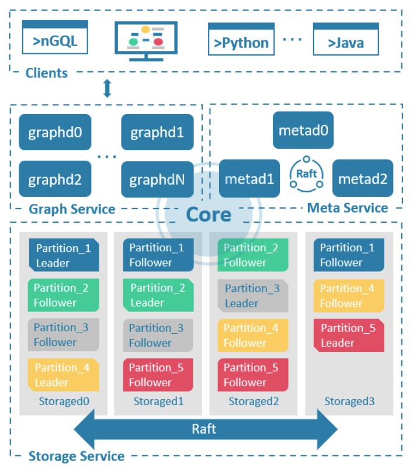
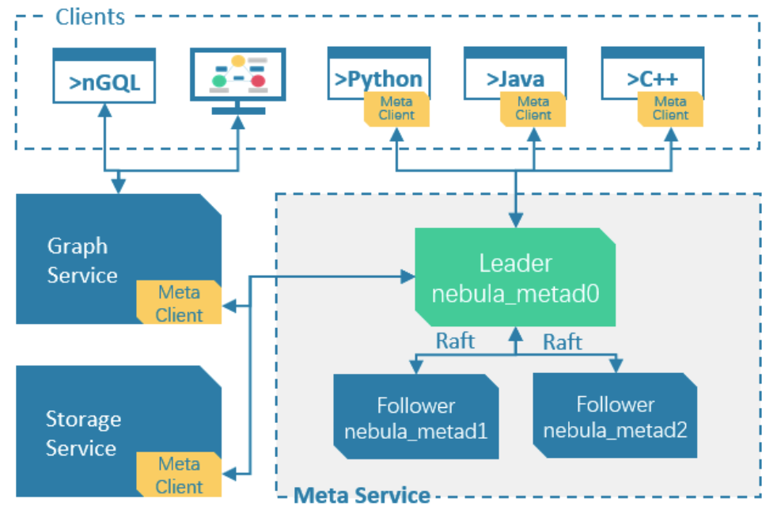
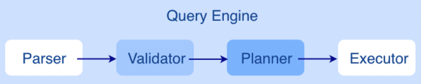
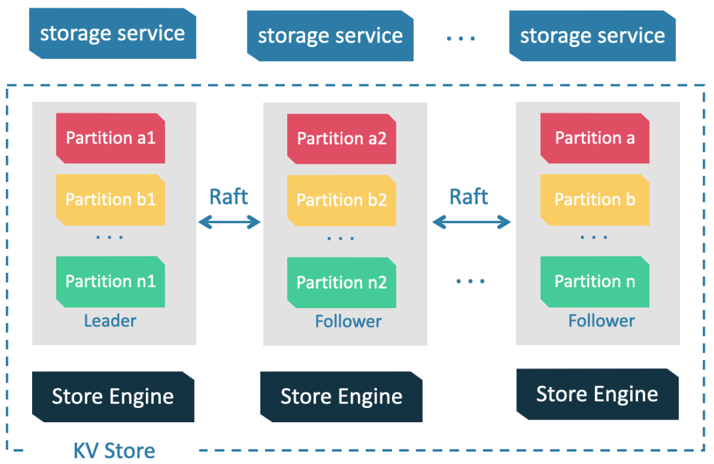

- [Data Modeling](#data-modeling)
  - [Data Structures](#data-structures)
  - [Directed Propeerty Graph](#directed-propeerty-graph)
- [VID](#vid)
  - [Features](#features)
  - [VID Operation](#vid-operation)
- [Architecture](#architecture)
  - [Meta Service](#meta-service)
    - [Functions of the Meta Service](#functions-of-the-meta-service)
  - [Graph Service](#graph-service)
    - [The Architecture of the Graph Service](#the-architecture-of-the-graph-service)
  - [Storage Service](#storage-service)
    - [Advantages](#advantages)
    - [The Architecture of the Storage Service](#the-architecture-of-the-storage-service)

# Data Modeling

## Data Structures

> NebulaGraph data model uses six data structures to store data. They are graph spaces, vertices, edges, tags, edge types and properties.

- **Graph spaces**: Graph spaces are used to isolate data from different teams or programs. Data stored in different graph spaces are securely isolated. Storage replications, privileges, and partitions can be assigned.
  
- **Vertices**: Vertices are used to store entities.

    In NebulaGraph, vertices are identified with vertex identifiers (i.e. `VID`). The `VID` must be unique in the same graph space. `VID` should be `int64`, or `fixed_string(N)`.

    ~~~warning
    In NebulaGraph 2.x a vertex must have at least one tag. And in NebulaGraph 3.3.0, a tag is not required for a vertex.
    ~~~

- **Edges**: Edges are used to connect vertices. An edge is a connection or behavior between two vertices.
  
  - There can be multiple edges between two vertices.
  - Edges are directed. -> identifies the directions of edges. Edges can be traversed in either direction.
  - An edge is identified uniquely with `<a source vertex, an edge type, a rank value, and a destination vertex>`. **Edges have no EID**.
  - An edge must have one and only one edge type.
  - The rank value is an immutable user-assigned 64-bit signed integer. It identifies the edges with the same edge type between two vertices. Edges are sorted by their rank values. The edge with the greatest rank value is listed first. The default rank value is zero.

- **Tags**: Tags are used to categorize vertices. Vertices that have the same tag share the same definition of properties.

- **Edge types**: Edge types are used to categorize edges. Edges that have the same edge type share the same definition of properties.

- **Properties**: Properties are key-value pairs. Both vertices and edges are containers for properties.

```note
Tags and Edge types are similar to "vertex tables" and "edge tables" in the relational databases.
```

## Directed Propeerty Graph

NebulaGraph stores data in directed property graphs. A directed property graph has a set of vertices connected by directed edges. Both vertices and edges can have properties. A directed property graph is represented as:

`G = < V, E, PV, PE >`

  - V is a set of vertices.
  - E is a set of directed edges.
  - PV is the property of vertices.
  - PE is the property of edges.

The following table is an example of the structure of the basketball player dataset. We have two types of vertices, that is player and team, and two types of edges, that is serve and follow.

| Element   | Name   | Property name (Data type)       | Description                                                                                                                                              |
| --------- | ------ | ------------------------------- | -------------------------------------------------------------------------------------------------------------------------------------------------------- |
| Tag       | player | name (string), age (int)        | Represents players in the team.                                                                                                                          |
| Tag       | team   | name (string)                   | Represents the teams.                                                                                                                                    |
| Edge type | serve  | start_year (int),end_year (int) | Represents actions taken by players in the team. An action links a player with a team, and the direction is from a player to a team.                     |
| Edge type | follow | degree (int)                    | Represents actions taken by players in the team. An action links a player with another player, and the direction is from one player to the other player. |

```info
NebulaGraph 3.3.0 allows dangling edges. Therefore, when adding or deleting, you need to ensure the corresponding source vertex and destination vertex of an edge exist. For details, see INSERT VERTEX, DELETE VERTEX, INSERT EDGE, and DELETE EDGE.

The MERGE statement in openCypher is not supported.
```

# VID

```info
In NebulaGraph, a vertex is uniquely identified by its ID, which is called a VID or a Vertex ID.
```

## Features

- The data types of VIDs are restricted to `FIXED_STRING`(<N>) or `INT64`. One graph space can only select one VID type.
- A VID in a graph space is `unique`. It functions just as a `primary key` in a relational database. VIDs in different graph spaces are independent.
- **The VID generation method must be set by users, because NebulaGraph does not provide auto increasing ID, or UUID.**
- Vertices with the same VID will be identified as the same one. For example:

  - A VID is the unique identifier of an entity, like a person's ID card number. A tag means the type of an entity, such as driver, and boss. Different tags define two groups of different properties, such as driving license number, driving age, order amount, order taking alt, and job number, payroll, debt ceiling, business phone number.
  - When two `INSERT` statements (neither uses a parameter of IF NOT EXISTS) with the same VID and tag are operated at the same time, **the latter INSERT will overwrite the former**.
  - When two `INSERT` statements with the same VID but different tags, like **TAG A** and **TAG B**, are operated at the same time, the operation of **Tag A will not affect Tag B**.

- VIDs will usually be indexed and stored into memory (in the way of `LSM-tree`). Thus, direct access to VIDs enjoys peak performance.

## VID Operation

NebulaGraph 1.x only supports INT64 while NebulaGraph 2.x supports INT64 and FIXED_STRING(<N>). In CREATE SPACE, VID types can be set via vid_type.
id() function can be used to specify or locate a VID.
LOOKUP or MATCH statements can be used to find a VID via property index.
Direct access to vertices statements via VIDs enjoys peak performance, such as DELETE xxx WHERE id(xxx) == "player100" or GO FROM "player100". Finding VIDs via properties and then operating the graph will cause poor performance, such as LOOKUP | GO FROM $-.ids, which will run both LOOKUP and | one more time.

# Architecture

NebulaGraph consists of three services: the `Graph Service`, the `Storage Service`, and the `Meta Service`. It applies the separation of storage and computing architecture.

Each service has its executable binaries and processes launched from the binaries. Users can deploy a NebulaGraph cluster on a single machine or multiple machines using these binaries.

The following figure shows the architecture of a typical NebulaGraph cluster:



NebulaGraph applies the separation of storage and computing architecture. The `Graph Service` is responsible for querying. The `Storage Service` is responsible for storage. They are run by different processes, i.e., nebula-graphd and nebula-storaged. The benefits of the separation of storage and computing architecture are as follows:

- Great scalability
  The separated structure makes both the Graph Service and the Storage Service flexible and easy to scale in or out.

- High availability
  If part of the Graph Service fails, the data stored by the Storage Service suffers no loss. And if the rest part of the Graph Service is still able to serve the clients, service recovery can be performed quickly, even unfelt by the users.

- Cost-effective
  The separation of storage and computing architecture provides a higher resource utilization rate, and it enables clients to manage the cost flexibly according to business demands.

- Open to more possibilities
  With the ability to run separately, the Graph Service may work with multiple types of storage engines, and the Storage Service may also serve more types of computing engines.

## Meta Service

The Meta Service in the NebulaGraph architecture is run by the nebula-metad processes. It is responsible for `metadata management`, such as `schema operations`, `cluster administration`, and `user privilege management`.

The architecture of the `Meta Service` is as follow:



The Meta Service is run by nebula-metad processes. Users can deploy nebula-metad processes according to the scenario:

- In a test environment, users can deploy one or three nebula-metad processes on different machines or a single machine.
- In a production environment, we recommend that users deploy three nebula-metad processes on different machines for high availability.

All the nebula-metad processes form a `Raft-based cluster`, with one process as the `leader` and the others as the `followers`.

The leader is elected by the majorities and only the leader can provide service to the clients or other components of NebulaGraph. The followers will be run in a standby way and each has a data replication of the leader. Once the leader fails, one of the followers will be elected as the new leader.

```info
The data of the leader and the followers will keep consistent through Raft. Thus the breakdown and election of the leader will not cause data inconsistency.
```

### Functions of the Meta Service

- Manages user accounts
  The Meta Service stores the information of user accounts and the privileges granted to the accounts. When the clients send queries to the Meta Service through an account, the Meta Service checks the account information and whether the account has the right privileges to execute the queries or not.

- Manages partitions
  The Meta Service stores and manages the locations of the storage partitions and helps balance the partitions.

- Manages graph spaces
  NebulaGraph supports multiple graph spaces. Data stored in different graph spaces are securely isolated. The Meta Service stores the metadata of all graph spaces and tracks the changes of them, such as adding or dropping a graph space.

- Manages schema information
  NebulaGraph is a strong-typed graph database. Its schema contains tags (i.e., the vertex types), edge types, tag properties, and edge type properties.

  The Meta Service stores the schema information. Besides, it performs the addition, modification, and deletion of the schema, and logs the versions of them.

- Manages TTL information
  The Meta Service stores the definition of TTL (Time to Live) options which are used to control data expiration. The Storage Service takes care of the expiring and evicting processes. For more information, see TTL.

- Manages jobs
  The Job Management module in the Meta Service is responsible for the creation, queuing, querying, and deletion of jobs.

## Graph Service

```info
The Graph Service is used to process the query. It has four submodules: Parser, Validator, Planner, and Executor. This topic will describe the Graph Service accordingly.
```

### The Architecture of the Graph Service



After a query is sent to the Graph Service, it will be processed by the following four submodules:

- Parser: Performs lexical analysis and syntax analysis.

- Validator: Validates the statements.

- Planner: Generates and optimizes the execution plans.

- Executor: Executes the plans with operators.

## Storage Service

The persistent data of NebulaGraph have two parts. One is the `Meta Service` that stores the **meta-related data**.

The other is the Storage Service that stores the data, which is run by the nebula-storaged process. This topic will describe the architecture of the Storage Service.

The architecture of the storage service as below:

### Advantages

- High performance (Customized built-in KVStore)
- Great scalability (Shared-nothing architecture, not rely on NAS/SAN-like devices)
- Strong consistency (Raft)
- High availability (Raft)
- Supports synchronizing with the third party systems, such as Elasticsearch.

### The Architecture of the Storage Service



