- [Knowledge Graph](#knowledge-graph)
- [Graph Database](#graph-database)
  - [Where is Graph Database Used?](#where-is-graph-database-used)
    - [Graph Traversal](#graph-traversal)
    - [Community Detection](#community-detection)
    - [Centrality](#centrality)
    - [Similarity](#similarity)
  - [Native Graph Processing](#native-graph-processing)
  - [Native Graph Storage](#native-graph-storage)
    - [Node](#node)
    - [Relationship](#relationship)
- [Introduction](#introduction)
  - [Example Graph](#example-graph)
  - [Node](#node-1)
  - [Node Labels](#node-labels)
  - [Relationship](#relationship-1)
  - [Relationship Type](#relationship-type)
  - [Properties](#properties)
    - [Number](#number)
    - [String and Boolean](#string-and-boolean)
    - [List](#list)
  - [Traversals & Paths](#traversals--paths)
  - [Schema](#schema)
  - [Naming Conventions](#naming-conventions)
  - [Edition Comparison](#edition-comparison)
- [Cypher](#cypher)
  - [Usage](#usage)
- [Index](#index)
  - [B-Tree Indexes [deprecated]](#b-tree-indexes-deprecated)
    - [Predicate Compatibility](#predicate-compatibility)
    - [Limitations for queries using CONTAINS and ENDS WITH](#limitations-for-queries-using-contains-and-ends-with)
    - [Limitations on key size](#limitations-on-key-size)
  - [Text Indexes](#text-indexes)
    - [Predicate Compatibility](#predicate-compatibility-1)
    - [Limitations](#limitations)
  - [Full-text Indexes](#full-text-indexes)
  - [Token Lookup Indexes](#token-lookup-indexes)
  - [Future Indexes](#future-indexes)
- [Query Tuning](#query-tuning)
  - [Cypher Query Options](#cypher-query-options)
    - [Cypher Runtime](#cypher-runtime)
- [Constraints](#constraints)
  - [Type of Constraints](#type-of-constraints)
    - [Unique node property constraints](#unique-node-property-constraints)
    - [Node property existence constraints](#node-property-existence-constraints)
    - [Relationship property existence constraints](#relationship-property-existence-constraints)
    - [Node key constraints](#node-key-constraints)
- [Stream](#stream)

# Knowledge Graph

> 知識圖譜（Knowledge Graph），是結構化的語義知識庫，用於以符號形式描述物理世界中的概念及其相互關係。其基本組成單位是「實體-關係-實體」三元組，以及實體及其相關屬性-值對，實體間通過關係相互聯結，構成網狀的知識結構。知識圖譜可以實現Web從網頁連結向概念連結轉變，支持用戶按主題而不是字符串檢索，真正實現語義檢索。基於知識圖譜的搜尋引擎，能夠以圖形方式向用戶反饋結構化的知識，用戶不必瀏覽大量網頁即能準確定位和深度獲取知識。

`wikipedia` 對於 `knowledge graph` 的定義如上, 簡單來說 `knowledge graph` 就是通過不同知識的關聯性形成一個網狀的知識結構, 其可作為 AI 的基石

當前 AI 領域如 `computer vision`, `speech recognition` 或是 `NLP` 的 training model, 都要依賴 `knowledge graph`

`Knowledge graph` 目前主要應用在搜尋, 智能問答, 推薦系統等應用, 其建設一般包括資料擷取, 實體辨識, 抽象關係, 資料存儲及應用等幾個面向, `Neo4j` 主要著眼於資料存儲的部分

`Knowledge graph` 的資料包含 `entity`, `poperty` 及 `relationship`, 常見的 Relational Database 如 MySQL 無法很好的發揮這類資料的特性, 因此 `knowledge graph` 資料的存儲一般都採用 `Graph Database`, 而 `Neo4j` 為 `Graph Database` 的一種

# Graph Database

隨著社交軟體, 電商平台, 零售供應鏈及物聯網產業的快速發展, 資料之間的關係隨資料量呈幾何式增長, 傳統關係型資料庫很難處理關係之間的運算及查詢, `graph database` 應運而生

許多大型企業應用都使用 `Graph Database` 實現, 如:
- 社交: Facebook, twitter, linkedin 利用其來管理社交關係, 實現好友推薦
- 零售: eBay, Walmart 利用其實現商品實時推薦
- 金融: JPMorgan, Citibank, 瑞銀等銀行利用其實現風控處理
- 汽車製造: Volvo, Toyota 利用其推動創新製造解決方案
- 電信: Verizon, Orange, AT&T 利用其管理網絡, 連線控制訪問

> A graph data structure consists of nodes (discrete objects) that can be connected by relationships.

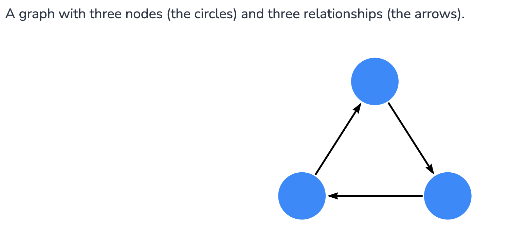

為何 graph database 能夠解決大數據趨勢下傳統資料庫在查詢運算時的複雜度問題呢? 先來了解一下 graph database 與一般資料庫在儲存結構上的差異:


`Relational Database` 結構性最強, 在 `data trasactions` 的效能表現最佳, 能夠完全滿足 `ACID` 應用需求

但結構性太強也使得結構不夠彈性, 會導致資料不易擴展, 且對於關聯型資料的效果不佳, 當關聯查詢逐漸複雜時會發生查詢性能不符預期, 因此不適合拿來做深度資料分析應用

隨著資料量不斷增長, 單機架構已經無法負荷系統運作, 技術發展趨勢逐漸向分散式架構轉移, 於是 `Key-Value NoSQL Database` 就誕生了

相較於 `Relational`, `Key-Value` 在結構上較為彈性, 也較容易進行分散式水平擴展, 但依照 `CAP Theory`, 資料庫設計先天上無法同時滿足 `Consistent`, `Availability` 和 `Partition Tolerance`, 大多 `NoSQL` 資料庫選擇的是 `CP` 的設計, 但其中 `Consistent` 的部分是採用 `Eventually Consistency Model`, 屬於 `Consistent Model` 中最弱的一致性模型, 其結構同樣不適合應用於深度資料分析應用

在 `Graph Database` 中, `Relationship` 是一等公民, 關聯的節點的物理意義為`指向`彼此, 遍歷搜尋時可以直接基於指針直接找到關聯資料, 不需像前兩者依賴 `foreign key relationship` 將兩張 table join search, 免去了 `Index Scan` 的成本, 實現 `O(logn) -> O(1)` 的效能提升, 這種搜尋方式稱為 `Index Free Adjacency(免索引鄰接)`

下圖為 `Neo4j` 官方釋出的 `Multi-Level Query Results`:


可以看到在 `Relational Database` 中隨著關聯的數量及深度增加會導致關聯查詢效率急遽下降, 甚至崩潰; 而 `Graph Database` 性能幾乎不會隨著資料量增加而改變

那在哪些應用場景不適合使用 graph database 呢?
- 紀錄大量基於 event 的資料 (log or iot sensor data)
- 二進制資料儲存
- 大規模分散式資料處理, 如 hadoop
- 強一制性需求高

## Where is Graph Database Used?

> 當然沒有技術是銀彈, 其都有各自適當發揮最大化效益的場景

接下來介紹一些適合 `Graph Database` 的一些應用場景

### Graph Traversal

從給定連通圖的某一節點出發, 沿著邊訪問途中所有節點, 且使每個節點僅被訪問一次即稱為 `Graph Traversal`, 大家熟知的 `Tree Traversal` 也是一種特殊的 `Graph Traversal`

其最經典應用包含 `Minimum Spanning Tree`, `Find Shortest Path`, `Topological Ordering`, `Critical path method` 等

### Community Detection

`Community Detection` 是指在 `Graph` 資料結構中發現密集連接的 sub network

如在蛋白質網絡中發現具有相似生物學功能的蛋白質; 在企業網絡中, 通過研究公司內部關係將員工分組為社群; 在 Twitter 或 Facebook 等社交網絡中具有相同興趣或共同朋友的使用者可能是同一社群的成員等

利用 `Graph` 結構資訊及節點特徵進行歸因及聚類演算, 以實現將大網絡分成兩個以上不同的社群, 進而達成分類/分群的目的:


### Centrality

`Centrality` 是社交網絡分析(Social Network Analysis, SNA) 中用以衡量網絡中一個個體在整個網絡中接近中心程度的一個概念, 這個程度量化後的數字即被稱作 `Centrality`

因此可以通過判斷一個節點的 centrality, 從而判斷這個節點在網絡中所佔據的重要性

在圖論和網絡分析中, `Centrality` 可以判斷圖中最重要的節點, 其應用包含識別社交網絡中最具影響力的人, 城市網絡中最關鍵的基礎設施或是病毒的超級傳播者等

### Similarity

即資料集的相似度計算, 在現有的 AI 演算法中, 大多數為基於概率的近似計算, 然後取最大可能性的近似值

`Similarity` 在現實中有著極高的應用需求, 如社群網絡中的好友推薦, 電商平台的商品推薦, 人臉辨識或語音辨識等都是類似的應用

## Native Graph Processing

上面討論到了用 `index-free adjacency` 的方式來維護節點與相鄰節點之間的關係, 每個節點自身維護其與相鄰節點的 `micro-index`, 成本會遠低於維護 `global index` 來得低, 即意味著查詢時間與全圖大小無關, 取決於局部欲查詢的相關節點

在 `nonnative graph database` 中, 使用 `global index` 來連接節點, 如下圖:

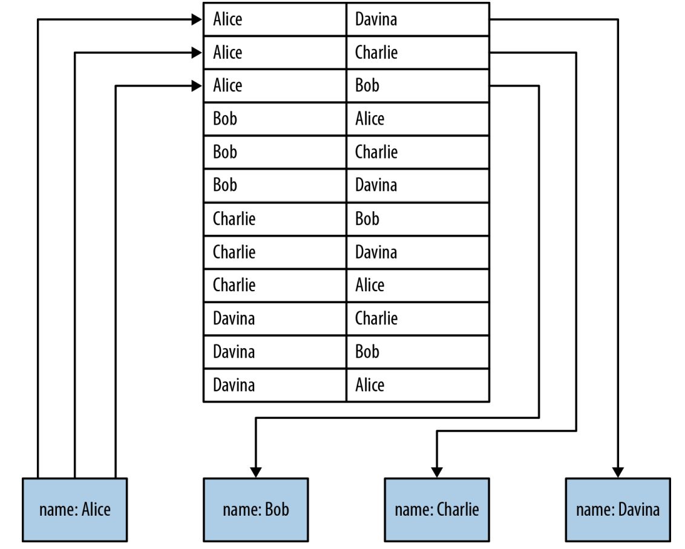

每次透過 index look up 的時間複雜度為 `O(log n)`, 若要反查誰把 `Alice` 當作朋友則需進行 m 次遍歷, 時間複雜度為 `O(m log n)`

隨著全局資料量 `n` 的增加及深度關係的查詢, 這種方式會因查詢成本過高導致效能不佳

而以 `neo4j` 代表的 native graph 主要透過 `relationships` 來實現高效遍歷: 

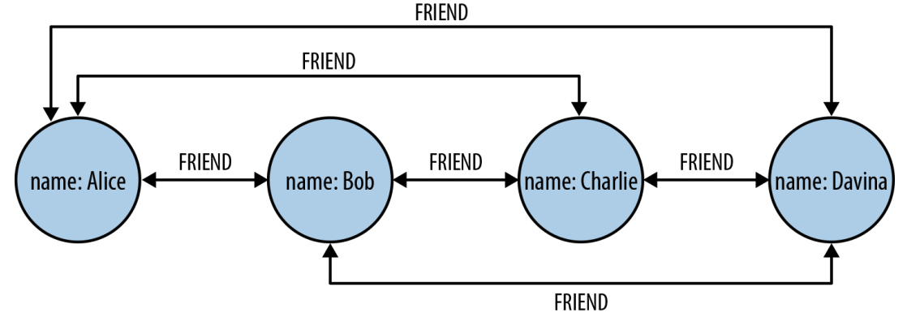

`Relationship` 作為雙邊節點的容器, 儲存了對應 node, relationship, property 的物理地址, 直接進行尋址遍歷, 從而免去 index scan 的開銷

同樣以圖中為例, 要查找圖中 `Alice` 的朋友可直接透過尋址搜尋, 時間複雜度為 `O(1)`

下圖為 `neo4j` 官方釋出的 benchmark 對比圖, 全圖有 `10 million` 節點及 `100 million relationships`, 總資料量 `4 GB`, 參考即可:

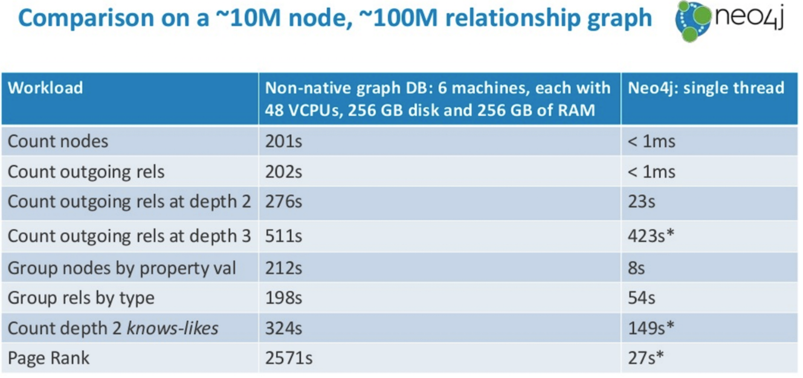

## Native Graph Storage

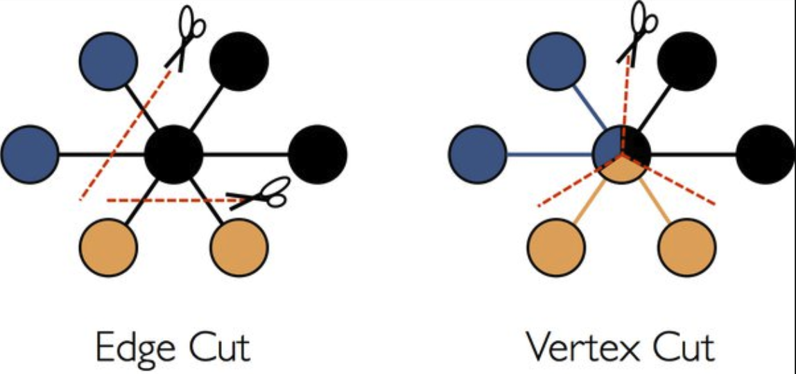

將 graph data 儲存到硬碟上的方法有很多種, 常見的主要是 `Edge Cut` 及 `Edge Cut` 兩種

`Edge Cut` 顧名思義即將邊切成兩段, 分別與起點與終點存在一起, 即邊的資料會保存兩份

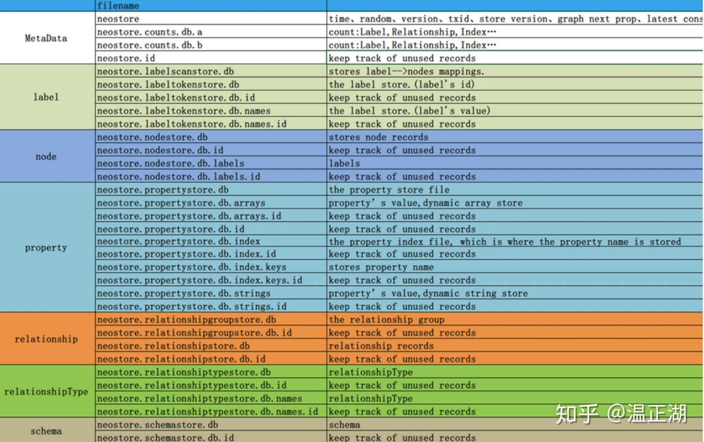

上圖為 `neo4j` 資料目錄下的文件列表, 圖中已經細分出 `metadata`, `label`, `node`, `property`, `relationship` 及 `schema` 等不同類型的文件

### Node

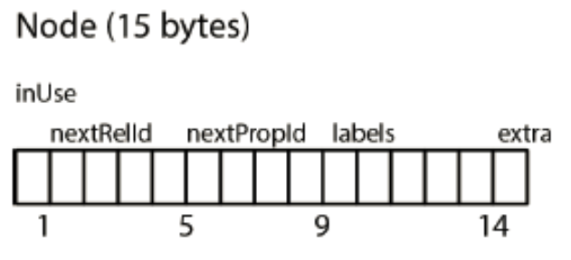

每個 node 的儲存空間為固定大小, 這樣做的好處在於能快速定位到每個 node 在 store file 中存儲的位置

俱利來說有個 node id 為 100, 就可以直接推算該筆資料位於 store file 起始位置 1500 bytes 的位置, 成本僅 `O(1)`, 而無需透過 index `O(log n)` 的開銷

Node 主要由以下成員組成:

```java
// in_use(byte)+next_rel_id(int)+next_prop_id(int)+labels(5)+extra(byte)
    public static final int RECORD_SIZE = 15;
```

- `inUse(Byte)`: 存放 in-use flag 及屬性和關係 id 的高位資訊
  ```java
  // [    ,   x] in use bit
    // [    ,xxx ] higher bits for rel id
    // [xxxx,    ] higher bits for prop id
  ```
- `nextRel(Int)`: 存放 node 連結的第一條 relationship ID
- `nextProp(Int)`: 存放 node 連結的第一個 property ID
- `labes(5 Bytes)`: 存放 node labels
- `extra(Byte)`: 紀錄 node 是否為 `dense`, 即 supernode

### Relationship

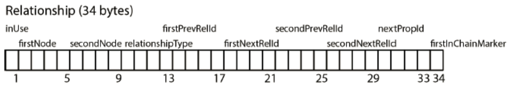

相較於 node, relationship 結構要複雜許多

Relationship 主要由以下成員組成:

```java
// record header size
    // directed|in_use(byte)+first_node(int)+second_node(int)+rel_type(int)+
    // first_prev_rel_id(int)+first_next_rel_id+second_prev_rel_id(int)+
    // second_next_rel_id(int)+next_prop_id(int)+first-in-chain-markers(1)
    public static final int RECORD_SIZE = 34;
```

- `inUse(Byte)`: 存放 in-use flage 及關係起點和下一個屬性的高位資訊
  ```java
  // [    ,   x] in use flag
    // [    ,xxx ] first node high order bits
    // [xxxx,    ] next prop high order bits
  ```

# Introduction

The `Neo4j` property graph database model consists of:

- `Nodes` describe entities (discrete objects) of a domain.
- `Nodes` can have zero or more `labels` to define (classify) what kind of nodes they are.
- `Relationships` describes a connection between a source node and a target node.
- `Relationships` always has a direction (one direction).
- `Relationships` must have a `type` (one type) to define (classify) what type of relationship they are.
- Nodes and relationships can have `properties` (key-value pairs), which further describe them.

```
In mathematics, graph theory is the study of graphs.

In graph therory:

- Nodes are also refered to as vertices or points.
- Relationships are also refered to as edges, links, or lines.
```

## Example Graph

The example graph shown below, introduces the basic concepts of the property graph:

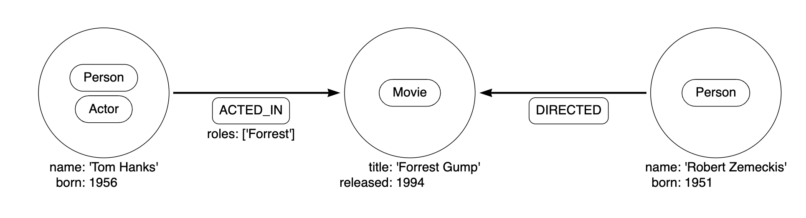

To create the example graph, use the Cypher clause `CREATE`:

```cypher
CREATE (:Person:Actor {name: 'Tom Hanks', born: 1956})-[:ACTED_IN {roles: ['Forrest']}]->(:Movie {title: 'Forrest Gump'})<-[:DIRECTED]-(:Person {name: 'Robert Zemeckis', born: 1951})
```

## Node

> Nodes are used to represent entities (discrete objects) of a domain.

The simplest possible graph is a single node with no relationships. Consider the following graph, consisting of a single node.

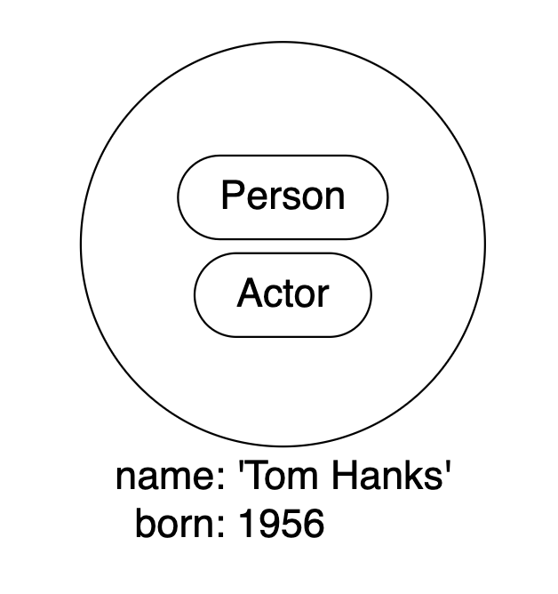

The node labels are:
- Person
- Actor

The properties are:
- name: Tom Hanks
- born: 1956

The node can be created with Cypher using the query:

```cypher
CREATE (:Person:Actor {name: 'Tom Hanks', born: 1956})
```

## Node Labels

> A node can have zero to many labels.

In the example graph, the node labels, `Person`, `Actor`, and `Movie`, are used to describe (classify) the nodes. More labels can be added to express different dimensions of the data.

The following graph shows the use of multiple labels:

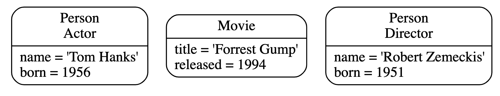

## Relationship

> A relationship describes how a connection between a source node and a target node are related. It is possible for a node to have a relationship to itself.

A relationship:

- Connects a source node and a target node.
- Has a direction (one direction).
- Must have a `type` (one type) to define (classify) what type of relationship it is.
- Can have properties (key-value pairs), which further describe the relationship.

Relationships organize nodes into structures, allowing a graph to resemble a list, a tree, a map, or a compound entity — any of which may be combined into yet more complex, richly inter-connected structures.

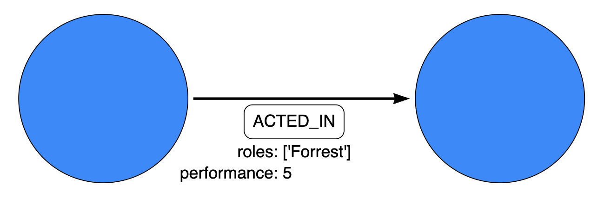

The relationship type: `ACTED_IN`

The properties are:
- `roles: ['Forrest']`
- `performance: 5`

The `roles` property has an array value with a single item (`'Forrest'`) in it.

The relationship can be created with Cypher using the query:

```cypher
CREATE ()-[:ACTED_IN {roles: ['Forrest'], performance: 5}]->()
```

>❗️ You must create or reference a source node and a target node to be able to create a relationship.

A node can have relationships to itself. To express that `Tom Hanks` `KNOWS` himself would be expressed as:

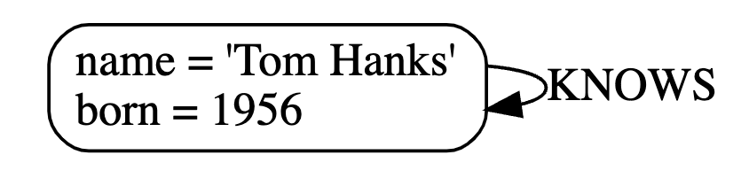

## Relationship Type

> A relationship must have exactly one relationship type.

Below is an `ACTED_IN` relationship, with the `Tom Hanks` node as the source node and `Forrest Gump` as the target node.

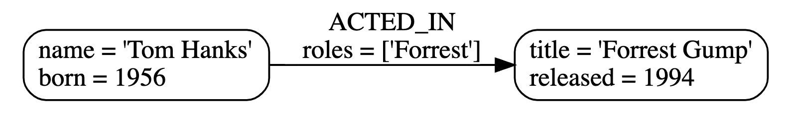

## Properties

> Properties are key-value pairs that are used for storing data on nodes and relationships.

The value part of a property:
- Can hold different data types, such as number, string, or boolean.
- Can hold a homogeneous list (array) containing, for example, strings, numbers, or boolean values.

### Number

```cypher
CREATE (:Example {a: 1, b: 3.14})
```

- The property a has the type `integer` with the value `1`.
- The property b has the type `float` with the value `3.14`.

### String and Boolean

```cypher
CREATE (:Example {c: 'This is an example string', d: true, e: false})
```

- The property `c` has the type `string` with the value `'This is an example string'`.
- The property `d` has the type `boolean` with the value `true`.
- The property `e` has the type `boolean` with the value `false`.

### List

```cypher
CREATE (:Example {f: [1, 2, 3], g: [2.71, 3.14], h: ['abc', 'example'], i: [true, true, false]})
```

- The property `f` contains an array with the value `[1, 2, 3]`.
- The property `g` contains an array with the value `[2.71, 3.14]`.
- The property `h` contains an array with the value `['abc', 'example']`.
- The property `i` contains an array with the value `[true, true, false]`.

> For a thorough description of the available data types, refer to the [Cypher manual → Values and types](https://neo4j.com/docs/cypher-manual/4.4/syntax/values/#cypher-values).

## Traversals & Paths

> A traversal is how you query a graph in order to find answers to questions.

Traversing a graph means visiting nodes by following relationships according to some rules. In most cases only a subset of the graph is visited.

To find out which movies `Tom Hanks` acted in according to the tiny example database, the traversal would start from the `Tom Hanks` node, follow any `ACTED_IN` relationships connected to the node, and end up with `Forrest Gump` as the result (see the dashed lines):

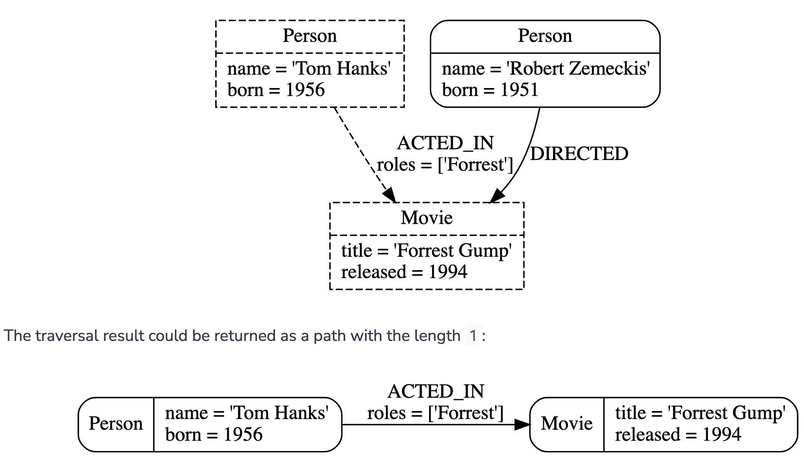

>❗️ The shortest possible path has length zero. It contains a single node and no relationships.

## Schema

A schema in Neo4j refers to indexes and constraints.

Neo4j is often described as schema optional, meaning that it is not necessary to create indexes and constraints. You can create data — nodes, relationships and properties — without defining a schema up front.

>💡 Indexes and constraints can be introduced when desired, in order to gain performance or modeling benefits.

## Naming Conventions

`Node labels`, `relationship types`, and `properties` (the key part) are case sensitive, meaning, for example, that the property name is different from the property Name.

The following naming conventions are recommended:

| Graph entity      | Recommended style                                       | Example                                     |
| ----------------- | ------------------------------------------------------- | ------------------------------------------- |
| Node label        | Camel case, beginning with an upper-case character      | `:VehicleOwner` rather than `:vehice_owner` |
| Relationship type | Upper case, using underscore to separate words          | `:OWNS_VEHICLE` rather than `:ownsVehicle`  |
| Property          | Lower camel case, beginning with a lower-case character | `firstName` rather than `first_name`        |

## Edition Comparison

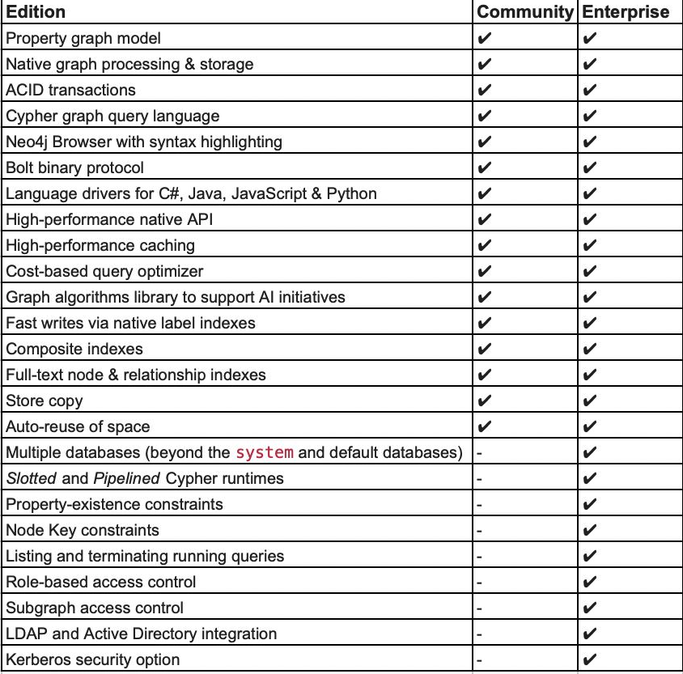

# Cypher

`Cypher` 為 `Neo4j` 的聲明式 `GQL(Graph Query Language)`, 其在設計上類似 `SQL`, 主要功能包括 `Node` 和 `Relationship` 的 CRUD, 管理 `index` 和 `constraint`

## Usage

以下為一個 `Cypher` 的使用範例:

```cypher
MATCH (n) DETACH DELETE n
```

`MATCH` 為查詢操作, `()` 代表一個 `Node(括號類似一個圓形)`, 括號中 `n` 為標識符

再來創建一個 person node:

```cypher
CREATE (n:Person {name:'John'}) RETURN n
```

- `CREATE` 是新增操作, `Person` 是 `Node Label`, 代表 `Node` 類型
- `{}` 代表 `Node Property`, 為 `key-value pairs` 結構
- 這句 cypher 語意為: 新增一個類別為 `Person` 的 node, 其具有一個 `name` property, value 為 `John`

繼續新增更多人物節點並分別命名:

```cypher
CREATE (n:Person {name:'Sally'}) RETURN n
CREATE (n:Person {name:'Steve'}) RETURN n
CREATE (n:Person {name:'Mike'}) RETURN n
CREATE (n:Person {name:'Liz'}) RETURN n
CREATE (n:Person {name:'Shawn'}) RETURN n
```

再來新增地區節點:

```cypher
CREATE (n:Location {city:'Miami', state:'FL'})
CREATE (n:Location {city:'Boston', state:'MA'})
CREATE (n:Location {city:'Lynn', state:'MA'})
CREATE (n:Location {city:'Portland', state:'ME'})
CREATE (n:Location {city:'San Francisco', state:'CA'})
```

Node type 為 `Location`, property 包含 `city` 和 `state`

接下來新增關係:

```cypher
MATCH (a:Person {name:'Liz'}), 
      (b:Person {name:'Mike'}) 
MERGE (a)-[:FRIENDS]->(b)
```

- `[]` 即代表 relationship, `FRIENDS` 為 relationship type
- `->` 具有方向性, 表示從 a -> b 的關係
- 語句表示 `Liz` 和 `Mike` 之間建立了一條 `FRIENDS` relationship

關係也可以增加屬性:

```cypher
MATCH (a:Person {name:'Shawn'}), 
      (b:Person {name:'Sally'}) 
MERGE (a)-[:FRIENDS {since:2001}]->(b)
```

- 在關係中同樣使用 `{}` 來表示關係的屬性
- 語意為建立 `Shawn` 與 `Sally` 之間的 `FRIENDS` 關係, 屬性 `since` 值為 `2001`, 表示建立朋友關係的時間

再來新增更多的關係:

```cypher
MATCH (a:Person {name:'Shawn'}), (b:Person {name:'John'}) MERGE (a)-[:FRIENDS {since:2012}]->(b)
MATCH (a:Person {name:'Mike'}), (b:Person {name:'Shawn'}) MERGE (a)-[:FRIENDS {since:2006}]->(b)
MATCH (a:Person {name:'Sally'}), (b:Person {name:'Steve'}) MERGE (a)-[:FRIENDS {since:2006}]->(b)
MATCH (a:Person {name:'Liz'}), (b:Person {name:'John'}) MERGE (a)-[:MARRIED {since:1998}]->(b)
```

再來需要建立不同類型節點之間的關係 - 人物和地區的關係

```cypher
MATCH (a:Person {name:'John'}), (b:Location {city:'Boston'}) MERGE (a)-[:BORN_IN {year:1978}]->(b)
```

`John` 與 `Boston` 建立一個 `BORN_IN` 的關係, 並帶上一個屬性 `year` 表示出生年份

同樣新增更多人與地區的關係:

```cypher
MATCH (a:Person {name:'Liz'}), (b:Location {city:'Boston'}) MERGE (a)-[:BORN_IN {year:1981}]->(b)
MATCH (a:Person {name:'Mike'}), (b:Location {city:'San Francisco'}) MERGE (a)-[:BORN_IN {year:1960}]->(b)
MATCH (a:Person {name:'Shawn'}), (b:Location {city:'Miami'}) MERGE (a)-[:BORN_IN {year:1960}]->(b)
MATCH (a:Person {name:'Steve'}), (b:Location {city:'Lynn'}) MERGE (a)-[:BORN_IN {year:1970}]->(b)
```

至此, graph data 已經新增完成, 可以開始查詢, 以下查詢所有在 `Boston` 出生的人:

```cypher
MATCH (a:Person)-[:BORN_IN]->(b:Location {city:'Boston'}) RETURN a,b
```

查詢所有對外有關係的節點:

```cypher
MATCH (a)-->() RETURN a
```

>❗️ 注意箭頭方向, 返回結果未包含任何地區節點, 因為地區節點並未指向其他節點

查詢所有關係的節點:

```cypher
MATCH (a)--() RETURN a
```

查詢所有對外有關係的節點以及關係類型:

```cypher
MATCH (a)-[r]->() RETURN a.name, type(r)
```

查詢所有有結婚關係的節點:

```cypher
MATCH (n)-[:MARRIED]-() RETURN n
```

新增節點並同時新增關係:

```cypher
CREATE (a:Person {name:'Todd'})-[r:FRIENDS]->(b:Person {name:'Carlos'})
```

查找某人朋友的朋友:

```cypher
MATCH (a:Person {name:'Mike'})-[r1:FRIENDS]-()-[r2:FRIENDS]-(friend_of_a_friend) RETURN friend_of_a_friend.name AS fofName
```

語句返回 `Mike` 朋友的朋友

修改節點屬性:

```cypher
MATCH (a:Person {name:'Liz'}) SET a.age=34
MATCH (a:Person {name:'Shawn'}) SET a.age=32
MATCH (a:Person {name:'John'}) SET a.age=44
MATCH (a:Person {name:'Mike'}) SET a.age=25
```

`SET` 表示修改操作

刪除節點屬性:

```cypher
MATCH (a:Person {name:'Mike'}) SET a.test='test'
MATCH (a:Person {name:'Mike'}) REMOVE a.test
```

`REMOVE` 表示`刪除屬性`操作

刪除節點:

```cypher
MATCH (a:Location {city:'Portland'}) DELETE a
```

`DELETE` 表示`刪除節點`操作

刪除有關係的節點:

```cypher
MATCH (a:Person {name:'Todd'})-[rel]-(b:Person) DELETE a,b,rel
```

# Index

## B-Tree Indexes [deprecated]

B-tree indexes are good for exact look-ups on all types of values, range scans, full scans, and prefix searches. They can be backed by two different index providers, native-btree-1.0 and lucene+native-3.0. If not explicitly set, native-btree-1.0 will be used.

```cypher
CREATE INDEX node_index_name IF NOT EXISTS FOR (n:Person) ON (n.surname)
```

### Predicate Compatibility

`BTREE` indexes support all types of predicates:

| Predicate             | Syntax             |
| --------------------- | ------------------ |
| equality check        | n.prop = value     |
| list membership check | n.prop IN list     |
| existence check       | n.prop IS NOT NULL |
| range search          | n.prop > value     |
| prefix search         | STARTS WITH        |
| suffix search         | ENDS WITH          |
| substring search      | CONTAINS           |

### Limitations for queries using CONTAINS and ENDS WITH

### Limitations on key size

## Text Indexes

Text indexes are a type of **single-property index** and **only index properties with string values**, unlike b-tree indexes. They are specifically designed to deal with ENDS WITH or CONTAINS queries efficiently. They are used through Cypher and they support a smaller set of string queries. Even though text indexes do support other text queries, **ENDS WITH or CONTAINS queries are the only ones for which this index type provides an advantage over a b-tree index**.

```cypher
CREATE TEXT INDEX node_index_name FOR (n:Person) ON (n.nickname)
```

### Predicate Compatibility

`TEXT` indexes support the following predicates:

| Predicate             | Syntax                    |
| --------------------- | ------------------------- |
| equality check        | n.prop = "string"         |
| list membership check | n.prop IN ["a", "b", "c"] |
| range search          | n.prop > "string"         |
| prefix search         | STARTS WITH               |
| suffix search         | ENDS WITH                 |
| substring search      | CONTAINS                  |

### Limitations

Text indexes only index **single property strings**. If the property to index can contain several value types, but string-specific queries are also performed, it is possible to have both a b-tree and a text index on the same schema.

The index has a key size limit for **single property strings of around 32kB**. If a transaction reaches the key size limit for one or more of its changes, that transaction fails before committing any changes. If the limit is reached during index population, the resulting index is in a failed state, and as such is not usable for any queries.

## Full-text Indexes

## Token Lookup Indexes

## Future Indexes

# Query Tuning

## Cypher Query Options

### Cypher Runtime

> Interpreted

In this runtime, the operators in the execution plan are chained together in a tree, where each non-leaf operator feeds from one or two child operators. The tree thus comprises nested iterators, and the records are streamed in a pipelined manner from the top iterator, which pulls from the next iterator and so on.

> Slotted

This is very similar to the interpreted runtime, except that there are additional optimizations regarding the way in which the records are streamed through the iterators. This results in improvements to both the performance and memory usage of the query. In effect, this can be thought of as the 'faster interpreted' runtime.

> Pipelined

The pipelined runtime was introduced in Neo4j 4.0 as a replacement for the older compiled runtime used in the Neo4j 3.x versions. It combines some of the advantages of the compiled runtime in a new architecture that allows for support of a wider range of queries.

Algorithms are employed to intelligently group the operators in the execution plan in order to generate new combinations and orders of execution which are optimised for performance and memory usage. While this should lead to superior performance in most cases (over both the interpreted and slotted runtimes), it is still under development and does not support all possible operators or queries (the slotted runtime covers all operators and queries).

# Constraints

## Type of Constraints

The following constraint types are available:

### Unique node property constraints

Unique property constraints ensure that property values are unique for all nodes with a specific label. For unique property constraints on multiple properties, the combination of the property values is unique. Unique constraints do not require all nodes to have a unique value for the properties listed — nodes without all properties are not subject to this rule.

### Node property existence constraints

Node property existence constraints ensure that a property exists for all nodes with a specific label. Queries that try to create new nodes of the specified label, but without this property, will fail. The same is true for queries that try to remove the mandatory property.

### Relationship property existence constraints

Property existence constraints ensure that a property exists for all relationships with a specific type. All queries that try to create relationships of the specified type, but without this property, will fail. The same is true for queries that try to remove the mandatory property.

### Node key constraints

Node key constraints ensure that, for a given label and set of properties:

- All the properties exist on all the nodes with that label.

- The combination of the property values is unique.

Queries attempting to do any of the following will fail:

- Create new nodes without all the properties or where the combination of property values is not unique.

- Remove one of the mandatory properties.

- Update the properties so that the combination of property values is no longer unique.

# Stream

Many user and customers want to integrate Kafka and other streaming solutions with Neo4j. Either to ingest data into the graph from other sources. Or to send update events (change data capture - CDC) to the event log for later consumption.

This extension was developed to satisfy all these use-cases and more to come.

Neo4j Streams can run in two modes:

- as a Neo4j plugin:
  - Neo4j Streams Source: a transaction event handler events that sends data to a Kafka topic

  - Neo4j Streams Sink: a Neo4j application that ingest data from Kafka topics into Neo4j via templated Cypher Statements

  - Neo4j Streams Procedures: two procedures streams.publish, which allows custom message streaming from Neo4j to the configured environment, and streams.consume which allows to consume messages from a given topic.

- `as a Kafka-Connect Plugin: a plugin for the Confluent Platform that allows to ingest data into Neo4j, from Kafka topics, via Cypher queries. At the moment it offers only the Sink functionality.