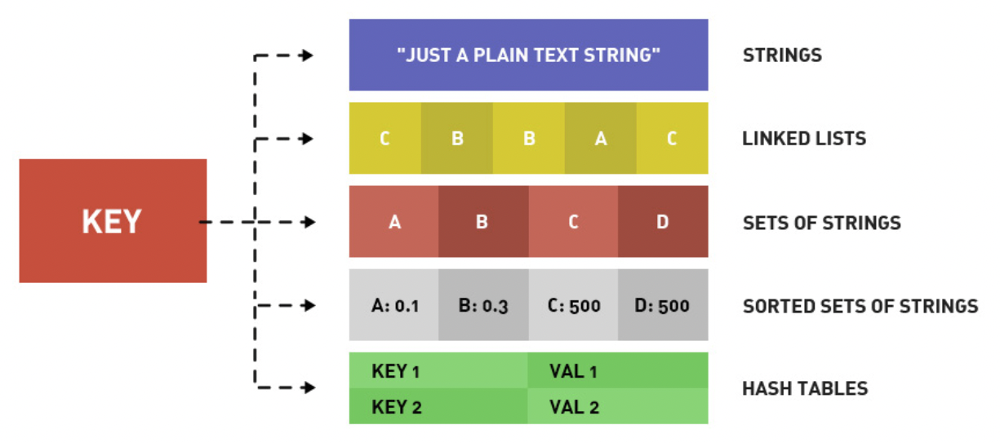
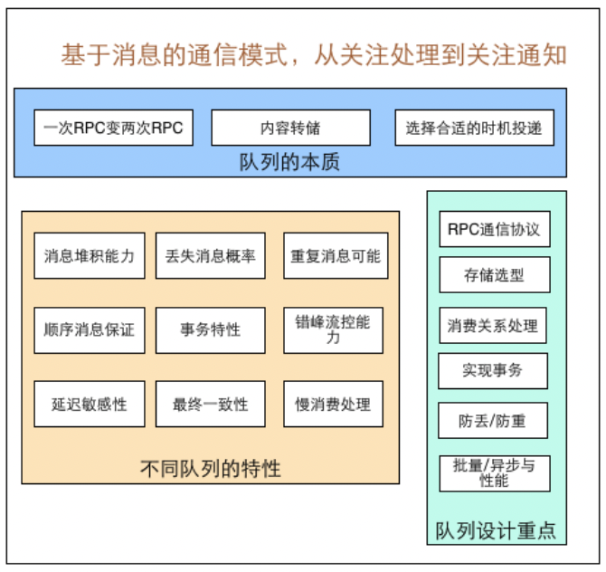
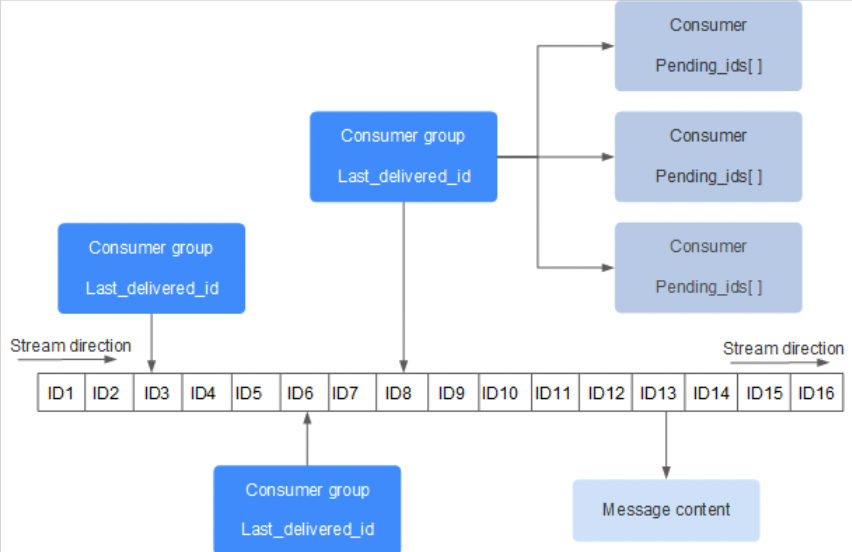
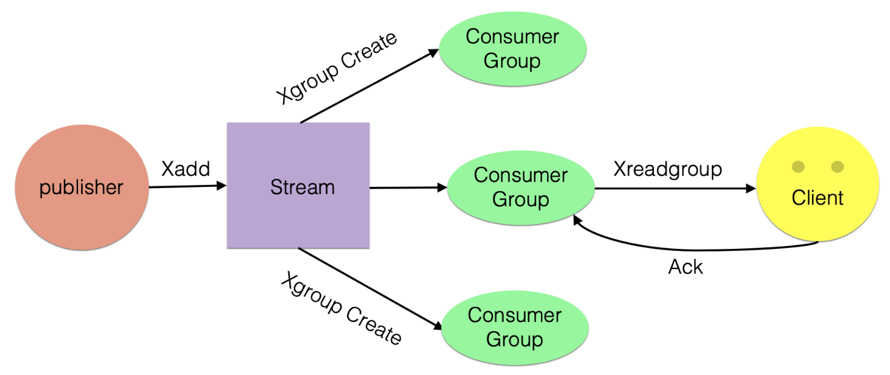
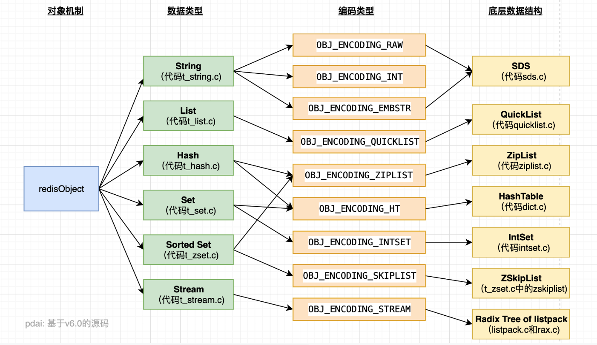

- [Introduction](#introduction)
  - [Why Redis](#why-redis)
  - [Redis Use Cases](#redis-use-cases)
- [Data Structure](#data-structure)
  - [Redis Data Types](#redis-data-types)
    - [String](#string)
    - [List](#list)
    - [Set](#set)
    - [Hash](#hash)
    - [ZSet](#zset)
    - [HyperLogLog](#hyperloglog)
    - [Bitmap](#bitmap)
    - [Geo](#geo)
  - [Stream Types(v5.0)](#stream-typesv50)
    - [Stream Structure](#stream-structure)
    - [CRUD](#crud)
    - [Single Consumer](#single-consumer)
    - [Consumer Group](#consumer-group)
  - [Redis Object](#redis-object)
    - [redisObject](#redisobject)
    - [Shared Object](#shared-object)
  - [Data Structure Implementation](#data-structure-implementation)
- [Persistence](#persistence)
  - [RDB](#rdb)
  - [AOF](#aof)
- [Pub/Sub](#pubsub)
  - [Based on Channel](#based-on-channel)
  - [Based on Pattern](#based-on-pattern)
- [Event](#event)
- [Transaction](#transaction)
  - [Standard Transaction Execution](#standard-transaction-execution)
  - [CAS Lock Implementation](#cas-lock-implementation)
- [High Availability](#high-availability)
- [Scalability](#scalability)
- [Application](#application)

# Introduction

> Redis 是一種支持 key-value 等多種資料結構的存儲系統, 可用於 cache, event publish 或 subscribe, 且支持網絡, 提供 string, hash, list, set 等資料類型, 且基於記憶體, 資料可實現持久化

全名為 **Remote Dictionary Server**, 使用 C 撰寫

## Why Redis

Redis 有以下幾種特點:
- r/w 性能優異: read 的速度可達 110k/s, write 可達 81k/s
- 資料類型豐富: 支持 binary Strings, Lists, Hashes, Sets 及 Ordered Sets 資料類型
- atomic: 所有操作都是 atomic operation, 還支持對幾個操作全併後的 atomic 執行
- 豐富的功能: 支持 publish/subscribe, notification, key expiration 等
- persistence: 支持 RDB, AOF 等持久化方式
- pub/sub
- distributed

官方 bench-mark 根據以下條件獲得測試結果(read 110k/s, write 81k/s)
- 50 parallel clients 併發執行 100k requests
- 更新讀取的值為 256 bytes string
- Linux 2.6, X3320 Xeon 2.5 ghz
- 文本執行使用 loopback interface(127.0.0.1)

## Redis Use Cases

> Cache hotspots

Cache 是 Redis 最常見的應用場景, 主要因為 r/w 性能優異且逐漸取代 memcached, 成為首選 server side cache component

且 Redis 支持 transaction, 能有效保證資料一致性

作為 cache 使用時一般有兩種方式保存資料:
- 取資料前先讀取 redis, 若無資料再讀取 database 並將資料寫進 redis
- insert data 時同時寫入 redis

第一種方式實現簡單, 但須注意:
- 避免 `cache breakdown`
- 資料實時性較差

第二種方式資料實時性強, 但開發時不便於統一處理

> Timelimit 業務應用

redis 支持 key expiration, 可以利用這一功能在限時的優惠活動訊息, 手機驗證碼等場景

> Counter 應用

redis 由於 `incrby` 指令可以實現 atomic 遞增, 可以運用於高併發秒殺活動, 分散式序列號生成, 具體業務還體現在如限制一個手機號碼發多少條簡訊, 一個 api 一分鐘限制多少 requests, 一個 api 一天限制調用幾次等

> Distributed Lock

主要利用 redis `setnx` 指令完成, `setnx(set if not exists)` 就是若不存在則成功設置緩存並返回 1, 否則返回 0

在 server cluster 中可能兩台機器上運行定時任務, 首先可以通過 `setnx` 設置一個 lock, 若成功設置則執行; 否則表明該定時任務已執行

此場景主要用在如秒殺系統等場景

> 延遲操作

比如在訂單產生後先佔用庫存, 10 分鐘後去檢查 user 是否真正購買, 若沒有購買則將此訂單設置無效並釋放庫存

由於 redis 從 2.8.0 後提供 `keyspace notifications`, 允許客戶訂閱 pub/sub channel, 以便以某種方式接收 redis 資料集的 event

上述需求可以在訂單產生時設置一個 key, 同時設置 10 分鐘過期, 並實現一個監聽器監聽 key 時效, key 失效後再做後續操作

此需求也可以利用 message queue 的延遲隊列來實現

> Ranking

Relational Database 在 ranking 方面查詢速度普遍偏慢, 可以借住 redis 的 `SortedSet` 進行熱點資料的排序

比如按讚排行榜, 可以做一個 `SortedSet`, 以 user openid 作為 username, 以 user 按讚數作為 score, 然後針對每個 user 做一個 `hash`, 通過 `zrangebyscore` 就可以按照點讚數獲取排行榜, 再根據 username 獲取 user hash 訊息

> 按讚, 好友等相互關係儲存

利用 redis 集合的一些指令, 如交集, 聯集, 差集等

在微薄應用中, 每個 user 關注的人存在一個集合中, 很容易實現找出兩人共同好友的功能

> Simple Queue

由於 redis 有 `list push` 和 `list pop` 這樣的指令, 所以能很方便的執行 queue operation

# Data Structure

> 對於 redis 來說, 所有的 key 都是 string

在討論基本資料結構時, 討論的都是儲存 value 的 data types, 主要包括常見 5 種 data type:
- String
- List
- Set
- Zset
- Hash

## Redis Data Types



| Type   | Value                                | r/w performance                                                                                                             |
| ------ | ------------------------------------ | --------------------------------------------------------------------------------------------------------------------------- |
| String | String, int, float                   | 對 String 或 String 部分操作; 對 int 或 float 進行遞增或遞減                                                                |
| List   | Linked List, 每個節點都有一個 String | 對 Linked List 頭尾 push 或 pop, 讀取單個或多個元素; 根據值查找或刪除元素                                                   |
| Set    | 包含 String 的無序集合               | String 集合, 確認是否存在新增, 讀取, 刪除; 計算交集, 聯級, 差集等                                                           |
| Hash   | 包含 key-value pair 的無序 hash table     | 新增, 讀取, 刪除單個元素                                                                                                    |
| Zset   | 包含 key-value pair 的有序 hash table     | String 成員與 float 之間的有序映射; 元素排列順序由 score 大小決定; 新增, 讀取, 刪除單個元素以及根據 score 範圍或成員來讀取元素 |

### String

> String 是 redis 中最基本的資料結構, 一個 key 對應一個 value

String 類型是 binary-safe, 即 redis 的 String 可以包含任何資料, 如數字, 字符串, jpg 圖片或者序列化物件

> Command

| Cmd    | Desc                          | Use               |
| ------ | ----------------------------- | ----------------- |
| GET    | 讀取特定 key 中的 value       | GET name          |
| SET    | 設置儲存在特定 key 中的 value | SET name value    |
| DEL    | 刪除儲存在特定 key 中的 value | DEL name          |
| INCR   | 將 key 中 value 加 1          | INCR key          |
| DECR   | 將 key 中 value 減 1          | DECR key          |
| INCRBY | 將 key 中 value 加上整數      | INCRBY key amount |
| DECRBY | 將 key 中 value 加上整數      | DECRBY key amount |

> Execution

```go
127.0.0.1:6379> set hello world
OK
127.0.0.1:6379> get hello
"world"
127.0.0.1:6379> del hello
(integer) 1
127.0.0.1:6379> get hello
(nil)
127.0.0.1:6379> set counter 2
OK
127.0.0.1:6379> get counter
"2"
127.0.0.1:6379> incr counter
(integer) 3
127.0.0.1:6379> get counter
"3"
127.0.0.1:6379> incrby counter 100
(integer) 103
127.0.0.1:6379> get counter
"103"
127.0.0.1:6379> decr counter
(integer) 102
127.0.0.1:6379> get counter
"102"
```

> Use Cases

- Cache: 將常用資料, string, 圖檔或影片等資料放到 redis 中作為 cache 以降低 db 讀寫壓力
- Counter: redis 是 single-thread model, 同時資料可以一步落地到其他 data source
- Session: session 共享

### List

> Redis 中 List 是以 double linked-list 實現

使用 List 資料結構可以輕鬆實現最新消息排隊的功能(TimeLine), 其另一個應用是 message queue, 可以利用 List push 將任務放在 List 中, 然後 worker thread 再用 pop 將任務取出執行

> Command

| Cmd    | Desc                                                                           | Use              |
| ------ | ------------------------------------------------------------------------------ | ---------------- |
| RPUSH  | 將給定 value push 至 List 右側                                                 | RPUSH key value  |
| LPUSH  | 將給定 value push 至 List 左側                                                 | LPUSH key value  |
| RPOP   | 從 List 右側 pop 出一個 value 並返回                                           | RPOP key         |
| LPOP   | 從 List 左側 pop 出一個 value 並返回                                           | LPOP key         |
| LRANGE | 讀取 List 在給定範圍內所有 value                                               | LRANGE key 0 -1  |
| LINDEX | 通過 index 讀取 List 元素; 也可以用負數下標, -1 表示 List 最後一個元素以此類推 | LINDEX key index |

> 使用 List 技巧

- LPUSH + LPOP = Stack
- LPUSH + RPOP = Queue
- LPUSH + ITRIM = Capped Collection
- LPUSH + BRPOP = Message Queue

> Execution

```go
127.0.0.1:6379> lpush mylist 1 2 ll ls mem
(integer) 5
127.0.0.1:6379> lrange mylist 0 -1
1) "mem"
2) "ls"
3) "ll"
4) "2"
5) "1"
127.0.0.1:6379> lindex mylist -1
"1"
127.0.0.1:6379> lindex mylist 10        # index不在 mylist 的区间范围内
(nil)
```

> Use Cases

- TimeLine: 發布新䩞文用 `LPUSH` 加入 timeline, 展示新的 List 訊息
- Message Queue

### Set

> Redis Set 是 String 類型的無序集合, 集合成員是唯一, 集合中不能出現重複資料

Redis Set 透過 hash table 實現, 新增, 刪除, 查詢的時間複雜度都是 O(1)

> Command

| Cmd       | Desc                                  | Use                  |
| --------- | ------------------------------------- | -------------------- |
| SADD      | 向 Set 新增一個或多個 item            | SADD key value       |
| SCARD     | 讀取 Set 成員數                       | SCARD key            |
| SMEMBERS  | 返回 Set 中所有成員                   | SMEMBERS key member  |
| SISMEMBER | 判斷 member 元素是否是 Set key 的成員 | SISMEMBER key member |

其他 set operation 參考: [https://www.runoob.com/redis/redis-sets.html](https://www.runoob.com/redis/redis-sets.html)

> Execution

```go
127.0.0.1:6379> sadd myset hao hao1 xiaohao hao
(integer) 3
127.0.0.1:6379> smembers myset
1) "xiaohao"
2) "hao1"
3) "hao"
127.0.0.1:6379> sismember myset hao
(integer) 1
```

> Use Cases
- Tag: 為 user 或 訊息新增 tag, 可以推薦同一 tag 或類似 tag 給關注的 user
- 按讚, 收藏可以以 set 實現

### Hash

> Redis hash 是一個 String 類型的 field 和 value 映射表, 適合用於儲存 object

> Command

| Cmd     | Desc                          | Use                           |
| ------- | ----------------------------- | ----------------------------- |
| HSET    | 新增 key-value pair           | HSET hash-key sub-key1 value1 |
| HGET    | 讀取指定 hash-key value       | HGET hash-key key1            |
| HGETALL | 讀取 hash 所有 key-value pair | HGETALL hash-key              |
| HDEL    | 若指定 key 存於 hash 中即移除 | HDEL hash-key sub-key1        |

> Execution

```go
127.0.0.1:6379> hset user name1 hao
(integer) 1
127.0.0.1:6379> hset user email1 hao@163.com
(integer) 1
127.0.0.1:6379> hgetall user
1) "name1"
2) "hao"
3) "email1"
4) "hao@163.com"
127.0.0.1:6379> hget user user
(nil)
127.0.0.1:6379> hget user name1
"hao"
127.0.0.1:6379> hset user name2 xiaohao
(integer) 1
127.0.0.1:6379> hset user email2 xiaohao@163.com
(integer) 1
127.0.0.1:6379> hgetall user
1) "name1"
2) "hao"
3) "email1"
4) "hao@163.com"
5) "name2"
6) "xiaohao"
7) "email2"
8) "xiaohao@163.com"
```

> Use Cases
- Cache: 相比 String 更節省空間, 更直觀

### ZSet

> Redis 有序集合, 與集合一樣也是 String 類型元素的集合, 且不允許重複成員; 不同的是每個元素都會關聯一個 double 類型的 score, redis 是透過score 來為集合成員進行排序

ZSet 成員是唯一的, 但分數(score)卻可以重複

ZSet 通過兩種資料結構實現:
- ziplist: 為了提高儲存效率而設計的一種特殊編碼的 double linked-list, 可以儲存字符串或整數, 儲存整數時是採用整數的 binary 而不是字符串形式; 能在 O(1) 的時間複雜度下完成 list 兩端的 pop 和 push, 但因為每次操作都需要重新分配 ziplist 記憶體空間, 空間複雜度較高
- zSkiplist: 其性能可以保證在查詢, 刪除, 新增等操作的時候時間複雜度為 O(log(n)) 

> Command

| Cmd    | Desc                                       | Use                            |
| ------ | ------------------------------------------ | ------------------------------ |
| ZADD   | 將一個帶有指定 score 的成員新增到 ZSet     | ZADD zset-key 178 member1      |
| ZRANGE | 根據元素在 ZSet 所處的位置從中查詢多個元素 | ZRANGE zset-key 0-1 withccores |
| ZREM   | 若指定元素成員存在於 ZSet 即移除此元素     | ZREM zset-key member1          |

更多指令參考: [https://www.runoob.com/redis/redis-sorted-sets.html](https://www.runoob.com/redis/redis-sorted-sets.html)

> Execution

```go
127.0.0.1:6379> zadd myscoreset 100 hao 90 xiaohao
(integer) 2
127.0.0.1:6379> ZRANGE myscoreset 0 -1
1) "xiaohao"
2) "hao"
127.0.0.1:6379> ZSCORE myscoreset hao
"100"
```

> Use Cases
- Ranking: Zset 適合實現各種排行榜場景

### HyperLogLog

> Redis 2.8.9 新增 Hyperloglog 資料結構

HyperLogLogs 主要功能為基數統計, 即不重複的元素, 可以在統計各種計數如註冊 IP 數量, 每日訪問 IP 數量, 在線使用者數量等過程中省去大量記憶體

例如一個大型網站每天訪問 IP 有 1M, 粗算一個 IP 消耗 15 Bytes, 1M 個 IP 即 15MB, 而 HyperLogLog 在 Redis 中每個 key 佔用的大小為 12KB, 理論存儲數量接近 2^64

不管儲存的內容為何, 其為一個基於基數估算的演算法, 只能較精準的估算出基數, 可以使用少量固定的記憶體去存儲並識別集合中唯一的元素, 但估算的基數不一定準確, 是一個帶有 0.81% 標準錯誤的近似值(對於能接受一定程度容錯的場景可忽略)

> Execution

```go
127.0.0.1:6379> pfadd key1 a b c d e f g h i	# 創建第一組元素
(integer) 1
127.0.0.1:6379> pfcount key1					# 统计元素的基数数量
(integer) 9
127.0.0.1:6379> pfadd key2 c j k l m e g a		# 创建第二组元素
(integer) 1
127.0.0.1:6379> pfcount key2
(integer) 8
127.0.0.1:6379> pfmerge key3 key1 key2			# 合并两组：key1 key2 -> key3 并集
OK
127.0.0.1:6379> pfcount key3
(integer) 13
```

### Bitmap

> 即點陣圖, 用一個 bit 來表示元素狀態, 只有 0 和 1 兩種狀態

主要用於記錄兩個狀態的元素, 如 user 活躍不活躍, 登陸未登陸等

若儲存一年的打卡狀態, 365 天 = 365 bit, 相當於使用 46 bytes 記憶體左右

> Execution

使用 bitmap 紀錄一週七天打卡狀態

```go
127.0.0.1:6379> setbit sign 0 1
(integer) 0
127.0.0.1:6379> setbit sign 1 1
(integer) 0
127.0.0.1:6379> setbit sign 2 0
(integer) 0
127.0.0.1:6379> setbit sign 3 1
(integer) 0
127.0.0.1:6379> setbit sign 4 0
(integer) 0
127.0.0.1:6379> setbit sign 5 0
(integer) 0
127.0.0.1:6379> setbit sign 6 1
(integer) 0
```

查看某一天是否有打卡

```go
127.0.0.1:6379> getbit sign 3
(integer) 1
127.0.0.1:6379> getbit sign 5
(integer) 0
```

統計打卡的天數

```go
127.0.0.1:6379> bitcount sign # 统计这周的打卡记录，就可以看到是否有全勤！
(integer) 3
```

### Geo

> Redis Geo 於 3.2 版本推出, 可以推算地理位置的資訊: 兩地之間距離, 方圓幾公里有誰等

> geoadd: 新增地理位置

```go
127.0.0.1:6379> geoadd china:city 118.76 32.04 manjing 112.55 37.86 taiyuan 123.43 41.80 shenyang
(integer) 3
127.0.0.1:6379> geoadd china:city 144.05 22.52 shengzhen 120.16 30.24 hangzhou 108.96 34.26 xian
(integer) 3
```

- 有效的精度從 -180度 -- 180度
- 有效緯度從 -85.05112878度 -- 85.05112878度

```go
// # 當座標位置超出上述範圍返回錯誤
127.0.0.1:6379> geoadd china:city 39.90 116.40 beijin
(error) ERR invalid longitude,latitude pair 39.900000,116.400000
```

> geopos: 讀取只成員的經緯度

```go
127.0.0.1:6379> geopos china:city taiyuan manjing
1) 1) "112.54999905824661255"
   1) "37.86000073876942196"
2) 1) "118.75999957323074341"
   1) "32.03999960287850968"
```

> geodist: 若不存在返回空

```go
127.0.0.1:6379> geodist china:city taiyuan shenyang m
"1026439.1070"
127.0.0.1:6379> geodist china:city taiyuan shenyang km
"1026.4391"
```

> georadius: 查詢附近的位置, 通過半徑查詢

```go
127.0.0.1:6379> georadius china:city 110 30 1000 km			以 100,30 座標為中心尋找半徑為 1000km 的城市
1) "xian"
2) "hangzhou"
3) "manjing"
4) "taiyuan"
127.0.0.1:6379> georadius china:city 110 30 500 km
1) "xian"
127.0.0.1:6379> georadius china:city 110 30 500 km withdist
1) 1) "xian"
   2) "483.8340"
127.0.0.1:6379> georadius china:city 110 30 1000 km withcoord withdist count 2
1) 1) "xian"
   2) "483.8340"
   3) 1) "108.96000176668167114"
      2) "34.25999964418929977"
2) 1) "manjing"
   2) "864.9816"
   3) 1) "118.75999957323074341"
      2) "32.03999960287850968"
```

> georadiusbymember: 顯示與指定成員一定的半徑範圍內的其他成員

```go
127.0.0.1:6379> georadiusbymember china:city taiyuan 1000 km
1) "manjing"
2) "taiyuan"
3) "xian"
127.0.0.1:6379> georadiusbymember china:city taiyuan 1000 km withcoord withdist count 2
1) 1) "taiyuan"
   2) "0.0000"
   3) 1) "112.54999905824661255"
      2) "37.86000073876942196"
2) 1) "xian"
   2) "514.2264"
   3) 1) "108.96000176668167114"
      2) "34.25999964418929977"
```

> Geo 底層實現原理就是 Zset, 因此可以通過 ZSet 指令來操作 Geo

```go
127.0.0.1:6379> type china:city
zset
127.0.0.1:6379> zrange china:city 0 -1 withscores
 1) "xian"
 2) "4040115445396757"
 3) "hangzhou"
 4) "4054133997236782"
 5) "manjing"
 6) "4066006694128997"
 7) "taiyuan"
 8) "4068216047500484"
 9) "shenyang"
1)  "4072519231994779"
2)  "shengzhen"
3)  "4154606886655324"
127.0.0.1:6379> zrem china:city manjing
(integer) 1
127.0.0.1:6379> zrange china:city 0 -1
1) "xian"
2) "hangzhou"
3) "taiyuan"
4) "shenyang"
5) "shengzhen"
```

## Stream Types(v5.0)

> Redis 5.0 中新增加了一個資料類型 Stream, 其借鑒了 Kafka 的設計, 是一個新的支持 multicast 的可持久化 message queue

基於 Redis message queue 實現有很多種:
- pub/sub: 無法持久化, 若出現網路斷線, redis 崩潰訊息就會被丟棄
- 基於 List LPUSH + BRPOP 或 Sorted-Set 實現: 支持持久化但不支持 multicast 及 consumer group

設計一個良好的 MQ 需要考慮什麼?
- 訊息生產
- 訊息消費
  - singlecast
  - multicast
- 訊息有序性
- 訊息持久性

參考自美團技術團隊文章[消息隊列設計精要](https://tech.meituan.com/2016/07/01/mq-design.html)


Redis Stream 設計特點:
- 訊息 ID 序列化生成
- 訊息遍歷
- 訊息 blocking read 和 non-blocking read
- 訊息支持 consumer group
- 未完成訊息處理
- MQ 監控
- ...

> Redis Stream 是一種超輕量 MQ, 並無完全實現 MQ 所有所有設計要點, 決定其適用場景

### Stream Structure

每個 Stream 都有一個唯一的名稱, 其就是 redis key, 在首次使用 `XADD` 指令追加訊息時自動創建



- `Consumer Group`: 由 `XGROUP CREATE` 指令創建, 一個 `Consumer Group` 中有多個 `Consumer`, 其之間為競爭關係
- `last_delivered_id`: 每個 `Consumer Group` 會有個 `last_delivered_id`, 任意一個 `Consumer` 讀取了訊息都會使 `last_delivered_id` 往前移動
- `pending_ids`: `Consumer` 狀態變數, 作用是維護 `Consumer` 未確認的id, 其紀錄了當前被 client 讀取的訊息, 但還沒有 `ACK`, 又被稱為 `PFL(Pending Entries List)`用來確保 client 至少消費了訊息一次, 而不會在網路傳輸中被丟棄未處理

此外還需理解兩點:
- message ID: 形式為 timestampInMillis-sequence, 例如1527846880572-5, 表示當前訊息在毫秒時間戳 1527846880572 時產生, 且是該毫秒內產生的第 5 條訊息; message ID 可由 server 自動生成或由 client 指定, 但形式必須是 int-int, 且後面加入的訊息 ID 必須大於前面的訊息 ID
- message content: 訊息內容就是 key-value pair, 如同 hash 結構的 key-value pair

### CRUD

- `XADD`: 新增訊息到末端
- `XTRIM`: 修剪並限制 Stream 長度
- `XDEL`: 刪除訊息
- `XLEN`: 讀取 Stream 包含的元素數量, 即訊息長度
- `XRANGE`: 讀取訊息列表, 會自動過濾已刪除的訊息
- `XREVRANGE`: 反向讀取訊息列表, ID 從大到小
- `XREAD`: 以 blocking 或 non-blocking 方式讀取訊息列表

```go
# *表示 server 自動生成 ID，後面順序跟著一堆 key/value
127.0.0.1:6379> xadd codehole * name laoqian age 30  #  名字叫laoqian，年齡30岁
1527849609889-0  # 生成的訊息ID
127.0.0.1:6379> xadd codehole * name xiaoyu age 29
1527849629172-0
127.0.0.1:6379> xadd codehole * name xiaoqian age 1
1527849637634-0
127.0.0.1:6379> xlen codehole
(integer) 3
127.0.0.1:6379> xrange codehole - +  # -表示最小值, +表示最大值
127.0.0.1:6379> xrange codehole - +
1) 1) 1527849609889-0
   1) 1) "name"
      1) "laoqian"
      2) "age"
      3) "30"
2) 1) 1527849629172-0
   1) 1) "name"
      1) "xiaoyu"
      2) "age"
      3) "29"
3) 1) 1527849637634-0
   1) 1) "name"
      1) "xiaoqian"
      2) "age"
      3) "1"
127.0.0.1:6379> xrange codehole 1527849629172-0 +  # 指定最小訊息ID的列表
1) 1) 1527849629172-0
   2) 1) "name"
      2) "xiaoyu"
      3) "age"
      4) "29"
2) 1) 1527849637634-0
   2) 1) "name"
      2) "xiaoqian"
      3) "age"
      4) "1"
127.0.0.1:6379> xrange codehole - 1527849629172-0  # 指定最大訊息ID的列表
1) 1) 1527849609889-0
   2) 1) "name"
      2) "laoqian"
      3) "age"
      4) "30"
2) 1) 1527849629172-0
   2) 1) "name"
      2) "xiaoyu"
      3) "age"
      4) "29"
127.0.0.1:6379> xdel codehole 1527849609889-0
(integer) 1
127.0.0.1:6379> xlen codehole  # 長度不受影響
(integer) 3
127.0.0.1:6379> xrange codehole - +  # 被刪除的訊息消失
1) 1) 1527849629172-0
   2) 1) "name"
      2) "xiaoyu"
      3) "age"
      4) "29"
2) 1) 1527849637634-0
   2) 1) "name"
      2) "xiaoqian"
      3) "age"
      4) "1"
127.0.0.1:6379> del codehole  # 刪除整个Stream
(integer) 1
```

### Single Consumer

可以在不定義 consumer group 時進行 Stream 訊息的獨立消費, 當 Stream 沒有新訊息時甚至可以 blocking wait

Redis 設計了一個單獨的消費指令 `XREAD`, 可以將 Stream 當成普通的訊息對列(list)使用, 使用時可以完全忽略 consumer group 的存在

```go
# 從 Stream 頭部讀取兩個訊息
127.0.0.1:6379> xread count 2 streams codehole 0-0
1) 1) "codehole"
   2) 1) 1) 1527851486781-0
         2) 1) "name"
            2) "laoqian"
            3) "age"
            4) "30"
      2) 1) 1527851493405-0
         2) 1) "name"
            2) "yurui"
            3) "age"
            4) "29"
# 從 Stream 尾部讀取一條訊息, 這裡不會返回任何訊息
127.0.0.1:6379> xread count 1 streams codehole $
(nil)
# 從尾部 blocking 等待新訊息, 下面的指令阻塞直到新訊息到來
127.0.0.1:6379> xread block 0 count 1 streams codehole $
# 重新打開一個窗口, 從這個窗口往 Stream 塞訊息
127.0.0.1:6379> xadd codehole * name youming age 60
1527852774092-0
# 切換到前面窗口發現阻塞解除, 返回新的訊息內容
# 並顯示一個等待時間, 這裡等待了 93s
127.0.0.1:6379> xread block 0 count 1 streams codehole $
1) 1) "codehole"
   2) 1) 1) 1527852774092-0
         2) 1) "name"
            2) "youming"
            3) "age"
            4) "60"
(93.11s)
```

Client 若想使用 `XREAD` 進行順序消費, 一定要返回訊息 ID, 下次繼續調用 `XREAD` 時將上次返回的最後一個訊息 ID 作為參數傳遞進去就可以繼續消費後續訊息

block 0 表示永遠 blocking 直到訊息到來, block 1000 表示 blocking 1s, 1s 內沒有訊息來則返回 nil

```go
127.0.0.1:6379> xread block 1000 count 1 streams codehole $
(nil)
(1.07s)
```

### Consumer Group



## Redis Object




### redisObject

### Shared Object

## Data Structure Implementation

# Persistence

## RDB

## AOF

# Pub/Sub

## Based on Channel

## Based on Pattern

# Event

# Transaction

## Standard Transaction Execution

## CAS Lock Implementation

# High Availability
# Scalability
# Application
