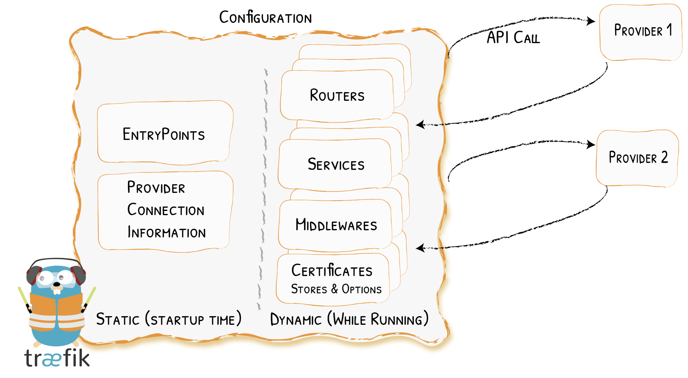
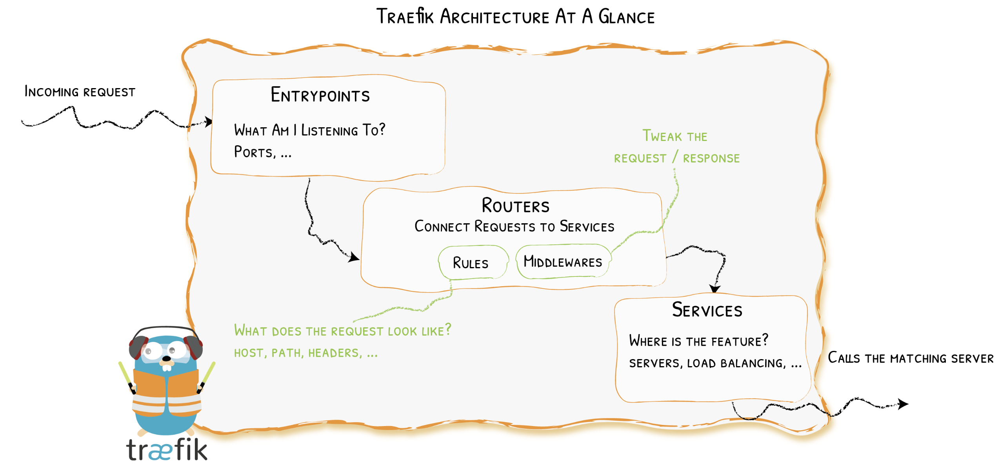
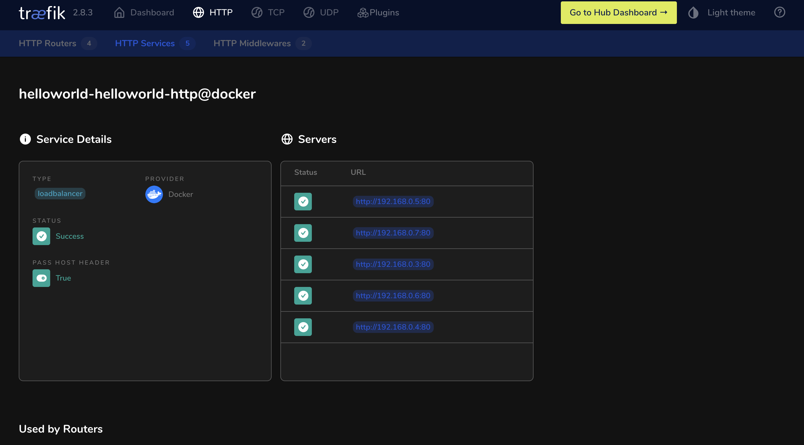

# What is API Gateway?

API gateway 是一個 server, 封裝了系統的內部架構並為每個 client 提供一個訂製的 API

其可能具有其他職責, 如 `authentication`, `authorization`, `monitor`, `load balance`, `cache`, `protocol converter`, `rate limit`, `circuit break`, `static response handle` 等等

API gateway 核心價值為讓所有的 client or consumer 都透過統一的 gateway 接入 microservices, 在 gateway layer 處理所有的非業務邏輯功能, 通常提供 `REST/HTTP` API

# Traefik

`Træfɪk` 是一個為了使微服務部署更加簡易便捷而誕生的現代化 HTTP reverse proxy, load balance 的工具

其支援多種平台如 `Kubernetes` 或 `Swarm`, 也支援多種 service registry 如 `etcd` 或 `consul`, 且能自動化套用動態配置

其具有以下特點:
- Continuously updates its configuration (No restarts!)
- Supports multiple load balancing algorithms
- Provides HTTPS to your microservices by leveraging Let's Encrypt (wildcard certificates support)
- Circuit breakers, retry
- See the magic through its clean web UI
- Websocket, HTTP/2, GRPC ready
- Provides metrics (Rest, Prometheus, Datadog, Statsd, InfluxDB)
- Keeps access logs (JSON, CLF)
- Fast
- Exposes a Rest API
- Packaged as a single binary file (made with ❤️ with go) and available as an official docker image

# Quick Start

> Based on traefik:2.8

這裡使用 `traefik:v2.8` 作為 image 啟動 `traefik`, `docker-compose.yaml` 配置如下:

```yaml
version: '3'

services:
  traefik:
    image: traefik:v2.2
    command: --api.insecure=true --providers.docker
    ports:
      - "80:80"
      - "8080:8080"
    volumes:
      - /var/run/docker.sock:/var/run/docker.sock
```

透過 command `docker-compose up -d` 啟動 `traefik` service, reverse porxy 即部署成功

再來透過 `docker-compose` 利用 `whoami` image 啟一個簡單的 HTTP server, `docker-compose.yaml` 配置如下:

```yaml
version: '3'

services:
  whoami:
    image: "traefik/whoami"
    labels:
      - "traefik.enable=true"
      - "traefik.http.routers.whoami.rule=Host(`whoami.localhost`)"
      - "traefik.http.routers.whoami.entrypoints=web"

networks:
  default:
    external:
      name: gateway_default

```

>❗️ 需注意已存在的 traefik network 名稱是否正確, 若不正確會無法正常進行 proxy

`whoami` 這個 HTTP server 主完成了以下幾件事:
- expose HTTP service, 並提供一些 `header` 及 `ip` 資訊
- 配置 container `labels`, 設置此 service 的 `Host` 為 `whoami.localhost` 為 `traefik` 提供標記

此時可以透過 Host `whoami.localhost` 來訪問 `whoami` service, 下面使用 `curl` 來做測試:

```sh
➜  Go git:(main) ✗ curl -H Host:whoami.localhost http://127.0.0.1
Hostname: 2d84bbee39b8
IP: 127.0.0.1
IP: 192.168.0.8
RemoteAddr: 192.168.0.2:50732
GET / HTTP/1.1
Host: whoami.localhost
User-Agent: curl/7.77.0
Accept: */*
Accept-Encoding: gzip
X-Forwarded-For: 192.168.0.1
X-Forwarded-Host: whoami.localhost
X-Forwarded-Port: 80
X-Forwarded-Proto: http
X-Forwarded-Server: d99d49394bfc
X-Real-Ip: 192.168.0.1
```

service 可以正常訪問, 此時若將 `Host` 配置為自己的 domain name, 也可以直接使用 domain 來進行訪問

# Configuration



`traefik` 透過一個配置檔案來管理 routers, services, certificates 等, 可以通過 `docker` 啟動 `traefik` 時來掛載檔案, `docker-compose.yaml` 初始檔案如下:

```yaml
version: '3'

services:
  traefik:
    image: traefik:v2.2
    ports:
      - "80:80"
      - "8080:8080"
    volumes:
      - ./traefik.toml:/etc/traefik/traefik.yml
      - /var/run/docker.sock:/var/run/docker.sock
```

其中 `traefik.yml` 通過掛載檔案的方式作為 `traefik` 基本配置文件, 基本配置文件可以通過 [traefik.sample.yml](https://github.com/traefik/traefik/blob/master/traefik.sample.yml) 取得

一個簡單的完整配置文件如下:

```yml
global:
  checkNewVersion: true
  sendAnonymousUsage: true
entryPoints:
  web:
    address: :80
  websecure:
    address: :443
log:
  level: DEBUG
  filePath: ./traefik.log
  format: json
accessLog:
  filePath: ./traefik_access.json
  format: json
api:
  insecure: true
  dashboard: true
providers:
  docker:
    defaultRule: Host(`{{ normalize .Name }}.docker.localhost`)
    exposedByDefault: false
```

# Routing & Load Balancing



- [Providers](https://doc.traefik.io/traefik/providers/overview/) discover the services that live on your infrastructure (their IP, health, ...)
- [Entrypoints](https://doc.traefik.io/traefik/routing/entrypoints/) listen for incoming traffic (ports, ...)
- [Routers](https://doc.traefik.io/traefik/routing/routers/) analyse the requests (host, path, headers, SSL, ...)
- [Services](https://doc.traefik.io/traefik/routing/services/) forward the request to your services (load balancing, ...)
- [Middlewares](https://doc.traefik.io/traefik/middlewares/overview/) may update the request or make decisions based on the request (authentication, rate limiting, headers, ...)

這裡使用 `Docker` 作為 `Provider`, 而 `Router` 和 `Service` 可以通過 `container labels` 來進行配置

通過 `traefik.http.routers.<container-name>.rule` 來配置路由規則, 類似 `nginx` 中的 `location`:

```yml
labels:
  - "traefik.http.routers.blog.rule=Host(`traefik.io`) || (Host(`containo.us`) && Path(`/traefik`))"
```

# Load Balance

對 `docker provider` 進行 load balance 只需執行 `docker-compose scale container_name=5` 即可:

```sh
➜  helloworld-http git:(main) ✗ docker-compose scale helloworld=5
WARNING: The scale command is deprecated. Use the up command with the --scale flag instead.
Creating helloworld-http_helloworld_3 ... done
Creating helloworld-http_helloworld_4 ... done
Creating helloworld-http_helloworld_5 ... done
```

在 `traefik dashboard` 中查看該 service 時可以發現已經 load balance 到五個 container 上了:

