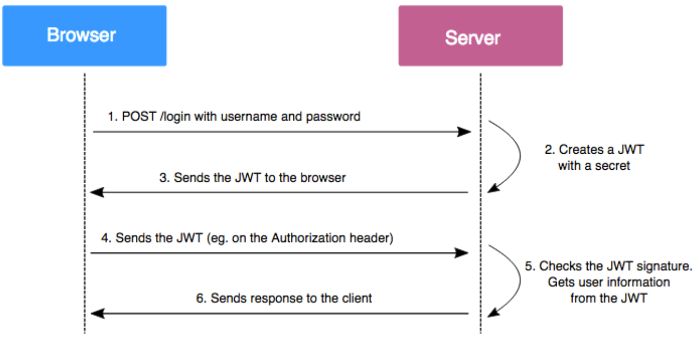

- [JWT Framework](#jwt-framework)
  - [JWS](#jws)
    - [JWS Compact](#jws-compact)
    - [JWS JSON Flattened](#jws-json-flattened)
  - [JWE](#jwe)
    - [JWE Serialization](#jwe-serialization)
  - [JWK](#jwk)
  - [JWT](#jwt)
  - [Implement With Gin](#implement-with-gin)
    - [User Claiim](#user-claiim)
    - [Generate Token](#generate-token)

# JWT Framework

`JWT(JSON Web Token)` 是一個非常輕巧的規範, 其允許使用者使用 `JWT` 在 client 及 server 之間傳遞安全可靠的資訊, 利用 `HTTP` 通訊過程中進行身份認證

在以下場景中非常適合使用 `JWT`:
- Authorization: 其為使用 `JWT` 最頻繁的場景, 一旦使用者登錄, 後續每個請求都將包含 `JWT`, 允許使用者訪問該 token 允許的 routes, services 及 resources, `SSO` 是現在廣泛使用 `JWT` 的一個應用, 因其輕量且可輕鬆跨域使用
- Information Exchange: 對於點對點之間安全的傳輸訊息而言, `JWT` 是一種很好的方式, 因其可以被簽名, 可以正確驗證訊息發送者資訊及訊息內容是否被篡改

與 `JWT` 相關的協議數量較多, 但也較為簡單:

- [JWS(JSON Web Signature)](https://www.rfc-editor.org/rfc/pdfrfc/rfc7515.txt.pdf): 表示基於 JSON 的資料結構, 並對內容進行數字簽名或 MAC
- [JWE(JSON Web Encryption)](https://www.rfc-editor.org/rfc/pdfrfc/rfc7516.txt.pdf): 類似 JWS, 但為加密而並未簽名
- [JWK(JSON Web Key)](https://www.rfc-editor.org/rfc/pdfrfc/rfc7517.txt.pdf): 以 JSON 形式表示一個加密 key
- [JWA(JSON Web Algorithms)](https://www.rfc-editor.org/rfc/pdfrfc/rfc7518.txt.pdf): 表示上述簽名或加密支援的演算法
- [JWT(JSON Web Token)](https://www.rfc-editor.org/rfc/pdfrfc/rfc7519.txt.pdf): 使用 JSON 形式表示的 token, 可以採用 JWS 或 JWE 進行簽名與加密
- JOSE(JSON Object Signature and Encryption): 即對上述 JWS 和 JWE 的統稱, 標準中常提到 JOSE Header, 代表的即為 JWS 的 Header 或 JWE 的 Header

## JWS

`JWS` 主要包含三部分:

- JOSE Header: 即一些 key-value pair
  - typ: type, 即整個 JWS 代表的類型, 典型值為 JWT
  - alg: algorithm, 當前 JWS 簽名或加密採用的演算法, 須於 JWA 中規範才能使用
  - jku: JWK Set URL: 存放公鑰的地址, 必須遵守 JWK 規範
  - jwk: JSON Web Key, 用於簽名的私鑰, 以 JSON 形式發放
  - kid: key id, 即 私鑰 id, JWK 可能返回多個密碼, kid 精確指定
  - x5: X.509 憑證相關
  - 其他
- JWS Payload: 即正文內容
- JWS Signature: 簽名方式如下:
  - 待簽名內容: `ASCII(BASE64URL(UTF8(JWS Protected Header)) || ’.’ || BASE64URL(JWS Payload))`
  - 簽名演算法: JOSE Header 中 `alg` field 指定

有兩種序列化格式如下:

### JWS Compact

最常見的序列化方式, 最終輸出由三個部分組成的字串, 由 `Base64 Url Safe` 編碼並以 `.` 作區隔

Example:

```
BASE64URL(UTF8(JWS Protected Header)) || '.' ||
BASE64URL(JWS Payload) || '.' ||
BASE64URL(JWS Signature)
```

output:

```
eyJhbGciOiJFUzUxMiJ9.UGF5bG9hZA.AdwMgeerwtHoh-l192l60hp9wAHZFVJbLfD_UxMi70cwnZOYaRI1bKPWROc-mZZqwqT2SI-KGDKB34XO0aw_7XdtAG8GaSwFKdCAPZgoXD2YBJZCPEX3xKpRwcdOO8KpEHwJjyqOgzDO7iKvU8vcnwNrmxYbSW9ERBXukOXolLzeO_Jn
```

### JWS JSON Flattened

當需要使用未受保護的 header 時使用, 其為一個簡單的 JSON Object, 此種格式並不常使用, 了解即可:

```json
{
  "payload": "SW4gb3VyIHZpbGxhZ2UsIGZvbGtzIHNheSBHb2QgY3J1bWJsZXMgdXAgdGhlIG9sZCBtb29uIGludG8gc3RhcnMu",
  "protected": "eyJhbGciOiJFUzI1NiJ9",
  "header": {
    "kid": "myEcKey"
  },
  "signature": "b7V2UpDPytr-kMnM_YjiQ3E0J2ucOI9LYA7mt57vccrK1rb84j9areqgQcJwOA00aWGoz4hf6sMTBfobdcJEGg"
}
```

>❗️ 不受保護的 header 意即未簽名的 header, 在完整性上不受保護, `alg` 值可以為 `none`, 此時 JWS 為不安全的

## JWE

JWS 為對內容進行簽名, JWE 則是對內容進行加密

JWE 主要由以下部分組成:

- JOSE Header
- JWE Encrypted Key: 加密私鑰
- JWE Initialization Vector: 初始向量
- JWE Additional Authenticated Data value: 額外認證資料
- JWE Ciphertext: 加密後密文
- JWE Authentication Tag: 認證標籤

### JWE Serialization

與 JWS 相同, 也有 `Compact` 及 `Flattened` 兩種序列化方式, 這裡主要介紹 `Compact` 的方式

`JWE Compact` 為最常見的 JWE 序列化方式, 最終輸出由五個部分組成的字串, 由 `Base64 Url Safe` 編碼並以 `.` 作區隔

```
BASE64URL(UTF8(JWE Protected Header)) || '.' ||
BASE64URL(JWE Encrypted Key) || '.' ||
BASE64URL(JWE Initialization Vector) || '.' ||
BASE64URL(JWE Ciphertext) || '.' ||
BASE64URL(JWE Authentication Tag)
```

## JWK

JWK 對 JWS 和 JWE 中使用到的私鑰的提供方式加以規範, 稱作 `JSON Web Key`, 以 JSON 形式將私鑰各項參數定義, 具體有哪些參數由該私鑰的種類而定, 如:

```json
{"jwk":
  [
    {"alg":"EC",
     "crv":"P-256",
     "x":"MKBCTNIcKUSDii11ySs3526iDZ8AiTo7Tu6KPAqv7D4",
     "y":"4Etl6SRW2YiLUrN5vfvVHuhp7x8PxltmWWlbbM4IFyM",
     "use":"enc",
     "kid":"1"},

    {"alg":"RSA",
     "mod": "0vx7agoebGcQSuuPiLJXZptN9nndrQmbXEps2aiAFbWhM78LhWx
4cbbfAAtVT86zwu1RK7aPFFxuhDR1L6tSoc_BJECPebWKRXjBZCiFV4n3oknjhMs
tn64tZ_2W-5JsGY4Hc5n9yBXArwl93lqt7_RN5w6Cf0h4QyQ5v-65YGjQR0_FDW2
QvzqY368QQMicAtaSqzs8KJZgnYb9c7d0zgdAZHzu6qMQvRL5hajrn1n91CbOpbI
SD08qNLyrdkt-bFTWhAI4vMQFh6WeZu0fM4lFd2NcRwr3XPksINHaQ-G_xBniIqb
w0Ls1jF44-csFCur-kEgU8awapJzKnqDKgw",
     "exp":"AQAB",
     "kid":"2011-04-29"}
  ]
}
```

JWK 也可以為一個 array, 此時稱作 JWKs, 提供一組私鑰, 並通過 `kid` 指定

對於 JWK 需要關注其能包含哪些參數, 共有兩類:
- 通用參數
  - kty: Key Type, 斯要類型, 如 `RSA`, `EC` 等
    - use: Public Key Use, 說明公鑰用途
    - sig: 用於簽名
    - enc: 用於加密
  - key_ops: Key Operations, 說明私鑰用途
    - sign
    - verify
    - encrypt
    - decrypt
    - wrapKey
    - unWrapKey
    - deriveKey
    - deriveBits
  - alg: 私鑰將被用於何種演算法
  - kid: 私鑰 id
  - x5xxx: X.509 相關
- 演算法相關參數

## JWT

`JWS` 用於對指定 payload 進行簽名, `JWE` 用於對普通文本進行加密, 而 `JWT` 則是基於二者:

- JWT 主體內容為 `Claim`, 其為 JSON 形式的 key-value pair
- JWT 在網絡中傳輸時需要被 JWS 簽名或是被 JWE 加密, 且使用 `Compact` 的序列化方式

`Claim` 主要包含以下內容:

- iss: JWT 發布者
- sub: JWT 主體, 在發布者系統內唯一
- aud: JWT 目的接收者, 接受此 JWT 的目的端必須驗證此值, 若與預期不符則拒絕此 JWT
- exp: 過期時間, 時間類型
- nbf: Not Before, 必須在規定生效時間之後才能處理
- iat: issue at, JWT 簽發時間
- jti: JWT ID, 為 JWT 提供 uuid, 用於防止 JWT replay

協議規範允許自定義 field, 只要 JWT 收發雙方達成一致即可

>❗️ JWT 在協議上只規範了能夠聲明的內容, 而最終呈現形式是由 JWS 協議提供

常規的 JWT 認證流程如下圖:



相較於 `session` 的方式, JWT 節省了 server 儲存使用者資訊的過程

> Server 不需保存 token, 只需對 token 中攜帶的資訊進行驗證即可; 無論 Client 訪問 Server 中的哪台機器, 只需通過使用者資訊驗證即可

## Implement With Gin

在 Go 中可以透過 [golang-jwt](https://github.com/golang-jwt/jwt) package 提供的一些編碼及驗證的工具輕鬆的實現 JWT authentication

另外 `Gin` 也支援 user-defined middleware, 因此可以很好的將 JWT 相關邏輯封裝於 middleware 中, 並對具體的 interface 進行認證

首先需安裝 `golang-jwt`:

```golang
go get -u github.com/golang-jwt/jwt/v4
```

### User Claiim

```golang
type UserClaim struct {
	jwt.RegisteredClaims
	User
}
```

自定義一個 `UserClaim`, 除了 `golang-jwt` 中原本的 `RegisteredClaims` 之外還另外儲存了 `User` 資訊

### Generate Token

以下函式主要用於產生認證用的 JWT:

```golang
func GenerateUserToken(user User, signingKey []byte, expiryDuration time.Duration, issuer string) (string, common.Error) {
	claim := &UserClaim{
		jwt.RegisteredClaims{
			ExpiresAt: &jwt.NumericDate{Time: time.Now().Add(expiryDuration)},
			Issuer:    issuer,
			IssuedAt:  &jwt.NumericDate{Time: time.Now()},
		},
		user,
	}

	// Generate Signed JWT token
	token := jwt.NewWithClaims(jwt.SigningMethodHS256, claim)
	signedToken, err := token.SignedString(signingKey)
	if err != nil {
		return "", common.NewError(common.ErrorCodeInternalProcess, err, common.WithMsg("failed to generate token"))
	}

	return signedToken, nil
}
```

- 將 `Claim` 使用 `HS256` algo 進行加密
- 最後對 token 進行簽名並返回