- [Git](#git)
- [Installation](#installation)
- [Create Repository](#create-repository)
  - [[git init]](#git-init)
  - [[git status]](#git-status)
  - [[git add]](#git-add)
  - [[git commit]](#git-commit)
- [Working Directory, Staging Area & Repository](#working-directory-staging-area--repository)
  - [Working Directory](#working-directory)
  - [Staging Area](#staging-area)
  - [Repository](#repository)
- [Version Control](#version-control)
  - [[git log]](#git-log)
  - [[git diff]](#git-diff)
  - [[git reset]](#git-reset)
  - [[git reflog]](#git-reflog)
- [Undoing Changes](#undoing-changes)
- [Branch Management](#branch-management)
  - [Create & Merge Branch](#create--merge-branch)
    - [[git branch]](#git-branch)
    - [[git checkout]](#git-checkout)
    - [[git merge]](#git-merge)
    - [[git switch]](#git-switch)
  - [Merge Conflict](#merge-conflict)
  - [Branch Strategy](#branch-strategy)
  - [Bug Branch](#bug-branch)
    - [[git stash]](#git-stash)
    - [[git cherry-pick]](#git-cherry-pick)
  - [Rebase](#rebase)
    - [[git rebase]](#git-rebase)
- [Remote Repository](#remote-repository)
  - [Adding Remote Repositories](#adding-remote-repositories)
    - [[git remote]](#git-remote)
    - [[git push]](#git-push)
- [Working Tree](#working-tree)
  - [[git worktree]](#git-worktree)

# Git

為了更方便地管理 Linux 程式碼, Linus 花了兩週自己用 C 開發了一套分散式版本控制系統, 即現在大家熟知的 Git

Linus 因為痛恨集中式的版本控制系統, 因此一直不願意使用 CVS 或 SVN 等工具

集中式的版本控制系統 codebase 是儲存在中央 server, 在做版控時要先從中央 server 取得最新的版本, 修改完程式碼再推送回去

集中式版控必須要透過網絡才能運作, 而分散式版控則沒有中央 server, 每個人 local 端都有一個完整的 codebase, 多人協同時只需要把各自的修改互相推送給對方即可看到對方的修改

# Installation

# Create Repository

Repository 中所有的文件都可以被 Git 管理, 舉凡每個文件的修改, 刪除都能被 Git 追蹤, 以便查看 codebase 歷史紀錄或是還原到某個時間點

## [git init]

以下範例創建一個 repo:

```shell
➜  mkdir learngit
➜  cd learngit
➜  pwd
/Users/regy/learngit
➜  learngit git init                                
hint: Using 'master' as the name for the initial branch. This default branch name
hint: is subject to change. To configure the initial branch name to use in all
hint: of your new repositories, which will suppress this warning, call:
hint:  
hint:   git config --global init.defaultBranch <name>
hint: 
hint: Names commonly chosen instead of 'master' are 'main', 'trunk' and
hint: 'development'. The just-created branch can be renamed via this command:
hint: 
hint:   git branch -m <name>
Initialized empty Git repository in /Users/regy/Github/test/learngit/.git/
```

如此一來一個空的 repo 就建好了, 目錄下產生了一個 `.git` 目錄, 其為 Git 用來跟蹤管理 repo, 不要隨意動到其中的文件, 以免破壞了 git repo

所有的版控系統只能追蹤文本文件的改動, 如 `.txt`, 程式碼等, 其會紀錄並顯示每次的文本改動, 如在第 5 行新增了一個單字 **Linux**, 在第 8 行刪除了一個單字 **mfer**, 針對 binary file 就無法追蹤其變化

> 建議使用標準的 `UTF-8` 編碼

下面示範如何將文件新增到版控系統中:

README.md

```md
Git is a version control system.
Git is free software.
```

首先將 `README.md` 放到 `learngit` 目錄下, 代表由此 git repo 來作管理

## [git status]

使用 `git status` 查看當前 git repo 的狀態:

```shell
➜  learngit git:(master) ✗ git status
On branch master

No commits yet

Untracked files:
  (use "git add <file>..." to include in what will be committed)
        README.md

nothing added to commit but untracked files present (use "git add" to track)
```

## [git add]

此時 `README.md` 雖然被 Git 偵測到, 但目前屬於 `Untracked files`, 表示尚未是 Git 追蹤的對象, 需要使用 `git add` 將文件新增到 git stagin area 中才能將 `README.md` 加入到追蹤對象:

```shell
➜  learngit git:(master) ✗ git add README.md
```

再使用 `git status` 查看會發現此時狀態會從 `Untracked files` 變成 `Changes to be committed`, 表示放在索引中的文件即將會被提交成一個新版本(commit)

```shell
➜  learngit git:(master) ✗ git status       
On branch master

No commits yet

Changes to be committed:
  (use "git rm --cached <file>..." to unstage)
        new file:   README.md
```

## [git commit]

此時可以用 `git commit` 提交一個新版本到 git repo:

```shell
➜  learngit git:(master) ✗ git commit -m 'first commit'                 
[master (root-commit) cbb0c14] first commit
 1 file changed, 2 insertions(+)
 create mode 100644 README.md
```

最後使用 `git status` 可以看到以下訊息:

```shell
➜  learngit git:(master) git status                   
On branch master
nothing to commit, working tree clean
```

表示已將 `README.md` 提交成一個 commit, 所以目前工作目錄上已經清空了

# Working Directory, Staging Area & Repository

在 Git 中主要可以分為 `Working Directory`, `Staging Area` 和 `Repository` 三個區塊, 前面提到使用 `git add` 指令將檔案新增進 `Staging Area`(or index), 再使用 `git commit` 將 `Staging Area` 中的內容一次性移往 `Repository`

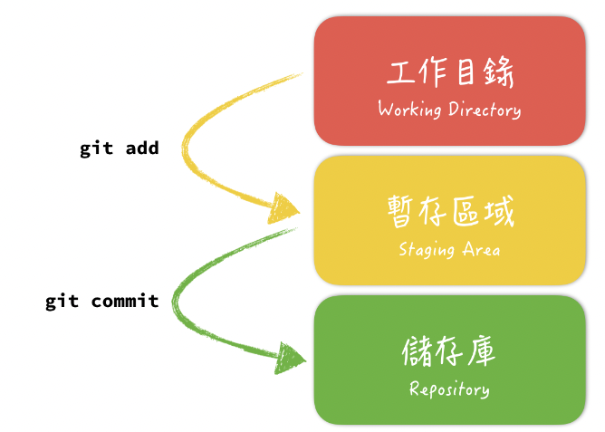

## Working Directory

> git status: `Untracked files`, `Changes not staged for commit`

`Working Deirectory` 即是我們在系統中看到的目錄, 比如 `/Users/regy/Github/test/learngit` 文件夾就是一個 `Working Directory`

## Staging Area

> git status: `Changes to be committed`, `new file`

又常被稱作 `index`, `Staging Area` 紀錄有哪些檔案即將要被提交到下一個 commit 版本中, 即要提交一個版本到 `Repository` 前必須要先更新 index status, 有變更才能提交成功

## Repository

> git status: `Committed`

前面提到`Working Directory` 有一個隱藏目錄 `.git`, 其中就包含了 Git 的 `Repository` 和 `Staging Area`

`Repository` 主要用來保存檔案或是程式碼, `Staging Area` 的資料提交到 `Repository` 後可以永久保存, 儲存相關內容的歷史修改紀錄及變更內容等

Git 跟蹤管理的是修改, 而非檔案, 如增加了一行, 刪除了一行, 更改某些字符, 甚至創建一個新的檔案都算是一個修改

而 `git commit` 只會將 `Staging Area` 中的修改提交到 `Repository` 中, 若修改沒有使用 `git add` 新增到 `Staging Area` 則不會被 `git commit` 提交到 `Repository`

如果覺得要先 `add` 再 `commit` 有點繁瑣, 也可以使用 `git commit -am`, 加上 `a` 參數的話即使沒有 `add` 也可以完成 `commit`, 但要注意的是 **`-a` 參數只對已經存在 `Repository` 中的檔案有效**, 若還沒新增進 `Respository` 的檔案(Untracked file) 也是無法提交成功

> 為什麼需要切分這麼多區域或階段呢?

原因是擁有 `Staging Area` 可以在操作上有更多的彈性與靈活性, 在 `commit` 到 `Repository` 之前可以針對不同狀況操作不同指令來控制檔案:

- 修改了三個檔案, 其中一個不想提交, 如何操作?
- 原先修改的檔案想放棄, 如何回到原來的版本?
- 尚未完成的檔案, 想先儲存可以怎麼做?
- 發現忘記切換分支怎麼辦, 想切回正確的分支?

# Version Control

當修改完程式碼之後透過 `git commit` 提交到 git repo 中, 如果哪天程式碼被改壞了或是誤刪了什麼文件, 依然可以從任意 commit 恢復而不會造成無法彌補的傷痛

再嘗試修改文件, 並將修改提交到 git repo(修改 README.md 如下):

```
Git is a distributed version control system.
Git is free software distributed under the GPL.
```

此時用 `git status` 查看:

```shell
➜  learngit git:(master) git status       
On branch master
Changes not staged for commit:
  (use "git add <file>..." to update what will be committed)
  (use "git restore <file>..." to discard changes in working directory)
        modified:   README.md

no changes added to commit (use "git add" and/or "git commit -a")
```

狀態又變為 `Changes not staged for commit` 並顯示 `README.md` 文件被修改, 然後嘗試提交:

```shell
➜  learngit git:(master) ✗ git commit -am 'second commit' 
[master 5dcfc65] second commit
 1 file changed, 3 insertions(+), 2 deletions(-)
```

注意這裡 `git commit -am` 中的 `a` 參數等價於 `git add`

## [git log]

接著使用 `git log` 可以查看 git repo 中的 history commit:

```shell
commit 5dcfc65acad6776f00c9375648ccb8b83315e603 (HEAD -> master)
Author: ReGYChang <p714140432@gmail.com>
Date:   Wed Jun 22 22:24:24 2022 +0800

    second commit

commit cbb0c143579ff7d2c21cd8c66d00d2a02458ae64
Author: ReGYChang <p714140432@gmail.com>
Date:   Wed Jun 22 22:08:24 2022 +0800

    first commit
```

Git 的 `commit id` 由一串雜湊值表示, 這是一個 `SHA1` 計算出來的一個數字, 以十六進制表示, git 就是透過 `commit id` 來實現版本控制

若覺得 `git log` 輸出內容太多, 也可以加上參數 `--oneline`:

```shell
5dcfc65 (HEAD -> master) second commit
cbb0c14 first commit
```

## [git diff]

如果要比較文件與上個版本的差異, 可以使用 `git diff` 查看:

```shell
➜  learngit git:(master) git diff 5dcfc65 cbb0c14

diff --git a/README.md b/README.md
index ce32b56..d8036c1 100644
--- a/README.md
+++ b/README.md
@@ -1,3 +1,2 @@
-```
-Git is a distributed version control system.
-Git is free software distributed under the GPL.
\ No newline at end of file
+Git is a version control system.
+Git is free software.
\ No newline at end of file
```

## [git reset]

Git 中 `HEAD` 表示當前版本, 如果要回退到上個版本 `first commit`, 可以使用 `git reset`:

```shell
➜  learngit git:(master) git reset --hard cbb0c14                                          
HEAD is now at cbb0c14 first commit
```

再用 `git log` 指令可以發現, 此時 `README.md` 文件的版本已經回退到 `first commit` 的版本, 而剛剛最新的版本 `second commit` 已經不見了:

```shell
commit cbb0c143579ff7d2c21cd8c66d00d2a02458ae64 (HEAD -> master)
Author: ReGYChang <p714140432@gmail.com>
Date:   Wed Jun 22 22:08:24 2022 +0800

    first commit
```

若想再回到 `second commit` 的版本, 就再使用一次 `git reset` 即可:

```shell
➜  learngit git:(master) git reset --hard 5dcfc65       
HEAD is now at 5dcfc65 second commit
```

Git 版本回退的速度非常快, 在內部有個指向當前版本的 `HEAD` pointer, 當回退版本時 git 只是把 `HEAD` pointer 從指向 `second commit` 改成指向 `first commit` 並把工作區文件更新了:

```
┌────┐
│HEAD│
└────┘
   │
   └──> ○ append GPL
        │
        ○ add distributed
        │
        ○ wrote a readme file

👇

┌────┐
│HEAD│
└────┘
   │
   │    ○ append GPL
   │    │
   └──> ○ add distributed
        │
        ○ wrote a readme file
```

那如果回退到某個版本後後悔, 想恢復到新版本怎麼辦卻找不到新版本的 `commit id` 怎麼辦?

## [git reflog]

在 git 中總是有後悔藥可以吃, 可以使用 `git reflog` 來查看之前使用過的指令:

```shell
5dcfc65 (HEAD -> master) HEAD@{0}: reset: moving to 5dcfc65
cbb0c14 HEAD@{1}: reset: moving to cbb0c14
5dcfc65 (HEAD -> master) HEAD@{2}: commit: second commit
cbb0c14 HEAD@{3}: commit (initial): first commit
```

就可以找到更新版本的 `commit id` 並使用 `git reset` 來移動 `HEAD` pointer


# Undoing Changes

如果不小心在 `README.md` 中加了一行:

```shell
➜  learngit git:(master) cat README.md                 

Git is a distributed version control system.
Git is free software distributed under the GPL.
Stupid boss mfer.%    
```

準備要提交時突然看到這行程式碼不能被老闆發現, 這時可以先用 `git status` 查看:

```shell
➜  learngit git:(master) ✗ git status
On branch master
Changes not staged for commit:
  (use "git add <file>..." to update what will be committed)
  (use "git restore <file>..." to discard changes in working directory)
        modified:   README.md

no changes added to commit (use "git add" and/or "git commit -a")
```

這裡顯示 `Changes not staged for commit`, 代表這段修改還沒有被 `add` 到 `Staging Area`, 並提示可使用 `git restore` 來撤銷 `Working Directory` 中的變更:

```shell
➜  learngit git:(master) ✗ git restore README.md   
```

此時 `git restore` 捨棄掉在 `Working Directory` 中做的修改, 若修改已經 `add` 到 `Staging Area` 中, 則可以加上 `staged` 參數, 將在 `Staging Area` 的檔案修改回退到上一個狀態, 再使用一次 `git restore` 捨棄 `Working Directory` 中的修改:

```shell
➜  learngit git:(master) ✗ git add README.md        
➜  learngit git:(master) ✗ git status       
On branch master
Changes to be committed:
  (use "git restore --staged <file>..." to unstage)
        modified:   README.md

➜  learngit git:(master) ✗ git restore --staged README.md   
➜  learngit git:(master) ✗ git restore README.md 
```

# Branch Management

前面說明了關於 Git 的基本使用方法, 再來就要介紹 Git 中最重要的 branch 功能

在開發軟體時可能同時會有多人在開發同一個功能或針對某個模組修復錯誤, 也可能會有多個發佈版本的存在且需要針對各個版本進行維護, Git 利用 branch 來支援這些功能

Branch 為了將版本修改紀錄的整體流程分開儲存, 讓切開的 branch 不受其他 branch 的影響, 所以在同一個 `Repository` 下可以同時進行多個不同版本的修改

Branch 也可以與其他的 branch merge, 如開發某個新功能的 branch 在開發完後再 merge 回 `main` branch, 如此一來能保證程式碼安全又不會因多人協同提交而互相影響

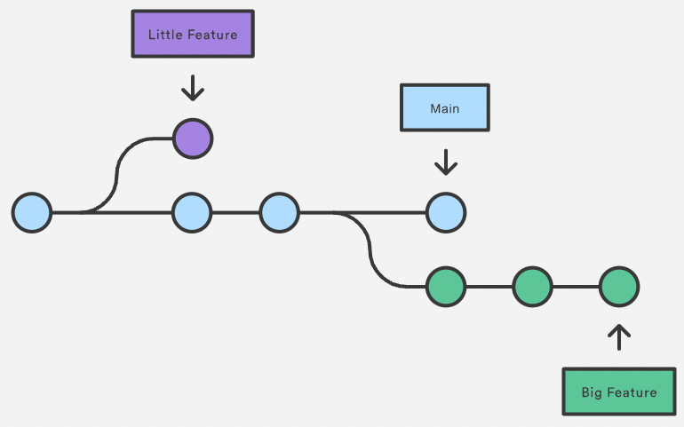

上面的圖顯示 `Repository` 中的三條 branch, `main` 一般來說代表在正式環境運行的程式碼版本, 而切分出來的 `Little Feature` branch 及 `Big Feature` branch 與 `main` branch 彼此互相獨立更新並記錄, 不止能讓三個不同版本的程式碼平行工作, 也能避免一些還在開發中的程式碼進到 `main` branch 影響 production 環境運作

當 `Repository` 第一次 commit 時, Git 會自動創建 `main` branch, 之後的 commit 在切換 branch 之前都會在 `main` branch 中做 commit

## Create & Merge Branch

Git 會將每次的 commit 串成一條 timeline, 這條 timeline 即為一個 branch, Git 默認會創建一條 `master` branch, 而 `HEAD` pointer 嚴格來說不是指向 commit, 而是指向 `master`, `master` 再指向 commit, 所以 `HEAD` 指向的就是當前所在的 branch

```shell
5dcfc65 (HEAD -> master) second commit
```

### [git branch]

剛開始時 `master` branch 是一條 timeline, Git 用 `master` 指向最新的 commit, 再用 `HEAD` 指向 `master`, 就能確認當前的 branch 以及當前 branch 的 commit point:

```shell
➜  learngit git:(master) git branch
* master
```

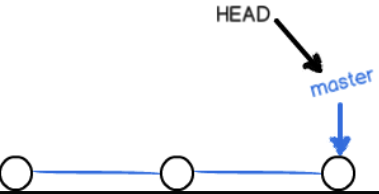

每次 commit `master` branch 都會新增一個節點, 隨著不斷 commit `master` branch 也越來越長

### [git checkout]

當創建新的 branch 如 `dev` 時, Git 創建了一個新的 pointer `dev`, 其指向 `master` 相同的 commit point, 使用 `git checkout` 將 `HEAD` 指向 `dev` 即表示當前 branch 在 `dev` 上:

```shell
➜  learngit git:(master) git branch dev    
➜  learngit git:(master) git checkout dev                         
Switched to branch 'dev'
➜  learngit git:(dev) git branch      
* dev
  master
```

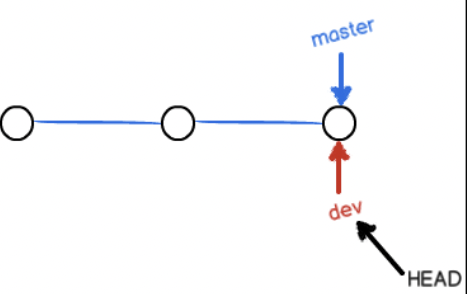

這邊可以觀察到 Git 創建一個 branch 的速度很快, 只需要增加一個 `dev` pointer, 並將 `HEAD` pointer 指向 `dev` 即可, `Working Directory` 的檔案不需做出任何變化

從現在起對 `Working Directory` 的修改和提交就是針對 `dev` branch 了, 如 commit 一次後 `dev` pointer 往前挪動一個節點, 而 `master` 則不動:

```shell
➜  learngit git:(dev) git commit -am "third commit on dev"       
[dev 2f9e804] third commit on dev
 1 file changed, 2 insertions(+), 2 deletions(-)
➜  learngit git:(dev) git log

commit 2f9e8046172c9484780e0855400314ebc6bf4767 (HEAD -> dev)
Author: ReGYChang <p714140432@gmail.com>
Date:   Thu Jun 23 16:12:49 2022 +0800

    third commit on dev

commit 5dcfc65acad6776f00c9375648ccb8b83315e603 (master)
Author: ReGYChang <p714140432@gmail.com>
Date:   Wed Jun 22 22:24:24 2022 +0800

    second commit

commit cbb0c143579ff7d2c21cd8c66d00d2a02458ae64
Author: ReGYChang <p714140432@gmail.com>
Date:   Wed Jun 22 22:08:24 2022 +0800

    first commit
```

此時 `dev` branch 開發完成, 再切回 `master` branch 就會發現剛才在 `dev` branch 添加的內容消失了, 原因是剛剛那個 commit 是在 `dev` branch 上, 而 `master` branch 此時的 commit pointer 並沒有改變

```shell
➜  learngit git:(dev) git checkout master                 
Switched to branch 'master'
➜  learngit git:(master) git log 

commit 5dcfc65acad6776f00c9375648ccb8b83315e603 (HEAD -> master)
Author: ReGYChang <p714140432@gmail.com>
Date:   Wed Jun 22 22:24:24 2022 +0800

    second commit

commit cbb0c143579ff7d2c21cd8c66d00d2a02458ae64
Author: ReGYChang <p714140432@gmail.com>
Date:   Wed Jun 22 22:08:24 2022 +0800

    first commit
```

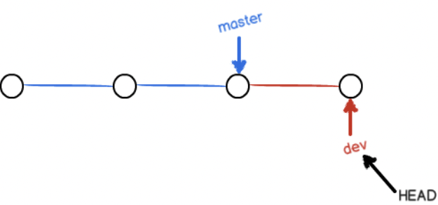

### [git merge]

若在 `dev` 上的工作完成了, 也可以將 `dev` branch merge 到 `master` branch, 即將 `master` 指向 `dev` 的當前提交即可:

```shell
➜  learngit git:(master) git merge dev
Updating 5dcfc65..2f9e804
Fast-forward
 README.md | 4 ++--
 1 file changed, 2 insertions(+), 2 deletions(-)
```

`git merge` 指令用於 merge 指定 branch 到當前 branch, merge 完成後可以發現 `README.md` 內容和 `dev` branch 最新的 commit 是完全一樣的

注意上面提到的 `Fast-forward` 指得是此次 merge 使用的是 `Fast-forward merge`, 即 `master` branch 狀態沒有更改過, `dev` branch 也包含了 `master` branch 的歷史紀錄, 所以直接把 `master` pointer 指向 `dev` 的最新 commit 就可以導入 `dev` branch 的內容, 即 `Fast-forward merge`

<-- 之後會再補充其他形式的 merge w -->

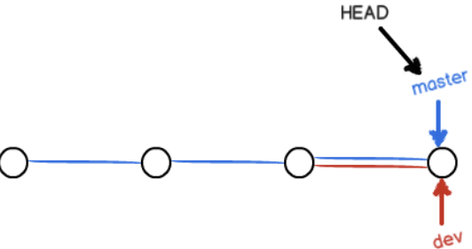

可以發現 Git merge branch 也只需要修改 pointer 指向, 而 `Working Directory` 內容也沒有改變

Merge branch 後甚至也可以刪除 `dev` branch, 即將 `dev` pointer 刪掉即可

```shell
➜  learngit git:(master) git branch -d dev 
Deleted branch dev (was 2f9e804).
➜  learngit git:(master) git branch

* master
```

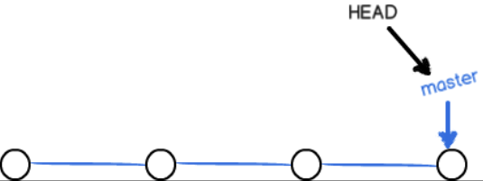

### [git switch]

前面提到可以使用 `git checkout <branch>` 來切換 branch, 但其實 `git checkout` 也可以用來進行檔案管理相關的操作

所以在新版本的 Git 中新增了 `git switch`, 目的是用來切分 `git checkout` 的工作, 避免在一個指令中進行太多的邏輯操作

以下列舉了 `git switch` 跟 `git checkout` 在切換 branch 上的指令對照:

```shell
# 切換分支
git checkout <branch>
git switch <branch>

# 強制切換分支（=切換 + reset --hard, 丟棄所有變更）
git checkout -f <branch>
git switch -f <branch>

# 切換 commit（d: detach, 會讓 HEAD 進入到非分支的狀態）
git checkout <hash>
git switch -d <hash>

# 創建分支, 並切換過去
git checkout -b <new_branch>
git switch -c <new_branch>  # c for create
```

## Merge Conflict

這邊創建一個新的 `feature1` branch 繼續開發:

```shell
➜  learngit git:(master) git switch -c feature1
Switched to a new branch 'feature1'
```

修改 `README.md` 最後一行改為:

```shell
Creating a new branch is quick AND simple.
```

在 `feature1` branch commit 並切回 `master` branch:

```shell
➜  learngit git:(feature1) git commit -am "fourth commit"
[feature1 26c5704] fourth commit
 1 file changed, 1 insertion(+), 1 deletion(-)
➜  learngit git:(feature1) git switch master             
Switched to branch 'master'
 ```

修改 `README.md` 最後一行改為:

```shell
Creating a new branch is quick & simple.
```

並在 `master` branch 上 commit:

```shell
➜  learngit git:(master) ✗ git commit -am 'fourth commit on master' 
[master c1fa3b6] fourth commit on master
 1 file changed, 1 insertion(+), 1 deletion(-)
```

此時 `master` branch 和 `feature1` branch 各自都分別有新的 commit, 狀態如下:

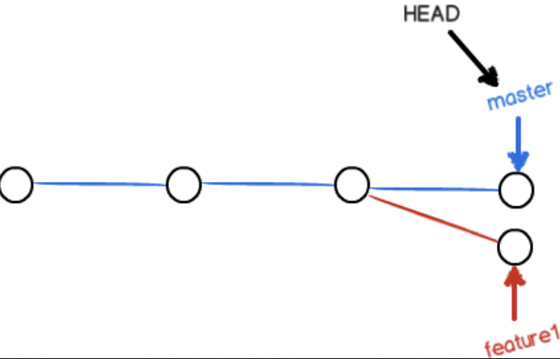

這種狀態下 Git 無法進行 `Fast-forward merge`, 只能將各自的 commit merge 起來, 但這種 merge 就有可能造成 `merge conflict`:

```shell
➜  learngit git:(master) git merge feature1                       
Auto-merging README.md
CONFLICT (content): Merge conflict in README.md
Automatic merge failed; fix conflicts and then commit the result.
```

`git merge` feature1 branch 後提示 `README.md` 檔案存在 conflict, 必須手動處理 conflict 後再 commit, `git status` 也可以查看 conflict 的檔案:

```shell
➜  learngit git:(master) ✗ git status        
On branch master
You have unmerged paths.
  (fix conflicts and run "git commit")
  (use "git merge --abort" to abort the merge)

Unmerged paths:
  (use "git add <file>..." to mark resolution)
        both modified:   README.md

no changes added to commit (use "git add" and/or "git commit -a")
```

也可以直接查看 `README.md` 內容:

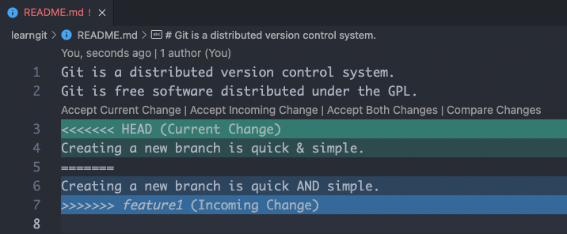

這邊透過工具提示可以選擇留下 `feature1` 或是 `master` 的內容, 或是同時選擇兩者

這裡選擇留下 `master` branch 中的修改並提交:

```shell
➜  learngit git:(master) ✗ git commit -am 'conflict fixed'          
[master f622ffa] conflict fixed
```

此時 `master` 和 `feature1` branch 狀態如下:

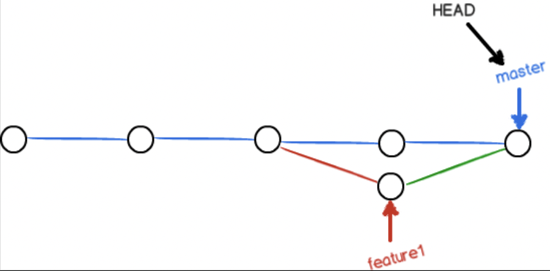

可使用 `git log` 查看 branch merge status:

```shell
➜  learngit git:(master) git log --oneline --graph

*   f622ffa (HEAD -> master) conflict fixed
|\  
| * 26c5704 (feature1) fourth commit
* | c1fa3b6 fourth commit on master
|/  
* 2f9e804 third commit on dev
* 5dcfc65 second commit
* cbb0c14 first commit
```

最後再將 `feature1` branch 刪除即完成功能開發:

```shell
➜  learngit git:(master) git branch -d feature1   
Deleted branch feature1 (was 26c5704).
```

## Branch Strategy

通常在 merge branch 時, Git 會優先使用 `Fast forward merge`, 但這種 merge 方式在刪除 branch 後會丟失 branch 的資訊

若強制禁用 `Fast forward merge`, Git 就會在 merge 時產生一個新的 commit, 如此一來就可以從 log 中看出 branch 的資訊

再一次展開新的開發並創建 `dev` branch:

```shell
➜  learngit git:(master) git switch -c dev     
Switched to a new branch 'dev'
```

修改 `README.txt` 內容並提交一個新的 commit:

```shell
➜  learngit git:(dev) git commit -am "--no-ff merge commit on dev"
[dev d2cf939] --no-ff merge commit on dev
 1 file changed, 1 insertion(+)
 ```

 切換回 `master` branch:

 ```shell
 ➜  learngit git:(dev) git switch  master                          
Switched to branch 'master'
```

Merge `dev` branch 並帶上 `--no-ff` 參數, 表示禁用 `Fast forward merge`:

```shell
➜  learngit git:(master) git merge --no-ff -m "merge with no-ff on master" dev
Merge made by the 'ort' strategy.
 README.md | 1 +
 1 file changed, 1 insertion(+)
 ```

 因為這次 merge 同時會創建一個新的 commit, 所以加上 `-m` 參數將 commit 描述寫入

 Merge 完成後用 `git log` 查看 branch history:

 ```shell
 git log --oneline --graph

 *   cfbcd6d (HEAD -> master) merge with no-ff on master
|\  
| * d2cf939 (dev) --no-ff merge commit on dev
|/  
*   f622ffa conflict fixed
|\  
| * 26c5704 fourth commit
* | c1fa3b6 fourth commit on master
|/  
* 2f9e804 third commit on dev
* 5dcfc65 second commit
* cbb0c14 first commit
```

可以看到不使用 `Fast forward merge` 後的狀態如下:


實際開發環境中的 branch 狀態可能如下圖:

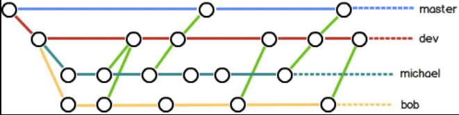

`master` branch 應該是非常穩定且僅用來發布新版本, 平時開發新功能不會使用 `master` branch

開發主要使用 `dev` branch, 其為不穩定版, 當到某個節點譬如 1.0 版本上線時, 再將 `dev` branch merge 到 `master` 中, 於 `master` branch 發布 1.0 版本的程式碼

若使用 `Fast forward merge` 則無法看出曾經有 merge 過, merge 後的 log 也不會顯示 branch

## Bug Branch

在軟體開發過程中經常會收到 bug issue, bug 的存在如同陽光灑落一般, 日復一日

當收到一個代號 101 的 bug 時, 很自然地要創建一個 branch `issue-101` 來修復, 但是目前在 `dev` 上進行的工作還沒有提交:

```shell
➜  learngit git:(master) ✗ git status        
On branch master
Changes to be committed:
  (use "git restore --staged <file>..." to unstage)
        new file:   hello.go

Changes not staged for commit:
  (use "git add <file>..." to update what will be committed)
  (use "git restore <file>..." to discard changes in working directory)
        modified:   README.md
```

目前進度進行到一半沒辦法 commit, 預計完成還需要一天, 但必須在兩小時內修復這個 bug, 單兵該如何處置?

### [git stash]

Git 提供了一個 `stash` 功能, 可以將目前 `Working Directory` 和 `Staging Area` 中的變更暫存起來:

```shell
➜  learngit git:(master) ✗ git stash 
Saved working directory and index state WIP on master: cfbcd6d merge with no-ff on master
```

>❗️NOTE: `Untracked` 狀態的檔案預設無法被 `Stash`, 需要另外使用 `-u` 參數

此時再使用 `git status` 查看狀態:

```shell
➜  learngit git:(master)  git status
On branch master
nothing to commit, working tree clean
```

發現 `Working Directory` 和 `Staging Area` 已經沒有新的變更了, 就可以安心創建新的 branch 來修復 bug

首先需要確認要在哪個 branch 上修復 bug, 假設需要在 `master` branch 上修復則從 `master` 創建臨時的 branch:

```shell
➜  learngit git:(master) git switch master     
Already on 'master'
➜  learngit git:(master) git switch -c issue-101
Switched to a new branch 'issue-101'
```

修復完成後再切換回 `master` branch 完成 merge, 刪除 `issue-101` branch 即完成此次修復工作:

```shell
➜  learngit git:(issue-101) git commit -am "bug fixed"                     
[issue-101 095111c] bug fixed
 1 file changed, 1 insertion(+), 2 deletions(-)
➜  learngit git:(issue-101) git switch master          
Switched to branch 'master'
➜  learngit git:(master) git merge --no-ff -m "merged bug fixed 101" issue-101
Merge made by the 'ort' strategy.
 README.md | 3 +--
 1 file changed, 1 insertion(+), 2 deletions(-)
 ```

 完成了 bug 修復後並不是直接打卡下班, 不要忘了 `dev` branch 還有工作在等我們, 此時切回 `dev` branch 並使用 `git stash list` 查看剛剛暫存的變更狀態:

 ```shell
 ➜  learngit git:(dev)  git stash list 

 stash@{0}: WIP on master: cfbcd6d merge with no-ff on master
 ```

 這裡有兩種方式恢復暫存的變更:

- 使用 `git stash apply` 恢復, 但恢復後 `stash` 中的內容並不會刪除, 需要另外用 `git stash drop` 刪除
- 使用 `git stash pop`, 恢復同時也將 `stash` 中的內容刪除

```shell
➜  learngit git:(dev) git stash pop
On branch dev
Changes to be committed:
  (use "git restore --staged <file>..." to unstage)
        new file:   hello.go

Changes not staged for commit:
  (use "git add <file>..." to update what will be committed)
  (use "git restore <file>..." to discard changes in working directory)
        modified:   README.md

Dropped refs/stash@{0} (3ca73ccbaba230c5f902ca04060e5661986cc9f4)
```

可以多次使用 `git stash`, 要恢復時再透過 `git stash list` 查看並選擇指定恢復的 stash:

```shell
$ git stash apply stash@{0}
```

### [git cherry-pick]

在 `master` branch 上修復完 bug 後, 發現 `dev` branch 之前也是從 `master` branch 切出來的, 所以這個 bug 也存在於當前的 `dev` branch 上

那要如何在當前 `dev` branch 上修復相同的 bug?

這裡只需要將 `[issue-101 095111c] bug fixed` 這個 commit 中的變更**"複製"**到 `dev` branch 即可

>❗️NOTE: 這裡只是複製 7a960b4 這個 commit 中的變更, 不是將整個 `master` branch merge 到 `dev`

Git 提供了 `cherry-pick` 指令, 可以複製一個指定的 commit 到當前 branch:

```shell
➜  learngit git:(dev) git cherry-pick 095111c                    
[dev 71bb07b] bug fixed
 Date: Thu Jun 23 18:01:01 2022 +0800
 1 file changed, 1 insertion(+), 2 deletions(-)
```

Git 會自動為 `dev` branch 完成一次 commit, 注意此次提交的 commit 為 `71bb07b`, 不同於 `master` branch 的 `095111c`, 這兩個 commit 只是變更內容相同, 但實際上是兩個不同的 commit

既然可以在 `master` branch 上修復 bug 後在 `dev` branch replay, 當然也可以在 `dev` branch 上修復 bug 並在 `master` branch 上 replay

`Cherry-Pick` 直接挑選指定 commit 搬到另一條 branch 上是個簡單且直覺的方法, 但其會衍生出兩個問題:
- 複製的 commit 雖然說明訊息與來源相同(若未選擇手動 commit), 但兩者 Hash 值可能不同, 如此則無法建立連結, 未來也不易追朔完整修改歷程
- `Cherry-Pick` 後再 merge 會產生重複 commit 項目

基於以上問題, Git 社群不推崇使用 `Cherry-Pick`:

> Even though this feature is interesting and awesome, it has been discouraged in the git community. The main reason is that it creates a duplicate commit with the same changes and you lose the ability to track the history of the original commit.
Also note that if you are cherry-picking a lot of commits out of order, those will be reflected on your branch in the order you cherry picked, not the on the chronological order of the original commits. Sometimes this may lead to undesirable results in your branch

[https://chamikakasun.medium.com/cherry-pick-with-git-7a2419a7696b](https://chamikakasun.medium.com/cherry-pick-with-git-7a2419a7696b)

## Rebase

`Rebase` 與 `Merge` 有著相同目的, 都是為了將檔案的變更從一個 branch 集成到另一個 branch 中

`Rebase` 中的 base, 指的是改變一個 branch 中一連串 commit 的 base, 即此 branch 被創建出來的那個 commit point

假設一個簡易的日常開發環境如下圖, 你需要為產品開發新功能而創建一個新的 branch Feature, 而其他人不斷地在 main branch 上更新新的 commit:

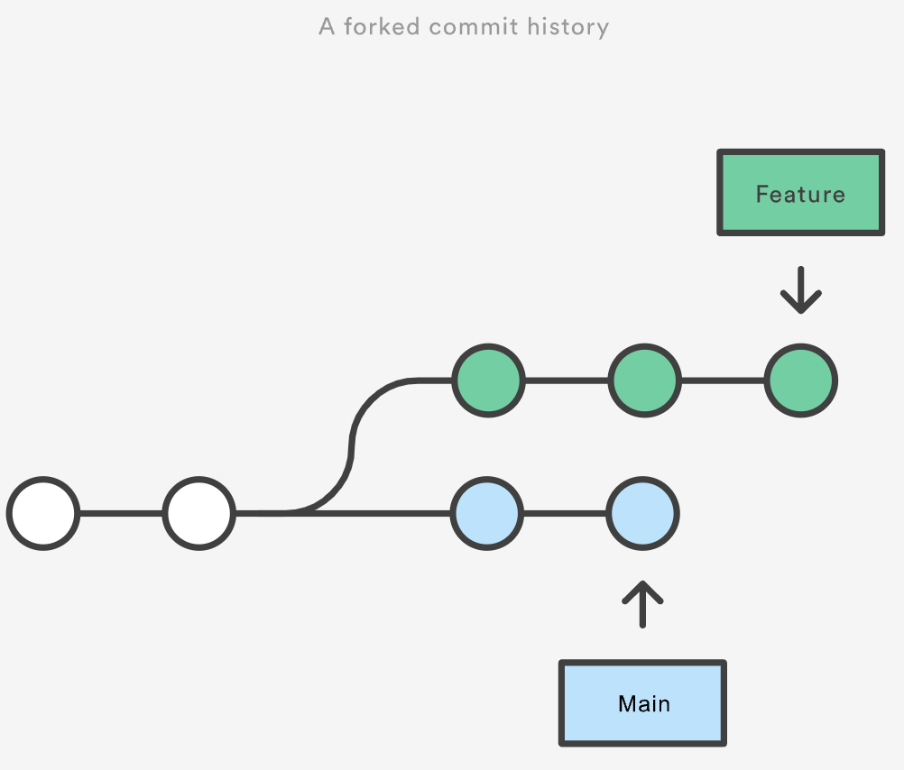

而此時 main branch 上有個新的 commit 與你正在開發的 feature branch 有關, 為了將這個新的 commit 合併到 feature branch 中, 可以使用 `Merge` 或者 `Rebase` 完成

當使用 `Merge` 時:

```shell
git switch feature
git merge main
```

如此一來會在 feature branch 中創建一個新的 **"merge commit"** 並將兩個 branch 歷史連結在一起, 產生如下的 branch 結構:

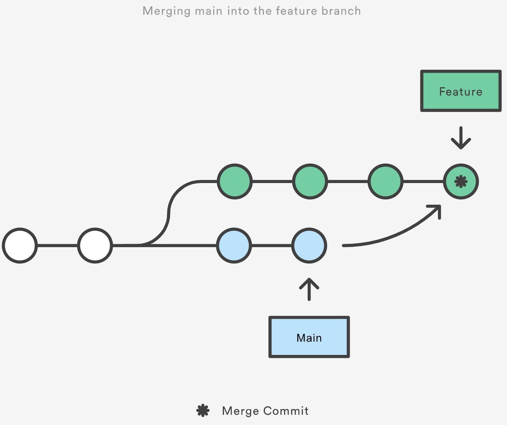

`Merge` 會保留原有的 branch 結構, 創建一個新的 commit 來整合兩個 branch 上的變更

但另一方面, 這意味著每次在 feature branch merge main branch 時都會產生一個無意義的 commit, 這會造成一個嚴重的問題: 若需要多次 merge main branch 最新的 commit, 則會產生多個無用 commit 讓 commit log 變得冗余, 可讀性與維護性降低

### [git rebase]

而相同的情況, 也可以使用 `git rebase` 將 feature branch rebase 到 main branch 上:

```shell
git switch feature
git rebase main
```

`Rebase` 會使整個 feature branch 的 base 變為 main branch 最新的 commit, 從而有效地整合了所有 main branch 的新 commit

與 `Merge` 比較, 兩者都成功整合了 main branch 的所有更新, 不同的是 `Rebase` 會根據原本 feature 中的每個 commit 基於新的 base 創建新的 commits, 並改寫 log 歷史紀錄

使用 `Rebase` 的優點主要是能獲得更清楚的 commit log, 其消除了不必要的 merge commit 並產生線性的 git graph 結構, 我們可以從 feature branch 的頂端一路向前追溯, 沒有任何 folk 即可追蹤到項目開始

但相較於 `Merge`, `Rebase` 更加複雜且危險, 原因是其會重寫 commit log, 可能會影響到其他協同開發的人; 另外 `Merge` 附加的 merge commit 可以提示 merge 上游 branch 的時間點, 若此時間點對於開發團隊來說是重要的則不應使用 `Rebase`, 因為使用 `Rebase` 則無法獲取此資訊

# Remote Repository

Git 是分散式版本控制系統, 同一個 git repo 可以分散到不同的機器上, 剛開始有一台機器上有一個初始版本的程式碼庫, 別的機器可以 **clone** 這個 repo, 且每台機器上的 repo 都是相同的, 並無主次之分

現實的運作方式為找一台運行 git 的 server, 每個人都可以從 server clone repo 到自己電腦上, 且可將各自的 commit push 到 server repo 中, 也可從 server pull 別人的 commit, 這即是 `Github` 運作的方式

local git repo 跟 `Github` remote repo 之間的傳輸是通過 SSH 加密, 其使用 SSH key 識別使用者身份

## Adding Remote Repositories

下面演示如何將本地 repo 推送到 github server:

先在 github 上 create repository

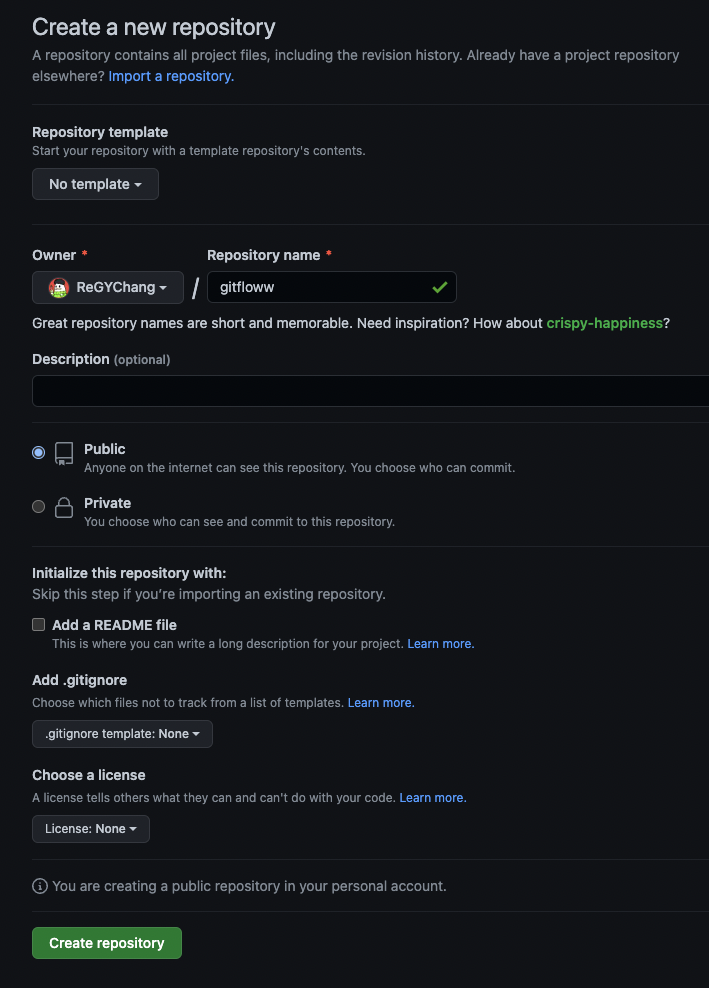

在 local 創建 git repo

```go
echo "# gitflow" >> README.md
git init
```

將 `README.md` 新增進 `Staging Area` 並提交到 `Repository`

```go
git add README.md
git commit -m "first commit"
```

### [git remote]

此時可以將 local repo 與 remote repo 進行關聯, 在本地 repo 輸入:

```go
git branch -M main
git remote add origin https://github.com/ReGYChang/gitflow.git
```

### [git push]

由於新建的 remote repo 目前是空的, 使用 `git push` 指令將 local repo 程式碼推送到 remote repo, 並使用參數 `-u` 設定 `upstream`, 可以使 branch 開始追蹤指定的 remote branch

```go
git push -u origin main
```

設定好 branch upstream 後並成功推送, 可以使用 `git status` 查看, 會顯示追蹤的資訊:

```go
➜  gitflow git:(main) ✗ git status 
On branch main
Your branch is up to date with 'origin/main'.
```

`Your branch is up to date with 'origin/main'.` 表示目前 local `main` branch 與 remote branch 內容是一致的

> ❗️ 注意如果創建 repository 時選了 `Add a README file`, 後續直接 `git push` 會出現 `failed to push some refs to https://github.com/ReGYChang/gitflow.git` 的錯誤, 因為新創建的 `README.md` 並不在 local repo 中導致, 需要先使用 `git pull --rebase origin master` 同步 remote repo 才能 `git push` 成功

# Working Tree

在實際開發過程中會時常需要切到其他 branch, 無論是需要對照, 修 bug 還是開發一個插件的新功能等

類似這種情況通常會先 `git stash` 目前的更動, 等處理完其他事情再 `git stash apply`(或是先 commit 回來再 reset) 恢復變更

## [git worktree]

Git v2.5 之後新增了 `git worktree` 指令, 可以減少 branch 之間切換的成本, 這裡 worktree 指的是 `Working Tree`(工作目錄)

在某個資料夾中進行 `git init` 或是 clone 一個 remote repository 後這個資料夾即成為一個 working tree(由 git 管理的專案資料夾)

`git worktree` 可以為同一個專案創建多個 working tree, 並且其他 working tree 變更在 commit 後會回到原本的 working tree

若是遇到警急上 patch 修 bug 卻又不想 `git stash` 目前的開發進度, 可以透過 `git worktree` 新增新的工作目錄另外處理, 不影響目前的開發狀況