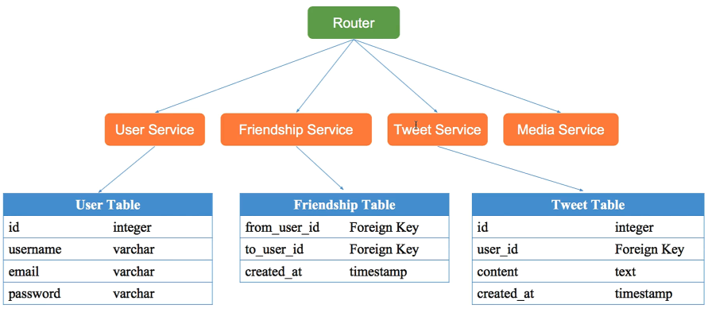
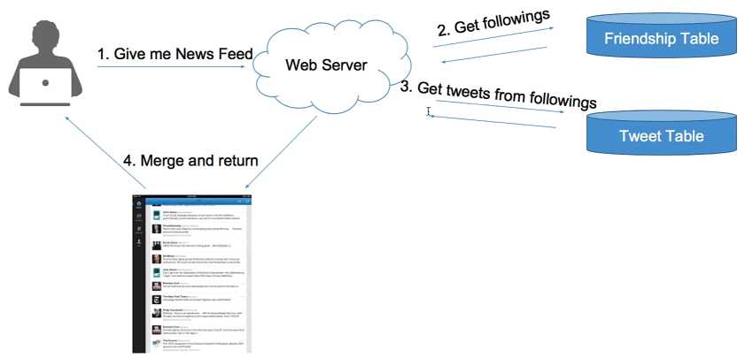

- [System Design & OOP](#system-design--oop)
- [4S](#4s)
  - [Scenario](#scenario)
  - [Service](#service)
  - [Storage](#storage)
    - [Database vs File System](#database-vs-file-system)
    - [Schema Design](#schema-design)
    - [News Feed](#news-feed)
      - [Pull Model](#pull-model)
      - [Pseudo Code](#pseudo-code)
      - [Storage - Push Model](#storage---push-model)
  - [Scale](#scale)
- [Implementation](#implementation)

# System Design & OOP

OOP 形式上需要設計程式碼結構, 實現細節等, 如 `Class`, `Object`, `Method`, `Inheritance`, `Interface` ...

System design 在於宏觀系統的設計思考及建構, 如 `Database`, `Schema`, `SQL`, `NoSQL`, `Cache`, `File System`, `Distributed System`, `Latency`, `Scalibility`, `Cluster`, `Load Balancer`, `Web Server`, `Message Queue`, `Sharding`, `Consistent Hashing`, `QPS`...

System Design Perspective:
- Work Solution 25%
- Analysis 25%
- Special Case 20%
- Tradeoff 15%
- Knowledge Base 15%

# 4S

## Scenario

確認需求場景:
- Features
- QPS
- DAU
- Interfaces

> 釐清需要設計哪些功能?
- Step 1: Enumerate
  - Register / Login
  - User Profile Display / Edit
  - Upload Image / Video *
  - Search *
  - Post / Share a tweet
  - Timeline / News Feed
  - Follow / Unfollow a user

- Step 2: Sort by priority
  - Post a Tweet
  - Timeline
  - News Feed
  - Follow / Unfollow a user
  - Register / Login

> 需要承受多大 loading?
- DAU, MAU
- Concurrent User
  - DAU * avg requests/user / seconds a day
  - Peek = avg concurrent user * 3
  - Fast Growing: MAX peek users in 3 months = Peak users * 2
- Read QPS
- Write QPS

> QPS Analysis
- QPS = 100
  - laptop server
- QPS = 1k
  - Single Web Server
  - Single SQL Database
  - 須考慮 Single Point Failure
- QPS = 1M
  - 1000 Web Server Cluster
  - Single Cache Database(Redis)
  - Maintainance

## Service

拆分系統服務
- Application
- Module

> 將大系統拆分為小服務
- Replay
- Merge

## Storage

資料如何儲存及取得
- 為每個 service 選擇存儲結構
- Schema 細化 table 結構

- Database
  - RDB
    - User Table
  - NoSQL Database
    - Tweets
    - Social Graph(followers)
- File System
  - images, vedio media files
- Cache
  - Persistent
  - Performace

### Database vs File System

Database 是 file system 的一層抽象, 其是依賴關係, database 依賴 file system

Database 提供了更豐富的資料操作 interface, 而 file system 只提供簡單的文件操作 interface, 因此兩個系統的讀寫效率理論上是差不多的

### Schema Design

### News Feed

> What's News Feed?
- 登入 Facebook/Twitter/IG 之後看到的 data steram
- 所有好友發送的資訊集合

#### Pull Model

- Algo
  - User 查看 News Feeds 時獲取獲取每個好友前 100 條 tweets, 合併出前 100 條 News Feed
    - Merge K Sorted Arrays
- Complexity
  - News Feed => 假設有 N 個好友, 則為 N 次 DB Reads Time + Merge K Sorted Arrays(可忽略)
  - Post a tweet => 一次 DB Write

#### Pseudo Code

- getNewsFeed(request)
  - followings = DB.getFollowings(user=request.user)
  - news_feed = empty
  - for follow in followings:
    - tweets = DB.getTweets(follow.to_user,100) # `N DB Reads 非常慢, 且發生在 News Feed 請求過程中`
    - news_feed.merge(tweets)
  - sort(news_feed)
  - return news_feed[:100] # return 前 100 條
- postTweet(request, tweet)
  - DB.insertTweet(request.user, tweet)
  - return success

#### Storage - Push Model

## Scale

handle corner case
- Sharding
- Optimize
- Special Case

# Implementation