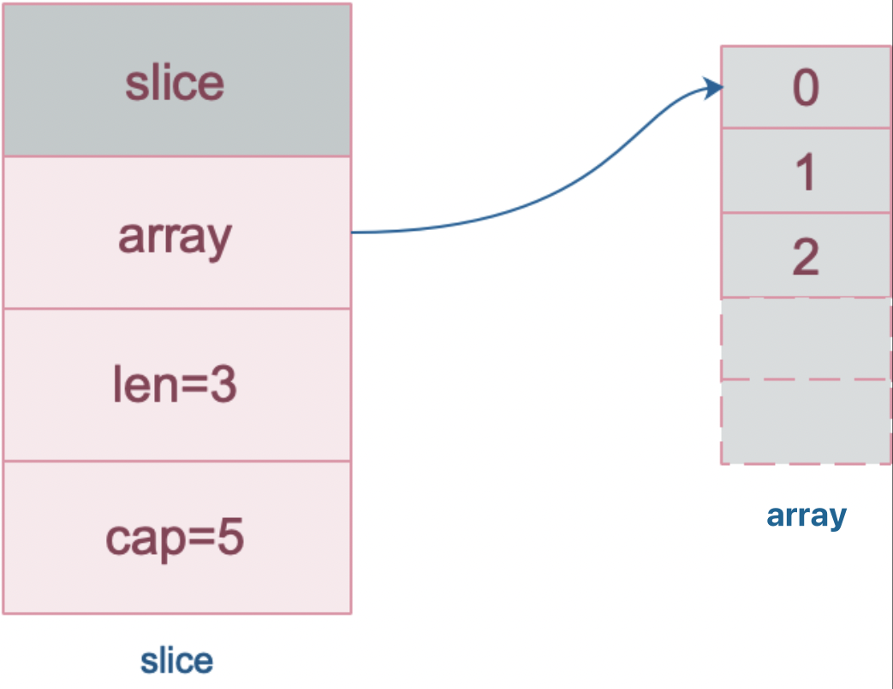
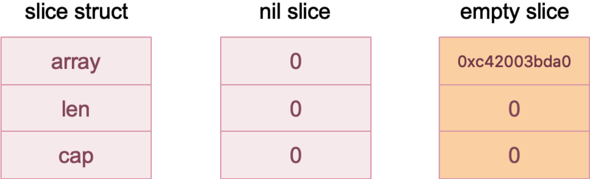
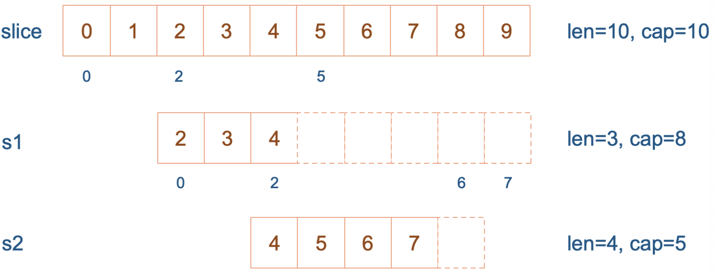
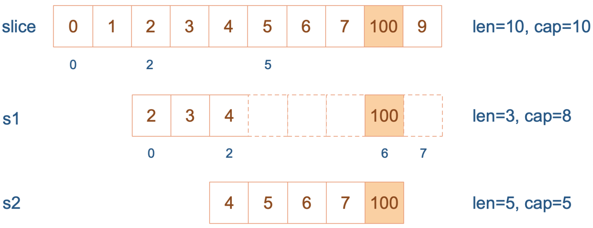
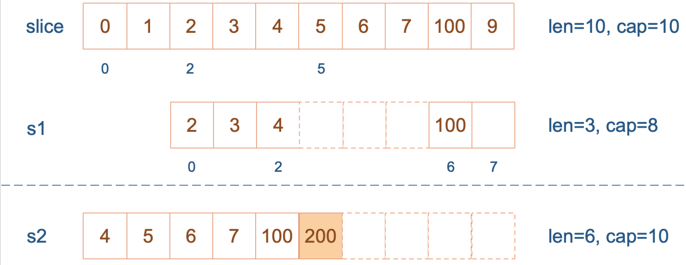

- [Array](#array)
  - [Array Declaration](#array-declaration)
  - [Value Type](#value-type)
  - [Array Length](#array-length)
  - [Iterate Over Items of An Array](#iterate-over-items-of-an-array)
  - [Multi Dimensional Array](#multi-dimensional-array)
- [Slice](#slice)
  - [Create Slice](#create-slice)
    - [Declare Slice](#declare-slice)
    - [Literal](#literal)
    - [Make](#make)
    - [Reslice](#reslice)
  - [Modification in Slice](#modification-in-slice)
  - [Length and capacity of slice](#length-and-capacity-of-slice)
  - [Create Slice With make](#create-slice-with-make)
  - [Append Element to Slice](#append-element-to-slice)
  - [Passing Slice as Function Parameter](#passing-slice-as-function-parameter)
  - [Multi Dimensional Slice](#multi-dimensional-slice)
  - [Memory Optimization](#memory-optimization)
  - [Comparison Slice in Go](#comparison-slice-in-go)
    - [Reflect](#reflect)
    - [For range Comparison](#for-range-comparison)
- [Map](#map)
  - [Create Map](#create-map)
  - [Append Element to Map](#append-element-to-map)
  - [Get Element from Map](#get-element-from-map)
  - [Delete Element from Map](#delete-element-from-map)
  - [Get Length of Map](#get-length-of-map)
  - [Map is a Reference Type](#map-is-a-reference-type)
  - [Comparing Map in Go](#comparing-map-in-go)

# Array

Array 是同一類型元素的集合

例如整數集合 5,8,9,79 形成一個 array

Go 不允許混合不同類型的元素, 例如 string 和 int 的 array (若是 interface{} 類型的 array 可以包含任意類型)

## Array Declaration

一個 array 表示形式為 `[n]T`, `n` 代表 array 中元素數量, `T` 代表元素的類型

**元素的數量 `n` 也是該類型的一部分**

```go
package main

import (
    "fmt"
)

func main() {
    var a [3]int //int array with length 3
    fmt.Println(a)
}
```

`var a [3]int` 宣告了一個長度為 3 的 int array

**array 所有元素都自動被賦值為零值**

也可以使用簡略宣告來創建 array

```go
package main

import (
    "fmt"
)

func main() {
    a := [3]int{12, 78, 50} // short hand declaration to create array
    fmt.Println(a)
}
```

簡略宣告中不需要將 array 中所有元素賦值

```go
package main

import (
    "fmt"
)

func main() {
    a := [3]int{12} 
    fmt.Println(a)
}
```

`a := [3]int{12}` 宣告了一個長度為 3 的 array, 但只提供了一個值 12, 剩下兩個元素自動賦值為零值

甚至可以忽略宣告 array 的長度並使用 `...` 代替, 讓 compiler 自動計算長度

```go
package main

import (
    "fmt"
)

func main() {
    a := [...]int{12, 78, 50} // ... makes the compiler determine the length
    fmt.Println(a)
}
```

**array 大小是類型的一部分**

因此 `[5]int` 及 `[25]int` 是不同類型

array 不能調整大小, 動態大小的問題會由 `slices` 解決

```go
package main

func main() {
    a := [3]int{5, 78, 8}
    var b [5]int
    b = a // not possible since [3]int and [5]int are distinct types
}
```

compiler 會拋出 `main.go:6: cannot use a (type [3]int) as type [5]int in assignment`

## Value Type

Go array 是值類型而不是參考類型

意味著當 array 賦值給一個新的變數時, 該變數會得到一個原始 array 的 copy

若對新變數進行更改不會影響原 array

```go
package main

import "fmt"

func main() {
    a := [...]string{"USA", "China", "India", "Germany", "France"}
    b := a // a copy of a is assigned to b
    b[0] = "Singapore"
    fmt.Println("a is ", a)
    fmt.Println("b is ", b) 
}

//a is [USA China India Germany France]  
//b is [Singapore China India Germany France]
```

`b` 第一個元素改為 `Singapore` 不會改變 array `a`

同理, 當 array 作為 parameter pass function 時也是 pass by value, 原 array 保持不變

```go
package main

import "fmt"

func changeLocal(num [5]int) {
    num[0] = 55
    fmt.Println("inside function ", num)
}
func main() {
    num := [...]int{5, 6, 7, 8, 8}
    fmt.Println("before passing to function ", num)
    changeLocal(num) //num is passed by value
    fmt.Println("after passing to function ", num)
}

//before passing to function  [5 6 7 8 8]
//inside function  [55 6 7 8 8]
//after passing to function  [5 6 7 8 8]
```

array `num` 實際上是通過 pass by value 的方式傳遞給 func `changeLocal`, array 不會因為函數調用而改變

## Array Length

通過將 array 作為 argument 傳遞給 `len` 函數可以得到 array 長度

```go
package main

import "fmt"

func main() {
    a := [...]float64{67.7, 89.8, 21, 78}
    fmt.Println("length of a is",len(a))
}

//length of a is 4
```

## Iterate Over Items of An Array

`for loop` 可用來遍歷 array 中元素

```go
package main

import "fmt"

func main() {
    a := [...]float64{67.7, 89.8, 21, 78}
    for i := 0; i < len(a); i++ { // looping from 0 to the length of the array
        fmt.Printf("%d th element of a is %.2f\n", i, a[i])
    }
}

//0 th element of a is 67.70  
//1 th element of a is 89.80  
//2 th element of a is 21.00  
//3 th element of a is 78.00
```

Go 提供了一種更簡潔的方式, 通過 `for range` 的方法來遍歷 array

`range` 返回 index 及該 index value

```go
package main

import "fmt"

func main() {
    a := [...]float64{67.7, 89.8, 21, 78}
    sum := float64(0)
    for i, v := range a {//range returns both the index and value
        fmt.Printf("%d the element of a is %.2f\n", i, v)
        sum += v
    }
    fmt.Println("\nsum of all elements of a",sum)
}
```

若只需要值並忽略 index 也可以通過 `_` 實現

```go
for _, v := range a { 
    // ignores index  
}
```

## Multi Dimensional Array

Go 可以創多維 array

```go
package main

import (
    "fmt"
)

func printarray(a [3][2]string) {
    for _, v1 := range a {
        for _, v2 := range v1 {
            fmt.Printf("%s ", v2)
        }
        fmt.Printf("\n")
    }
}

func main() {
    a := [3][2]string{
        {"lion", "tiger"},
        {"cat", "dog"},
        {"pigeon", "peacock"}, // this comma is necessary. The compiler will complain if you omit this comma
    }
    printarray(a)
    var b [3][2]string
    b[0][0] = "apple"
    b[0][1] = "samsung"
    b[1][0] = "microsoft"
    b[1][1] = "google"
    b[2][0] = "AT&T"
    b[2][1] = "T-Mobile"
    fmt.Printf("\n")
    printarray(b)
}

//lion tiger
//cat dog
//pigeon peacock

//apple samsung
//microsoft google
//AT&T T-Mobile
```

> array 具有固定長度限制, 不可能增加 array 長度

# Slice

`slice` 是由 array 建立的一種方便, 靈活且功能強大的 wrapper

其本身不擁有任何資料, 它們只是對現有 array 的 reference

`slice` source code 如下:

```go
// runtime/slice.go
type slice struct {
	array unsafe.Pointer
	len   int
	cap   int
}
```

`slice` 有三個屬性:

- `pointer`: 指向底層 `array`
- `len`: 表示 `slice` 可用元素的個數, 即使用 index 對 `slice` 元素進行訪問時, index 不能超出 `slice` 的長度
- `cap`: 表示底層 `array` 的元素個數, `cap` >= `len`, 在底層 `array` 不進行擴容的情況下 `cap` 即是 `slice` 可以擴展的上限



>❗️底層 array 可以同時被多個 slice 同時指向, 因此對一個 slice 元素進行操作有可能影響到其他 slice

## Create Slice

創建 `slice` 的方式有以下幾種:

| method  | sample                                           |
| ------- | ------------------------------------------------ |
| declare | var slice []int                                  |
| new     | slice := *new([]int)                             |
| literal | slice := []int{1,2,3}                            |
| make    | slice := make([]int, 5, 10)                      |
| reslice | slice := array[1:5] or slice := sourceSlice[1:5] |

### Declare Slice

直接聲明創建出來的 slice 其實為一個 `nil slice`, 其長度及容量皆為 0, 與 `nil` 比較結果為 `true`

`nil slice` 很容易與 `empty slice` 混淆, `empty slice` 長度及容量也皆為 0, 但是所有的 `empty slice` 的資料指針都指向同一個位置 `0xc42003bda0`, `empty slice` 與 `nil` 比較結果為 `false`

其內部構造比較如下:



其創建方法分別如下:

| type        | method                                    | len | cap | compare to nil |
| ----------- | ----------------------------------------- | --- | --- | -------------- |
| nil slice   | var s1 []int; var s2 = *new([]int)        | 0   | 0   | true           |
| empty slice | var s3 = []int{}; var s4 = make([]int, 0) | 0   | 0   | false          |

>💡兩者很相似, 長度和容量皆為 0, 官方建議盡量使用 `nil slice`

### Literal

直接使用初始化表達式創建:

```go
package main

import "fmt"

func main() {
	s1 := []int{0, 1, 2, 3, 8: 100}
	fmt.Println(s1, len(s1), cap(s1))
}
```

>❗️需要注意的是上述程式碼中使用了索引號直接賦值, 其他為註明元素默認為 0

### Make

使用 `make` 函式創建 slice 需要傳入三個參數: slice 型別, 長度, 容量; 容量可以不傳, 默認與長度相等

```go
package main

import "fmt"

func main() {
	slice := make([]int, 5, 10)
	slice[2] = 2
	fmt.Println(slice)
}
```

### Reslice

`Reslice` 也是比較常見的一種創建 slice 的方法, 可以從現有的 array 或 slice 直接擷取, 當然需要指定起止索引的位置

新的 slice 和老的 slice 共用底層 array, 新老 slice 對底層 array 的修改都會影響彼此; 基於 array 亦同

>💡新老 slice 或新 slice 老 array 相互影響的前提為兩者共用底層 array, 若因為執行 `append` 使得新的 slice 底層 array 擴容並轉移到新位置, 則兩者就不會相互影響

```go
 data := [...]int{0, 1, 2, 3, 4, 5, 6, 7, 8, 9}
 slice := data[2:4:6] // data[low, high, max]
```

上述程式碼對 `data` 使用三個索引進行 `reslice` 並創建出新的 `slice`, 這裡的 `data` 可以為 slice or array

`low` 為最低索引值, 表示第一個元素為 `data` 位於 `low` 索引處的元素; `high` 表示最後一個元素只能為索引 `high-1` 的元素; 而最大容量則只能為索引 `max-1` 的元素

```
max >= high >= low
```

當 `high == low` 時新的 `slice` 為空; 另外 `high` 和 `max` 必須在老 array 或老 slice 的容量(`cap`)範圍內

舉個例子:

```go
package main

import "fmt"

func main() {
	slice := []int{0, 1, 2, 3, 4, 5, 6, 7, 8, 9}
	s1 := slice[2:5]
	s2 := s1[2:6:7]

	s2 = append(s2, 100)
	s2 = append(s2, 200)

	s1[2] = 20

	fmt.Println(s1)
	fmt.Println(s2)
	fmt.Println(slice)
}
```

output:

```go
[2 3 20]
[4 5 6 7 100 200]
[0 1 2 3 20 5 6 7 100 9]
```

初始狀態如下:

```go
slice := []int{0, 1, 2, 3, 4, 5, 6, 7, 8, 9}
s1 := slice[2:5]
s2 := s1[2:6:7]
```

- `s1` 從 `slice` 索引 2 - 索引 5, 長度為 3, 容量默認到 array 尾端, 為 8
- `s2` 從 `s1` 索引 2 - 索引 6, 容量到索引 7, 為 5



再來向 `s2` 尾部追加一個 100:

```go
s2 = append(s2, 100)
```

`s2` 容量剛好夠, 不需擴容直接追加; 不過這會修改原始 array 對應位置的元素, 因此會影響到 `slice` 及 `s1`:



再次向 `s2` 追加元素 200:

```go
s2 = append(s2, 200)
```

此時 `s2` 容量不足會觸發擴容, 將原來的元素複製到新的記憶體位置以擴大容量, 且為了應對未來再次擴容的需求, `s2` 會在擴容時多留一些 buffer, 將新的容量擴大為初始容量的 2 倍, 即 10



最後修改 `s1` 索引 2 位置的元素:

```go
s1[2] = 20
```

這次只會影響原始 array 相應位置的元素, 因為 `s2` 底層的 array 已經使用不同的記憶體位置

>💡當 print `s1` 時只會印出 `s1` 長度以內的元素, 雖然其底層 array 不只有 3 個元素

## Modification in Slice

Slice 自己不擁有任何資料, 其只是底層 array 的一種表示

對 slice 所做的任何修改都會反映在底層 array 中

```go
package main

import (
    "fmt"
)

func main() {
    darr := [...]int{57, 89, 90, 82, 100, 78, 67, 69, 59}
    dslice := darr[2:5]
    fmt.Println("array before", darr)
    for i := range dslice {
        dslice[i]++
    }
    fmt.Println("array after", darr)
}
```

根據 array index 創建了一個 slice `dslice`

使用 for loop 將這些 index value 遞增 1, 查看後發現對 `dslice` 的修改反映在 `darr` 中

output:
```go
array before [57 89 90 82 100 78 67 69 59]  
array after [57 89 91 83 101 78 67 69 59]
```

當多個 slices 共用相同的底層 array 時, 每個 slice 所做的修改都會反映在 array 中

```go
package main

import (
    "fmt"
)

func main() {
    numa := [3]int{78, 79 ,80}
    nums1 := numa[:] // creates a slice which contains all elements of the array
    nums2 := numa[:]
    fmt.Println("array before change 1", numa)
    nums1[0] = 100
    fmt.Println("array after modification to slice nums1", numa)
    nums2[1] = 101
    fmt.Println("array after modification to slice nums2", numa)
}
```

`nums[:]` 缺少開始及結束值

開始與結束默認值為 `0` 及 `len(numa)`

兩個 slice `nums1` 和 `nums2` 共享相同 array

output:

```go
array before change 1 [78 79 80]  
array after modification to slice nums1 [100 79 80]  
array after modification to slice nums2 [100 101 80]
```

從輸出可以看出當 slices 共享一個 array 時每個修改都會反映在 array 上

## Length and capacity of slice

slice 長度是 slice 中的元素數量

**slice 容量是從創建 slice index 開始的底層 array 中的元素數量**

```go
package main

import (
    "fmt"
)

func main() {
    fruitarray := [...]string{"apple", "orange", "grape", "mango", "water melon", "pine apple", "chikoo"}
    fruitslice := fruitarray[1:3]
    fmt.Printf("length of slice %d capacity %d", len(fruitslice), cap(fruitslice)) // length of is 2 and capacity is 6
}
```

`fruitslice` 是從 `fruitarray` index 1 & 2 創建的

因此 `fruitslice` 容量是從 index 1 開始, 也就是從 `orange` 開始, 為 `6`

該 slice len = 2 & cap = 6

slice 可以重置長度

```go
package main

import (
    "fmt"
)

func main() {
    fruitarray := [...]string{"apple", "orange", "grape", "mango", "water melon", "pine apple", "chikoo"}
    fruitslice := fruitarray[1:3]
    fmt.Printf("length of slice %d capacity %d\n", len(fruitslice), cap(fruitslice)) // length of is 2 and capacity is 6
    fruitslice = fruitslice[:cap(fruitslice)] // re-slicing furitslice till its capacity
    fmt.Println("After re-slicing length is",len(fruitslice), "and capacity is",cap(fruitslice))
}
```

output:

```go
length of slice 2 capacity 6 
After re-slicing length is 6 and capacity is 6
```

## Create Slice With make

`make` 通過傳遞類型, 長度及容量來創建 slice

容量是可選參數, 默認值為 slice length

make 函數創建一個 array 並返回引用該 array 的 slice

```go
func make([]T, len, cap) []T
```

```go
package main

import (
    "fmt"
)

func main() {
    i := make([]int, 5, 5)
    fmt.Println(i)
    // [0 0 0 0 0]
}
```

通過 `make` 創建 slice 默認情況下為零值

## Append Element to Slice

array 長度是固定的, 無法增加

slice 是動態的, 可使用 `append` 將新元素追加到 slice 上

append 函數定義如下：

```go
func append（s[]T，x ... T）[]T
```

**x ... T** 在函數定義中表示該函數接受參數 x 的個數是可變的, 這些類型的函數被稱為 [`Variadic Functions`](https://golangbot.com/variadic-functions/)

當新的元素透過 `append` 被添加到 slice 時, 實際上是創建了一個新的 array, 並將現有的 array 元素複製到新 array 中並返回新 array 的新 slice reference

```go
package main

import (
    "fmt"
)

func main() {
    cars := []string{"Ferrari", "Honda", "Ford"}
    fmt.Println("cars:", cars, "has old length", len(cars), "and capacity", cap(cars)) // capacity of cars is 3
    cars = append(cars, "Toyota")
    fmt.Println("cars:", cars, "has new length", len(cars), "and capacity", cap(cars)) // capacity of cars is doubled to 6
}
```

`cars` 容量最初是 3, `append(cars, "Toyota")` 返回的 slice 賦值給 `cars` 後容量變成 6

output:

```go
cars: [Ferrari Honda Ford] has old length 3 and capacity 3  
cars: [Ferrari Honda Ford Toyota] has new length 4 and capacity 6
```

slice 類型零值為 `nil`, 一個 `nil` slice 長度和容量都為 0

可以使用 `append` 函數將值追加到 `nil` slice

```go
package main

import (  
    "fmt"
)

func main() {  
    var names []string //zero value of a slice is nil
    if names == nil {
        fmt.Println("slice is nil going to append")
        names = append(names, "John", "Sebastian", "Vinay")
        fmt.Println("names contents:",names)
    }
}
```

`names` 是 nil, 利用 `append` 添加 3 個 string 給 `names`

output:

```go
slice is nil going to append  
names contents: [John Sebastian Vinay]
```

也可以使用 `...` 運算符將一個 slice 添加到另一個 slice 中

```go
package main

import (
    "fmt"
)

func main() {
    veggies := []string{"potatoes", "tomatoes", "brinjal"}
    fruits := []string{"oranges", "apples"}
    food := append(veggies, fruits...)
    fmt.Println("food:",food)
}
```

`food` 是通過 `append(veggies, fruits...)` 創建

output:

```go
food: [potatoes tomatoes brinjal oranges apples]
```

## Passing Slice as Function Parameter

slice 底層由一個 struct type 表示:

```go
type slice struct {  
    Length        int
    Capacity      int
    ZerothElement *byte
}
```

slice 包含 len, cap 和指向 array 第 0 個元素的 pointer

當 slice 傳遞給函數時, 即使透過 pass by value, pointer variable 也將引用相同的底層 array

因此當 slice 作為參數傳遞給函數時, 函數內所做的更改也會在函數外可見

```go
package main

import (
    "fmt"
)

func subtactOne(numbers []int) {
    for i := range numbers {
        numbers[i] -= 2
    }
}
func main() {
    nos := []int{8, 7, 6}
    fmt.Println("slice before function call", nos)
    subtactOne(nos)                               // function modifies the slice
    fmt.Println("slice after function call", nos) // modifications are visible outside
}
```

調用 `subtactOne` 將 slice 中每個元素遞減 2

`subtactOne` 調用後打印 slice 時這些更改是可見的

output:

```go
array before function call [8 7 6]  
array after function call [6 5 4]
```

## Multi Dimensional Slice

類似於 array, slice 也可以有多個維度

```go
package main

import (
    "fmt"
)

func main() {  
     pls := [][]string {
            {"C", "C++"},
            {"JavaScript"},
            {"Go", "Rust"},
            }
    for _, v1 := range pls {
        for _, v2 := range v1 {
            fmt.Printf("%s ", v2)
        }
        fmt.Printf("\n")
    }
}
```

output:

```go
C C++  
JavaScript  
Go Rust
```

## Memory Optimization

slice 持有對底層 array 的 reference, 只要 slice 還在記憶體中, array 就無法進行 GC, 在記憶體管理方面需要注意

假設需要處理一個非常大的 array 的一小部分, 由這個 array 創建一個 slice 並處理, 需注意 slice reference 時 array 仍存在 memory 中

一種解決方法是使用 `copy` 函數 `func copy(dst，src[]T)int` 來創建一個 slice 副本

這樣可以使用新的 slice 並 GC 原始 array

```go
package main

import (
    "fmt"
)

func countries() []string {
    countries := []string{"USA", "Singapore", "Germany", "India", "Australia"}
    neededCountries := countries[:len(countries)-2]
    countriesCpy := make([]string, len(neededCountries))
    copy(countriesCpy, neededCountries) //copies neededCountries to countriesCpy
    return countriesCpy
}
func main() {
    countriesNeeded := countries()
    fmt.Println(countriesNeeded)
}
```

`neededCountries := countries[:len(countries)-2` 創建一個去掉尾部兩個元素的 slice `countries` 並將 `neededCountries` 複製到 `countriesCpy` 再返回

而 `countries` array 可以被 GC, 因為 `neededCountries` 不再被引用

## Comparison Slice in Go

當需要比較兩個 slice 包含的元素是否完全相等時, 一般有兩種方法:
- `reflect`
- `for range` 遍歷比較

### Reflect

```go
func StringSliceReflectEqual(a, b []string) bool {
    return reflect.DeepEqual(a, b)
}
```

直接使用 `reflect` 的 `reflect.DeepEqual` 來比較 `a` 和 `b` 是否相等

### For range Comparison

```go
func StringSliceEqual(a, b []string) bool {
    if len(a) != len(b) {
        return false
    }

    if (a == nil) != (b == nil) {
        return false
    }

    for i, v := range a {
        if v != b[i] {
            return false
        }
    }

    return true
}
```

先比較長度是否相等, 在比較兩個 slice 是否都為 `nil` 或都不為 `nil`, 最後比較對應 index 元素是否相等

>❗️NOTE

```go
if (a == nil) != (b == nil) {
    return false
}
```

這段程式碼作用是與 `reflect.DeepEqual` 結果保持一致: `[]int{} != []int(nil)`

# Map

map 是在 Go 中將 value & key 關聯的 build-in type, 通過相印的 key 獲取 value

## Create Map

通過 `make` 函數傳入 key & value 的類型可以創建 map

`make(map[type of key]type of value)` 

```go
personSalary := make(map[string]int)
```

使用 `make` 創建名為 `personSalary` 的 map, 其中 key 是 string type, value 是 int type

map 零值是 `nil`, 若想添加元素到 nil map 中會觸發 runtime `panic`, 因此 map 必須使用 `make` 函數初始化

```go
package main

import (
    "fmt"
)

func main() {  
    var personSalary map[string]int
    if personSalary == nil {
        fmt.Println("map is nil. Going to make one.")
        personSalary = make(map[string]int)
    }
}
```

`personSalry` 是 `nil`, 因此需使用 `make` 初始化

## Append Element to Map

新增元素到 map 的語法與 array 相同：

```go
package main

import (
    "fmt"
)

func main() {
    personSalary := make(map[string]int)
    personSalary["steve"] = 12000
    personSalary["jamie"] = 15000
    personSalary["mike"] = 9000
    fmt.Println("personSalary map contents:", personSalary)
    // personSalary map contents: map[steve:12000 jamie:15000 mike:9000]
}
```

也可以在宣告的時候初始化 map

```go
package main

import (  
    "fmt"
)

func main() {  
    personSalary := map[string]int {
        "steve": 12000,
        "jamie": 15000,
    }
    personSalary["mike"] = 9000
    fmt.Println("personSalary map contents:", personSalary)
    // personSalary map contents: map[steve:12000 jamie:15000 mike:9000]
}
```

## Get Element from Map

從 map 獲取元素的語法為 `map[key]`

```go
package main

import (
    "fmt"
)

func main() {
    personSalary := map[string]int{
        "steve": 12000,
        "jamie": 15000,
    }
    personSalary["mike"] = 9000
    employee := "jamie"
    fmt.Println("Salary of", employee, "is", personSalary[employee])
    // Salary of jamie is 15000
}
```

如果獲取一個不存在的元素 map 會返回該元素的零值

```go
package main

import (  
    "fmt"
)

func main() {
    personSalary := map[string]int{
        "steve": 12000,
        "jamie": 15000,
    }
    personSalary["mike"] = 9000
    employee := "jamie"
    fmt.Println("Salary of", employee, "is", personSalary[employee])
    //Salary of jamie is 15000
    fmt.Println("Salary of joe is", personSalary["joe"])
    //Salary of joe is 0

}
```

若要確認 map 中存不存在這個 key, 可以使用 comma-ok 斷言:

```go
value, ok := map[key]
```

若 `ok` 為 true 則表示 key 存在; 反之則表示不存在

```go
package main

import (
    "fmt"
)

func main() {
    personSalary := map[string]int{
        "steve": 12000,
        "jamie": 15000,
    }
    personSalary["mike"] = 9000
    newEmp := "joe"
    value, ok := personSalary[newEmp]
    if ok == true {
        fmt.Println("Salary of", newEmp, "is", value)
    } else {
        fmt.Println(newEmp,"not found")
    }
    // joe not found
}
```

遍歷 map 中所有元素需要用 `for range`:

```go
package main

import (
    "fmt"
)

func main() {
    personSalary := map[string]int{
        "steve": 12000,
        "jamie": 15000,
    }
    personSalary["mike"] = 9000
    fmt.Println("All items of a map")
    for key, value := range personSalary {
        fmt.Printf("personSalary[%s] = %d\n", key, value)
    }

}
```

output:

```go
All items of a map
personSalary[mike] = 9000
personSalary[steve] = 12000
personSalary[jamie] = 15000
```

>❗️當使用 `for range` 遍歷 map 時不保證每次執行程式獲取的元素順序都相同

## Delete Element from Map

刪除 `map` 中的 key 語法為 `delete(map, key)`, 這個函數沒有返回值

```go
package main

import (  
    "fmt"
)

func main() {  
    personSalary := map[string]int{
        "steve": 12000,
        "jamie": 15000,
    }
    personSalary["mike"] = 9000
    fmt.Println("map before deletion", personSalary)
    delete(personSalary, "steve")
    fmt.Println("map after deletion", personSalary)

}
```

output:

```go
map before deletion map[steve:12000 jamie:15000 mike:9000]
map after deletion map[mike:9000 jamie:15000]
```

## Get Length of Map

與 array 相同, 使用 `len` 函數獲取 map 長度

```go
package main

import (
    "fmt"
)

func main() {
    personSalary := map[string]int{
        "steve": 12000,
        "jamie": 15000,
    }
    personSalary["mike"] = 9000
    fmt.Println("length is", len(personSalary))
    // length is 3
}
```

## Map is a Reference Type

與 slice 類似, map 也是引用類型

當 map 被賦值為一個新變數時, 它們指向同一個內部資料結構

因此改變其中一個變數就會影響到另一個變數

```go
package main

import (
    "fmt"
)

func main() {
    personSalary := map[string]int{
        "steve": 12000,
        "jamie": 15000,
    }
    personSalary["mike"] = 9000
    fmt.Println("Original person salary", personSalary)
    newPersonSalary := personSalary
    newPersonSalary["mike"] = 18000
    fmt.Println("Person salary changed", personSalary)

}
```

`personSalary` 被賦值給 `newPersonSalary`, `newPersonSalary` 中 `mike` 新資料成了 `18000`, 而 `personSalar` 中 `mike` 薪資也變成 `18000`

output:

```go
Original person salary map[steve:12000 jamie:15000 mike:9000]
Person salary changed map[steve:12000 jamie:15000 mike:18000]
```

當 map 作為函數參數傳遞時也是一樣, 函數中對 map 任何修改對於外部調用都是可見的

## Comparing Map in Go

map 之間不能使用 `==` 操作符判斷, `==` 只能用來檢查 map 是否為 `nil`

```go
package main

func main() {
    map1 := map[string]int{
        "one": 1,
        "two": 2,
    }

    map2 := map1

    if map1 == map2 {
    }
}
```

上述程式拋出 compile error **invalid operation: map1 == map2 (map can only be compared to nil)**

> 判斷兩個 map 是否相同的方法是遍歷兩個 map 的每個元素


