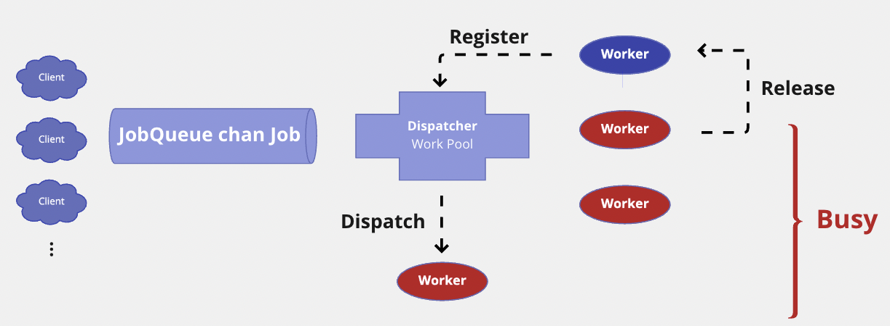

最近在實作數據中台的 service, 由於 service 設計上需要滿足 parallelization 及 high-conccurency 的需求, 軟體架構設計上希望透過 `Worker Pool` 來完成, 也藉此機會精進 `go concurrency control`

偶然間讀到一篇著於 2015 年的文章 [Handling 1 Million Requests per Minute with Go
](http://marcio.io/2015/07/handling-1-million-requests-per-minute-with-golang/), 文章內容深受啟發, 推薦大家有機會可以讀一下原文

本文主要紀錄說明文章精華, 並將程式碼封裝為通用 package component, 簡化所有 service 的 `Worker Pool` 調用流程

# The Problem

初始的需求其實並不複雜, 目標是實現能處理來自百萬 endpoint 發起的大量 `POST` 請求的 `handler`, `handler` 主要功能為將收到的 payloads 上傳至 Amazon S3 bucket

# From Beginning

開始先定義 HTTP request payload 及上傳至 S3 method:

```go
type PayloadCollection struct {
	WindowsVersion  string    `json:"version"`
	Token           string    `json:"token"`
	Payloads        []Payload `json:"data"`
}

type Payload struct {
    // [redacted]
}

func (p *Payload) UploadToS3() error {
    // the storageFolder method ensures that there are no name collision in
    // case we get same timestamp in the key name
    storage_path := fmt.Sprintf("%v/%v", p.storageFolder, time.Now().UnixNano())

	bucket := S3Bucket

	b := new(bytes.Buffer)
	encodeErr := json.NewEncoder(b).Encode(payload)
	if encodeErr != nil {
		return encodeErr
	}

    // Everything we post to the S3 bucket should be marked 'private'
    var acl = s3.Private
	var contentType = "application/octet-stream"

	return bucket.PutReader(storage_path, b, int64(b.Len()), contentType, acl, s3.Options{})
}
```

每個 payload 啟用一個 `goroutine` 處理, 達到平行處理請求目的:

```go
func payloadHandler(w http.ResponseWriter, r *http.Request) {

    if r.Method != "POST" {
		w.WriteHeader(http.StatusMethodNotAllowed)
		return
	}

    // Read the body into a string for json decoding
	var content = &PayloadCollection{}
	err := json.NewDecoder(io.LimitReader(r.Body, MaxLength)).Decode(&content)
    if err != nil {
		w.Header().Set("Content-Type", "application/json; charset=UTF-8")
		w.WriteHeader(http.StatusBadRequest)
		return
	}

    // Go through each payload and queue items individually to be posted to S3
    for _, payload := range content.Payloads {
        go payload.UploadToS3()   // <----- DON'T DO THIS
    }

    w.WriteHeader(http.StatusOK)
}
```

這種方式簡單易懂, 在一般使用場景下也不會有什麼問題, 但是在 `high-conconcurrency` 場景下, 如果不對 `goroutine` 做 `concurrency control` 可能會面臨 CPU, Memory 竄升直至系統崩潰, 若處理過程涉及 disk 讀寫, 則 system loading 更會呈指數級成長

若要面對每分鐘 100 萬的 `POST` requests, 這種實現方式系統可能很快就被打掛了

# Round Two

用 `buffered channel` 當作 job queue, 如此便可以透過控制 queue item 的數量達到系統資源控管, 不會因突然拉升的 request 導致系統癱瘓:

```go
var Queue chan Payload

func init() {
    Queue = make(chan Payload, MAX_QUEUE)
}

func payloadHandler(w http.ResponseWriter, r *http.Request) {
    ...
    // Go through each payload and queue items individually to be posted to S3
    for _, payload := range content.Payloads {
        Queue <- payload
    }
    ...
}
```

而後再單獨啟 processor 去 consume job queue 並處理上傳任務:

```go
func StartProcessor() {
    for {
        select {
        case job := <-Queue:
            job.payload.UploadToS3()  // <-- STILL NOT GOOD
        }
    }
}
```

如此一來雖然解決了 `goroutine` 失控的問題, 但依然沒有解決如何在 `high-concurrency` 環境下平行處理大量請求, 這種方式還是 `single-thread` 處理請求, 效能反而更糟

# Final War

採用兩層 `channel` 設計, 一個 channel 作爲 job queue 儲存待處理的 job, 另一個 channel 則用來作 worker control

空閒的 `Worker` 會註冊到 `wokerPool` 中等待分配 `Job`, `Dispatcher` 會將 `Job` 分配到空閒 `Worker` 的 `jobChannel` 中, `Worker` 從 `jobChannel` 中接收 `Job` 並處理, 處理結束後再次註冊至 `wokerPool` 等待下一次 dispatch, 循環往復:

```go
var (
	MaxWorker = os.Getenv("MAX_WORKERS")
	MaxQueue  = os.Getenv("MAX_QUEUE")
)

// Job represents the job to be run
type Job struct {
	Payload Payload
}

// A buffered channel that we can send work requests on.
var JobQueue chan Job

// Worker represents the worker that executes the job
type Worker struct {
	WorkerPool  chan chan Job
	JobChannel  chan Job
	quit    	chan bool
}

func NewWorker(workerPool chan chan Job) Worker {
	return Worker{
		WorkerPool: workerPool,
		JobChannel: make(chan Job),
		quit:       make(chan bool)}
}

// Start method starts the run loop for the worker, listening for a quit channel in
// case we need to stop it
func (w Worker) Start() {
	go func() {
		for {
			// register the current worker into the worker queue.
			w.WorkerPool <- w.JobChannel

			select {
			case job := <-w.JobChannel:
				// we have received a work request.
				if err := job.Payload.UploadToS3(); err != nil {
					log.Errorf("Error uploading to S3: %s", err.Error())
				}

			case <-w.quit:
				// we have received a signal to stop
				return
			}
		}
	}()
}

// Stop signals the worker to stop listening for work requests.
func (w Worker) Stop() {
	go func() {
		w.quit <- true
	}()
}

type Dispatcher struct {
	// A pool of workers channels that are registered with the dispatcher
	WorkerPool chan chan Job
}

func NewDispatcher(maxWorkers int) *Dispatcher {
	pool := make(chan chan Job, maxWorkers)
	return &Dispatcher{WorkerPool: pool}
}

func (d *Dispatcher) Run() {
    // starting n number of workers
	for i := 0; i < d.maxWorkers; i++ {
		worker := NewWorker(d.pool)
		worker.Start()
	}

	go d.dispatch()
}

func (d *Dispatcher) dispatch() {
	for {
		select {
		case job := <-JobQueue:
			// a job request has been received
			go func(job Job) {
				// try to obtain a worker job channel that is available.
				// this will block until a worker is idle
				jobChannel := <-d.WorkerPool

				// dispatch the job to the worker job channel
				jobChannel <- job
			}(job)
		}
	}
}
```

當 handler 接收到 `HTTP POST` request 就會將 `Job` push 到 `JobQueue`, 隨後 `Dispatcher` 會將 `Job` 取出並 dispatch 給 idle worker 處理, 達到並行處理的目的

```go
func payloadHandler(w http.ResponseWriter, r *http.Request) {

    if r.Method != "POST" {
		w.WriteHeader(http.StatusMethodNotAllowed)
		return
	}

    // Read the body into a string for json decoding
	var content = &PayloadCollection{}
	err := json.NewDecoder(io.LimitReader(r.Body, MaxLength)).Decode(&content)
    if err != nil {
		w.Header().Set("Content-Type", "application/json; charset=UTF-8")
		w.WriteHeader(http.StatusBadRequest)
		return
	}

    // Go through each payload and queue items individually to be posted to S3
    for _, payload := range content.Payloads {

        // let's create a job with the payload
        work := Job{Payload: payload}

        // Push the work onto the queue.
        JobQueue <- work
    }

    w.WriteHeader(http.StatusOK)
}

func main() {
  // create dispatcher and initialize worker, listen and dispactch job from JobQueue
  d := NewDispatcher(MaxWorker)
  d.Run()
  http.HandleFunc("/payload", payloadHandler)
  log.Fatal(http.ListenAndServe(":8099", nil))
}
```

另外 `JobQueue` 及 `WorkerPool` 皆為 `buffered channel`, buffer 長度可由外部參數或環境變數決定, 增加了系統彈性:

```go
var (
	MaxWorker = os.Getenv("MAX_WORKERS")
	MaxQueue  = os.Getenv("MAX_QUEUE")
)
```

到目前為止, 已經完成最開始問題所設定的目標, 即在 concurrency control 的前提下完成 parallelization, 最大化執行效能且最小化 memory overhead

但如果日後想在其他場景也能使用 worker pool, 還需要將程式碼進行封裝及抽象, 已讓任何類型的業務邏輯也能輕鬆調用 worker pool

# Follow Up

首先將 `Job struct` 抽象為 `Job interface`, 並定義一個抽象方法 `Execute()`

外部調用時可以自定義 job struct 並 implement `Execute()`, 即可輕鬆調用 work pool package

另外也將 `maxWorkers` 及 `maxJobs` 最為參數封裝到 `NewDispatcher()`, 在調用時可以直接指定 `worker pool` 及 `job queue` 的大小, 進一步簡化 configuration 的過程:

```go
var JobQueue chan Job

type Job interface {
	Execute()
}

type Worker struct {
	WorkerPool chan chan Job
	JobChannel chan Job
	done       chan bool
}

func NewWorker(workerPool chan chan Job) Worker {
	return Worker{
		WorkerPool: workerPool,
		JobChannel: make(chan Job),
		done:       make(chan bool),
	}
}

// Start method starts the run loop for the worker, listening for a done channel in
// case we need to stop it
func (w Worker) Start() {
	go func() {
		for {
			// register the current worker into the worker pool.
			w.WorkerPool <- w.JobChannel

			select {
			case job := <-w.JobChannel:
				// we have received a work request.
				job.Execute()

			case <-w.done:
				// we have received a signal to stop
				return
			}
		}
	}()
}

func (w Worker) Stop() {
	go func() {
		w.done <- true
	}()
}

type Dispatcher struct {
	// A pool of workers channels that are registered with the dispatcher
	WorkerPool chan chan Job
	maxWorkers int
	maxJobs    int
}

func NewDispatcher(maxWorkers int, maxJobs int) *Dispatcher {
	JobQueue = make(chan Job, maxJobs)
	pool := make(chan chan Job, maxWorkers)

	return &Dispatcher{WorkerPool: pool, maxJobs: maxJobs, maxWorkers: maxWorkers}
}

func (d *Dispatcher) Run() {
	// starting n number of workers
	for i := 0; i < d.maxWorkers; i++ {
		worker := NewWorker(d.WorkerPool)
		worker.Start()
	}

	go d.dispatch()
}

func (d *Dispatcher) dispatch() {
	for {
		select {
		case job := <-JobQueue:
			// a job request has been received
			go func(job Job) {
				// try to obtain a worker job channel that is available.
				// this will block until a worker is idle
				jobChannel := <-d.WorkerPool

				// dispatch the job to the worker job channel
				jobChannel <- job
			}(job)
		}
	}
}
```

以下為一個簡單的 test case, 任務為將 `byte[]` 反覆 encoding/decoding 100 次:

```go
type mockJob struct {
	payload []byte
}

func (m *mockJob) Execute() {
	b := m.payload
	for i := 0; i < 100; i++ {
		var mt map[string]interface{}

		_ = json.Unmarshal(b, &mt)
		b, _ = json.Marshal(mt)
	}
}

func Test_WorkerPool(t *testing.T) {
	var request = 1000

	d := NewDispatcher(100, 100)
	d.Run()

	for i := 0; i < request; i++ {
		j := &mockJob{
			payload: []byte(`
				"person": {
					"name": {
					  "first": "Leonid",
					  "last": "Bugaev",
					  "fullName": "Leonid Bugaev"
					},
					"github": {
					  "handle": "buger",
					  "followers": 109
					},
					"avatars": [
					  { "url": "https://avatars1.githubusercontent.com/u/14009?v=3&s=460", "type": "thumbnail" }
					]
				  },
				  "company": {
					"name": "Acme"
				  }
			`),
		}
		JobQueue <- j
		t.Log("Operation successful")
	}
}

func Benchmark_Worker_Pool(b *testing.B) {
	d := NewDispatcher(100, 100)
	d.Run()

	for i := 0; i < b.N; i++ {
		j := &mockJob{
			payload: []byte(`
				"person": {
					"name": {
					  "first": "Regy",
					  "last": "Chang",
					  "fullName": "Handsome Guy"
					},
					"github": {
					  "handle": "regy",
					  "followers": 3
					},
					"avatars": [
					  { "url": "https://avatars1.githubusercontent.com/u/14009?v=3&s=460", "type": "thumbnail" }
					]
				  },
				  "company": {
					"name": "NexAIoT"
				  }
			`),
		}
		JobQueue <- j
	}
}
```

# Summary

下圖完美詮釋了 `Worker Pool in Go` 的概念:


整個 `Worker Pool` work flow 如下圖:



總結一下這個 worker pool 有以下功能:
- Execute concurrent job by goroutine
- Flexibility with the definition of job running
- Limiting the number of jobs executed over a period of time