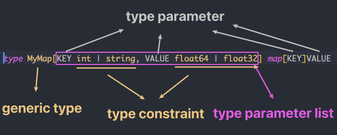
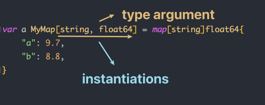

- [Interface](#interface)
  - [Nil Interface](#nil-interface)
  - [Polymorphism with Open Closed Principle](#polymorphism-with-open-closed-principle)
  - [Composition Instead of Inheritance](#composition-instead-of-inheritance)
- [Generic](#generic)
  - [Beginning From Parameter & Argument](#beginning-from-parameter--argument)
  - [Generic in Go](#generic-in-go)
  - [Type Parameter, Type Argument, Type Constraint & Generic Type](#type-parameter-type-argument-type-constraint--generic-type)
    - [Other Generic Types](#other-generic-types)
    - [Nested Type Parameter](#nested-type-parameter)
    - [Syntax Error](#syntax-error)
    - [Special Generic](#special-generic)
    - [Nested Generic](#nested-generic)
    - [Generic With Anonymous](#generic-with-anonymous)
  - [Generic Receiver](#generic-receiver)
    - [Queue Implementation Base On Generic Type](#queue-implementation-base-on-generic-type)
    - [Dynamic Checkout Variable Type](#dynamic-checkout-variable-type)

# Interface

Interface 是一組抽象方法集合(未實現方法/僅包含方法名參數返回值的方法), 如果 implement interface 中所有 methods, 即該類型物件實現了此 interface

interface 定義語法：

```go
type interfaceName interface {  
    //methods 
}  
```

```go
package main

import "fmt"

type Human struct {
    name string
    age int
    phone string
}

type Student struct {
    Human //anonymous field
    school string
    loan float32
}

type Employee struct {
    Human //anonymous field
    company string
    money float32
}

//Human implement SayHi method
func (h Human) SayHi() {
    fmt.Printf("Hi, I am %s you can call me on %s\n", h.name, h.phone)
}

//Human implement SayHi method
func (h Human) Sing(lyrics string) {
    fmt.Println("La la la la...", lyrics)
}

//Employee overwrite Human SayHi method
func (e Employee) SayHi() {
    fmt.Printf("Hi, I am %s, I work at %s. Call me on %s\n", e.name,
        e.company, e.phone)
    }

// Interface Men 被 Human,Student 和 Employee implement
// 因為這三個 struct 都 implement 下面兩個 methods
type Men interface {
    SayHi()
    Sing(lyrics string)
}

func main() {
    mike := Student{Human{"Mike", 25, "222-222-XXX"}, "MIT", 0.00}
    paul := Student{Human{"Paul", 26, "111-222-XXX"}, "Harvard", 100}
    sam := Employee{Human{"Sam", 36, "444-222-XXX"}, "Golang Inc.", 1000}
    tom := Employee{Human{"Tom", 37, "222-444-XXX"}, "Things Ltd.", 5000}

    //定義 Men type 的變數 i
    var i Men

    //i 能承載 Student
    i = mike
    fmt.Println("This is Mike, a Student:")
    i.SayHi()
    i.Sing("November rain")

    //i 也能承載 Employee
    i = tom
    fmt.Println("This is tom, an Employee:")
    i.SayHi()
    i.Sing("Born to be wild")

    //宣告 slice Men
    fmt.Println("Let's use a slice of Men and see what happens")
    x := make([]Men, 3)
    //三個不同 type element 都 implement Men interface
    x[0], x[1], x[2] = paul, sam, mike

    for _, value := range x{
        value.SayHi()
    }
}
```

## Nil Interface

Nil interface (interface{}) 不包含任何 method, 所有的類型都實現了 nil interface. 

Nil interface 在需要承載任意類型的值時相當有用, 類似 C 中的 `void*`

```go
// define a nil interface
var a interface{}
var i int = 5
s := "Hello world"
// a 可以承載任意類型值
a = i
a = s
```

那如何知道這個 interface 變數實際保存了哪種類型的物件？目前常用的兩種方法：
- switch
- Comma-ok

Switch check
```go
type Element interface{}
type List [] Element

type Person struct {
    name string
    age int 
}

//print
func (p Person) String() string {
    return "(name: " + p.name + " - age: "+strconv.Itoa(p.age)+ " years)"
}

func main() {
    list := make(List, 3)
    list[0] = 1 //an int 
    list[1] = "Hello" //a string
    list[2] = Person{"Dennis", 70} 

    for index, element := range list{
        switch value := element.(type) {
            case int:
                fmt.Printf("list[%d] is an int and its value is %d\n", index, value)
            case string:
                fmt.Printf("list[%d] is a string and its value is %s\n", index, value)
            case Person:
                fmt.Printf("list[%d] is a Person and its value is %s\n", index, value)
            default:
                fmt.Println("list[%d] is of a different type", index)
        }   
    }   
}
```

Comma-ok check

```go
func main() {
    list := make(List, 3)
    list[0] = 1 // an int
    list[1] = "Hello" // a string
    list[2] = Person{"Dennis", 70}

    for index, element := range list {
        if value, ok := element.(int); ok {
            fmt.Printf("list[%d] is an int and its value is %d\n", index, value)
        } else if value, ok := element.(string); ok {
            fmt.Printf("list[%d] is a string and its value is %s\n", index, value)
        } else if value, ok := element.(Person); ok {
            fmt.Printf("list[%d] is a Person and its value is %s\n", index, value)
        } else {
            fmt.Printf("list[%d] is of a different type\n", index)
        }
    }
}
```

## Polymorphism with Open Closed Principle

OCP 描述軟體實體(類型, 模組, 函數等)應該是可擴展但不能被修改的

```go
package main

import (  
    "fmt"
)

type SalaryCalculator interface {  
    CalculateSalary() int
}

type Permanent struct {  
    empId    int
    basicpay int
    pf       int
}

type Contract struct {  
    empId  int
    basicpay int
}

//salary of permanent employee is sum of basic pay and pf
func (p Permanent) CalculateSalary() int {  
    return p.basicpay + p.pf
}

//salary of contract employee is the basic pay alone
func (c Contract) CalculateSalary() int {  
    return c.basicpay
}

/*
total expense is calculated by iterating though the SalaryCalculator slice and summing  
the salaries of the individual employees  
*/
func totalExpense(s []SalaryCalculator) {  
    expense := 0
    for _, v := range s {
        expense = expense + v.CalculateSalary()
    }
    fmt.Printf("Total Expense Per Month $%d", expense)
}

func main() {  
    pemp1 := Permanent{1, 5000, 20}
    pemp2 := Permanent{2, 6000, 30}
    cemp1 := Contract{3, 3000}
    employees := []SalaryCalculator{pemp1, pemp2, cemp1}
    totalExpense(employees)

}
```

`SalaryCalculator` interface 的設計使得 `totalExpense` 可以擴展新的員工類型而不需要修改任何程式碼.

若公司新增了一種員工類型 `Freelancer` 且有著不同的薪資結構, `Freelancer` 只需傳遞到 `totalExpense` slice parameter, 不需要修改 `totalExpense` method 本身.

只要 `Freelancer` 也實現 `SalaryCalculator` interface 即可實現

## Composition Instead of Inheritance

Go 中沒有提供繼承機制, 但可以通過 embedding interface 來創建一個新 interface 實現

```go
package main

import (  
    "fmt"
)

type SalaryCalculator interface {  
    DisplaySalary()
}

type LeaveCalculator interface {  
    CalculateLeavesLeft() int
}

type EmployeeOperations interface {  
    SalaryCalculator
    LeaveCalculator
}

type Employee struct {  
    firstName string
    lastName string
    basicPay int
    pf int
    totalLeaves int
    leavesTaken int
}

func (e Employee) DisplaySalary() {  
    fmt.Printf("%s %s has salary $%d", e.firstName, e.lastName, (e.basicPay + e.pf))
}

func (e Employee) CalculateLeavesLeft() int {  
    return e.totalLeaves - e.leavesTaken
}

func main() {  
    e := Employee {
        firstName: "Naveen",
        lastName: "Ramanathan",
        basicPay: 5000,
        pf: 200,
        totalLeaves: 30,
        leavesTaken: 5,
    }
    var empOp EmployeeOperations = e
    empOp.DisplaySalary()
    fmt.Println("\nLeaves left =", empOp.CalculateLeavesLeft())
}
```

創建新 interface `EmployeeOperations` 並嵌套兩個 interface: `SalaryCalculator` & `LeaveCalculator`.

如果一個類型定義了 `SalaryCalculator` 及 `LeaveCalculator` interface 中的 method, 就稱該類型實現了 `EmployeeOperations` interface

# Generic

2022.03.15, 飽受爭議又備受期待的 `generic` 終於隨著 Go@v1.18 release 了

## Beginning From Parameter & Argument

假設目前有一個計算兩數之和的函式:

```go
func Add(a int, b int) int {
    return a + b
}
```

這個函式很簡單, 但有個問題: **其無法計算 `int` 型別之外的和**

如果想計算 float 或 string 的和則需要實現不同型別的不同函式:

```go
func AddFloat32(a float32, b float32) float32 {
    return a + b
}

func AddString(a string, b string) string {
    return a + b
}
```

除此之外還有其他更好的實現方式嗎? 這裡先來回顧一下函式的 `parameter` 及 `argument` 的概念:

```go
// var a, b are parameter, "a int, b int" is a parameter list
func Add(a int, b int) int {  
    return a + b
}

Add(100,200) // 100, 200 are argument
```

函式的 `parameter` 只是類似佔位符的存在, 並沒有具體的值, 只有當函式調用並傳入 `argument` 之後才有具體的值

若將 `parameter` 及 `argument` 概念延伸, 為變數的型別也引入類似 `parameter` 及 `argument` 的概念, 上述問題就迎刃而解, 這裡將其稱為 `type parameter` 和 `type argument`:

```go
// 假設 T 為 type parameter, 則定義函式時其型別是不確定的, 類似佔位符
func Add(a T, b T) T {  
    return a + b
}
```

上面這段 pseudocode 中 `T` 被稱為 `type parameter`, 其不是具體型別, 定義函式時型別不確定, 需要在調用函式時傳入具體類型

如此一來就能達到一個函式同時支援多個不同類型的目的了, 這裡被傳入的具體型別稱為 `type argument`:

```go
// [T=int] 中的 int type argument, 表示函示 Add() 定義中的 type parameter T 全部被 int 替換
Add[T=int](100, 200)  
// 傳入 type argument int 之後, Add() 函式的定義近似成:
func Add( a int, b int) int {
    return a + b
}

// 當想要計算 string 之和時就傳入 string 當作 type argument
Add[T=string]("Hello", "World") 
// 傳入 type argument string 之後, Add() 函式的定義近似成:
func Add( a string, b string) string {
    return a + b
}
```

通過引入 `type argument` 和 `type parameter` 兩個概念, 可以讓一個函式擁有處理多種不同型別資料的能力, 稱為 `generic programming`

雖然通過 `interface` + `reflection` 也能實現動態資料處理, 但其有很多問題:
- 使用上麻煩
- 失去了 compile time type checking 功能, 容易出錯
- 性能不理想

而 `generic` 的引入能解決上述問題, 但 `generic` 也無法解決全部問題, 依然有自己適用的場景

> 若需要為不同型別撰寫相同邏輯的程式碼, 使用 `generic` 將是最適合的選擇

## Generic in Go

通過上述 pseudocode, 實際上對 Go 中的 generic programming 有了最初步也最重要的認知: `type parameter` 和 `type argument`, Go@v1.18 也是通過這種方式實現 `generic programming`, 除此之外還引入非常多新概念:
- type parameter
- type argument
- type parameter list
- type constraint
- instantiations
- generic receiver
- generic function

## Type Parameter, Type Argument, Type Constraint & Generic Type

觀察下面簡單的例子:

```go
type IntSlice []int

var a IntSlice = []int{1, 2, 3} // correct
var b IntSlice = []float32{1.0, 2.0, 3.0} // ✗ incorrect
```

因為 IntSlice 底層型別為 []int, float 型別的 slice 無法賦值

若想要定義一個可以容納 `float32` 或 `string` 等其他型別的 slice 怎麼辦? 可以直接為每種型別定義新型別:

```go
type StringSlice []string
type Float32Slie []float32
type Float64Slice []float64
```

但其結構都相同, 只是成員型別不同就需要重新定義這麼多的新型別, 若使用 `generic` 的方式, 就只需定義一個型別代表上述所有型別:

```go
type Slice[T int|float32|float64 ] []T
```

不同於一般型別定義, 這裡型別名稱 `Slice` 後面跟著中括號:
- `T` 為 `type parameter`, 定義 `Slice` 型別時 `T` 代表的具體型別不確定, 類似一個佔位符
- `int|float32|float64` 被稱為 `type constraint`, `|` 作用為告訴 compiler `type parameter T` 只能接受 `int`, `float32` 或 `float64` 這三種型別的 argument
- ` T int|float32|float64` 定義了所有 `type parameter`, 稱其為 `type parameter list`
- 此處新定義的型別名稱為 `Slice[T]`

> 型別定義中使用 `type parameter` 型別, 則稱為 `generic type`

`generic type` 不能直接使用, 必須傳入 `type argument` 將其確定為具體型別後才可用, 而傳入 `type argument` 確定具體型別的行為稱為 `Instantiations`

```go
// 傳入 type argument int, generic type Slice[T] 被實體化為具體型別  Slice[int]
var a Slice[int] = []int{1, 2, 3}  
fmt.Printf("Type Name: %T",a)  //output -> Type Name: Slice[int]

// 傳入 type argument float32, 將 generic type Slice[T] 實體化為具體型別 Slice[string]
var b Slice[float32] = []float32{1.0, 2.0, 3.0} 
fmt.Printf("Type Name: %T",b)  //output -> Type Name: Slice[float32]

// ✗ Incorrect, var a 型別為 Slice[int], b 型別為 Slice[float32], 兩者型別不同
a = b  

// ✗ Incorrect, string 不在 type constraint int|float32|float64 中, 不能用來實體化 generic type
var c Slice[string] = []string{"Hello", "World"} 

// ✗ Incorrect, Slice[T] 為 generic type, 不可直接使用必須實體化為具體的型別
var x Slice[T] = []int{1, 2, 3} 
```

對於上述例子, 需要先為 `generic type Slice[T]` 傳入 `type argument int`, 如此一來 `generic type` 就會被實體化為具體型別 `Slice[int]`, 被實體化之後的型別定義可近似為:

```go
// 定義一個普通型別 Slice[int], 其底層型別為 []int
type Slice[int] []int     
```

用實體化後的型別 `Slice[int]` 聲明一個新的變數 `a`, 可以儲存 `int` 型別的 slice, 再用同樣的方式實體化另一個型別 `Slice[float32]` 並聲明變數 `b`

因為變數 `a` 和 `b` 為具體的不同型別(`Slice[int]` & `Slice[float32]`), 所以不同型別間的變數賦值是不允許的

同時因為 `Slice[T]` 的 `type constraint` 限定只能使用 `int` 或 `float32` 來實體化, 所以 `Slice[string]` 也是不允許的

實際應用中 `type parameter` 數量可以超過一個:

```go
// MyMap 型別定義了兩個 type parameter KEY 和 VALUE, 並分別指定了不同的 type constranit
// 此 generic type 名稱為: MyMap[KEY, VALUE]
type MyMap[KEY int | string, VALUE float32 | float64] map[KEY]VALUE  

// 用 type argument string 和 flaot64 替換 type parameter KEY, VALUE, generic type 被實體化為具體型別 MyMap[string, float64]
var a MyMap[string, float64] = map[string]float64{
    "jack_score": 9.6,
    "bob_score":  8.4,
}
```

簡單總結:
- `KEY` 和 `VALUE` 為 `type parameter`
- `int|string` 為 `KEY` 的 `type constraint`, `float32|float64` 為 `VALUE` 的 `type constraint`
- `KEY int|string, VALUE float32|float64` 為 `type parameter list`
- `Map[KEY,VALUE]` 為 `generic type`, 型別名稱為 `Map[KEY,VALUE]`
- `var a MyMap[string, float64] = xx` 中的 `string` 和 `float64` 為 `type argument`, 用於替換 `KEY` 和 `VALUE` 並實體化出具體型別 `MyMap[string, float64]`





### Other Generic Types

所有型別定義都可以使用 `type parameter`:

```go
// generic type struct
type MyStruct[T int | string] struct {  
    Name string
    Data T
}

// generic type interface
type IPrintData[T int | float32 | string] interface {
    Print(data T)
}

// generic type channel
type MyChan[T int | string] chan T
```

### Nested Type Parameter

`type parameter` 可以互相套用:

```go
type WowStruct[T int | float32, S []T] struct {
    Data     S
    MaxValue T
    MinValue T
}
```

任何 `generic type` 都必須傳入 `type argument` 實體化才能使用:

```go
var ws WowStruct[int, []int]
```

上述程式碼中為 `T` 傳入 `type argument int`, 又因 `S` 定義為 `[]T`, 所以 `S` 的 `type argument` 為 `[]int`, 實體化後 `WowStruct[T,S]` 定義如下:

```go
type WowStruct[int, []int] struct {
    Data     []int
    MaxValue int
    MinValue int
}
```

因為 `S` 定義為 `[]T`, 所以一旦 `T` 確認之後 `S` 的 `type argument` 就確定了:

```go
ws := WowStruct[int, []float32]{
        Data:     []float32{1.0, 2.0, 3.0},
        MaxValue: 3,
        MinValue: 1,
}
```

`T` 傳入 `type argument int`, 所以 `S` 的 `type argument` 為 `[]int` 而非 `[]float32`

### Syntax Error

定義 `generic type` 時基礎型別不能只有 `generic parameter`:

```go
type CommonType[T int|string|float32] T
```

`type constraint` 部分語法會被 compiler 誤認為表達式:

```go
//✗ Incorrect, T *int 會被 compiler 判斷為表達式: T 乘以 int, 而非 int pointer
// compiler: 定義一個存放 slice 的 array, array length 為 T 乘以 int
type NewType[T *int] []T

//✗ Incorrect, 同上, * 被判斷為乘號, | 被判斷為 or operation
type NewType2[T *int|*float64] []T 

//✗ Incorrect
type NewType2 [T (int)] []T 
```

> 為了避免上述歧異, 解決方法為給 `type constraint` 包上 `interface{}` 或加上逗號消除歧異:

```go
type NewType[T interface{*int}] []T
type NewType2[T interface{*int|*float64}] []T 

// 若 type constranit 中只有一個型別可以加上逗號消除歧異
type NewType3[T *int,] []T

//✗ Incorrect, 若 type constranit 存在多個型別則無法使用逗號消除歧異
type NewType4[T *int|*float32,] []T 
```

統一推薦使用 `interface{}` 處理

### Special Generic

這裡討論一種較為特殊的 `generic type`:

```go
type Wow[T int | string] int

var a Wow[int] = 123     // compile correct
var b Wow[string] = 123  // compile correct
var c Wow[string] = "hello" // compile error, 因為 hello 無法賦值給底層型別 int
```

這裡雖然使用了 `type parameter`, 但因為型別定義底層型別為 `int`, 所以無論傳入什麼型別的 `type argument` 實體化後的新型別底層型別都為 `int`

### Nested Generic

`generic type` 與普通型別相同, 可以互相嵌套定義出更複雜的新型別:

```go
// 首先定義一個 generic type Slice[T]
type Slice[T int|string|float32|float64] []T

// ✗ Incorrect, generic type Slice[T] type constranit 不包含 uint, uint8
type UintSlice[T uint|uint8] Slice[T]  

// ✓ Correct, 基於 generic type Slice[T] 定義新的 generic type FloatSlice[T], FloatSlice[T] 只接受 float32 和 float64 兩種型別
type FloatSlice[T float32|float64] Slice[T] 

// ✓ Correct, 基於 generic type Slice[T] 定義新的 generic type IntAndStringSlice[T]
type IntAndStringSlice[T int|string] Slice[T]  
// ✓ Correct, 基於 IntAndStringSlice[T] nested 定義出新的 generic type
type IntSlice[T int] IntAndStringSlice[T] 

// Nested generic type with map
type WowMap[T int|string] map[string]Slice[T]
type WowMap2[T Slice[int] | Slice[string]] map[string]T
```

### Generic With Anonymous

使用匿名 struct 時通常會先定義好匿名 struct 並直接初始化:

```go
testCase := struct {
        caseName string
        got      int
        want     int
    }{
        caseName: "test OK",
        got:      100,
        want:     100,
    }
```

但是匿名 struct 無法使用 generic type 做型別定義:

```go
testCase := struct[T int|string] {
        caseName string
        got      T
        want     T
    }[int]{
        caseName: "test OK",
        got:      100,
        want:     100,
    }
```

這一點對於為 genric type 做 unit test 的時候非常麻煩

## Generic Receiver

> Generic 一個最主要的應用場景就是與 receiver 結合使用

定義普通型別之後可以為型別實現方法, 同樣也可以為 generic type 實現方法:

```go
type MySlice[T int | float32] []T

func (s MySlice[T]) Sum() T {
    var sum T
    for _, value := range s {
        sum += value
    }
    return sum
}
```

這個例子為 generic type `MySlice[T]` 新增了一個計算成員總和的方法 `Sum()`:
- 將 `MySlice[T]` 作為 receiver
- 方法返回的參數使用 `type parameter T`
- 方法定義中也可以使用 `type paramter T` (`var sum T`)

使用 `MySlice[T]` 之前需要先用 `type argument` 進行實體化:

```go
var s MySlice[int] = []int{1, 2, 3, 4}
fmt.Println(s.Sum()) // output: 10

var s2 MySlice[float32] = []float32{1.0, 2.0, 3.0, 4.0}
fmt.Println(s2.Sum()) // output: 10.0
```

上述例子用 `type argument int` 實體化了 generic type `MySlice[T]`, 所有 generic type 定義中的 `T` 都被替換為 `int`:

```go
type MySlice[int] []int // 實體化後的型別為 MyIntSlice[int]

func (s MySlice[int]) Sum() int {
    var sum int 
    for _, value := range s {
        sum += value
    }
    return sum
}
```

通過 `generic type receiver`, generic type 實用性得到巨大的擴展, 在沒有 generic type 之前若想實現通用的資料結構如 `heap`, `stack`, `queue`, `linked list` 等, 選擇只有兩個:
- 為每個型別寫一個實現
- 使用 `interface` + `reflection`

有了 generic 後就能非常簡單地創建通用的資料節後了

### Queue Implementation Base On Generic Type

`Queue` 為一種 `FIFO` 的資料結構, 與現實中排隊同理, 資料只能從尾部進入, 從頭部取出

```go
// type constraint 使用 `interface` 型別, 表示所有型別都能用來實體化 generic type Queue[T]
type Queue[T interface{}] struct {
    elements []T
}

// 將資料放入隊尾
func (q *Queue[T]) Put(value T) {
    q.elements = append(q.elements, value)
}

// 從對首取出資料並刪除
func (q *Queue[T]) Pop() (T, bool) {
    var value T
    if len(q.elements) == 0 {
        return value, true
    }

    value = q.elements[0]
    q.elements = q.elements[1:]
    return value, len(q.elements) == 0
}

// Queue 大小
func (q Queue[T]) Size() int {
    return len(q.elements)
}
```

>❗️ 為方便說明, 此 Queue 實現方法為考慮 thread safe 等其他問題

`Queue[T]` 為 generic type, 使用前須實體化:

```go
var q1 Queue[int]  // 可儲存 int 型別的 Queue
q1.Put(1)
q1.Put(2)
q1.Put(3)
q1.Pop() // 1
q1.Pop() // 2
q1.Pop() // 3

var q2 Queue[string]  // 可儲存 string 型別的 Queue
q2.Put("A")
q2.Put("B")
q2.Put("C")
q2.Pop() // "A"
q2.Pop() // "B"
q2.Pop() // "C"

var q3 Queue[struct{Name string}] 
var q4 Queue[[]int] // 可儲存 []int slice 的 Queue
var q5 Queue[chan int] // 可儲存 int channel 的 Queue
var q6 Queue[io.Reader] // 可儲存 interface 的 Queue
// ......
```

### Dynamic Checkout Variable Type

使用 `interface` 時經常會用到 `type assertion` 或 `type switch` 來確認 interface 具體的型別, 並針對不同型別做出不同處裡:

```go
var i interface{} = 123
i.(int) // type assertion

// type switch
switch i.(type) {
    case int:
        // do something
    case string:
        // do something
    default:
        // do something
}
```

那對於 `value T` 這種通過 `type parameter` 定義的變數, 是否能判斷具體型別並針對不同型別做出不同處理呢? 答案是不行:

```go
func (q *Queue[T]) Put(value T) {
    value.(int) // error, generic type variable 不能使用 type assertion

    // error, 不允許使用 type switch 判斷 value 的具體型別
    switch value.(type) {
    case int:
        // do something
    case string:
        // do something
    default:
        // do something
    }
    
    // ...
}
```

雖然 `type switch` 和 `type assertion` 不可用, 但可通過 `reflection` 來達到目的:

```go
func (receiver Queue[T]) Put(value T) {
    // Printf() 可輸出 value type (reflection)
    fmt.Printf("%T", value) 

    // 通過 reflection 可以動態取得變數 value 型別並按情況處理
    v := reflect.ValueOf(value)

    switch v.Kind() {
    case reflect.Int:
        // do something
    case reflect.String:
        // do something
    }

    // ...
}
```

這看似達到了目的, 但當寫出如上程式碼則反應了一個問題:

> 為了避免使用 reflection 而選擇了 generic, 最後卻又在 generic 中使用 reflection

當出現這種情況時應該重新思考需求是否真的需要使用 `generic`

