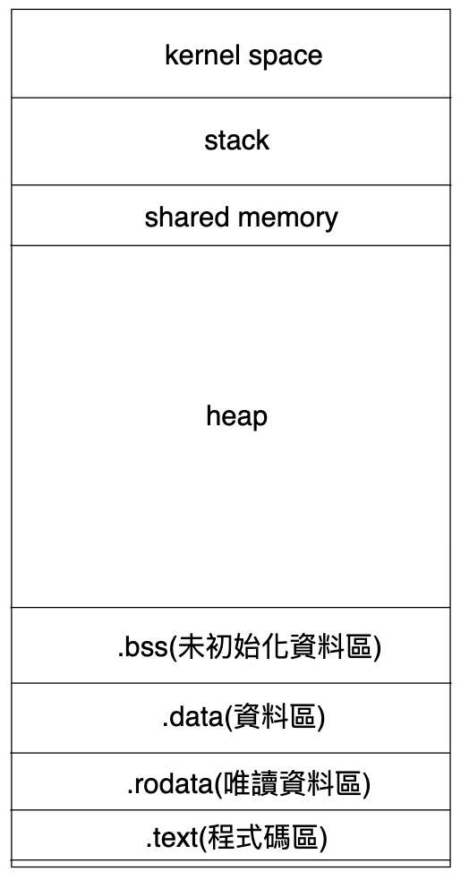

- [Variable](#variable)
  - [Anonymouse Variable](#anonymouse-variable)
- [Constant](#constant)
  - [Literal Constants(unnamed constants)](#literal-constantsunnamed-constants)
  - [iota](#iota)
- [Type](#type)
  - [Type Assertion](#type-assertion)
  - [Type Switch](#type-switch)
  - [Type Conversion](#type-conversion)
    - [strconv](#strconv)
- [Pointer](#pointer)
  - [Memory Allocation](#memory-allocation)
  - [Nil pointer & Wild pointer](#nil-pointer--wild-pointer)
  - [Pointer variable and Memory storage](#pointer-variable-and-memory-storage)
  - [Function parameter](#function-parameter)

# Variable

Go 採用靜態類型, 宣告變數時需指定變數的類型

變數宣告
```go
// 未賦值默認為 0
var a int 
// 宣告時賦值
var a int = 1
// 宣告時賦值
var a = 1
```

var a = 1, 由於 1 是 int 類型, 所以賦值時 a 自動被確認為 int 類型故可以省略類型名稱, 另一種更簡單表述:

```go
a := 1
msg := "Hello World"
```

這裡 `:=` 直接代替了變數的定義及賦值

## Anonymouse Variable

_ 為匿名變數, 會丟棄對應資料不處理. 通常配合函數返回值處理

```go
_, b := 3, 2
```

匿名變數不佔用 namespace, 且不會分配記憶體空間

# Constant

與變數定義相似, 將 `var` 換成 `const`, 且常數在定義時**必須賦值**

常數用來儲存不會發生變化的資料, 例如圓周率, 身分證號碼等, 在整個 runtime 不允許變動的值

```go
package main

import "fmt"

func main(){
    const pi float64 = 3.14159
    // pi = 4.56  compile error
    fmt.Println(pi)

    // 不是使用 :=
    const e = 2.7182
    fmt.Println("e =", e)
}
```

多個常數宣告
```go
const (
    pi = 3.14159
    e = 2.7182
)
```

`const` 同時宣告多個常數時若省略賦值則表示和上一行值相同

```go
const (
    n1 = 99
    n2  // n2 = 99
    n3  // n3 = 99
)
```

## Literal Constants(unnamed constants)

指程式中 hard coding 的 const

```go
23  // 整數類型常數
3.14159  // 浮點數類型常數
3.2+12i  // 復數類型常數
true  // 布林值類型常數
"foo"  // 字符串類型常數
```

## iota

`iota` 是 go 常數計數器, 只能在常數的表達式中使用. 用於生成一組相似規則初始化的常數, 但不用每行都寫一遍初始化表達式

>❗️ 在一個 `const` 宣告語句中, `iota` 將會被設為 0, 並在每一個有常數聲明的行加一

`iota` 可以理解為 `const` 的行索引, 能簡化定義, 在定義枚舉時很有效

```go
package main

import "fmt"

func main(){
    const (
        a = iota  // 0
        b  // 1
        c  // 2
        d  // 3
    )
    fmt.Println(a, b, c, d)
}
```

`iota` 遇到 `const` 會重置為 0

```go
package main

import "fmt"

func main(){
    const (
        a = iota
        b // 1
        c // 2
        d // 3
    )
    fmt.Println(a, b, c, d)
    // iota 遇到 const 重置為 0
    const e = iota  // 0
    fmt.Println(e)
}
```

使用 `_` 跳過某些值

```go
package main

import "fmt"

func main(){
    const (
        a = iota  // 0
        _
        c  // 2
        d  // 3
    )
    fmt.Println(a, c, d)
}
```

`iota` 宣告中插入值

```go
package main

import "fmt"

func main(){
    const (
        a = iota  // 0
        b = 100  // 100
        c = iota  // 2
        d  // 3
    )
    fmt.Println(a, b, c, d)
}
```

常數寫在同一行 iota 值相同, 下一行值 +1

```go
package main

import "fmt"

func main() {
    const(
        a = iota  // 0
        b, c = iota, iota  // 1, 1
        d, e  // 2, 2
        f, g, h = iota, iota, iota  // 3, 3, 3
        i, j, k  // 4, 4, 4
    )
    fmt.Println(a)
    fmt.Println(b, c)
    fmt.Println(d, e)
    fmt.Println(f, g, h)
    fmt.Println(i, j, k)
}
```

為常數賦初始值, 換行後 iota 根據行 +1, 不是根據值 +1

```go
package main

import "fmt"

func main(){
    const (
        a = 6  // 6
        b, c = iota, iota  // 1 1
        d, e  // 2 2
        f, g, h = iota, iota, iota  // 3 3 3
        i, j, k  // 4 4 4
    )
    fmt.Println(a)
    fmt.Println(b, c)
    fmt.Println(d, e)
    fmt.Println(f, g, h)
    fmt.Println(i, j, k)
}
```

若一行中賦值初始值不同, 則下一行的值與上一行的相同

```go
package main

import "fmt"

func main(){
    const (
        a, b = 1, 6  // 1 6
        c, d  // 1 6
        e, f, g = 2, 8, 10  // 2 8 10
        h, i, j  // 2 8 10
    )
    fmt.Println(a, b)
    fmt.Println(c, d)
    fmt.Println(e, f, g)
    fmt.Println(h, i, j)
}
```

若一行中既有賦初始值, 又有 `iota`, 則下一行中對應初始值的位置的值不變, 對應 `iota` 位置的值 +1

```go
package main

import "fmt"

func main(){
    const (
        a, b, c = 3, iota, iota  // 3 0 0
        d, e, f  // 3 1 1
        g, h, i = iota, 16, iota  // 2 16 2
        j, k, l  // 3 16 3
    )
    fmt.Println(a, b, c)
    fmt.Println(d, e, f)
    fmt.Println(g, h, i)
    fmt.Println(j, k, l)
}
```

定義數量級

```go
package main

import "fmt"

func main(){
    const (
        _ = iota
        KB = 1 << (10 * iota)  // 1024
        MB = 1 << (10 * iota)
        GB = 1 << (10 * iota)
        TB = 1 << (10 * iota)
        PB = 1 << (10 * iota)
    )
    fmt.Println(KB, MB, GB, TB, PB)
}
```

# Type

- int
  - 按空間大小分為: `int8`, `int16`, `int32`, `int64`
  - 對應無號整數: `uint8`, `uint16`, `uint32`, `uint64`
- float
  - `float32`, `float64`
- complex
  - 默認類型是 `complex128` 64 bits 實數 + 64 bits 虛數
  - 另一種 `complex64` 32 bits 實數 + 32 bits 虛數
    ```go
    var c1 complex
    c1 = 1 + 2i

    var c2 complex64
    c2 = 2 + 3i

    var c3 complex128
    c3 = 3 + 4i

    fmt.Println(c1)
    fmt.Println(c2)
    fmt.Println(c3)
    ```
- boolean
  - `true`, `false`
  - boolean default `fault`
  - `true`, `false` 均小寫
  - 不允許將 int 轉 bool
  - 無法進行數值運算, 或與其他類型轉換
- string
  - "", 會識別轉譯字符
  - ``, 不會識別轉譯字符, 以原生形式輸出
  - go 使用 UTF-8 encoding, 每個字符佔 1 byte
- alias
  - `byte` 是 `uint8` alias, 表示 ASCII 中一個字符 (1 byte)
  - `rune` 是 `int32` alias, 表示一個 UTF-8 字符, 處理中文日文或其他特殊字符 (4 bytes)

## Type Assertion

通過 type assertion 可以做到以下兩件事:
- 檢查 `i` 是否為 `nil`
- 檢查 `i` 儲存的值是否為某個類型

具體使用方式有兩種:

> 第一種: `t := i.(T)`

這個表達式可以斷言一個 interface object `i` 裡不是 `nil`, 且 interface object `i` 儲存的值類型是 T, 若斷言成功會返回值給 t; 失敗則會觸發 panic

```go
package main

import "fmt"

func main() {
    var i interface{} = 10
    t1 := i.(int)
    fmt.Println(t1)

    fmt.Println("==========")

    t2 := i.(string)
    fmt.Println(t2)
}
```

output:

```go
10
==========
panic: interface conversion: interface {} is int, not string

goroutine 1 [running]:
main.main()
        E:/GoPlayer/src/main.go:12 +0x10e
exit status 2
```

執行第二次斷言的時候失敗且觸發了 panic

若要斷言的 interface value 是 `nil`, 一樣會觸發 panic:

```go
package main

func main() {
    var i interface{} // nil
    var _ = i.(interface{})
}
```

output:

```go
panic: interface conversion: interface is nil, not interface {}

goroutine 1 [running]:
main.main()
        E:/GoPlayer/src/main.go:5 +0x34
exit status 2
```

> 第二種: `t, ok:= i.(T)`

如同第一種, 這個表達式也是可以斷言一個 interface object `i` 值是否為 `nil`, 且 interface object `i` 儲存的值類型是 T, 若斷言成功則會返回其類型給 `t`, 且此時 `ok` 值為 true 表示斷言成功

若 interface value type 並非所斷言的 T 則失敗, 不會觸發 panic, 而是將 `ok` 值設為 false, 此時 `t` 為 T 的零值

```go
package main

import "fmt"

func main() {
    var i interface{} = 10
    t1, ok := i.(int)
    fmt.Printf("%d-%t\n", t1, ok)

    fmt.Println("==========")

    t2, ok := i.(string)
    fmt.Printf("%s-%t\n", t2, ok)

    fmt.Println("==========")

    var k interface{} // nil
    t3, ok := k.(interface{})
    fmt.Println(t3, "-", ok)

    fmt.Println("==========")
    k = 10
    t4, ok := k.(interface{})
    fmt.Printf("%d-%t\n", t4, ok)

    t5, ok := k.(int)
    fmt.Printf("%d-%t\n", t5, ok)
}
```

output:

```go
10-true
==========
-false
==========
<nil> - false
==========
10-true
10-true
```

## Type Switch

若需要區分多種類型, 可以使用 type switch 斷言

```go
package main

import "fmt"

func findType(i interface{}) {
    switch x := i.(type) {
    case int:
        fmt.Println(x, "is int")
    case string:
        fmt.Println(x, "is string")
    case nil:
        fmt.Println(x, "is nil")
    default:
        fmt.Println(x, "not type matched")
    }
}

func main() {
    findType(10)      // int
    findType("hello") // string

    var k interface{} // nil
    findType(k)

    findType(10.23) //float64
}
```

output:

```go
10 is int
hello is string
<nil> is nil
10.23 not type matched
```

> Summary
- 若值為 `nil`, 匹配的是 `case nil`
- 若值在 switch-case 中並沒有匹配對應類型, 那麼匹配的是 default

## Type Conversion

關於數值類型間的轉換只需要調用需轉換的目標類型對應函數即可:

```go
v1 := uint(16)   // 初始化 v1 型別為 unit
v2 := int8(v1)   // 將 v1 轉型成 int8 型別並賦值 v2
v3 := uint16(v2) // 將 v2 轉型為 uint16 型別並賦值 v3
```

>❗️在有號數及無號數, 高位數向低位數轉型時需要特別注意數字的 overflow 及 truncate 問題

```go
v1 := uint(-255)
```

由於 `uint` 是無號整數, 所以上述轉型會報 compile error:

```go
constant -255 overflows uint
```

改寫程式碼如下:

```go
v1 := uint(255)
v2 := int8(v1)  // v2 = -1
```

由於 `int8` 能夠表示的數字範圍為 -128 - 127, 255 超出了其表示範圍, 因此會擷取後 8 位, `v1` 為無號整數且後八位都是 1, `int8` 為有號整數, 最高位數為符號位, 因此轉型後的數字 `v2` 為負數, `11111111` 是這個負數的補數, 因此 `v2` 最終轉型的結果為 -1

整數與浮點數之間的轉型, 小數位數被丟棄:

```go
v1 := 99.99
v2 := int(v1)  // v2 = 99
```

將整數轉型為浮點數:

```go
v1 := 99
v2 := float64(v2)
```

字符串與其他型別之間的轉換:

> 整數型別可以通過對應的 UTF-8 編碼轉型成對應的字符串

```go
v1 := 65
v2 := string(v1)  // v2 = A

v3 := 30028
v4 := string(v3)  // v4 = 界
```

另外還可以將 byte array 或 `rune`(Unicode encoding) array 轉型為字符串:

```go
v1 := []byte{'h', 'e', 'l', 'l', 'o'}
v2 := string(v1)  // v2 = hello

v3 := []rune{114, 101, 103, 121}
v4 := string(v3)  // v4 = regy
```

### strconv

要實現字符串與其他基本型別間轉換可以通過 `strconv` package 提供的函數來完成:

```go
v1 := "100"
v2, err := strconv.Atoi(v1)  // 將字符串轉為整數, v2 = 100

v3 := 100
v4 := strconv.Itoa(v3)   // 將整數轉為字符串, v4 = "100"

v5 := "true"
v6, err := strconv.ParseBool(v5)  // 將字符串轉為 bool
v5 = strconv.FormatBool(v6)  // 將 bool 轉為字符串

v7 := "100"
v8, err := strconv.ParseInt(v7, 10, 64)   // 將字符串轉為整數, 第二個參數表示進制, 第三個參數表示最大位數
v7 = strconv.FormatInt(v8, 10)   // 將整數轉為字符串, 第二個參數表示進制

v9, err := strconv.ParseUint(v7, 10, 64)   // 將字符串轉為無號整數, 參數含義同 ParseInt
v7 = strconv.FormatUint(v9, 10)  // 將字符串轉為無號整數, 參數含義同 FormatInt

v10 := "99.99"
v11, err := strconv.ParseFloat(v10, 64)   // 將字符串轉為浮點數, 第二個參數表示精度
v10 = strconv.FormatFloat(v11, 'E', -1, 64)

q := strconv.Quote("Hello, 世界")    // 為字符串加上引號
q = strconv.QuoteToASCII("Hello, 世界")  // 將字符串轉為 ASCII 編碼
```

# Pointer

Pointer 指代表某個記憶體地址的值, 這個記憶體地址往往是記憶體中一個變數的值的起始位置

Pointer 有幾個特性：
- default: nil
- `&` 取變數記憶體地址, `*` 通過 pointer 訪問目標物件
- 不支持指針運算, 不支持 `->` 運算符, 直接用 `.` 訪問目標物件屬性或方法

```go
package main

import "fmt"

func main(){ 
    var x int = 99
    var p *int = &x

    fmt.Println(p)
}
```

當運行到 `var x int = 99` 時記憶體中會分配一塊空間, 我們為它命名為 `x`. 他在記憶體中的有一個地址, 如 `0xc00000a0c8`. 當我們想訪問這個空間時, 可以使用**記憶體地址**或 `x` 去訪問

運行到 `var p *int = &x` 時, 我們定義一個**指針變數** `p`, `p` 儲存了變數 `x` 的記憶體地址

> 結論是指針就是記憶體地址, 指針變數就是儲存記憶體位置的變數

接著修改 `x` 內容
```go
package main

import "fmt"

func main() {
    var x int = 99
    var p *int = &x

    fmt.Println(p) // 0xc0000182d8

    x = 100

    fmt.Println("x: ", x) // 100
    fmt.Println("*p: ", *p) // 100
    
    *p = 999

    fmt.Println("x: ", x) // 999
    fmt.Println("*p: ", *p) // 999
}
```

- `x` & `*p` 的值是一樣的
- `*p` 稱為 `間接引用`
- `*p = 999` 通過 `x` 變數的記憶體地址來操作 `x` 對應的記憶體空間
- 不管是 `x` or `*p` 操作的都是同一塊記憶體空間

## Memory Allocation



其中 `.data` 存的是初始化後的資料

程式碼存在 stake, 一般 `make()` or `new()` 出來的存在 heap

Stack 用來給函式提供記憶體空間, 在 stack 上存取記憶體

函式調用時會在 call stack 上產生一個 stack frame, 每個獨立的 stack frame 一般包括：

- local variable
- parameter
- call function context

**其中 parameter 與 local variable 存儲地位相同**

當程式運行時首先執行 `main()`, 即產生一個 stack frame

當運行到 `var x int = 99` 時就會在 stack frame 中分配一塊記憶體位置

同理 `var p *int = &x`

## Nil pointer & Wild pointer

Nil pointer: 未被初始化的指針

```go
var p *int
```

這時若想取其值操作 `*p` 則會報錯

Wild pointer: 被一塊無效的記憶體地址空間初始化

```go
var p *int = 0xc00000a0c8
```

## Pointer variable and Memory storage

表達式 `new(T)` 會創建一個 `T` 類型的匿名變數, 為 `T` 類型的新值分配並清空一塊記憶體空間, 然後將這塊記憶體空間地址返回, 而這個結果就是指向這個新的 `T` 類型值的指針值, 返回的指針類型為 `*T`

`new()` 創建的記憶體空間位於 heap 上, 空間的默認值是資料類型的默認值. 如 `p := new(int)` 則 `*p` 為0
```go
package main

import "fmt"

func main(){
    p := new(int)
    fmt.Println(p)
    fmt.Println(*p)
}
```

只需使用 `new()` 函式創建而無需擔心記憶體的生命週期或怎樣將其空間關閉, go GC 會自動做記憶體管理

```go
package main

import "fmt"

func main(){
    p := new(int)
    
    *p = 1000
    
    fmt.Println(p)
    fmt.Println(*p)

    var x int = 10
    var y int = 20
    x = y
}
```

`var y int = 20` 中的 `y` 代表的是記憶體位置, 稱為`左值`; 而 `x = y` 中的 `y` 代表的是**記憶體空間中的值**, 稱作 `右值`

`x = y` 表示的是把 `y` 對應的記憶體空間值寫到 `x` 記憶體空間中

`=` 左邊的變數代表變數指向的**記憶體位置**, 相當於**寫操作**

`=` 右邊的變數代表變數**記憶體空間存的值**, 相當於**讀操作**

```go
p := new(int)

*p = 1000

fmt.Println(*p)
```

`*p = 1000` 意思是將 1000 寫入 *p 指向的記憶體空間中

而 `fmt.Println(*p)` 則是把 `*p` 的記憶體空間中的值打印出來

若在 funcion 中創建變數：

```go
func foo() {
    p := new(int)

    *p = 1000
}
```

當運行 `foo()` 會產生一個 stack frame, 運行結束會釋放 stack frame

而 `p` 是 `new()` 創建的, 存在在 `heap` 上, 當 stack frame 釋放時 `p` 並沒有消失, `p` 指向的記憶體位置也沒有消失, 於是可以基於這個特性實現 `call by reference`

## Function parameter

函式傳遞參數有兩種：

- pass by reference: 將記憶體位置作為函式參數傳遞
- pass by value: 將 argument(實參)的值拷貝一份給 parameter(行參)

> 無論是 pass by reference or value, 都是 `argument` 將自己的值拷貝給 `parameter`, 只不過值有可能是記憶體地址或是值

pass by value

```go
package main

import "fmt"

func swap(x, y int){
    x, y = y, x
    fmt.Println("swap  x: ", x, "y: ", y)
}

func main(){
    x, y := 10, 20
    swap(x, y)
    fmt.Println("main  x: ", x, "y: ", y)
}
```

output

```go
swap  x:  20 y:  10
main  x:  10 y:  20
```

- 運行 `main()` 時系統在 stack 產生一個 stack frame, 上面有 `x` 及 `y` 兩個變數
- 運行 `swap()` 時系統在 stack 產生一個 stack frame, 上面有 `x` 及 `y` 兩個變數
- 運行 `x, y = y, x` 後交換 `swap()` 產生的 stack frame 中的 `xy` 值, 不影響 `main()` 中的 `xy` 值
- `swap()` 運行完成後釋放 stack frame, 其上的 `x,y` 也隨之消失
- 當運行 `fmt.Println("main x: ", x, "y: ", y)` 時 `xy` 值依舊保持不變

pass by reference

```go
package main

import "fmt"

func swap2(a, b *int){
    *a, *b = *b, *a
}

func main(){
    x, y := 10, 20
    swap(x, y)
    fmt.Println("main  x: ", x, "y: ", y)
}
```

output

```go
main  x:  20 y:  10
```

- 運行 `main()` 並創建 stack frame, 上面有 `xy` 兩個變數
- 運行 `swap()` 並創建 stack frame, 上面有 `ab` 兩個變數
- `ab` 中存儲的值是 `xy` 的記憶體地址
- 當運行 `*a, *b = *b, *a` 時, 左邊的 `*a` 表示 `x` 的記憶體地址, 左邊的 `*b` 表示的是 `y` 的記憶體位置; 右邊的 `*b` 表示 `y` 的值, 右邊的 `*a` 表示的是 `x` 的值
- `main()` 中的 `xy` 被交換
- `swap()` 釋放 stack frame 也不影響被交換結果