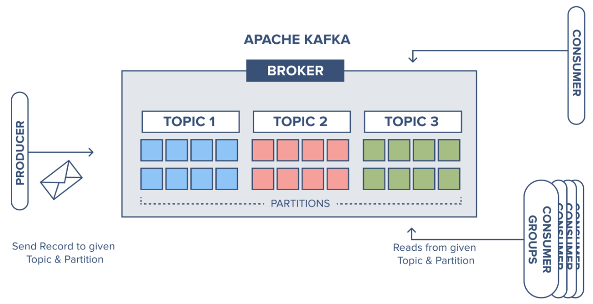

# Kafka

傳統上來說 Kafka 是一個分散式, 基於 `pub/sub` pattern 的 message queue

Message Producer 不會將 message 直接發送給特定的 subscriber, 而是會將 message 分為不同的 topics, subscriber 只接收特定 topic 的 message

Kafka 也被定義為一個 open source 的 `event streaming platform`, 被廣泛使用於高性能的 data pipeline, stream analysis, data integration 及 service application

# Message Queue

目前比較常見的 message queue 主要有 Kafka, ActiveMQ, RabbitMQ, RocketMQ 等

在大數據應用場景下主要採用 Kafka 作為 message queue 的解決方案

傳統的 message queue 主要應用場景包括 `caching`, `decoupling` 及 `asynchronous communication`

- Caching: 有助於控制和優化 data stream 經過系統的速度, 解決 producer 和 consumer 處理速度不一致的問題
- Decoupling: 允許獨立擴展或修改 data source 及 destination 雙邊的處理過程, 只要確保其遵守同樣的 interface 約束
- asyn: 允許 message 放入 queue, 等到需要處理的時候再進行處理, 不需同步處理

Pub/sub pattern 有幾個特點:
- 可以有多個 topic
- consumer consume 後不刪除資料
- 每個 consumer 相互獨立, 都可以 consume 到資料

# Kafka Architecture

- 為了方便擴充並提高 throughput, 一個 topic 可以拆分為多個 partition
- 配合 partition 設計提出 consumer group design, group 內每個 consumer 可並行消費
- 為提升可用性, 可為每個 partition 增加 replication, 類似 NameNode HA(leader, follower)

# Kafka CMD

## kafka-topics.sh

| Arguments            | Type   | Description                            |
| -------------------- | ------ | -------------------------------------- |
| --boostrap-server    | String | 連接 Kafka Broker hostname & port      |
| --topic              | String | 目標 topic name                        |
| --create             | --     | create topic                           |
| --delete             | --     | delete topic                           |
| --alter              | --     | update topic                           |
| --list               | --     | list all topics                        |
| --describe           | --     | inspect topic detail info              |
| --partitions         | --     | setup number of partition              |
| --replication-factor | --     | setup number of replication of partion |
| --config             | --     | update system default config           |

## kafka-console-producer.sh

| Arguments           | Type    | Description                                  | Example                       |
| ------------------- | ------- | -------------------------------------------- | ----------------------------- |
| --bootstrap-server  | String  | `Require: `連接 Kafka Broker hostname & port | host1, host2, host3           |
| --topic             | String  | `Require: `receive topic name                | --                            |
| --broker-list       | String  | `Deprecated: `Source broker server           | host1, host2, host3           |
| --batch-size        | Integer | Messages number in a single batch            | `Default: `200                |
| --compression-codec | String  | Compression encode/decode                    | none, gzip, snappy, lz4, zstd |
| --max-block-ms      | Long    | --                                           | `Default: `60000              |

## kafka-console-consumer.sh

| Arguments          | Type    | Description                                  | Example             |
| ------------------ | ------- | -------------------------------------------- | ------------------- |
| --bootstrap-server | String  | `Require: `連接 Kafka Broker hostname & port | host1, host2, host3 |
| --topic            | String  | Consumed topic                               | --                  |
| --whitelist        | String  | regex                                        | --                  |
| --partition        | Integer | --                                           | --                  |
| --offset           | String  | --                                           | --                  |
| --from-beginning   | --      | --                                           | --                  |
| --max-messages     | Integer | --                                           | --                  |
| --isolation-level  | String  | --                                           | --                  |
| --group            | String  | 指定 consumer group ID                       | --                  |
| --timeout-ms       | Integer | --                                           | --                  |