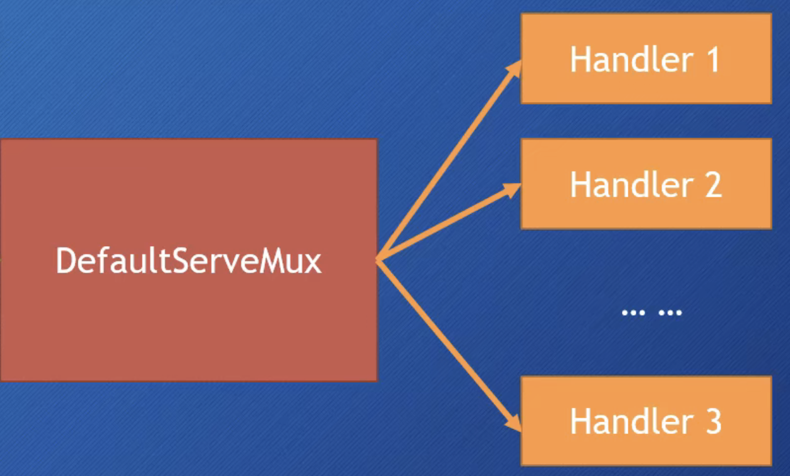
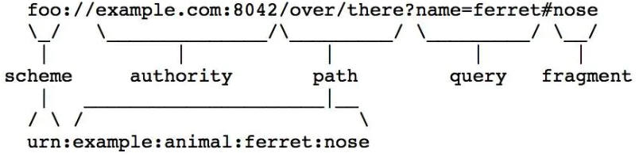
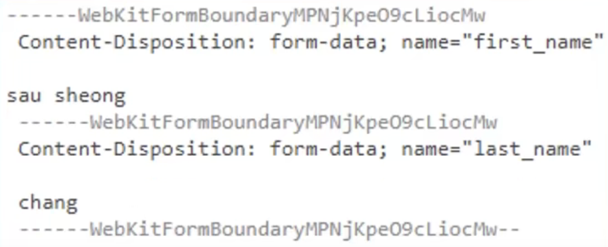

- [net/http](#nethttp)
- [http.Client](#httpclient)
  - [http.Get](#httpget)
  - [http.Post](#httppost)
  - [http.PostForm](#httppostform)
  - [http.Head](#httphead)
  - [(*http.Client).Do](#httpclientdo)
  - [http.Client Data Structures](#httpclient-data-structures)
  - [http.Transport Implementation](#httptransport-implementation)
  - [Transport.RoundTrip() Implementation](#transportroundtrip-implementation)
- [http.Server](#httpserver)
  - [Handler](#handler)
    - [http.Handle](#httphandle)
    - [Build-in Handler](#build-in-handler)
      - [NotFoundHandler](#notfoundhandler)
      - [RedirectHandler](#redirecthandler)
      - [StripPrefix](#stripprefix)
      - [TimeoutHandler](#timeouthandler)
      - [FileServer](#fileserver)
  - [HTTP Request Handle](#http-request-handle)
  - [HTTPS Request Handle](#https-request-handle)
- [HTTP Message](#http-message)
  - [HTTP Request](#http-request)
    - [Request URL](#request-url)
    - [Request Header](#request-header)
    - [Request Body](#request-body)
    - [Form](#form)
    - [PostForm](#postform)
    - [MultipartForm](#multipartform)
      - [FormValue()](#formvalue)
      - [FormFile()](#formfile)
      - [MultipartReader()](#multipartreader)

# net/http

通過 `net.Dial()` 或 `net.DialTimeout` 函數來訪問基於 HTTP 協議的網路服務是完全沒問題的, 因為 HTTP 也是基於 TCP/IP 協議

但若通過 `net.Dial()` 函數進行 HTTP 程式開發, HTTP status code, packet header 和 packet body 的部分處理起來相當繁瑣

因此 Go standard library build-in 的 net/http package 涵蓋了 HTTP client 和 server 的具體實現

# http.Client

net/http package 提供了最簡潔的 HTTP client 實現, 不需借助第三方通訊 library(如 `libcurl`) 即可直接使用 `GET` 和 `POST` 發起 HTTP request

```go
func (c *Client) Do(req *Request) (*Response, error)
func (c *Client) Get(url string) (resp *Response, err error)
func (c *Client) Head(url string) (resp *Response, err error)
func (c *Client) Post(url, contentType string, body io.Reader) (resp *Response, err error)
func (c *Client) PostForm(url string, data url.Values) (resp *Response, err error)
```

## http.Get

調用 `http.Get()`方法並傳入請求 URL 即可發起一個 GET request:

```go
resp, err := http.Get("https://regy.dev") 
if err != nil {    // error handle ...    return }
defer resp.Body.Close() 
io.Copy(os.Stdout, resp.Body)
```

通過 `http.Get` 發起請求時, 默認調用的是上述 `http.Client` 默認物件的 `Get` 方法:

```go
func Get(url string) (resp *Response, err error) {    
    return DefaultClient.Get(url)
}
```

`DefaultClient` 默認指向 `http.Client` 物件實體:

```go
var DefaultClient = &Client{}
```

`http.Get()` 方法返回值有兩個, 第一個是 response 物件, 第二個是 `error` 物件, 若請求過程中出現錯誤, 則 `error` 物件不為 nil; 否則可以通過 response 物件獲得 response status code, response header, response body 等訊息

response 物件是 `http.Response` 類型實體, 一般可以通過 `resp.Body` 獲取 response body, 通過 `resp.Header` 獲得 response header, 通過 `resp.StatusCode` 獲取 response status 

獲得 response 成功後需記得調用 `resp.Body` 的 `Close()` 方法結束網路請求釋放系統資源

## http.Post

調用 `http.Post()` 方法並傳遞以下三個參數:
- 請求目標的 URL
- POST 請求資料的資源類型 (MIME Type)
- data byte stream ([]byte)

下列程式碼演示如何上傳使用者頭貼:

```go
resp, err := http.Post("https://regy.dev/avatar", "image/jpeg", &imageDataBuf) 
if err != nil {    // error handle    return }
if resp.StatusCode != http.StatusOK {     // error handle     return }
// ...
```

底層實現及返回值與 `http.Get()` 相同

## http.PostForm

`http.PostForm()` 方法實現了標準編碼格式 `application/x-www-form-urlencoded` 的 POST 表單提交

下列程式碼模擬 HTML 登錄表單提交:

```go
resp, err := http.PostForm("https://regy.dev/login", url.Values{"name":{"test-user"}, "password": {"test-passwd"}}) 
if err != nil {    // error handle    return } 
if resp.StatusCode != http.StatusOK {     // error handle     return } 
// ...
```

POST 請求參數通過 `url.Valuses` 進行編碼及封裝

底層實現及返回值與 `http.Get()` 相同

## http.Head

HTTP Head 請求表示只請求目標 URL 的 response header, 無需返回 response body

通過 `http.Head()` 方法發起 Head 請求, 與 `http.Get()` 方法相同, 只需傳入目標 URL 參數即可

下列程式碼用於請求首頁的 HTTP Response Header:

```go
resp, err := http.Head("https://regy.dev")
if err != nil {    
    fmt.Println("Request Failed: ", err.Error())    
    return
}
defer resp.Body.Close()

// print header info for 
key, value := range resp.Header  {    
    fmt.Println(key, ":", value)
}
```

## (*http.Client).Do

大多數應用場景 `http.Get`, `http.Post` 和 `http.PostForm` 就可以滿足, 但如果發起的 HTTP request 需要設定更多的自定義 request header, 比如:
- 設定自定義 `User-Agent` 而不是默認的 `Go http package`
- 傳遞 Cookie
- 發起其他方式 HTTP request, 比如 `PUT`, `PATCH`, `DELETE` 等

此時可以通過 `http.Client` 的 `Do()` 方法實現, 此時不再是通過默認的 `DefaultClient` 物件調用 `http.Client` 的方法, 而是需要手動實體化 `Client` 物件並傳入添加了自定義 request header 的請求物件來發起 HTTP request:

```go
// init client request object
req, err := http.NewRequest("GET", "https://regy.dev", nil)
if err != nil { return }

// add custom request header
req.Header.Add("Custom-Header", "Custom-Value")

// ... other config of request header
client := &http.Client{    // ... setup client property}
resp, err := client.Do(req)

if err != nil {    // ... error handle    return}

defer resp.Body.Close()
io.Copy(os.Stdout, resp.Body)
```

用於初始化請求物件的 `http.NewRequest()` 方法需要三個參數:
- Request method
- 目標 URL
- Request 實體 (只有 POST, PUT, DELETE 之類請求需要設置請求實體, 對於 HEAD, GET 只需傳入 nil 即可)

`http.NewRequest()` 方法返回的第一個值就是請求物件實體 `req`, 該實體類型為 `http.Request`

可以調用 `http.Request` 類型的 public methods 對請求物件進行自定義配置, 比如 request method, URL, request header 等

設置完成後將 request object 傳入 `client.Do()` 方法發起 HTTP request, 之後的操作與前四個基本方法一致

## http.Client Data Structures

`http.Get()`、`http.Post()`、`http.PostForm()` 和 `http.Head()` 方法其實都是在 http.DefaultClient 的基礎上調用的

`http.DefaultClient` 是 `net/http` package 提供的 HTTP client 默認實現:

```go
// DefaultClient is the default Client and is used by Get, Head, and Post.var DefaultClient = &Client{}
```

但還是可以基於 `http.Client` 自定義 HTTP client implementation

`Client` 類型的資料結構:

```go

type Client struct {
    // Transport 用於指定單次 HTTP request/response 完整流程
    // 默認值為 DefaultTransport 
    Transport RoundTripper

    // CheckRedirect 用於定義重定向處理策略
    // 它是一個函數類型，接收 req 和 via 兩個參數，分別表示即將發起的請求和已經發起的所有請求，越早的已發起請求在越前面
    // 若不為 nil, Client 將在跟蹤 HTTP 重定向前調用此函數
    // 若返回 error, Client 將直接返回 error, 不會再發起該 request
    // 若為 nil, Client 將採用確認策略, 會在 10 個連續 request 後終止
    CheckRedirect func(req *Request, via []*Request) error

    // Jar 用於指定 request/response header 中的 Cookie 
    //若 field 為 空, 則只有在 request 中顯式設定的 Cookie 才會被發送
    Jar CookieJar

    // 指定單次 HTTP request/response transaction timeout
    // 為設定的話使用 Transport 的默認設置，為零的話表示不設置 timeout
    Timeout time.Duration
```

> Transport

其中 `Transport` field 必須 implement `http.RoundTripper` interface, `Transport` 指定了一次 HTTP transaction (request/response) 的完整流程, 若不指定默認使用 `http.DefaultTransport` 這個默認實現, 比如 `http.DefaultClient`

> CheckRedirect

`CheckRedirect` 函數用於定義處理重定向策略

當使用 `http.DefaultClient` 提供的 `Get()` 或者 `Head()` 方法發送 HTTP request 時, 若 response status code 為 30x(比如 `301`, `302` 等), HTTP Client 會在遵循跳轉規則前先調用 `CheckRedirect` 函數

> Jar

`Jar` 可用於在 HTTP Client 中設置 Cookie, `Jar` 類型必須實現 `http.CookieJar` interface, 該 interface 預定義了 `SetCookies()` 和 `Cookies()` 兩個方法

若 HTTP Client 沒有設置 `Jar`, Cookie 將被忽略而不會發送到 Client, 一般會用 `http.SetCookie()` 方法來設置 Cookie

> Timeout

`Timeout` field 用於指定 `Transport` timeout 時間, 沒有指定的話使用 `Transport` 自定義的設置

## http.Transport Implementation

下面通過 `http.DefaultTransport` 實現來介紹 `http.Transport`, 沒有顯示設置 `Transport` field 時就會使用 `DefaultTransport`:

```go
func (c *Client) transport() RoundTripper {
	if c.Transport != nil {
		return c.Transport
	}
	return DefaultTransport
}
```

`DefaultTransport` 是 `Transport` 的默認實現, 對應的初始化程式碼如下:

```go
var DefaultTransport RoundTripper = &Transport{
	Proxy: ProxyFromEnvironment,
	DialContext: (&net.Dialer{
		Timeout:   30 * time.Second,
		KeepAlive: 30 * time.Second,
	}).DialContext,
	ForceAttemptHTTP2:     true,
	MaxIdleConns:          100,
	IdleConnTimeout:       90 * time.Second,
	TLSHandshakeTimeout:   10 * time.Second,
	ExpectContinueTimeout: 1 * time.Second,
}
```

這裡只設置 `Transport` 的部分屬性, `Transport` 類型完整的資料結構如下:

```go

type Transport struct {
    ...
    
    // 定義 HTTP Proxy 策略
    Proxy func(*Request) (*url.URL, error)
    
    // 用於指定創建未加密 TCP 連接的 context 參數 (透過 net.Dial() 創建連接時使用)
    DialContext func(ctx context.Context, network, addr string) (net.Conn, error)
    // deprecatede，使用 DialContext 替代
    Dial func(network, addr string) (net.Conn, error)
    // 創建加密 TCP 連接
    DialTLS func(network, addr string) (net.Conn, error)
    // 指定 tls.Client 所使用的 TLS 配置
    TLSClientConfig *tls.Config
    // TLS handsharking timeout
    TLSHandshakeTimeout time.Duration
    
    // 是否禁用 HTTP 長連接
    DisableKeepAlives bool
    // 是否對 HTTP 報文進行壓縮傳輸（gzip）
    DisableCompression bool
    
    // 最大空閒連接數（支持長連接時有效）
    MaxIdleConns int
    // 單個服務 (域名) 最大空閒連接數
    MaxIdleConnsPerHost int
    // 單個服務 (域名) 最大連接數
    MaxConnsPerHost int
    // 空閒連接 timeout 時間
    IdleConnTimeout time.Duration

    // 從 Client 將 request 完全提交給 server 到從 server 收到 reponse header timtout 時間
    ResponseHeaderTimeout time.Duration
    // 包含 "Expect: 100-continue" request header 的情況下從 Client 將 request 完全提交給 server 到從 server 收到 reponse header timtout 時間
    ExpectContinueTimeout time.Duration
    
    ...        
}
```

結合 `Transport` 資料結構觀察 `DefaultTransport` 的設置:
- `net.Dialer` 初始化 Dial context config, 默認 timeout 時間為 30 秒
- `MaxIdleConns` 指定最大空閒連接數為 100, 未顯式設定 `MaxIdleConnsPerHost` 和 `MaxConnsPerHost`, `MaxIdleConnsPerHost` 有默認值, 通過 `http.DefaultMaxIdleConnsPerHost` 設置, 默認值為 2
- 通過 `IdleConnTimeout` 指定最大空閒連接時間為 90 秒, 即當某個空閒連接超過 90 秒沒有被復用則銷毀, 空閒連接需要 `DisableKeepAlives` 為 `false` 的情況下才可用, 即 HTTP 長連接狀態下有效 (HTTP/1.1 以上版本支持長連接, 對應 request header `Connection:keep-alive`)
- 通過 `ExpectContinueTimeout` 指定 Client 想要使用 POST 請求把一個很大的報文體發送給 server 時, 先通過發送一個包含了 `Expect: 100-continue` 的 request header, 詢問 server 是否願意接收這個大報文體對應的超時時間，這裡默認設置為 1 秒

另外 `Transport` 包含了 `RoundTrip` 方法實現, 實現了 `RoundTripper` interface

接著來觀察 `Transport` 中 `RoundTrip` 方法的實現

## Transport.RoundTrip() Implementation

`http.RoundTripper` interface 具體定義:

```go
type RoundTripper interface {
    RoundTrip(*Request) (*Response, error)
}
```

`RoundTrip()` 方法用於執行一個獨立的 HTTP transaction, 接受傳入的 `*Request` 作為參數並返回對應的 `*Response`, 以及一個 `error`

底層 Go 通過 WHATWG Fetch API 實現了單次 HTTP request/response transaction:

```go
func (t *Transport) RoundTrip(req *Request) (*Response, error) {
  if useFakeNetwork() {
    return t.roundTrip(req)
  }

  ac := js.Global().Get("AbortController")
  if ac != js.Undefined() {
    // Some browsers that support WASM don't necessarily support
    // the AbortController. See
    // https://developer.mozilla.org/en-US/docs/Web/API/AbortController#Browser_compatibility.
    ac = ac.New()
  }

  opt := js.Global().Get("Object").New()
  // See https://developer.mozilla.org/en-US/docs/Web/API/WindowOrWorkerGlobalScope/fetch
  // for options available.
  opt.Set("method", req.Method)
  opt.Set("credentials", "same-origin")
  if h := req.Header.Get(jsFetchCreds); h != "" {
    opt.Set("credentials", h)
    req.Header.Del(jsFetchCreds)
  }
  if h := req.Header.Get(jsFetchMode); h != "" {
    opt.Set("mode", h)
    req.Header.Del(jsFetchMode)
  }
  if ac != js.Undefined() {
    opt.Set("signal", ac.Get("signal"))
  }
  headers := js.Global().Get("Headers").New()
  for key, values := range req.Header {
    for _, value := range values {
      headers.Call("append", key, value)
    }
  }
  opt.Set("headers", headers)

  if req.Body != nil {
    // TODO(johanbrandhorst): Stream request body when possible.
    // See https://bugs.chromium.org/p/chromium/issues/detail?id=688906 for Blink issue.
    // See https://bugzilla.mozilla.org/show_bug.cgi?id=1387483 for Firefox issue.
    // See https://github.com/web-platform-tests/wpt/issues/7693 for WHATWG tests issue.
    // See https://developer.mozilla.org/en-US/docs/Web/API/Streams_API for more details on the Streams API
    // and browser support.
    body, err := ioutil.ReadAll(req.Body)
    if err != nil {
      req.Body.Close() // RoundTrip must always close the body, including on errors.
      return nil, err
    }
    req.Body.Close()
    a := js.TypedArrayOf(body)
    defer a.Release()
    opt.Set("body", a)
  }
  respPromise := js.Global().Call("fetch", req.URL.String(), opt)
  var (
    respCh = make(chan *Response, 1)
    errCh  = make(chan error, 1)
  )
  success := js.FuncOf(func(this js.Value, args []js.Value) interface{} {
    result := args[0]
    header := Header{}
    // https://developer.mozilla.org/en-US/docs/Web/API/Headers/entries
    headersIt := result.Get("headers").Call("entries")
    for {
      n := headersIt.Call("next")
      if n.Get("done").Bool() {
        break
      }
      pair := n.Get("value")
      key, value := pair.Index(0).String(), pair.Index(1).String()
      ck := CanonicalHeaderKey(key)
      header[ck] = append(header[ck], value)
    }

    contentLength := int64(0)
    if cl, err := strconv.ParseInt(header.Get("Content-Length"), 10, 64); err == nil {
      contentLength = cl
    }

    b := result.Get("body")
    var body io.ReadCloser
    // The body is undefined when the browser does not support streaming response bodies (Firefox),
    // and null in certain error cases, i.e. when the request is blocked because of CORS settings.
    if b != js.Undefined() && b != js.Null() {
      body = &streamReader{stream: b.Call("getReader")}
    } else {
      // Fall back to using ArrayBuffer
      // https://developer.mozilla.org/en-US/docs/Web/API/Body/arrayBuffer
      body = &arrayReader{arrayPromise: result.Call("arrayBuffer")}
    }

    select {
    case respCh <- &Response{
      Status:        result.Get("status").String() + " " + StatusText(result.Get("status").Int()),
      StatusCode:    result.Get("status").Int(),
      Header:        header,
      ContentLength: contentLength,
      Body:          body,
      Request:       req,
    }:
    case <-req.Context().Done():
    }

    return nil
  })
  defer success.Release()
  failure := js.FuncOf(func(this js.Value, args []js.Value) interface{} {
    err := fmt.Errorf("net/http: fetch() failed: %s", args[0].String())
    select {
    case errCh <- err:
    case <-req.Context().Done():
    }
    return nil
  })
  defer failure.Release()
  respPromise.Call("then", success, failure)
  select {
  case <-req.Context().Done():
    if ac != js.Undefined() {
      // Abort the Fetch request
      ac.Call("abort")
    }
    return nil, req.Context().Err()
  case resp := <-respCh:
    return resp, nil
  case err := <-errCh:
    return nil, err
  }
}
```

實現了 `http.RoundTripper` interface 的程式碼通常需要在多個 goroutine 中併發執行, 因此必須確保實現的同步安全性

以上就是 `http.Client` 底層實現的幾個核心組件及其默認實現, 重點關注 `http.Transport`, 其定義了一次 HTTP transaction 的完整流程

可以通過自定義 `Transport` 實現對 HTTP Client request 的訂製

# http.Server

http.Server 是一個 struct, 簽名如下:

```go
// A Server defines parameters for running an HTTP server.
// The zero value for Server is a valid configuration.
type Server struct {
	Addr string
	Handler Handler // handler to invoke, http.DefaultServeMux if nil
	TLSConfig *tls.Config
	ReadTimeout time.Duration
	ReadHeaderTimeout time.Duration
	WriteTimeout time.Duration
	IdleTimeout time.Duration
	MaxHeaderBytes int
	TLSNextProto map[string]func(*Server, *tls.Conn, Handler)
	ConnState func(net.Conn, ConnState)
	ErrorLog *log.Logger
	BaseContext func(net.Listener) context.Context
	ConnContext func(ctx context.Context, c net.Conn) context.Context
	inShutdown atomicBool // true when server is in shutdown
	disableKeepAlives int32     // accessed atomically.
	nextProtoOnce     sync.Once // guards setupHTTP2_* init
	nextProtoErr      error     // result of http2.ConfigureServer if used
	mu         sync.Mutex
	listeners  map[*net.Listener]struct{}
	activeConn map[*conn]struct{}
	doneChan   chan struct{}
	onShutdown []func()
}
```

- Addr field 表示網絡位址, 若為 "" 表示所有網絡 interface 80 port
- Handler field 若為 nli, 則為 `DefaultServeMux`

`http.ListenAndServe()` 函數程式碼如下:

```go
// ListenAndServe always returns a non-nil error.
func ListenAndServe(addr string, handler Handler) error {
	server := &Server{Addr: addr, Handler: handler}
	return server.ListenAndServe()
}
```

其中將參數 `addr` 和 `handler` 作為 http.Server struct `Addr` 和 `Handler` field 做初始化, 並調用 `http.Server` 的方法 `ListenAndServe()`

因此以下兩段程式碼功能相同:

```go
package main

import "net/http"

func main() {
  // init server
	server := http.Server{
		Addr: ":8080",
		Handler: nil,
	}
	server.ListenAndServe()

  // call http.ListenAndServe(addr, handler) directly
	http.ListenAndServe(":8080", nil)
}
```

## Handler

- handler 是一個 interface
- handler 定義了一個 method ServeHTTP()
  - http.ResponseWriter
  - *http.Request

handler interface 簽名如下:

```go
type Handler interface {
	ServeHTTP(ResponseWriter, *Request)
}
```

若使用 `server.ListenAndServe()` 方法或者調用 `http.ListenAndServe()` 函數且 handler 傳入 nil, 則默認初始化 `DefaultServeMux`

- `DefaultServeMux` 是一個 Multiplexer
- 其也是一個 Handler, 負責 dispatches requests 到其他 handler



### http.Handle

可以使用 `http.Handle` 將某個 Handler 附加到 DefaultServeMux
- http package 有一個 Handle 函數
- ServerMux struct 也有一個 Handler 方法
- 調用 `http.Handle` 實際上調用的是 `DefaultServeMux` 上的 Handle 方法

`http.Handle` 函數簽名如下:

```go
// Handle registers the handler for the given pattern
// in the DefaultServeMux.
// The documentation for ServeMux explains how patterns are matched.
func Handle(pattern string, handler Handler) { DefaultServeMux.Handle(pattern, handler) }
```
- 第一個參數為註冊的訪問路徑
- 第二個參數為 上述提及 handler 來處理請求

> 另一種方式可以使用 `http.HandleFunc()` 函數的方式來註冊 Handler, 將某個具有適當簽名的函數 f 適配成為一個 Handler, 此 Handler 具有方法 f

```go
func HandleFunc(pattern string, handler func(ResponseWriter, *Request)) {
	DefaultServeMux.HandleFunc(pattern, handler)
}
```

第二個參數為參數為 `http.ResponseWriter` 和 `http.Request` 的函數, 會直接調用 `DefaultServeMux.HandleFunc()` 方法

```go
func (mux *ServeMux) HandleFunc(pattern string, handler func(ResponseWriter, *Request)) {
	if handler == nil {
		panic("http: nil handler")
	}
	mux.Handle(pattern, HandlerFunc(handler))
}
```

`DefaultServeMux.HandleFunc()` 方法 一樣會使用 `http.Handle()` 函數將所傳入的函數包裝為 Handler, **注意此處 HandlerFunc() 為函數類型, 其實現了 `ServeHTTP` 方法即 implement Handler interface**

```go
// The HandlerFunc type is an adapter to allow the use of
// ordinary functions as HTTP handlers. If f is a function
// with the appropriate signature, HandlerFunc(f) is a
// Handler that calls f.
type HandlerFunc func(ResponseWriter, *Request)

// ServeHTTP calls f(w, r).
func (f HandlerFunc) ServeHTTP(w ResponseWriter, r *Request) {
	f(w, r)
}
```

透過 `http.HandlerFunc` 類型使函數類型完成了 Handler 類型的轉換

### Build-in Handler

Go 內建了五種 Handler:
- NotFoundHandler
- RedirectHandler
- StripPrefix
- TimeoutHandler
- FileServer

#### NotFoundHandler

調用 `http.NotFoundHander()` 函數會返回一個 handler, 其會給每個 request response "404 page not found"

```go
// NotFoundHandler returns a simple request handler
// that replies to each request with a ``404 page not found'' reply.
func NotFoundHandler() Handler { return HandlerFunc(NotFound) }
```

#### RedirectHandler

`http.RedirectHandler()` 會返回一個 handler, 其會把每個 requests 使用特定的 status code 跳轉到指定的 URL

```go
// RedirectHandler returns a request handler that redirects
// each request it receives to the given url using the given
// status code.
//
// The provided code should be in the 3xx range and is usually
// StatusMovedPermanently, StatusFound or StatusSeeOther.
func RedirectHandler(url string, code int) Handler {
	return &redirectHandler{url, code}
}
```

- url: 要跳轉的目標 URL
- code: 跳轉的 status code, 比較常見的有 `StatusMovedPermanently`, `StatusFound` 或 `StatusSeeOther` 等

#### StripPrefix

`http.StripPrefix()` 返回一個 Handler, 其會從 request URL 中去除指定的前綴, 再調用另一個 Handler

若 request URL 與指定的 prefix 不符則返回 `404`

```go
// StripPrefix returns a handler that serves HTTP requests by removing the
// given prefix from the request URL's Path (and RawPath if set) and invoking
// the handler h. StripPrefix handles a request for a path that doesn't begin
// with prefix by replying with an HTTP 404 not found error. The prefix must
// match exactly: if the prefix in the request contains escaped characters
// the reply is also an HTTP 404 not found error.
func StripPrefix(prefix string, h Handler) Handler {
	if prefix == "" {
		return h
	}
	return HandlerFunc(func(w ResponseWriter, r *Request) {
		p := strings.TrimPrefix(r.URL.Path, prefix)
		rp := strings.TrimPrefix(r.URL.RawPath, prefix)
		if len(p) < len(r.URL.Path) && (r.URL.RawPath == "" || len(rp) < len(r.URL.RawPath)) {
			r2 := new(Request)
			*r2 = *r
			r2.URL = new(url.URL)
			*r2.URL = *r.URL
			r2.URL.Path = p
			r2.URL.RawPath = rp
			h.ServeHTTP(w, r2)
		} else {
			NotFound(w, r)
		}
	})
}
```

- prefix: URL 將要被移除的 prefix string
- h: 移除 prefix string 後此 Handler 將會接受到 request

#### TimeoutHandler

`http.TimeoutHandler()` 返回一個 Handler, 用來在指定時間內運行傳入的 Handler h

```go
// TimeoutHandler returns a Handler that runs h with the given time limit.
//
// The new Handler calls h.ServeHTTP to handle each request, but if a
// call runs for longer than its time limit, the handler responds with
// a 503 Service Unavailable error and the given message in its body.
// (If msg is empty, a suitable default message will be sent.)
// After such a timeout, writes by h to its ResponseWriter will return
// ErrHandlerTimeout.
//
// TimeoutHandler supports the Pusher interface but does not support
// the Hijacker or Flusher interfaces.
func TimeoutHandler(h Handler, dt time.Duration, msg string) Handler {
	return &timeoutHandler{
		handler: h,
		body:    msg,
		dt:      dt,
	}
}
```

也相當於一個修飾器
- h: 將要被修飾的 Handler
- dt: 第一個 Handler 允許處理的時間
- msg: 若 timeout 則將 msg 返回給 request, 表示 response time 過長

#### FileServer

`http.FileServer()` 返回一個 Handler, 使用基於 root 的 file system 來 response

```go
// FileServer returns a handler that serves HTTP requests
// with the contents of the file system rooted at root.
//
// As a special case, the returned file server redirects any request
// ending in "/index.html" to the same path, without the final
// "index.html".
//
// To use the operating system's file system implementation,
// use http.Dir:
//
//     http.Handle("/", http.FileServer(http.Dir("/tmp")))
//
// To use an fs.FS implementation, use http.FS to convert it:
//
//	http.Handle("/", http.FileServer(http.FS(fsys)))
//
func FileServer(root FileSystem) Handler {
	return &fileHandler{root}
}
```

`FileSystem` 是一個 interface, 簽名如下:

```go
type FileSystem interface {
	Open(name string) (File, error)
}
```

可以使用此 interface 實現自定義 `FileSystem`, 若需使用到 OS 的 file system, 需要使用 `Dir` 類型

```go
type Dir string

func (d Dir) Open(name string) (File, error)
```

`Dir` 類型 implement `FileSystem` interface `Open()` 方法, 底層類型為 string

> 實現瀏覽特定目錄文件的 Handler:

```go
package main

import "net/http"


func main() {
	http.HandleFunc("/", func (w http.ResponseWriter, r *http.Request)  {
		http.ServeFile(w, r, "wwwroot" + r.URL.Path)
	})
	http.ListenAndServe(":8080", nil)
}
```

上述程式實現了一個 Handler, 可以直接瀏覽 `wwwroot` 目錄下的文件, 不需要在 URL 輸入 `wwwroot`

若使用 `http.FileServer()` 的 `fileHandler` 處理相同請求如下:

```go
package main

import "net/http"


func main() {
	http.ListenAndServe(":8080", http.FileServer(http.Dir("wwwroot")))
}
```
 
## HTTP Request Handle

使用 `net/http` package 提供的 `http.ListenAndServe()` 函數可以開啟一個 HTTP server, 並且在指定的 IP 和 port 上監聽 client request, 此函數簽名如下:

```go
func ListenAndServe(addr string, handler Handler) error
```

該函數有兩個參數:
- `addr`: 表示監聽的 IP 和 port
- `handler`: 表示 server 對應的處理程式, 若為空表示將調用 `http.DefaultServerMux` 處理(DefaultServeMux 是一個 multiplexer)

> server 業務邏輯處理程式 `http.Handle()` 或 `http.HandleFunc()` 默認會被注入到 `http.DefaultServerMux`

實現一個最基本的 HTTP server:

```go
package main

import (
    "fmt"
    "log"
    "net/http"
)

func main() {
    http.HandleFunc("/hello", func(writer http.ResponseWriter, request *http.Request) {
        params := request.URL.Query();
        fmt.Fprintf(writer, "Hello, %s", params.Get("name"))
    })
    err := http.ListenAndServe(":8080", nil)
    if err != nil {
        log.Fatalf("Failed to start HTTP server: %v", err)
    }
}
```

通過 `http.HandleFunc` 函數定義了一個 `/hello` 路由及其對應處理程式, 處理程式會返回一個 Hello string, 其中還引用了 client 傳送的 request parameter

再通過 `http.ListenAndServe` 函數啟動 HTTP server, 監聽 localhost 8080 port

當 client 請求 `http://127.0.0.1:8080/hello` URL 時, HTTP server 會將其轉發給默認的 `http.DefaultServeMux` 處理, 最後會調用 `http.HandleFunc` 函數定義的處理器 handle request 並 response

實現一個基本的 client request:

```go
req, err := http.NewRequest("GET", "http://127.0.0.1:8080/hello?name=regy", nil)
```

## HTTPS Request Handle

net/http package 還提供了 `http.ListenAndServeTLS()` 函數, 用於處理 HTTPS request:

```go
func ListenAndServeTLS(addr string, certFile string, keyFile string, handler Handler) error
```

`ListenAndServeTLS()` 和 `ListenAndServe()` 行為一致, 區別在於前者只處理 HTTPS request

Server 必須配置 SSL/TLS 憑證等相關文件, 比如 `certFile` 對應 SSL/TLS 憑證文件目錄, `keyFile` 對應憑證私鑰文件目錄

# HTTP Message

HTTP message 分為 HTTP Request 和 HTTP Response

兩者具有相同的結構:
- request/reponse line
- 0 或多個 header
- 可選的 body

```go
// request line
GET /Protocols/rfc2616/rfc2616.html HTTP/1.1

// request headers
Host: www.w3.org
User-Agent: Mozilla/5.0

// blank body
blank
```

`net/http` package 提供了 HTTP message struct

## HTTP Request

`net/http` 中提供 Request struct, 代表 client 發送的 HTTP request message

其中重要的幾個 field:
- URL
- Header
- Body
- Form, PostForm, MultipartForm

也可以通過 Request 方法訪問請求中的 Cookie, URL, User Agent 等資訊

Request 既可以代表發送到 server 的請求, 也可以代表從 client 發出的請求

### Request URL

Request URL field 代表了 request line 中的部分內容

URL field 是指向 `url.URL` 類型的一個 pointer, `url.URL` 為一個 struct:

```go
type URL struct {
	Scheme      string
	Opaque      string    // encoded opaque data
	User        *Userinfo // username and password information
	Host        string    // host or host:port
	Path        string    // path (relative paths may omit leading slash)
	RawPath     string    // encoded path hint (see EscapedPath method)
	ForceQuery  bool      // append a query ('?') even if RawQuery is empty
	RawQuery    string    // encoded query values, without '?'
	Fragment    string    // fragment for references, without '#'
	RawFragment string    // encoded fragment hint (see EscapedFragment method)
}
```

URL 通用格式為: scheme://[userinfo@]host/path[?query][#fragment]

若不以斜槓開頭的 URL 被解釋為: scheme:opaque[?query][#fragment]



URL Query 是透過 RawQuery 提供實際查詢的 string, 如 "http://www.example.com/post?id=123&thread_id=13"

另一種簡單的方法是透過 Request 的 Form field 來取得 key-value pair 資訊

URL Fragment 主要用來標記 URL 中所標記資源中的某個資源, 若從 browser 發出的請求則無法提取 Fragment field value, browser 發送請求時會將 fragment 部分去除

可以通過 `r.URL.Query()` 方法來查詢請求參數:

```go
// http://www.example.com/post?id=123&thread_id=456

url := r.URL

query := url.Query() // map[string][]string

id := query["id"] // []string{"123"}

threadId := query["thread_id"] // "456"
```

### Request Header

Request/Response 的 headers 是通過 Header 類型來描述, 其為一個 map, 用來描述 HTTP Header 中的 key-value pair

```go
type Header map[string][]string
```

設置 key 時會創建一個空 []string 作為 value, value 中第一個元素就是新 header 的值

為指定的 key 添加一個新的 header 值, 可直接執行 append 函數

取得 Request Header 有三種方式:
- r.Header: 返回 Header 類型的 map
- r.Header["Accept-Encoding"]: 返回 [gzip,deflate] ([]string 類型)
- r.Header.Get("Accept-Encoding"): 返回 gzip, deflate (string 類型)

### Request Body

Request/Response 的 bodies 都是使用 Body field 表示

Body 是一個 `io.ReadCloser` interface, 其由兩個 interface 組成:
- `Reader` interface
- `Closer` interface

`Reader` interface 定義了一個 `Read()` 函數:

```go
Read(p []byte) (n int, err error)
```

`Closer` interface 定義了一個 `Close()` 函數:

```go
Close() error
```

若想讀取 request body 內容, 可以調用 Body 的 Read 方法:

```go
package main

import (
	"fmt"
	"net/http"
)


func main() {
	server := http.Server{
		Addr: ":8080",
		Handler: nil,
	}

	http.HandleFunc("/post", func(w http.ResponseWriter, r *http.Request) {
		length := r.ContentLength
		body := make([]byte, length)
		r.Body.Read(body)

		fmt.Fprintln(w, string(body))
	})

	server.ListenAndServe()
}
```

### Form

HTML Form 中的資料會以 name-value pair 形式通過 POST 請求發送, 資料內容會放在 POST 請求中的 Body

通過 POST 發送的 name-value pair format 可以通過 Form Content Type 指定, 也就是 enctype 屬性

```HTML
<form action="/process" method="post" enctype="apllication/x-www-form-urlencoded">
  <input type="text" name="first name"/>
  <input type="text" name="last name"/>
  <input type="submit"/>
</form>
```

Form enctype property:
- default value: `application/x-www-form-urlencoded`
- browser 至少要支持: `application/x-www-form-urlencoded`, `multipart/form-data`
- 若為 HTML5 還要求支持 `text/plain`

若 `enctype` 為 `application/x-www-form-urlencoded`, browser 會將 form data 編碼到 query string 中, 如:

```go
first_name=sau%20regy&last_name=chang
```

若 `enctype` 是 `multipart/form-data`:
- 每個 name-value pair 會被轉換為一個 `MIME` message 部分
- 每個部分都有自己的 `Content Type` 和 `Content Disposition`



針對簡單的文本, 則可直接使用 Form URL encoded; 若需要上傳大量資料, 如上傳文件, 則可使用 multipart-MIME, 甚至可以把 binary data 通過 `Base64` 編碼當作文本發送

通過 form method property, 可以設置請求方法為 GET 或是 POST

GET request 沒有 Body, 所有的資料都通過 URL 的 name-value pair 發送

`Request` 函數允許從 URL/Body 中提取資料, 通過以下 field:
- Form
- PostForm
- MultipartForm

```go
package main

import (
	"fmt"
	"net/http"
)


func main() {
	server := http.Server{
		Addr: ":8080",
		Handler: nil,
	}

	http.HandleFunc("/post", func(w http.ResponseWriter, r *http.Request) {
		r.ParseForm()
		fmt.Fprintln(w, r.Form)
	})

	server.ListenAndServe()
}
```

- Form 中資料是 key-value pair
- 先調用 `ParseForm` 或 `ParseMultipartForm` 來解析 Request
- 再讀取對應的 Request Form, PostForm, MultipartFrom field

Form 為 `url.Values` 類型:

```go
type Values map[string][]string
```

### PostForm

> `Form` 和 `PostForm` 皆不支持 `multipart/form-data` enctype, 只支持 `application/x-www-form-urlencoded`, 若要使用 `multipart` 則需使用 `MultipartForm`

在 Form 中如果只想取 first_name 這個 key 的 value, 可以使用 `r.Form["first_name"]`, 其會返回一個元素的 slice: ["Dave"]

若 `Form` 和 URL 有相同的 key, 則其會放在同一個 slice 中, `Form` 中的值在前, URL 的值在後

若只想要 `Form` 中的 key-value pair 而不要 URL 的, 可以使用 `PostForm` field

### MultipartForm

要使用 `MultipartForm` field 需要先調用 `ParseMultipartForm` 方法, 該方法會在必要時調用 `ParseForm` 方法, 參數為需要讀取資料的長度

`MultipartForm` 只包含表單的 key-value pair, 其返回類型是一個 struct 而不是 map, 其中包含兩個 map:

```go
type Form struct {
	Value map[string][]string
	File  map[string][]*FileHeader
}
```

```go
package main

import (
	"fmt"
	"net/http"
)


func main() {
	server := http.Server{
		Addr: ":8080",
		Handler: nil, 
	}

	http.HandleFunc("/post", func(w http.ResponseWriter, r *http.Request) {
		r.ParseMultipartForm(1024)
		fmt.Fprintln(w, r.MultipartForm)
	})

	server.ListenAndServe()
}
```

#### FormValue()

另外調用 Request `FormValue` 方法會返回 Form field 中指定 key 對應的第一個 value, **不需再調用 `ParseForm` 或 `ParseMultipartForm`**

`PostFormValue` 方法也一樣, 但只能讀取 PostForm field, 且 `FormValue` 和 `PostFormValue` 都會調用 `ParseMultipartForm` 方法 

用 `multipart/form-data` 實作上傳文件:

```go
package main

import (
	"fmt"
	"io/ioutil"
	"log"
	"net/http"
)

func process(w http.ResponseWriter, r *http.Request){
	r.ParseMultipartForm(1024)

	fileHeader := r.MultipartForm.File["uploaded"][0]
	file, err := fileHeader.Open()
	if err != nil {
		log.Fatal("Upload file error")
	}

	data, err := ioutil.ReadAll(file)
	if err != nil {
		log.Fatal("Read file error")
	}

	fmt.Fprintln(w, string(data))
}

func main() {
	server := http.Server{
		Addr: ":8080",
		Handler: nil,
	}

	http.HandleFunc("/upload", process)

	server.ListenAndServe()

}
```

`multipart/form-data` 最常見的應用場景就是上傳文件:
- 首先調用 `ParseMultipartForm` 方法
- 從 MultipartForm struct 的 File field 中獲得 FileHeader, 並調用其方法 `Open()` 來獲得文件
- 可以使用 `ioutil.ReadAll` 函數將文件內容讀到 byte slice 中

#### FormFile()

上傳文件也可以使用 `FormFile()` 方法實現:

```go
package main

import (
	"fmt"
	"io/ioutil"
	"log"
	"net/http"
)

func process(w http.ResponseWriter, r *http.Request){
	// r.ParseMultipartForm(1024)

	// fileHeader := r.MultipartForm.File["uploaded"][0]
	// file, err := fileHeader.Open()

	file, _, err := r.FormFile("uploaded")

	if err != nil {
		log.Fatal("upload file error")
	}

	data, err := ioutil.ReadAll(file)
	if err != nil {
		log.Fatal("Read file error")
	}

	fmt.Fprintln(w, string(data))
}

func main() {
	server := http.Server{
		Addr: ":8080",
		Handler: nil,
	}

	http.HandleFunc("/upload", process)

	server.ListenAndServe()

}
```

使用 `FormFile()` 方法則無須調用 `ParseMultipartForm`, 其會返回**指定 key 對應的第一個 value**, 會同時返回 File 和 FileHeader 及 Error, 若只上傳一個文件可以使用這種方法

> ParseForm 這類方法只能處理 `application/x-www-form-urlencoded` 編碼的資料, 無法處理 `application/json`

#### MultipartReader()

Request `MultipartReader()` 方法也可以用來讀取 Form data, 其簽名如下:

```go
func (r *Request) MultipartReader() (*multipart.Reader, error) {}
```

若 request 為 `multipart/form-data` 或 `multipart` 混合的 POST method, 則 `MultipartReader` 返回一個 MIME multipart reader; 否則返回 nil 及 error

可以使用該方法代替 `ParseMultipartForm` 把請求的 body 作為 stream 處理:
- 不是將 Form 當成一個物件來處理, 也不是一次性獲得整個 map
- 而是逐一檢查 Form value 再各個處理

