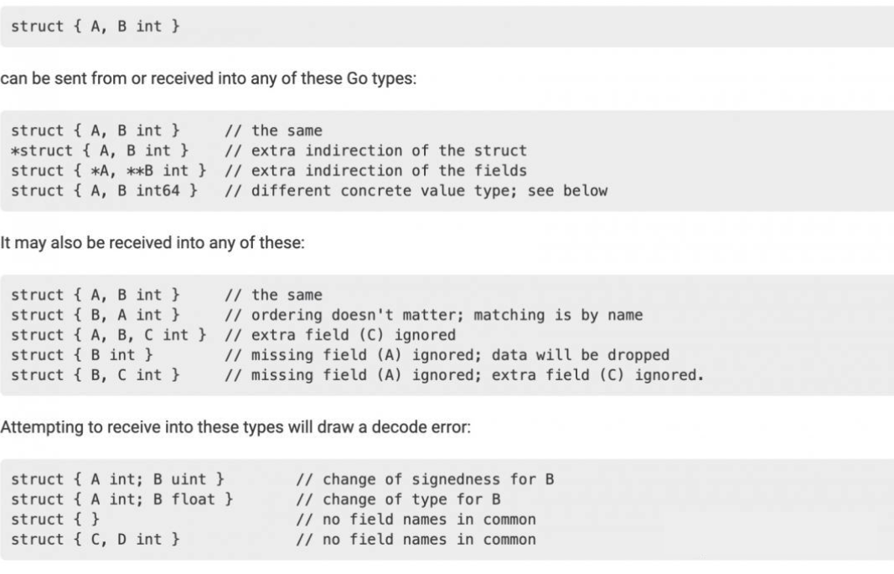
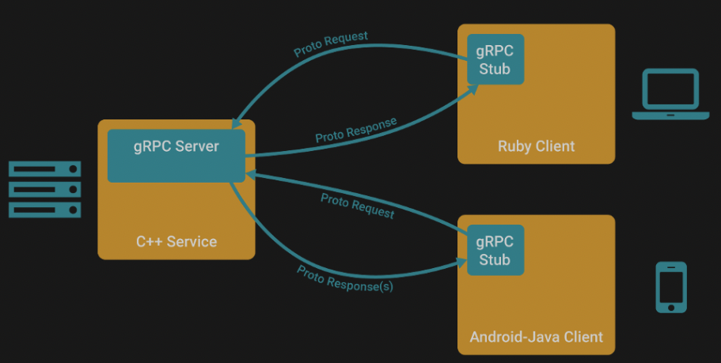
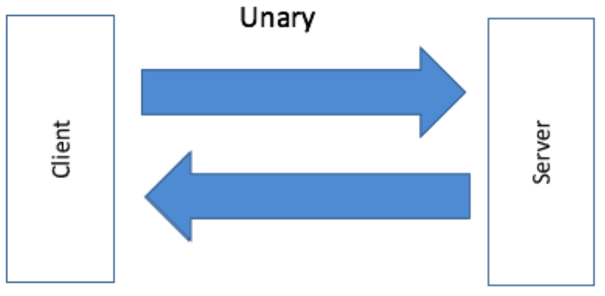
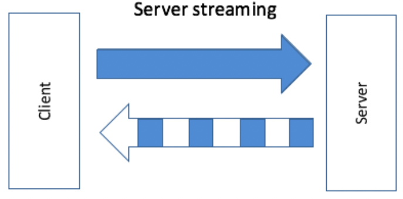
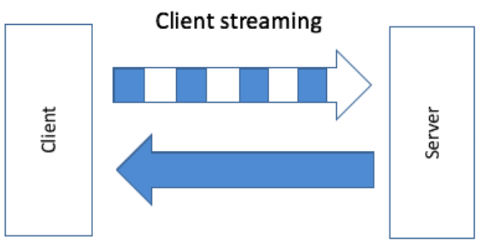
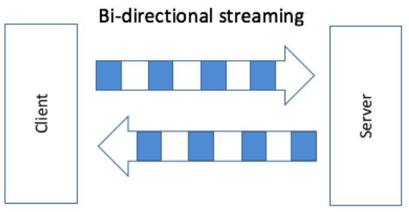
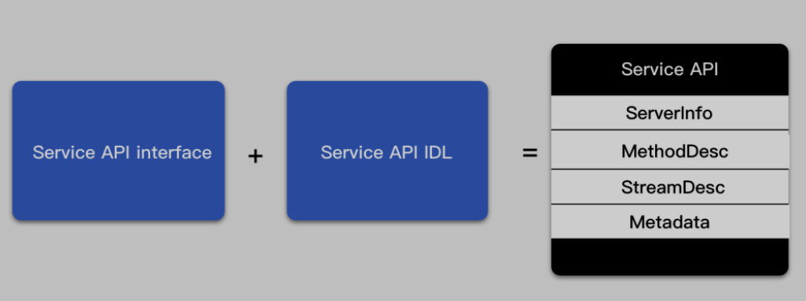
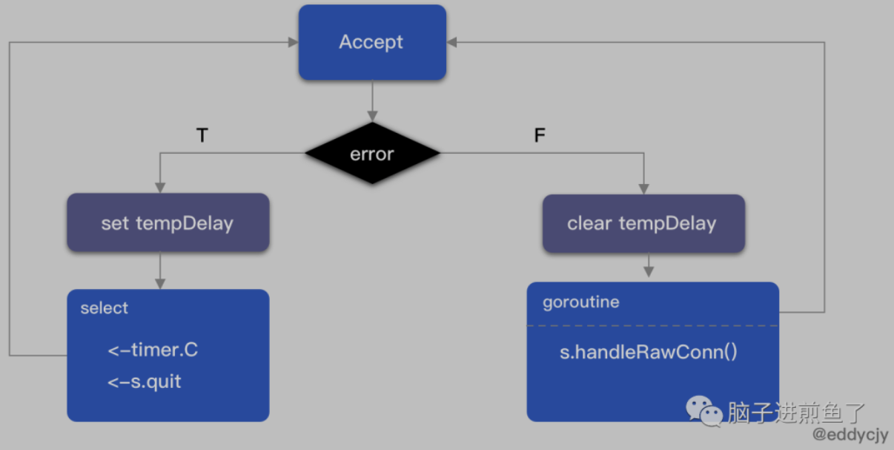

- [RPC](#rpc)
  - [RPC in Go](#rpc-in-go)
  - [encoding/gob](#encodinggob)
    - [Gob En/Deconding Rules](#gob-endeconding-rules)
    - [Gob En/Deconding in Go](#gob-endeconding-in-go)
- [gRPC](#grpc)
  - [Communication Model](#communication-model)
  - [Communication Type](#communication-type)
    - [Unary RPC](#unary-rpc)
    - [Server Streaming](#server-streaming)
    - [Client Streaming](#client-streaming)
    - [Bi-Directional Streaming](#bi-directional-streaming)
  - [gRPC Server Source Code Review](#grpc-server-source-code-review)
    - [Initialization](#initialization)
    - [Register](#register)
      - [Service API interface](#service-api-interface)
      - [Service API IDL](#service-api-idl)
      - [Register Service](#register-service)
      - [Summary](#summary)
    - [Listen](#listen)
  - [gRPC Client](#grpc-client)
    - [Create Socket Connection](#create-socket-connection)
    - [Instantiated Service API](#instantiated-service-api)
    - [Methods Call](#methods-call)
    - [Connection](#connection)
    - [Close Connection](#close-connection)
- [Protobuf](#protobuf)
  - [Protobuf Setup](#protobuf-setup)
  - [Protobuf Example](#protobuf-example)

# RPC

RPC(Remote Procedure Call) 是一種通過網路請求從遠端 server 調用 service, 而不需要了解底層網絡細節的通訊協議

RPC 協議基於傳輸層的 TCP 或 UDP, 或是由應用層的 HTTP 構建, 允許開發者直接調用另一台 server 上的程式而無需為調用過程額外編寫通訊相關程式碼

> RPC 使得開發分散式應用程式更加容易, 現在流行的微服務通常基於 RPC 協議

相較於 HTTP 採用 browser - server (B/S) model, RPC 採用 client - server (C/S) model, 請求程式為 client, 遠端 server 提供程式是 server

執行一個 RPC 調用時, client 首先會發送一個帶有參數的請求到 server, 並等待 server response;

在 server 端 service process 保持監聽狀態, 當 client request 到達時, server 通過 parsing 請求參數計算出結果, 並向 client 發送 response, 接著繼續等待下一個 client request

client 收到 server repsonse 後可以執行相對應的業務邏輯, 也可以繼續進行其他的 RPC 調用

從抽象角度來看, RPC 具備以下三點特性:
- 需要約定調用的語法
- 需要約定內容編碼方式
- 需要網絡傳輸

## RPC in Go

Go 標準庫提供 `net/rpc` package, 其實現了 RPC 協議的相關細節

`net/rpc` package 允許 RPC client 通過網絡或其他 I/O 連接調用一個 server 物件的 public methods

在 RPC server 需要將此物件註冊為可訪問的 service, 之後該物件的 public methods 就能通過 RPC 方式提供調用

一個 RPC server 可以註冊多個不同類型的物件, 但無法註冊同個類型的多個物件, 此外一個物件只有滿足以下條件的 method 才能被 RPC server 設置為可提供遠程調用:
- 必須為 public method
- 必須有兩個參數, 且參數類型必須是 package 外部可訪問的類型或是 Go build-in
- 第二個參數必須是一個 pointer
- 方法必須返回一個 `error` 類型的值

總結以上四點:
```go
func (t *T) MethodName(argType T1, replyType *T2) error
```

其中類型 `T`, `T1` 和 `T2` 分別對應 service 物件所屬類型, 請求類型及回應類型, 默認都會使用 Go build-in `encoding/gob` package 進行編解碼

此方法 `MethodName` 第一個參數表示由 RPC client 傳入的請求參數, 第二個參數表示要返回給 RPC client 的 response, 最後返回一個 `error` 類型的值表示錯誤資訊

## encoding/gob

Gob 是 Go 中一個序列化資料結構的編解碼工具, 當一個資料結構使用 Gob 進行序列化後即可於網絡中傳輸, 其經典適用場景就是 RPC 傳輸

`net/rpc` package 默認使用 `encoding/gob` 進行編解碼, 以 `rpc.Client` 為例, 其初始化程式碼如下:

```go
func NewClient(conn io.ReadWriteCloser) *Client {
  encBuf := bufio.NewWriter(conn)
  client := &gobClientCodec{conn, gob.NewDecoder(conn), gob.NewEncoder(encBuf), encBuf}
  return NewClientWithCodec(client)
}
```

發送端會在發送訊息之前使用 `gob.Encoder` 對資料進行編碼, 接收端在收到訊息後會通過 `gob.Decoder` 對資料進行解碼

> Summary

與 `JSON` 或 `XML` 這種基於文本描述的資料交換格式不同, `Gob` 是 bianry encoding data stream, 因此性能和傳輸效率更高, 且 `Gob` Stream 是可以自解釋的, 具備完整的表達能力

但作為針對 Go 語言的資料結構編解碼專用序列化工具, `Gob` 無法跨語言使用, 只能侷限在 Go 開發的 RPC client 與 server 間通訊

當需要與其他程式語言實現 client 或 server 通訊就需要對 `net/rpc` package 底層的編解碼工具自定義, 改用 `JSON` 或 `Protobuf` 來進行資料格式序列化

### Gob En/Deconding Rules

對 Gob 而言, 發送方和接收方的資料結構並不需要完全一致, 以官方示例為例:



`struct { A, B int }` 結構編碼的資料可以被後面 9 種結構類型接受解碼, 接收資料結構只要滿足與發送資料結構簽名一致, 或者為發送資料類型的子集(但不能為空), 即可正常接收並解碼

具體不同資料類型規則如下:
- `struct`, `array`, `slice` 可以被編碼, 但 `function` 和 `channel` 無法
- `int` 分為有號數和無號數, 其之間無法互相編解碼
- `bool` 被當作 `uint` 來編碼, `0` 為 `false`, `1` 為 `true`
- `float`都被當作 `float64` 類型來編碼, `float` 和 `int` 也無法互相編解碼
- `string` (包含 `string` 和 `[]byte`) 是以無號數 byte 個數 + 每個 byte 編碼形式編解碼
- `array` (包含 `slice` 和 `array`) 是按照無號數個數 + 每個 array element 編碼的形式進行編解碼
- `map` 按照無號數元素個數 + key value pair 形式進行編解碼
- `struct` 按照序列化屬性名稱 + 屬性值來進行編解碼, 若屬性值為 0 或 nil 則直接被忽略

> 最後需注意 `struct` 類型中的屬性名稱都應該以大寫字母開頭, 確保為 public

### Gob En/Deconding in Go

```go
package main

import (
  "bytes"
  "encoding/gob"
  "fmt"
  "log"
)

type P struct {
  X, Y, Z int
  Name    string
  Tags    []string
  Attr    map[string]string
}

type Q struct {
  X, Y *int32
  Name string
  Tags    []string
  Attr    map[string]string
}

func main() {
  var network bytes.Buffer
  enc := gob.NewEncoder(&network)  // init encoder gob.Encoder
  dec := gob.NewDecoder(&network)  // init decoder gob.Decoder
  // data encode（before send the data）
  err := enc.Encode(P{3, 4, 5, "regy", []string{"Java", "MongoDB", "Go"}, map[string]string{"webiste": "https://regy.dev"}})
  if err != nil {
    log.Fatal("encode error:", err)
  }
  // data decode（after receive the data）
  var q Q
  err = dec.Decode(&q)
  if err != nil {
    log.Fatal("decode error:", err)
  }
  fmt.Printf("%q: {%d,%d}, Tags: %v, Attr: %v\n", q.Name, *q.X, *q.Y, q.Tags, q.Attr)
}
```

# gRPC

`gRPC` 是一個高性能且通用的 open source RPC framework, 其是由 Google 基於 mobile application development 開發並基於 `HTTP/2` 而設計, 支援 `ProtoBuf` 序列化標準及眾多開發語言

`HTTP/2` 在 `HTTP/1.1` 的基礎上做了大量優化, `HTTP/1.1` 雖然引入了 `Keep-Alive` 機制復用 TCP connection, 但還是有許多問題:
- 使用 `Keep-Alive` request 是 serializable(非 pipeline 時), 而 pipeline 時則有 `head-of-line blocking(HOL)` issue
- 每次都需要傳輸不必要的 Header
- 無法雙向通訊

> HTTP/1.1 允許多個 request 復用 connection, 可以同時將 request 全部發送出去, 不需要等一個 return 再發第二個, 以提升 concurrency, 而 server 需要將 response 按照 pipeline 中發送的順序進行順序返回, 如果前面的 request blocking, 後面的 request/response 則會被動等待

HTTP/2 則解決了這些問題, 並引入了新的機制:
- 在 client/server 建立了 header table, 每次只發送 index 以縮減 header 體積
- 建立 virtual channel, 將 data 拆分成多個 stream, 每個 steram 有自己的 id 及 piority, 且 stream 可以雙向傳輸, 每個 stream 可以拆成多個 frames, 可以將 request 切成多個 stream 發送, 每個 stream 獨立返回, 以避開 HTTP/1.1 serializable 或 `HOL` 問題

基於 HTTP/2 data stream 機制, gRPC client/server 可以實現批次優化, client 可以累積 request 一次性發送給 server, server 也可以批次返回結果, 以實現 stream rpc

與很多 RPC 系統類似, `gRPC` 也是基於以下理念: 定義一個 service, 指定其為能夠被遠端調用的方法(包含參數和返回型別), 在 server 實現 intereface, 並運行一個 gRPC server 來處理 client 調用, 在 client 擁有一個`存根`就像 server 一樣的方法

`gRPC` 默認使用 `protocol buffers`, 其為 Google 開源的一套成熟的結構化資料序列化標準

## Communication Model



- gRPC Stub(Client) 調用 A 方法, 發起 RPC 調用
- 對 request 資訊使用 `Protobuf` 進行物件序列化壓縮(IDL)
- gRPC Server 收到 request 後解析 request body, 進行業務邏輯處理並返回
- 對 response 使用 `Protobuf` 進行物件序列化壓縮(IDL)
- gRPC Stub 收到 Server response, 解析 response body, callback A 方法並喚醒等待回應 (blocking) 的 client 調用並返回 response 結果

## Communication Type

### Unary RPC



Server

```go
type SearchService struct{}

func (s *SearchService) Search(ctx context.Context, r *pb.SearchRequest) (*pb.SearchResponse, error) {
    return &pb.SearchResponse{Response: r.GetRequest() + " Server"}, nil
}

const PORT = "9001"

func main() {
    server := grpc.NewServer()
    pb.RegisterSearchServiceServer(server, &SearchService{})

    lis, err := net.Listen("tcp", ":"+PORT)
    ...

    server.Serve(lis)
}
```

- 創建 `gRPC Server` 物件, 其為 Server 端的抽象物件
- 將 `SearchService`(其包含需被調用的 server side interface) 註冊到 `gRPC Server` 內部註冊中心, 接收到請求時可透過內部的 "service discovery" 機制找到對應 interface 並處理
- 創建 `listener` 監聽 TCP connection
- `gRPC Server` 開始 `lis.Accept` 直到 `Stop` 或 `GracefulStop`

Client

```go
func main() {
    conn, err := grpc.Dial(":"+PORT, grpc.WithInsecure())
    ...
    defer conn.Close()

    client := pb.NewSearchServiceClient(conn)
    resp, err := client.Search(context.Background(), &pb.SearchRequest{
        Request: "gRPC",
    })
    ...
}
```

- 創建與 Server 的 socket
- 創建 `SearchService` 的 client object
- 發送 RPC request, 等待同步回應, 得到 callback 後返回 response

### Server Streaming



Server

```go
func (s *StreamService) List(r *pb.StreamRequest, stream pb.StreamService_ListServer) error {
    for n := 0; n <= 6; n++ {
        stream.Send(&pb.StreamResponse{
            Pt: &pb.StreamPoint{
                ...
            },
        })
    }

    return nil
}
```

Client

```go
func printLists(client pb.StreamServiceClient, r *pb.StreamRequest) error {
    stream, err := client.List(context.Background(), r)
    ...

    for {
        resp, err := stream.Recv()
        if err == io.EOF {
            break
        }
        ...
    }

    return nil
}
```

### Client Streaming



Server

```go
func (s *StreamService) Record(stream pb.StreamService_RecordServer) error {
    for {
        r, err := stream.Recv()
        if err == io.EOF {
            return stream.SendAndClose(&pb.StreamResponse{Pt: &pb.StreamPoint{...}})
        }
        ...

    }

    return nil
}
```

Client

```go
func printRecord(client pb.StreamServiceClient, r *pb.StreamRequest) error {
    stream, err := client.Record(context.Background())
    ...

    for n := 0; n < 6; n++ {
        stream.Send(r)
    }

    resp, err := stream.CloseAndRecv()
    ...

    return nil
}
```

### Bi-Directional Streaming



Server

```go
func (s *StreamService) Route(stream pb.StreamService_RouteServer) error {
    for {
        stream.Send(&pb.StreamResponse{...})
        r, err := stream.Recv()
        if err == io.EOF {
            return nil
        }
        ...
    }

    return nil
}
```

Client

```go
func printRoute(client pb.StreamServiceClient, r *pb.StreamRequest) error {
    stream, err := client.Route(context.Background())
    ...

    for n := 0; n <= 6; n++ {
        stream.Send(r)
        resp, err := stream.Recv()
        if err == io.EOF {
            break
        }
        ...
    }

    stream.CloseSend()

    return nil
}
```

## gRPC Server Source Code Review

Server

```go
func main() {
  server := grpc.NewServer()
  pb.RegisterSearchServiceServer(server, &SearchService{})

  lis, err := net.Listen("tcp", ":"+PORT)
  ...

  server.Serve(lis)
}
```

短短四行程式碼可以運行一個 gRPC server, 以下來拆解並一步步剖析 source code 是如何實現

### Initialization

```go
// grpc.NewServer()
func NewServer(opt ...ServerOption) *Server {
 opts := defaultServerOptions
 for _, o := range opt {
  o(&opts)
 }
 s := &Server{
  lis:    make(map[net.Listener]bool),
  opts:   opts,
  conns:  make(map[io.Closer]bool),
  m:      make(map[string]*service),
  quit:   make(chan struct{}),
  done:   make(chan struct{}),
  czData: new(channelzData),
 }
 s.cv = sync.NewCond(&s.mu)
 ...

 return s
}
```

`NewServer` 函數主要是進行 `grpc.Server` 初始化的動作:
- lis: 監聽地址 map
- opts: service options, 包含 `Credentials`, `Interceptor` 及其他基礎配置
- conns: client connection socket map
- m: service infomation map
- quit: quit signal
- done: done signal
- czData: 用於儲存 `ClientConn`, `addrConn 及 `Server` 的 `channelz` 相關資料
- cv: graceful exit 會等待此 signal, 直到所有 RPC request 都處理完並斷開才會繼續處理

### Register

```go
pb.RegisterSearchServiceServer(server, &SearchService{})
```

#### Service API interface

```go
// search.pb.go
type SearchServiceServer interface {
 Search(context.Context, *SearchRequest) (*SearchResponse, error)
}

func RegisterSearchServiceServer(s *grpc.Server, srv SearchServiceServer) {
 s.RegisterService(&_SearchService_serviceDesc, srv)
}
```

在生成出來的 `.pb.go` 檔案中, 會定義出 Service APIs interface 的具體實現約束

在 gRPC Server 進行註冊時, 會傳入應用 Service 的功能 interface implementation, 此時生成的 `RegisterServer` 方法會保證兩者間的一致性

#### Service API IDL

`&_SearchService_serviceDesc` 有何作用? 程式碼如下:

```go
// search.pb.go
var _SearchService_serviceDesc = grpc.ServiceDesc{
 ServiceName: "proto.SearchService",
 HandlerType: (*SearchServiceServer)(nil),
 Methods: []grpc.MethodDesc{
  {
   MethodName: "Search",
   Handler:    _SearchService_Search_Handler,
  },
 },
 Streams:  []grpc.StreamDesc{},
 Metadata: "search.proto",
}
```

這段為 Service 的描述程式碼, 用來向 gRPC Server 內部表述自身具有什麼:
- ServiceName: service name
- HandlerType: service interface, 用於檢查使用者提供的 implementation 是否滿足 interface 要求
- Methods: unary 方法集合, struct 內 `Handler` 方法對應最終的 RPC 處理方法, 在執行 RPC 方法時會使用
- Metadata: 負責描述資料屬性, 這裡主要描述 `SearchServiceServer` service

#### Register Service

```go
func (s *Server) register(sd *ServiceDesc, ss interface{}) {
    ...
 srv := &service{
  server: ss,
  md:     make(map[string]*MethodDesc),
  sd:     make(map[string]*StreamDesc),
  mdata:  sd.Metadata,
 }
 for i := range sd.Methods {
  d := &sd.Methods[i]
  srv.md[d.MethodName] = d
 }
 for i := range sd.Streams {
  ...
 }
 s.m[sd.ServiceName] = srv
}
```

最後一步會將先前的 service interface info, service description info 註冊到內部的 `service` 以便後續實際調用:
- server: server interface info
- md: unary service RPC 方法集合
- sd: stream service
- mdata: metadata

#### Summary

主要說明了 gRPC Server 啟動前的整理及註冊行為, 為後續運行預先準備:



### Listen

接下來就是 gRPC 初始化流程中最重要的部分: Listen / Request handle 的部分:

```go
func (s *Server) Serve(lis net.Listener) error {
 ...
 var tempDelay time.Duration
 for {
  rawConn, err := lis.Accept()
  if err != nil {
   if ne, ok := err.(interface {
    Temporary() bool
   }); ok && ne.Temporary() {
    if tempDelay == 0 {
     tempDelay = 5 * time.Millisecond
    } else {
     tempDelay *= 2
    }
    if max := 1 * time.Second; tempDelay > max {
     tempDelay = max
    }
    ...
    timer := time.NewTimer(tempDelay)
    select {
    case <-timer.C:
    case <-s.quit:
     timer.Stop()
     return nil
    }
    continue
   }
   ...
   return err
  }
  tempDelay = 0

  s.serveWG.Add(1)
  go func() {
   s.handleRawConn(rawConn)
   s.serveWG.Done()
  }()
 }
}
```

`gRPC server` 會根據外部傳入的 Listener 不同而調用不同的 Listener mode, 這也是 `net.Listener` 的魅力所在, 靈活性及擴充性極高

在 `gRPC server` 中最常用的是 `TCPConn`, 基於 `TCP Listener` 實現, 處理邏輯如下:



- loop 處理 connection, 通過 `lis.Accept` 取出 connection, 若 channel 中沒有需要處理的 connection 時 `block and wait`
- 若 `lis.Accept` 失敗則觸發休眠機制, 若第一次失敗則休眠 5ms, 否則翻倍, 循環直至 1s, 休眠結束會嘗試讀取下一個 connection
- 若 `lis.Accept` 成功則重置休眠時間計時器, 並啟動一個新的 goroutine 調用 `handleRawConn` 方法執行/處理新的 request
- loop 過程中包含了 **"exit service"** 的場景, 主要分為 `shutdown` 及 `graceful shutdown` 兩種情況

## gRPC Client

```go
func main() {
  conn, err := grpc.Dial(":"+PORT, grpc.WithInsecure())
  ...
  defer conn.Close()

  client := pb.NewSearchServiceClient(conn)
  res, err := client.Search(context.Background(), &pb.SearchRequest{...})
  ...
}
```

### Create Socket Connection

```go
// grpc.Dial(":"+PORT, grpc.WithInsecure())
func DialContext(ctx context.Context, target string, opts ...DialOption) (conn *ClientConn, err error) {
 cc := &ClientConn{
  target:            target,
  csMgr:             &connectivityStateManager{},
  conns:             make(map[*addrConn]struct{}),
  dopts:             defaultDialOptions(),
  blockingpicker:    newPickerWrapper(),
  czData:            new(channelzData),
  firstResolveEvent: grpcsync.NewEvent(),
 }
 ...
 chainUnaryClientInterceptors(cc)
 chainStreamClientInterceptors(cc)

 ...
}
```

`grpc.Dial` 方法實際上是對於 `grpc.DialContext` 的封裝, 區別在於 `ctx` 是直接傳入 `context.Background`

其功能為創建並指定目標 client side connection, 並負責以下職責:
- Initial ClientConn
- Initial 基於 process LB 的 loading balance config
- Initial channelz
- Initial retry rules 和 client unary/stream interceptor
- Initial protocol stack basic info
- context timeout control
- Initial & parse address info
- Create connection between server

### Instantiated Service API

```go
type SearchServiceClient interface {
 Search(ctx context.Context, in *SearchRequest, opts ...grpc.CallOption) (*SearchResponse, error)
}

type searchServiceClient struct {
 cc *grpc.ClientConn
}

func NewSearchServiceClient(cc *grpc.ClientConn) SearchServiceClient {
 return &searchServiceClient{cc}
}
```

### Methods Call

```go
// search.pb.go
func (c *searchServiceClient) Search(ctx context.Context, in *SearchRequest, opts ...grpc.CallOption) (*SearchResponse, error) {
 out := new(SearchResponse)
 err := c.cc.Invoke(ctx, "/proto.SearchService/Search", in, out, opts...)
 if err != nil {
  return nil, err
 }
 return out, nil
}
```

`proto` 產生的 RPC 方法像一層包裝, 把需要的東西放進去, 實際上還是調用 `grpc.invoke` 方法

```go
func invoke(ctx context.Context, method string, req, reply interface{}, cc *ClientConn, opts ...CallOption) error {
 cs, err := newClientStream(ctx, unaryStreamDesc, cc, method, opts...)
 if err != nil {
  return err
 }
 if err := cs.SendMsg(req); err != nil {
  return err
 }
 return cs.RecvMsg(reply)
}
```

需關注三個地方的調用:
- newClientStream: 獲取 transport layer `Transport` 並組合封裝到 `ClientStream` 中返回, 這部分會涉及 load balance, timeout control, encoding, stream 與 server 基本一致的行為
- cs.SendMsg: 發送 RPC request, 但其並不負責 waiting response
- cs.RecvMsg: Block & wait 收到的 RPC response

### Connection

```go
// clientconn.go
func (cc *ClientConn) getTransport(ctx context.Context, failfast bool, method string) (transport.ClientTransport, func(balancer.DoneInfo), error) {
 t, done, err := cc.blockingpicker.pick(ctx, failfast, balancer.PickOptions{
  FullMethodName: method,
 })
 if err != nil {
  return nil, nil, toRPCErr(err)
 }
 return t, done, nil
}
```

在 `newClientStream` 方法中, 通過 `getTransport` 方法獲取了 `Transport Layer` 中抽象出來的 `ClientTransport` 及 `ServerTransport`, 實際上就是獲取一個 connection 給後續的 RPC Call 傳輸使用

### Close Connection

```go
// conn.Close()
func (cc *ClientConn) Close() error {
 defer cc.cancel()
    ...
 cc.csMgr.updateState(connectivity.Shutdown)
    ...
 cc.blockingpicker.close()
 if rWrapper != nil {
  rWrapper.close()
 }
 if bWrapper != nil {
  bWrapper.close()
 }

 for ac := range conns {
  ac.tearDown(ErrClientConnClosing)
 }
 if channelz.IsOn() {
  ...
  channelz.AddTraceEvent(cc.channelzID, ted)
  channelz.RemoveEntry(cc.channelzID)
 }
 return nil
}
```

此方法會取消 `ClientConn` context, 同時關閉所有底層傳輸:
- Context Cancel
- Clear & close client connection
- Clear & close parser connection
- Clear & close loading balance connection
- 新增跟蹤引用
- 移除當前 channel info

# Protobuf

RPC framework 主要圍繞在以下三大特點不斷優化:
- 具有約定調用語法
- 需要約定內容編碼方式
- 需要網絡傳輸

希望以更優的方式達到更低的成本及更快的速度, 其中 `encode/decode` 就是一個非常重要的點

RPC 調用中的 request 和 response 在調用時都有著不小的消耗:
- 內容序列化及反序列化, 若效率更高則對 CPU effort 更小
- 內容在網絡中傳輸, protocol stack 成本, bandwidth 成本, GC 成本等

舉例來說很多業務會將結果 cache 到 redis, 而有時結果集很大, 緩存資料存放時都需要經過序列化, 常規的序列化方式為 `json`, 但 `json` 序列化之後體積很大, 對於體積龐大的 key 只要經歷一輪 concurrent read, redis CPU 及 bandwidth 就會瞬間飆高, 因此需要更高效的序列化策略

這方面 RPC framwork 有以下幾個目標:
- 盡可能快速完成序列化/反序列化
- 序列化後體積盡可能小
- 跨語言
- 簡單, 型別明確
- 容易擴展, 可以簡單迭代並向後兼容

對此, `gRPC` 的解決方案為棄用 json, xml 這種傳統序列化方案, 轉向使用 `Protocol Buffers` 作為替代解決方案

`Protocol buffers` 是一種與程式語言, 平台無耦合的資料交換格式, 用於序列化結構化資料, 較 XML, JSON 而言, `Protobuf` 序列化後的 data stream 更小, 傳輸速度更高, 且操作更簡單

> Protocol buffers are a language-neutral, platform-neutral extensible mechanism for serializing structured data.

`protoc` 主要用於 compile `protobuf(.proto)` 檔案和 runtime, 其為 C++ 編寫, 以超高的壓縮率著稱, release 下載地址如下: 

[https://github.com/protocolbuffers/protobuf/releases
](https://github.com/protocolbuffers/protobuf/releases
)

需注意一點, `Protocol buffers` 可以獨立使用, 不一定要與 gRPC 綁定使用, 但若使用 gRPC 則一定要使用 `Protocol buffers`

使用 protobuf 作為序列化傳輸方案有以下幾個優點:
- 節省網路傳輸量, 傳輸速度更快且檔案大小更小
- 降低 CPU effort, parsing JSON 本身為 CPU intensive, 而 protobuf 本身為 binary format, 更接近底層資料表徵, 因此能有效降低 CPU effort
- 能夠根據不同程式語言 compile 出不同的檔案
- 可以邊寫註解, 型別顯式明確

透過 protobuf 定義好傳輸的資料欄位(message) 和呼叫的方法(service) 後, gRPC 即可在不同程式語言上運行

對於 JSON 等文本形式的序列化協定來說, protubuf 能達到幾十倍空間及性能的提升, 比如傳輸整數 123, 文本類協定需要 3 個 bytes(ascii 31 32 33) 來傳輸, 而 binary 類只需要一個 byte (01111011) 即可表達

同時 protobuf 會維護 `.proto` 檔案, 如此一來在 parsing 檔案生成 stub 程式時可以對 function name 進行編號, 傳輸時只需傳輸編號而不用傳 function name, 如此一來可以省下大量 bytes 傳輸量, 其他更多精巧的壓縮方式如 `TLV`, 可以參考 [proto encoding](https://link.zhihu.com/?target=https%3A//developers.google.com/protocol-buffers/docs/encoding)


## Protobuf Setup

Uncompress:

```shell
$ unzip protoc-3.14.0-linux-x86_64.zip -d protoc-3.14.0-linux-x86_64
```

Add env:

```shell
$ sudo vim /etc/profile 
```

Export env:

```shell
export PATH=$PATH:/home/regy/17x/protoc-3.14.0-linux-x86_64/bin
```

Active:

```shell
$ source /etc/profile
```

Check if install success:

```shell
$ protoc --version
libprotoc 3.14.0
```

除了安裝 `protoc` 之外還需要安裝各個程式語言對應的 compile plugin, 以下為 Go compile plugin:

```shell
go get google.golang.org/protobuf/cmd/protoc-gen-go
```

## Protobuf Example

create `.proto` file: hello_world.proto

```protobuf
syntax = "proto3";  // 定義要使用的 protocol buffer 版本

package calculator;  // for name space
option go_package = "proto/calculator";  // generated code 的 full Go import path

message CalculatorRequest {
  int64 a = 1;
  int64 b = 2;
}

message CalculatorResponse {
  int64 result = 1;
}

service CalculatorService {
  rpc Sum(CalculatorRequest) returns (CalculatorResponse) {};
}
```

`protoc` compile:

```shell
# Syntax: protoc [OPTION] PROTO_FILES
$ protoc --proto_path=IMPORT_PATH  --go_out=OUT_DIR  --go_opt=paths=source_relative path/to/file.proto
```

- `-proto_path or -I`: 指定 `import` path, 可以指定多個參數, compile 時按順序查找, 不指定時默認查找當前目錄
  - `.proto` 也可以引入其他 `.proto` 檔案, 用於指定被 import 檔案位置
- `-go_out`: 指定輸出檔案路徑

```shell
$ protoc --go_out=. hello_word.proto
```

compile 結束後會產生一個 `hello_world.pb.go` 檔案, 即 compile 完成

> Compile Progress

- parsing `.proto` 檔案, compile 成 `protobuf` 原生資料結構並保存於 memory
- 將 `protobuf` 相關資料結構傳遞給對應程式語言的 compile plugin, 由 plugin 負責將接收到的 `protobuf` 原生資料結構渲染輸出為特定語言 template

後續提到的 `gRPC Plugins`, `gRPC-Gateway` 也是 `protoc` compile plugin, 將 `.proto` 檔案 compile 成對應組件所需要的原始檔