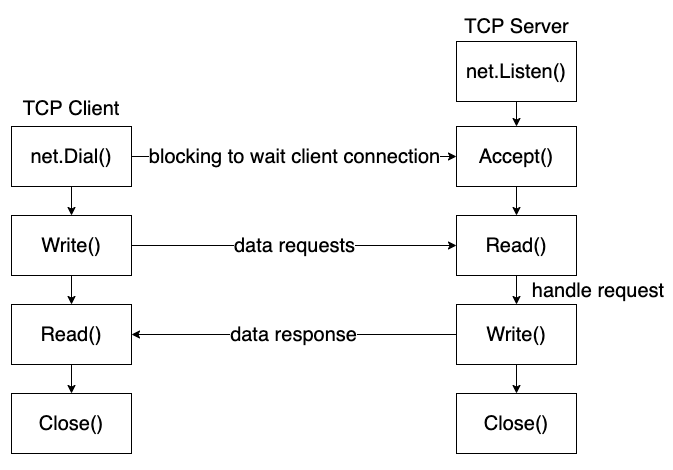

- [Socket](#socket)
- [Server Side](#server-side)
- [TCP-CS](#tcp-cs)
	- [Server](#server)
	- [Client](#client)
	- [Server - Concurrent](#server---concurrent)
	- [Client - Concurrent](#client---concurrent)
- [Multi-Users Chat Romm Demo](#multi-users-chat-romm-demo)
	- [Modules](#modules)
	- [Functions](#functions)
		- [Broadcast user login](#broadcast-user-login)
		- [Broadcast user messages](#broadcast-user-messages)
		- [Search online users](#search-online-users)
		- [Rename user name](#rename-user-name)
		- [User exit](#user-exit)
		- [User Timeout](#user-timeout)

# Socket


# Server Side

- Listen Function
    
    ```fsharp
    func Listen(network, address string) (Listener, error)
    
    network: protocol like TCP, UDP
    address: IP Address + Port Number
    ```
    
- Listener Interface
    
    ```fsharp
    type Listener interface {
    		Accept() (Conn, error)
    		Close() error
    		Addr() Addr
    }
    ```
    
- Conn Interface
    
    ```fsharp
    type Conn interface {
    		Read(b []byte) (n int, err error)
    		Write(b []byte) (n, int, err error)
    		Close() error
    		LocalAddr() Addr
    		RemoteAddr() Addr
    		SetDeadline(t time.Time) error
    		SetReadDeadline(t time.Time) error
    		SetWriteDeadline(t time.Time) error
    }
    ```
    

# TCP-CS


## Server

```go
func main(){
	// define server protocal and port number
	listener, err := net.Listen("tcp","172.0.0.1:8000")
	if err != nil {
			fmt.Println("net.Listen err: ", err)
			return
	}

	defer listener.Close()

	fmt.Println("waiting client to build connection...")

	// blocking connetion requests from client
	// create connetion successfully and return socket to communication
	conn, err := listener.Accept()
	if err != nil {
			fmt.Println("listener.Accept() err: ", err)
			return
	}

	defer conn.Close()

	fmt.Println("server and client successfully build connection")

	// read client data
	buf := make([]byte, 4096)
	n, err := conn.Read(buf)
	if err != nil {
			fmt.Println("conn.Read() err: ", err)
			return
	}

	conn.Write(buf[:n])

	fmt.Println("server read client data: ",string(buf[:n]))

}
```

---

## Client
1. conn, err := net.Dial(”tcp”, IP + port)
2. write data to server → conn.Write()
3. Read server response data → conn.Read()
4. conn.Close()

```go
func main(){
	// define server protocal and port number
	conn, err := net.Dial("tcp","172.0.0.1:8000")
	if err != nil {
			fmt.Println("net.Dial err: ", err)
			return
	}

	defer conn.Close()

	conn.Write([]byte("Are you Ready?"))

	buf := make([]byte,4096)
	n, err := conn.Read(buf)
	if err != nil {
			fmt.Println("conn.Read() err: ", err)
			return
	}

	fmt.Println("server response data: ", string(buf[:n]))

}
```

---

## Server - Concurrent
1. create listener → listener := net.Listen(”tcp”, IP + port)
2. defer listener.Close()
3. for loop blocking to listen client connection → conn := listener.Accept()
4. create goroutine for each client request and transfer data → go HandlerConnect()
5. implement HandlerConnet(conn net.Conn)
    1. defer conn.Close()
    2. get client address → conn.RemoteAddr()
    3. handle data to upper → strings.ToUpper()
    4. response data → conn.Write(buf[:n])
6. server check if connection closed: **Read client data and return 0**

```go
func HandlerConnect(conn net.Conn){
	defer conn.Close()

	// get remote client address
	addr := conn.RemoteAddr()
	fmt.Println(addr,"build connection successfully")

	// loop read client data
	buf := make([]byte,4096)
	for {
			n,err := conn.Read(buf)
			if n == 0 || "exit\n" == string(buf[:n]){
					fmt.Println("client connection closed!")
					return
			}
			if err != nil {
					fmt.Println("conn.Read() err: ", err)
					return
			}

			// use data
			fmt.Println("Server read data successfully: ",string(buf[:n]))

			// toupper and response
			conn.Write([]byte(strings.ToUpper(string(buf[:n]))))
	}
}

func main(){
	// define server protocal and port number
	listener, err := net.Listen("tcp","172.0.0.1:8000")
	if err != nil {
			fmt.Println("net.Listen err: ", err)
			return
	}

	defer listener.Close()

	// blocking connetion requests from client
	// create connetion successfully and return socket to communication
	for {
			fmt.Println("waiting client to build connection...")

			conn, err := listener.Accept()
			if err != nil {
					fmt.Println("listener.Accept() err: ", err)
					return
			}
			// 具體完成 server 及 client 資料通訊請求
			go HandlerConnect(conn)
	}

	fmt.Println("server and client successfully build connection")

	// read client data
	buf := make([]byte, 4096)
	n, err := conn.Read(buf)
	if err != nil {
			fmt.Println("conn.Read() err: ", err)
			return
	}

	conn.Write(buf[:n])

	fmt.Println("server read client data: ",string(buf[:n]))

}
```

---

## Client - Concurrent

```go
func main(){
	// define server protocal and port number
	conn, err := net.Dial("tcp","172.0.0.1:8000")
	if err != nil {
			fmt.Println("net.Dial err: ", err)
			return
	}

	defer conn.Close()

	// 獲取 user 鍵盤輸入(stdin)，將輸入資料送給 server
	go func() {
			str := make([]byte, 4096)
			for {
					n, err := os.Stdin.Read(str)
					if err != nil {
							fmt.Println("os.Stdin.Read err: ", err)
							continue
					}
					// 寫給 server
					conn.Write(str[:n])
			}
	}()

	// 顯示 server response data
	buf := make([]byte, 4096)
	for {
			n, err := conn.Read(buf)
			if err != nil {
					fmt.Println("conn.Read err: ", err)
					return
			}
			fmt.Println("client read server response: ", string(buf[:n]))
	}

	buf := make([]byte,4096)
	n, err := conn.Read(buf)
	if n == 0 {
			fmt.Println("server connection closed!")
			return
	}
	if err != nil {
			fmt.Println("conn.Read() err: ", err)
			return
	}

	fmt.Println("server response data: ", string(buf[:n]))

}
```

# Multi-Users Chat Romm Demo

## Modules
- main go process
  - 創建監聽 socket, for loop Accept() client connection - conn 並啟動 goroutine HandlerConnect
- HandlerConnect
  - 創建 user struct type 並存入 onlineMao, 發送 user login boradcast, 聊天訊息, 查詢 online users, rename, exit, timeout logout
- Manager
  - 監聽 global channel message, 並將讀到的消息 boradcast 給 onlineMap 中所有 user
- WriteMsgToClient
  - 讀取每個 user 自帶 channel C 上訊息 (由 Manager 發送)並回寫給 user
- Global Variable
  - user struct type: Client{C, Name, Addr string}
  - online users list: onlineMap[string]Client
  - message channel: messages

## Functions

### Broadcast user login
- main go process create socket and remember **defer**
- for loop listen client connection requests, Accept()
- accept client request and create goroutine to handle client data -> HandlerConnect(conn), defer
- define global struct type Client(C, Name, Addr)
- create global map, channel
- implement HandlerConnect, get Client IP + Port - RemoteAddr(), initial user struct info
- create goroutine to handle Manager before **Accept()**
- implement Manager to handle messages channel, initial online users map, looping to read global channel and broadcast to user channel

### Broadcast user messages
- 封裝 NewMsg() 來處理 broadcast, user message
- HandlerConnect 中創建匿名 goroutine function 讀取 user socket 上發送的聊天內容並寫道 global channel
- for loop conn.Read

### Search online users
- 將讀取到的 user message 結尾 "\n" 去掉
- 判斷是否為 who cmd
- 若否則寫入 global messages channel

### Rename user name
- 將讀取到的 user message 判斷是否包含 rename
- 提取 "|" 後 string 並存入 Client.Nmae
- update onlineMap
- reponse 修改成功 - conn.Write

### User exit
- after user login successfully create channel isQuit to listen event
- 當 conn.Read == 0, isQuit <- true
- 在 HandlerConnect 結尾 for loop 增加 select 監聽 <- isQuit
- 滿足條件將 user remove from online map and broadcast to other users

### User Timeout
- 在 select 中監聽定時器 - time.After() 到達將 user remove from online map and broadcast
- create isActive channel 判斷 user 是否 active - isActive <- true
- select 中添加監聽 <- isActive - 條件滿足不做任何動作以重置計時器


```go
package main

import (
	"fmt"
	"net"
	"strings"
	"time"
)

// Client user struct type
type Client struct {
	C    chan string
	Name string
	Addr string
}

// global map to store online user
var onlineMap map[string]Client

// global channel to pass user messages
var messages = make(chan string)

func NewMsg(client Client, msg string) (buf string) {
	buf = "[" + client.Addr + "]" + client.Name + ": " + msg
	return buf
}

func WriteMsgToClient(client Client, conn net.Conn) {
	// listen message from user's channel
	for msg := range client.C {
		conn.Write([]byte(msg + "\n"))
	}
}

func HandlerConnect(conn net.Conn) {
	defer conn.Close()

	isActive := make(chan bool)

	// get user address info
	userAddr := conn.RemoteAddr().String()

	// create user struct
	client := Client{
		make(chan string),
		userAddr,
		userAddr,
	}

	// add new user into map
	onlineMap[client.Name] = client

	// create goroutine to send message to user
	go WriteMsgToClient(client, conn)

	// send user online message to global channel
	messages <- NewMsg(client, "login!")

	isQuit := make(chan bool)

	// create anonymous goroutine to handle user's message
	go func() {
		for {
			buf := make([]byte, 4096)
			n, err := conn.Read(buf)
			if n == 0 {
				isQuit <- true
				fmt.Printf("Check client: %s exit...\n", client.Name)
				return
			}
			if err != nil {
				fmt.Println("coon.Read err: ", err)
				return
			}

			// get user message
			msg := string(buf[:n-1])

			// get online users list
			if msg == "who" && len(msg) == 3 {
				conn.Write([]byte("Users list:\n"))

				// loop global map and get onlice users list
				for _, user := range onlineMap {
					userInfo := user.Addr + ": " + user.Name + "\n"
					conn.Write([]byte(userInfo))
				}

			} else if len(msg) >= 8 && msg[:6] == "rename" {
				newName := strings.Split(msg, "|")[1]

				// modify struct member name
				client.Name = newName

				// update online user map
				onlineMap[userAddr] = client

				// response
				conn.Write([]byte("rename successful!\n"))

			} else {
				// broadcast user message and write into global channel
				messages <- NewMsg(client, msg)
			}
			isActive <- true

		}
	}()

	// blocking
	for {
		// listen channel data flow
		select {
		case <-isQuit:
			// terminate WriteMsgToClient goroutine
			close(client.C)
			// delete user from online map
			delete(onlineMap, client.Addr)
			messages <- NewMsg(client, "logout")
			return
		case <-isActive:
			// reset timeout
		case <-time.After(time.Second * 10):
			messages <- NewMsg(client, "timeout")
			time.Sleep(time.Second * 2)
			delete(onlineMap, client.Addr)
			return
		}
	}
}

func Manager() {
	// init online user map
	onlineMap = make(map[string]Client)

	// looping listen global channel data
	for {
		msg := <-messages

		// looping send message to online user
		for _, client := range onlineMap {
			client.C <- msg
		}
	}
}

func main() {
	// create listener
	listener, err := net.Listen("tcp", "127.0.0.1:8000")
	if err != nil {
		fmt.Println("Listen err: ", err)
		return
	}
	defer listener.Close()

	// create message manager to manage map and global channel
	go Manager()

	// looping listen client requests
	for {
		conn, err := listener.Accept()
		if err != nil {
			fmt.Println("Accept err: ", err)
			return
		}

		// create goroutine to handle client requests
		go HandlerConnect(conn)
	}
}

```