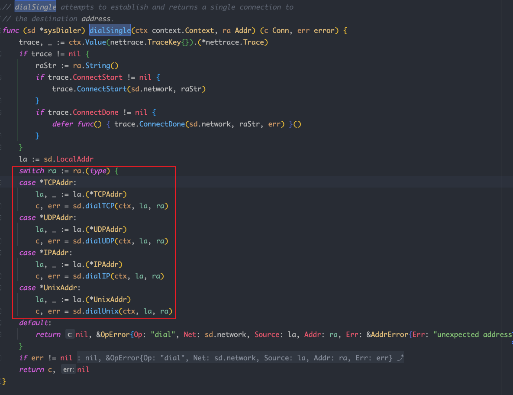
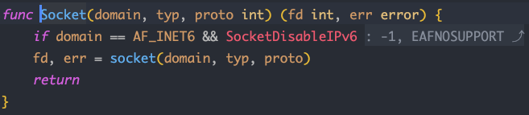

- [Socket](#socket)
	- [Stream Socket](#stream-socket)
	- [Datagram Socket](#datagram-socket)
- [TCP Server](#tcp-server)
	- [Net package](#net-package)
	- [Dial Function](#dial-function)
	- [Timeout Handle](#timeout-handle)
		- [Connection Timeout](#connection-timeout)
		- [Request / Response Timeout](#request--response-timeout)
- [TCP-CS](#tcp-cs)
	- [Server](#server)
	- [Client](#client)
	- [Server - Concurrent](#server---concurrent)
	- [Client - Concurrent](#client---concurrent)
- [UDP-CS](#udp-cs)
	- [UDP Server](#udp-server)
	- [UDP Client](#udp-client)
- [Sticky Packaet Issue](#sticky-packaet-issue)
- [Multi-Users Chat Romm Demo](#multi-users-chat-romm-demo)
	- [Modules](#modules)
	- [Functions](#functions)
		- [Broadcast user login](#broadcast-user-login)
		- [Broadcast user messages](#broadcast-user-messages)
		- [Search online users](#search-online-users)
		- [Rename user name](#rename-user-name)
		- [User exit](#user-exit)
		- [User Timeout](#user-timeout)

# Socket


`socket` 是 BSD UNIX 的 process 通信機制, 他是一個 `file handle`, 用於描述 `IP Address` 和 `port`

`socket` 在 design pattern 中屬於 `Facade Pattern`, 將複雜的 `TCP/IP` 封裝在 socket 中, 使用者只需要調用 socket 定義的相關函數就可以進行 socket communication

應用程式通常通過 `socket` 向網路發出 request / response 的網路請求, 常用的 socket 類型有兩種:
- Stream Socket(SOCK_STREAM)
- Datagram Socket(SOCK_DGRAM)

## Stream Socket

Stream socket 是可靠的, 雙向連接的通信串流, 若以 "1,2" 的順序將兩個項目輸出到 socket, 它們在另一端則會以 "1,2" 的順序抵達且不會出錯

瀏覽器所使用的 HTTP protocol 也是利用 stream socket 取得網頁所需的 HTML 等文件

Stream socket 使用所謂的 `The Transmission Control Protocol`(TCP)來確保資料可以依序抵達且不出錯, 保障資料的完整性

TCP 會在傳輸層對上層送來的過大訊息分割成多個 segments, 並由傳輸層負責處理封包遺失, 確保依序送達等工作; 若應用程式對資料有靠與依序需求時, 使用 stream socket 就無須自行處理

## Datagram Socket

Datagram socket 也使用 IP 進行 routing, 但其傳輸層協議使用 `User Datagram Protocol`(UDP) 而非 TCP

使用 datagram socket 不用像 stream socket 一樣維護一個開啟的連線, 只需打造封包, 給它一個 IP header 與目的資訊即可送出

通常當一些封包遺失不會造成重大影響時會只用 datagram socket, 如 tftp, 多人遊戲, 串流音樂, 影像會議等

Datagram socket 是基於訊息導向的方式傳送資料, 資料封包可能會由於繞送封包路徑改變而造成抵達順序不同, 發送方也無法知道是否遞送成功

# TCP Server

TCP/IP(Transmission Control Protocol/Internet Protocol) 是一種**連接導向**, 可靠, 基於 byte stream 的傳輸層通訊協議

因為是**連接導向**的協議, 資料像流水一樣傳輸, 因此會產生 `sticky packet` 問題

TCP Server 可以同時連接多個 clien, Go 每建立一個連線就會創建一個 `groutine` 來處理請求

Server 處理流程大致分為:
- 監聽 port
- 接收 client request & create connection
- 創建 `goroutine` 處理連線
- close connection

## Net package

- Listen Function
    
    ```go
    func Listen(network, address string) (Listener, error)
    
    network: protocol like TCP, UDP
    address: IP Address + Port Number
    ```
    
- Listener Interface
    
    ```go
    type Listener interface {
    		Accept() (Conn, error)
    		Close() error
    		Addr() Addr
    }
    ```
    
- Conn Interface
    
    ```go
    type Conn interface {
    		Read(b []byte) (n int, err error)
    		Write(b []byte) (n, int, err error)
    		Close() error
    		LocalAddr() Addr
    		RemoteAddr() Addr
    		SetDeadline(t time.Time) error
    		SetReadDeadline(t time.Time) error
    		SetWriteDeadline(t time.Time) error
    }
    ```

## Dial Function

Go 對 socket 創建過程進行了抽象與封裝, 無論使用什麼協議建立什麼形式的連接, 都只需要調用 `net.Dial()` 函數即可完成

`Dial()` 函數原型:

```go
func Dial(network, address string) (Conn, error) {
    var d Dialer
    return d.Dial(network, address)
}
```

其中 `network` 參數表示傳入的網路協議(tcp, udp 等), `address` 參數表示傳入的 IP Address or domain name, port 是可選的, 若需指定以 `:` 形式寫在 IP/Domain 後面即可

如果連接成功函數返回連接物件, 否則返回 `error`

幾種常見協議的調用方式:

TCP Connection:

```go
conn, err := net.Dial("tcp", "192.168.10.10:80")
```

UDP Connection:

```go
conn, err := net.Dial("udp", "192.168.10.10:8888")
```

ICMP Connection:

```go
conn, err := net.Dial("ip4:icmp", "www.google.com")
```

目前 `Dial()` 函數支持幾種網路協議: `tcp`, `tcp4`(IPv4), `tcp6`(IPv6), `udp`, `udp4`(IPv4), `udp6`(IPv6), `ip`, `ip4`(IPv4), `ip6`(IPv6), `unix`, `unixgram`, `unixpacket`

成功建立連接後, 可以使用連接物件 `conn` 的 `Write()` 方法, 接收資料時使用 `Read()` 方法

`Dial()` 函數是對 `dialTCP()`, `dialUDP()`, `dialIP()`, `dialUnix()` 的封裝, 可以通過 source code 看到, 底層真正建立連接是通過 `dialSingle()` 函數完成:



`dialSingle()` 函數通過從輸入參數中獲得網絡協議類型調用對應的連接建立函數並返回連接物件

再往下追可以看到這些底層函數最終都的調用了 `syscall` package 的 `Socket()` 函數與對應的 OS Socket API 交互實現網絡連接建立, 針對不同的通訊協議建立不同的連接類型:



其中 `domain` 代表通訊域, 支持 `IPv4`, `IPv6` 和 `Unix`, 對應的常數值分別是 `syscall.AF_INET`, `syscall.AF_INET6` 和 `syscall.AF_UNIX`

`typ` 則代表 Socket 的類型, 如 TCP 對應的 Socket 類型常數是 `syscall.SOCK_STREAM`, UDP 對應的 Socket 類型常數是 `syscall.SOCK_DGRAM`, 此外還支持 `syscall.SOCK_RAW` 和 `syscall.SOCK_SEQPACKET` 兩種類型

`SOCK_RAW` 就是原始的 IP protocol packet, `SOCK_SEQPACKET` 與 `SOCK_STREAM` 類似, 都是連接導向, 只不過前者有消息邊界, 傳輸的是資料包而不是 byte stream

通常使用 `SOCK_STREAM` 和 `SOCK_DGRAM` 居多

最後一個參數 `proto` 表示通訊協議, 一般默認為 `0`, 因為該值可以通過前兩個參數判斷得出, 如前兩個參數分別為 `syscall.AF_INET` 和 `syscall.SOCK_DGRAM` 時會選擇 UDP 作為通訊協議

## Timeout Handle
網絡超時包含在多個環節中, 包括 connection timeout, request timeout 或 response timeout

### Connection Timeout

在使用 `Dial()` 函數建立網絡連接時, 可以使用 `net` package 提供的 `DialTimeout` 函數主動傳入額外的 timeout parameter 來建立連接, `DialTimeout` 原型如下:

```go
func DialTimeout(network, address string, timeout time.Duration) (Conn, error) {
    d := Dialer{Timeout: timeout}
    return d.Dial(network, address)
}
```

和 `Dial()` 函數調用一樣, 只是多設置了 timeout field

若使用 `Dial()` 函數默認會通過 OS 提供的機制來處理 connection timeout, 對於 TCP 連接通常是 3 分鐘左右

```go
// create connection
conn, err := net.DialTimeout("tcp", service, 3 * time.Second)
```

### Request / Response Timeout

使用 `Dial()` 或 `DialTimeout()` 函數建立網絡連接成功後會返回 `net.Conn` 物件, 可以通過在該物件上進行讀寫操作實現 request 和 response, 這部分 timeout 可以通過 `Conn` 提供的三個方法來設置:

```go
SetDeadline(t time.Time) error
SetReadDeadline(t time.Time) error
SetWriteDeadline(t time.Time) error
```

可以通過 `SetDeadline()` 設置統一的讀寫 timeout 時間, 也可以通過 `SetReadDeadline` 和 `SetWriteDeadline` 分別設置 read timeout 和 write timeout

>❗️這三種方法傳入的都是絕對時間, 而不是相對時間


# TCP-CS


## Server

```go
func main(){
	// define server protocal and port number
	listener, err := net.Listen("tcp","172.0.0.1:8000")
	if err != nil {
			fmt.Println("net.Listen err: ", err)
			return
	}

	defer listener.Close()

	fmt.Println("waiting client to build connection...")

	// blocking connetion requests from client
	// create connetion successfully and return socket to communication
	conn, err := listener.Accept()
	if err != nil {
			fmt.Println("listener.Accept() err: ", err)
			return
	}

	defer conn.Close()

	fmt.Println("server and client successfully build connection")

	// read client data
	buf := make([]byte, 4096)
	n, err := conn.Read(buf)
	if err != nil {
			fmt.Println("conn.Read() err: ", err)
			return
	}

	conn.Write(buf[:n])

	fmt.Println("server read client data: ",string(buf[:n]))

}
```

---

## Client
1. conn, err := net.Dial(”tcp”, IP + port)
2. write data to server → conn.Write()
3. Read server response data → conn.Read()
4. conn.Close()

```go
func main(){
	// define server protocal and port number
	conn, err := net.Dial("tcp","172.0.0.1:8000")
	if err != nil {
			fmt.Println("net.Dial err: ", err)
			return
	}

	defer conn.Close()

	conn.Write([]byte("Are you Ready?"))

	buf := make([]byte,4096)
	n, err := conn.Read(buf)
	if err != nil {
			fmt.Println("conn.Read() err: ", err)
			return
	}

	fmt.Println("server response data: ", string(buf[:n]))

}
```

---

## Server - Concurrent
1. create listener → listener := net.Listen(”tcp”, IP + port)
2. defer listener.Close()
3. for loop blocking to listen client connection → conn := listener.Accept()
4. create goroutine for each client request and transfer data → go HandlerConnect()
5. implement HandlerConnet(conn net.Conn)
    1. defer conn.Close()
    2. get client address → conn.RemoteAddr()
    3. handle data to upper → strings.ToUpper()
    4. response data → conn.Write(buf[:n])
6. server check if connection closed: **Read client data and return 0**

```go
func HandlerConnect(conn net.Conn){
	defer conn.Close()

	// get remote client address
	addr := conn.RemoteAddr()
	fmt.Println(addr,"build connection successfully")

	// loop read client data
	buf := make([]byte,4096)
	for {
			n,err := conn.Read(buf)
			if n == 0 || "exit\n" == string(buf[:n]){
					fmt.Println("client connection closed!")
					return
			}
			if err != nil {
					fmt.Println("conn.Read() err: ", err)
					return
			}

			// use data
			fmt.Println("Server read data successfully: ",string(buf[:n]))

			// toupper and response
			conn.Write([]byte(strings.ToUpper(string(buf[:n]))))
	}
}

func main(){
	// define server protocal and port number
	listener, err := net.Listen("tcp","172.0.0.1:8000")
	if err != nil {
			fmt.Println("net.Listen err: ", err)
			return
	}

	defer listener.Close()

	// blocking connetion requests from client
	// create connetion successfully and return socket to communication
	for {
			fmt.Println("waiting client to build connection...")

			conn, err := listener.Accept()
			if err != nil {
					fmt.Println("listener.Accept() err: ", err)
					return
			}
			// 具體完成 server 及 client 資料通訊請求
			go HandlerConnect(conn)
	}

	fmt.Println("server and client successfully build connection")

	// read client data
	buf := make([]byte, 4096)
	n, err := conn.Read(buf)
	if err != nil {
			fmt.Println("conn.Read() err: ", err)
			return
	}

	conn.Write(buf[:n])

	fmt.Println("server read client data: ",string(buf[:n]))

}
```

---

## Client - Concurrent

```go
func main(){
	// define server protocal and port number
	conn, err := net.Dial("tcp","172.0.0.1:8000")
	if err != nil {
			fmt.Println("net.Dial err: ", err)
			return
	}

	defer conn.Close()

	// 獲取 user 鍵盤輸入(stdin)，將輸入資料送給 server
	go func() {
			str := make([]byte, 4096)
			for {
					n, err := os.Stdin.Read(str)
					if err != nil {
							fmt.Println("os.Stdin.Read err: ", err)
							continue
					}
					// 寫給 server
					conn.Write(str[:n])
			}
	}()

	// 顯示 server response data
	buf := make([]byte, 4096)
	for {
			n, err := conn.Read(buf)
			if err != nil {
					fmt.Println("conn.Read err: ", err)
					return
			}
			fmt.Println("client read server response: ", string(buf[:n]))
	}

	buf := make([]byte,4096)
	n, err := conn.Read(buf)
	if n == 0 {
			fmt.Println("server connection closed!")
			return
	}
	if err != nil {
			fmt.Println("conn.Read() err: ", err)
			return
	}

	fmt.Println("server response data: ", string(buf[:n]))

}
```

# UDP-CS

## UDP Server

```go
func main() {
    listen, err := net.ListenUDP("udp", &net.UDPAddr{
        IP:   net.IPv4(0, 0, 0, 0),
        Port: 8888,
    })
    if err != nil {
        fmt.Println("net.ListenUDP error : ", err)
        return
    }
    defer listen.Close()
    for {
        var data [1024]byte
        // receive datagram
        n, addr, err := listen.ReadFromUDP(data[:]) 
        if err != nil {
            fmt.Println("listen.ReadFromUDP error : ", err)
            continue
        }
        fmt.Printf("data == %v  , addr == %v , count == %v\n", string(data[:n]), addr, n)
        // response data to client
        _, err = listen.WriteToUDP(data[:n], addr) 
        if err != nil {
            fmt.Println("listen.WriteToUDP error:", err)
            continue
        }
    }
}
```

## UDP Client

```go
func main() {
   socket, err := net.DialUDP("udp", nil, &net.UDPAddr{
      IP:   net.IPv4(0, 0, 0, 0),
      Port: 8888,
   })
   if err != nil {
      fmt.Println("net.DialUDP error : ", err)
      return
   }
   defer socket.Close()
   sendData := []byte("hello xiaomotong!!")
   // send dat
   _, err = socket.Write(sendData)
   if err != nil {
      fmt.Println("socket.Write error : ", err)
      return
   }
   data := make([]byte, 2048)
   // receive response data
   n, remoteAddr, err := socket.ReadFromUDP(data)
   if err != nil {
      fmt.Println("socket.ReadFromUDP error : ", err)
      return
   }
   fmt.Printf("data == %v  , addr == %v , count == %v\n", string(data[:n]), remoteAddr, n)
}
```

# Sticky Packaet Issue

server.go

```go
package main

import (
   "bufio"
   "fmt"
   "io"
   "net"
)

// handle client connection
func process(conn net.Conn) {
   defer conn.Close()
   reader := bufio.NewReader(conn)
   var buf [2048]byte
   for {
      n, err := reader.Read(buf[:])
      // exit goroutine if client be closed
      if err == io.EOF {
         break
      }
      if err != nil {
         fmt.Println("reader.Read error :", err)
         break
      }
      recvStr := string(buf[:n])
      // print received data
      fmt.Printf("received data：%s\n\n", recvStr)
   }
}

func main() {

   listen, err := net.Listen("tcp", "127.0.0.1:8888")
   if err != nil {
      fmt.Println("net.Listen error : ", err)
      return
   }
   defer listen.Close()
   fmt.Println("server start ...  ")

   for {
      conn, err := listen.Accept()
      if err != nil {
         fmt.Println("listen.Accept error :", err)
         continue
      }
      go process(conn)
   }
}
```

client.go

```go
package main

import (
   "fmt"
   "net"
)

func main() {
   conn, err := net.Dial("tcp", "127.0.0.1:8888")
   if err != nil {
      fmt.Println("net.Dial error : ", err)
      return
   }
   defer conn.Close()
   fmt.Println("client start ... ")

   for i := 0; i < 30; i++ {

      msg := `Hello world, hello regy!`

      conn.Write([]byte(msg))
   }

   fmt.Println("send data over... ")

}
```

由結果可看出 Client 發送了 30 次資料到 server, 可是 server 只輸出了 4 次, 多條資料黏在一起輸出

導致 sticky packet 原因有兩種:
- Nagle 演算法導致發送端提交一段資料給 TCP 傳送時, TCP 並不會立刻發送, **而是等待一小段時間看是否還有要發送的資料, 若有則會將這兩段資料一起發送**
- 接收端接收不及時: TCP 會將接收到的資料存在自己的緩衝區中, 並通知應用層讀取, 當應用層由於某些原因無法及時將 TCP 資料讀取出來就會造成 TCP 緩衝區中存放幾段資料

解決方法可以針對資料進行封包及拆包的操作

封包: 給一段資料加上 header, 資料就分為 packet header 和 packet body 兩部份, 有時為了過濾非法封包還會加上 packet tail

Packet header 的長度是固定的, 會明確指出 packet body 大小, 這樣就可以正確的拆解一個完整的 packet:
- 根據 packet header length(fixed)
- 根據 packet header length variable

可以自定義一個協議, 譬如資料包前兩個 byte 是 packet header, 裡面儲存發送資料的長度

server2.go

```go
package main

import (
   "bufio"
   "bytes"
   "encoding/binary"
   "fmt"
   "io"
   "net"
)

// Decode data
func Decode(reader *bufio.Reader) (string, error) {
   // read data length
   lengthByte, _ := reader.Peek(2) // read 2 byte from packet
   lengthBuff := bytes.NewBuffer(lengthByte)
   var length int16
   // read packet length
   err := binary.Read(lengthBuff, binary.LittleEndian, &length)
   if err != nil {
      return "", err
   }
   // Buffered return readable bytes
   if int16(reader.Buffered()) < length+2 {
      return "", err
   }

   // read real data
   realData := make([]byte, int(2+length))
   _, err = reader.Read(realData)
   if err != nil {
      return "", err
   }
   return string(realData[2:]), nil
}

func process(conn net.Conn) {
   defer conn.Close()
   reader := bufio.NewReader(conn)

   for {
      msg, err := Decode(reader)
      if err == io.EOF {
         return
      }
      if err != nil {
         fmt.Println("Decode error : ", err)
         return
      }
      fmt.Println("received data ：", msg)
   }
}

func main() {

   listen, err := net.Listen("tcp", "127.0.0.1:8888")
   if err != nil {
      fmt.Println("net.Listen error :", err)
      return
   }
   defer listen.Close()
   for {
      conn, err := listen.Accept()
      if err != nil {
         fmt.Println("listen.Accept error :", err)
         continue
      }
      go process(conn)
   }
}
```

client2.go

```go
package main

import (
   "bytes"
   "encoding/binary"
   "fmt"
   "net"
)

// Encode data
func Encode(message string) ([]byte, error) {
   // packet header length with 2 bytes(int16)
   var length = int16(len(message))
   var nb = new(bytes.Buffer)

   // write packet header
   err := binary.Write(nb, binary.LittleEndian, length)
   if err != nil {
      return nil, err
   }

   // write into packet
   err = binary.Write(nb, binary.LittleEndian, []byte(message))
   if err != nil {
      return nil, err
   }
   return nb.Bytes(), nil
}

func main() {
   conn, err := net.Dial("tcp", "127.0.0.1:8888")
   if err != nil {
      fmt.Println("net.Dial error : ", err)
      return
   }
   defer conn.Close()
   for i := 0; i < 30; i++ {
      msg := `Hello world,hello xiaomotong!`

      data, err := Encode(msg)
      if err != nil {
         fmt.Println("Encode msg error : ", err)
         return
      }
      conn.Write(data)
   }
}
```

# Multi-Users Chat Romm Demo

## Modules
- main go process
  - 創建監聽 socket, for loop Accept() client connection - conn 並啟動 goroutine HandlerConnect
- HandlerConnect
  - 創建 user struct type 並存入 onlineMao, 發送 user login boradcast, 聊天訊息, 查詢 online users, rename, exit, timeout logout
- Manager
  - 監聽 global channel message, 並將讀到的消息 boradcast 給 onlineMap 中所有 user
- WriteMsgToClient
  - 讀取每個 user 自帶 channel C 上訊息 (由 Manager 發送)並回寫給 user
- Global Variable
  - user struct type: Client{C, Name, Addr string}
  - online users list: onlineMap[string]Client
  - message channel: messages

## Functions

### Broadcast user login
- main go process create socket and remember **defer**
- for loop listen client connection requests, Accept()
- accept client request and create goroutine to handle client data -> HandlerConnect(conn), defer
- define global struct type Client(C, Name, Addr)
- create global map, channel
- implement HandlerConnect, get Client IP + Port - RemoteAddr(), initial user struct info
- create goroutine to handle Manager before **Accept()**
- implement Manager to handle messages channel, initial online users map, looping to read global channel and broadcast to user channel

### Broadcast user messages
- 封裝 NewMsg() 來處理 broadcast, user message
- HandlerConnect 中創建匿名 goroutine function 讀取 user socket 上發送的聊天內容並寫道 global channel
- for loop conn.Read

### Search online users
- 將讀取到的 user message 結尾 "\n" 去掉
- 判斷是否為 who cmd
- 若否則寫入 global messages channel

### Rename user name
- 將讀取到的 user message 判斷是否包含 rename
- 提取 "|" 後 string 並存入 Client.Nmae
- update onlineMap
- reponse 修改成功 - conn.Write

### User exit
- after user login successfully create channel isQuit to listen event
- 當 conn.Read == 0, isQuit <- true
- 在 HandlerConnect 結尾 for loop 增加 select 監聽 <- isQuit
- 滿足條件將 user remove from online map and broadcast to other users

### User Timeout
- 在 select 中監聽定時器 - time.After() 到達將 user remove from online map and broadcast
- create isActive channel 判斷 user 是否 active - isActive <- true
- select 中添加監聽 <- isActive - 條件滿足不做任何動作以重置計時器


```go
package main

import (
	"fmt"
	"net"
	"strings"
	"time"
)

// Client user struct type
type Client struct {
	C    chan string
	Name string
	Addr string
}

// global map to store online user
var onlineMap map[string]Client

// global channel to pass user messages
var messages = make(chan string)

func NewMsg(client Client, msg string) (buf string) {
	buf = "[" + client.Addr + "]" + client.Name + ": " + msg
	return buf
}

func WriteMsgToClient(client Client, conn net.Conn) {
	// listen message from user's channel
	for msg := range client.C {
		conn.Write([]byte(msg + "\n"))
	}
}

func HandlerConnect(conn net.Conn) {
	defer conn.Close()

	isActive := make(chan bool)

	// get user address info
	userAddr := conn.RemoteAddr().String()

	// create user struct
	client := Client{
		make(chan string),
		userAddr,
		userAddr,
	}

	// add new user into map
	onlineMap[client.Name] = client

	// create goroutine to send message to user
	go WriteMsgToClient(client, conn)

	// send user online message to global channel
	messages <- NewMsg(client, "login!")

	isQuit := make(chan bool)

	// create anonymous goroutine to handle user's message
	go func() {
		for {
			buf := make([]byte, 4096)
			n, err := conn.Read(buf)
			if n == 0 {
				isQuit <- true
				fmt.Printf("Check client: %s exit...\n", client.Name)
				return
			}
			if err != nil {
				fmt.Println("coon.Read err: ", err)
				return
			}

			// get user message
			msg := string(buf[:n-1])

			// get online users list
			if msg == "who" && len(msg) == 3 {
				conn.Write([]byte("Users list:\n"))

				// loop global map and get onlice users list
				for _, user := range onlineMap {
					userInfo := user.Addr + ": " + user.Name + "\n"
					conn.Write([]byte(userInfo))
				}

			} else if len(msg) >= 8 && msg[:6] == "rename" {
				newName := strings.Split(msg, "|")[1]

				// modify struct member name
				client.Name = newName

				// update online user map
				onlineMap[userAddr] = client

				// response
				conn.Write([]byte("rename successful!\n"))

			} else {
				// broadcast user message and write into global channel
				messages <- NewMsg(client, msg)
			}
			isActive <- true

		}
	}()

	// blocking
	for {
		// listen channel data flow
		select {
		case <-isQuit:
			// terminate WriteMsgToClient goroutine
			close(client.C)
			// delete user from online map
			delete(onlineMap, client.Addr)
			messages <- NewMsg(client, "logout")
			return
		case <-isActive:
			// reset timeout
		case <-time.After(time.Second * 10):
			messages <- NewMsg(client, "timeout")
			time.Sleep(time.Second * 2)
			delete(onlineMap, client.Addr)
			return
		}
	}
}

func Manager() {
	// init online user map
	onlineMap = make(map[string]Client)

	// looping listen global channel data
	for {
		msg := <-messages

		// looping send message to online user
		for _, client := range onlineMap {
			client.C <- msg
		}
	}
}

func main() {
	// create listener
	listener, err := net.Listen("tcp", "127.0.0.1:8000")
	if err != nil {
		fmt.Println("Listen err: ", err)
		return
	}
	defer listener.Close()

	// create message manager to manage map and global channel
	go Manager()

	// looping listen client requests
	for {
		conn, err := listener.Accept()
		if err != nil {
			fmt.Println("Accept err: ", err)
			return
		}

		// create goroutine to handle client requests
		go HandlerConnect(conn)
	}
}

```