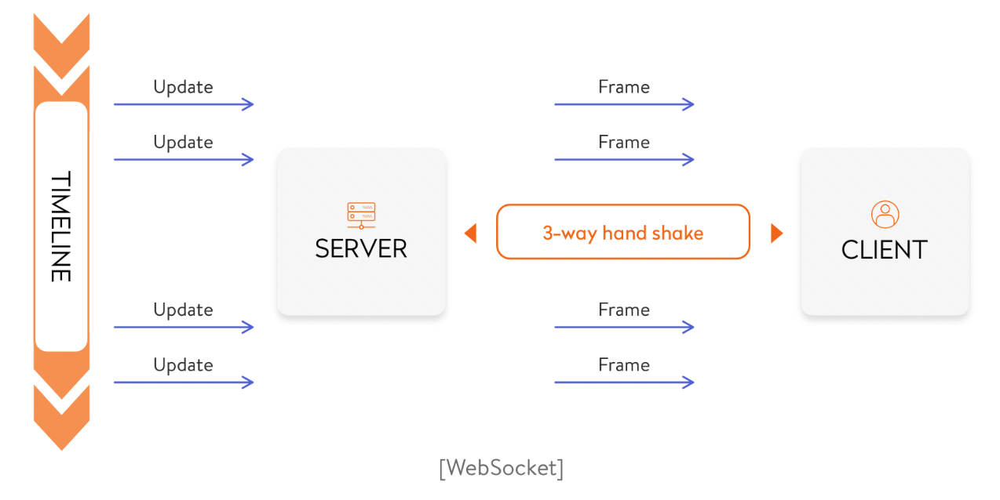
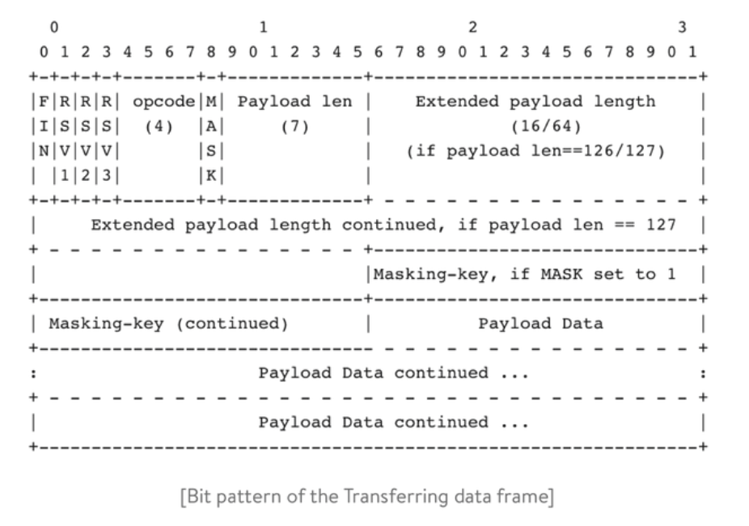

- [Websocket](#websocket)
  - [Create a WebSocket Application in Go](#create-a-websocket-application-in-go)
  - [WebSocket Libraries](#websocket-libraries)
    - [GORILLA](#gorilla)
    - [GOBWAS](#gobwas)

# Websocket

如今, 在不刷新頁面的情況下發送訊息並獲得即時響應在我們看來是理所當然的事情, 開發者在 `HTTP Long Polling` 和 `AJAX` 上走了很長一段路, 最後終於找到一種構建真正的實時應用程式的解決方案

該方案以 [WebSockets](https://en.wikipedia.org/wiki/WebSocket) 的形式出現, 讓 browser 和 server 之間開啟一個交互式 session 形成可能, `WebSocket` 支援 browser 將訊息發送到 server 並接收 event trigger response, 而無需使用 `HTTP Long Polling` 的方式去獲取 reponse

> What WebSockets are

`WebSocket` 通訊協議通過單個 `TCP` 連接提供全雙工通訊通道, 與 `HTTP` 相比 WebSocket 不需要發送 request 即可獲得 reponse

對於需要連續資料交換的 service(如即時通訊軟體, 線上遊戲或即時交易系統), `WebSockets` 是一個很好的解決方案

`WebSocket` connection 由 browser 發起 request, 經過 handshaking 後建立連接, `WebSocket` 中的特殊標頭僅需要 browser 與 server 之間一次 handshaking 即可建立連接, 該連接在整個生命週期保持活動狀態

與 `HTTP` 相比, `WebSocket` 具有以下優點:
- 輕量級 packet header 減少了資料傳輸的成本
- 單個 Web Client 僅需要一個 `TCP` 連接
- `WebSocket` server 可以將資料推送到 Web Client



`WebSocket` 協議實現相對簡單, 其使用 `HTTP` 協議進行初次 handshaking, 成功後即建立連接; 且 WebSocket 實質上使用 `TCP`(Raw TCP) 來 r/w 資料

Client request 如下所示:

```go
GET /chat HTTP/1.1
    Host: server.example.com
    Upgrade: websocket
    Connection: Upgrade
    Sec-WebSocket-Key: x3JJHMbDL1EzLkh9GBhXDw==
    Sec-WebSocket-Protocol: chat, superchat
    Sec-WebSocket-Version: 13
    Origin: http://example.com
```

Server response:

```go
HTTP/1.1 101 Switching Protocols
    Upgrade: websocket
    Connection: Upgrade
    Sec-WebSocket-Accept: HSmrc0sMlYUkAGmm5OPpG2HaGWk=
    Sec-WebSocket-Protocol: chat
```

## Create a WebSocket Application in Go

基於 `net/http` package 編寫簡單的 WebSocket echo server, 需要:
- initiate a handshaking
- 從 Client 接收 data frames
- 傳送 data frames 到 Client
- close the handshaking

首先建立一個帶有 `WebSocket` endpoint 的 HTTP handler:

```go
// HTTP server with WebSocket endpoint
func Server() {
        http.HandleFunc("/", func(w http.ResponseWriter, r *http.Request) {
            ws, err := NewHandler(w, r)
            if err != nil {
                 // handle error
            }
            if err = ws.Handshake(); err != nil {
                // handle error
            }
        …
```

再來初始化 WebSocket struct

初始化 handshaking request 始終來自 client, server 確認了 WebSocket request 後需使用 handshaking response 回覆

> 無法使用 `http.ResponseWriter` response, 因為一旦開始發送, 其將關閉基礎的 TCP 連接

因此需要使用 `HTTP hijacking`, 通過 `Hijacking` 可以接管基礎 TCP 連接處理程式和 `bufio.Writer`, 在不關閉 TCP 連接的情況下讀取和寫入資料

```go
// NewHandler initializes a new handler
func NewHandler(w http.ResponseWriter, req *http.Request) (*WS, error) {
        hj, ok := w.(http.Hijacker)
        if !ok {
            // handle error
        }                  .....
}
```

要完成 handshaking server 必須使用適當的 header 進行 response

```go
// Handshake creates a handshake header
    func (ws *WS) Handshake() error {

        hash := func(key string) string {
            h := sha1.New()
            h.Write([]byte(key))
            h.Write([]byte("258EAFA5-E914-47DA-95CA-C5AB0DC85B11"))

        return base64.StdEncoding.EncodeToString(h.Sum(nil))
        }(ws.header.Get("Sec-WebSocket-Key"))
      .....
}
```

`Sec-WebSocket-key` 是隨機生成並使用 `Base64` 編碼

Handshaking 成功後, application 可以從 client 讀取資料或向 client 寫入資料, [WebSocket](https://datatracker.ietf.org/doc/html/rfc6455#section-5.2) 定義了一個 client-server 之間使用的 specific frame format, 這是 bit pattern of the frame:



解碼 client payload:

```go
// Recv receives data and returns a Frame
    func (ws *WS) Recv() (frame Frame, _ error) {
        frame = Frame{}
        head, err := ws.read(2)
        if err != nil {
            // handle error
        }
```

對資料進行編碼:

```go
// Send sends a Frame
    func (ws *WS) Send(fr Frame) error {
        // make a slice of bytes of length 2
        data := make([]byte, 2)

        // Save fragmentation & opcode information in the first byte
        data[0] = 0x80 | fr.Opcode
        if fr.IsFragment {
            data[0] &= 0x7F
        }
        .....
```

當雙方之一發送了狀態為關閉的 close frame 當作 payload 時 handshaking 將關閉, 發送 close frame 的那方可以在 payload 中發送關閉原因, 若關閉是由 client 發起, server 發送相應的 close frame reponse

```go
// Close sends a close frame and closes the TCP connection
func (ws *Ws) Close() error {
    f := Frame{}
    f.Opcode = 8
    f.Length = 2
    f.Payload = make([]byte, 2)
    binary.BigEndian.PutUint16(f.Payload, ws.status)
    if err := ws.Send(f); err != nil {
        return err
    }
    return ws.conn.Close()
}
```

## WebSocket Libraries

### GORILLA

[Gorilla web toolkit](https://github.com/gorilla/websocket) 實現完整的 WebSocket 協議

> Install

```go
go get github.com/gorilla/websocket
```

> Client Side

```go
Client side:
 // init
    // schema – can be ws:// or wss://
    // host, port – WebSocket server
    u := url.URL{
        Scheme: {schema},
        Host:   {host}:{port},
        Path:   "/",
    }
    c, _, err := websocket.DefaultDialer.Dial(u.String(), nil)
    if err != nil {
        // handle error
    }
        .......
    // send message
    err := c.WriteMessage(websocket.TextMessage, {message})
    if err != nil {
        // handle error
    }
        .......
    // receive message
    _, message, err := c.ReadMessage()
    if err != nil {
        // handle error
    }
        .......
```

> Server Side

```go
// init
    u := websocket.Upgrader{}
    c, err := u.Upgrade(w, r, nil)
    if err != nil {
        // handle error
    }
        .......
    // receive message
    messageType, message, err := c.ReadMessage()
    if err != nil {
        // handle error
    }
        .......
    // send message
    err = c.WriteMessage(messageType, {message})
    if err != nil {
        // handle error
    }
        .......
```

### GOBWAS

具有強大的功能, 如 `zero-copy upgrade`, 允許構建自定義 packet 處理邏輯等

> install

```go
go get github.com/gobwas/ws
```

> client

```go
// init
    // schema – can be ws or wss
    // host, port – ws server
    conn, _, _, err := ws.DefaultDialer.Dial(ctx, {schema}://{host}:{port})
    if err != nil {
        // handle error
    }
        .......
    // send message
    err = wsutil.WriteClientMessage(conn, ws.OpText, {message})
    if err != nil {
        // handle error
    }

        .......
    // receive message
    msg, _, err := wsutil.ReadServerData(conn)
    if err != nil {
        // handle error
    }
        .......
```

> Server

```go
// init
    listener, err := net.Listen("tcp", op.Port)
    if err != nil {
        // handle error
    }
    conn, err := listener.Accept()
    if err != nil {
        // handle error
    }
    upgrader := ws.Upgrader{}
    if _, err = upgrader.Upgrade(conn); err != nil {
        // handle error
    }
        .......
    // receive message
    for {
         reader := wsutil.NewReader(conn, ws.StateServerSide)
         _, err := reader.NextFrame()
         if err != nil {
             // handle error
         }
         data, err := ioutil.ReadAll(reader)
         if err != nil {
             // handle error
         }
            .......
    }
        .......
    // send message
    msg := "new server message"
    if err := wsutil.WriteServerText(conn, {message}); err != nil {
        // handle error
    }
        .......
```

