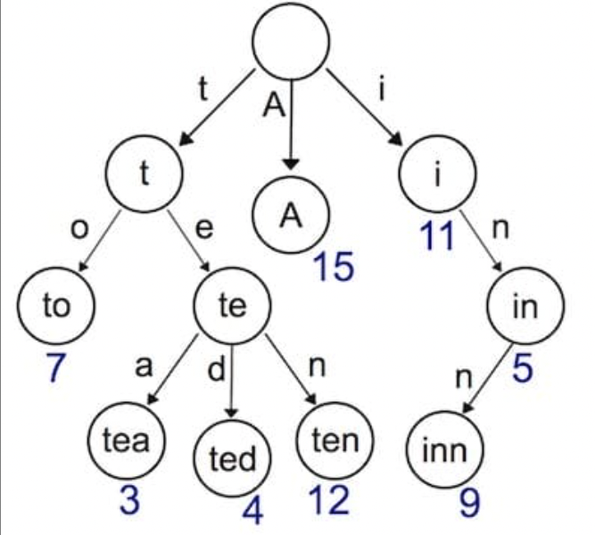
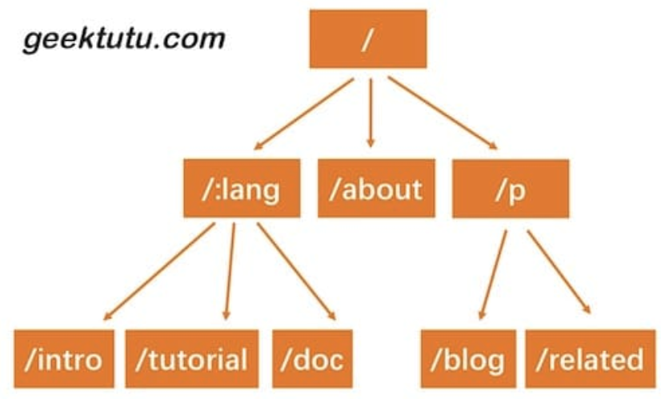

- [Create Gee Web Framework](#create-gee-web-framework)
	- [main.go](#maingo)
	- [gee.go](#geego)
- [Context Design](#context-design)
	- [context.go](#contextgo)
	- [router.go](#routergo)
- [gee.go](#geego-1)
- [Dynamic Routing](#dynamic-routing)
	- [Trie Tree Implementation](#trie-tree-implementation)
	- [trie.go](#triego)
	- [Router](#router)
	- [Context & handle Updated](#context--handle-updated)
	- [Unit Test](#unit-test)
- [Group Control](#group-control)
	- [Nested Route Group](#nested-route-group)
	- [Unit Test](#unit-test-1)
- [Middleware](#middleware)
	- [Design](#design)

# Create Gee Web Framework

這裡模仿 `gin` framework 設計並編寫 `gee` framwork 的 design 及 API

首先創建新文件夾, 初始化 module 並引用 local path packages:

```shell
go mod init gee
go mod edit -replace gee=/Users/regy/Github/omni-chat/gee
```

## main.go

```go
package main

import (
	"fmt"
	"net/http"

	"gee"
)

func main() {
	r := gee.New()
	r.GET("/", func(w http.ResponseWriter, req *http.Request) {
		fmt.Fprintf(w, "URL.Path = %q\n", req.URL.Path)
	})

	r.GET("/hello", func(w http.ResponseWriter, req *http.Request) {
		for k, v := range req.Header {
			fmt.Fprintf(w, "Header[%q] = %q\n", k, v)
		}
	})

	r.Run(":9999")
}
```

參考 gin framework 的 design, 使用 `New()` 創建 gee instance, 並使用 `GET()` 方法新增路由, 最後使用 `Run()` 啟動 web server

這裡的路由是靜態路由, 還不支持類似 `/hello/:name` 這樣的動態路由

## gee.go

```go
package gee

import (
	"fmt"
	"net/http"
)

// HandlerFunc defines the request handler used by gee
type HandlerFunc func(http.ResponseWriter, *http.Request)

// Engine implement the interface of ServeHTTP
type Engine struct {
	router map[string]HandlerFunc
}

// New is the constructor of gee.Engine
func New() *Engine {
	return &Engine{router: make(map[string]HandlerFunc)}
}

func (engine *Engine) addRoute(method string, pattern string, handler HandlerFunc) {
	key := method + "-" + pattern
	engine.router[key] = handler
}

// GET defines the method to add GET request
func (engine *Engine) GET(pattern string, handler HandlerFunc) {
	engine.addRoute("GET", pattern, handler)
}

// POST defines the method to add POST request
func (engine *Engine) POST(pattern string, handler HandlerFunc) {
	engine.addRoute("POST", pattern, handler)
}

// Run defines the method to start a http server
func (engine *Engine) Run(addr string) (err error) {
	return http.ListenAndServe(addr, engine)
}

func (engine *Engine) ServeHTTP(w http.ResponseWriter, req *http.Request) {
	key := req.Method + "-" + req.URL.Path
	if handler, ok := engine.router[key]; ok {
		handler(w, req)
	} else {
		fmt.Fprintf(w, "404 NOT FOUND: %s\n", req.URL)
	}
}
```

- 定義了 `HandlerFunc` 型別提供給 framework user 使用, 其用來定義 route mapping handle function
- 在 `Engine` struct 中添加一個 route mapping map routers, key 由 request method 和 static routing address 組成, 如 `GET-/`, `GET-/hello`, 針對相同的路由若請求方法不同, 可以映射到不同的 handler 處理
- 當 user 調用 `(*Engine).GET()` 方法時, 會將路由和 handler registe 到 engine 的 routes mapping map
- `(*Engine).Run()` 方法是 ListenAndServe warpped 方法
- Engine 實現 `ServeHTTP` 方法的作用為解析 request path 並查找 routes mapping map, 若找到執行對應 handler, 否則 return `404 NOT FOUND`

# Context Design

對於 Web Server 來說, 無非是根據請求 `*http.Request` 來構建響應 `http.ResponseWriter`

但這兩個物件提供的 interface 粒度太細, 如若要構建一個完整的響應需要考慮 `Header` 和 `Body`, 而 `Header` 包含了 `StatusCode`, `ContentType` 等幾乎每次請求都需要設置的資訊, 若不有效封裝則需要大量復寫繁瑣的程式碼且容易出錯

以返回 JSON 資料作比較範例:

封裝前

```go
obj = map[string]interface{}{
    "name": "geektutu",
    "password": "1234",
}
w.Header().Set("Content-Type", "application/json")
w.WriteHeader(http.StatusOK)
encoder := json.NewEncoder(w)
if err := encoder.Encode(obj); err != nil {
    http.Error(w, err.Error(), 500)
}
```

封裝後

```go
c.JSON(http.StatusOK, gee.H{
    "username": c.PostForm("username"),
    "password": c.PostForm("password"),
})
```

針對使用場景封裝 `*http.Request` 和 `http.ResponseWriter` 的方法並簡化相關方法調用, 只是設計 `Context` 的原因之一

對於 framework 來說還需要支持額外的功能, 如將來解析動態路由 `/hello/:name` 時參數 `:name` 值擺放的位置? 或是 framework 需要支持 middleware, 而 middleware 所產生的訊息要放在哪?

Context 隨著每個請求的產生而建立, 隨請求結束而銷毀, 和當前請求強相關的資訊都應由 Context 乘載

因此設計 `Context` struct, 擴展性和複雜性保留在內部, 對外則簡化了接口, 路由的 handle function 和要實現的 middleware, 參數都統一使用 `Context` instance

這裡做了以下改進:
- 將 router 獨立, 方便後續新增功能
- 設計 `Context`, 封裝 Request 和 Response, 提供對 JSON, HTML 等返回型別的支持

main.go
```go
func main() {
	r := gee.New()
	r.GET("/", func(c *gee.Context) {
		c.HTML(http.StatusOK, "<h1>Hello Gee</h1>")
	})
	r.GET("/hello", func(c *gee.Context) {
		// expect /hello?name=geektutu
		c.String(http.StatusOK, "hello %s, you're at %s\n", c.Query("name"), c.Path)
	})

	r.POST("/login", func(c *gee.Context) {
		c.JSON(http.StatusOK, gee.H{
			"username": c.PostForm("username"),
			"password": c.PostForm("password"),
		})
	})

	r.Run(":9999")
}
```

- Handler 的參數變成 `gee.Context`, 提供了查詢 `Query/PostForm` 參數的功能
- `gee.Context` 封裝了 HTML/String/JSON 函數, 能夠快速構建 HTTP response

## context.go

```go
import (
	"encoding/json"
	"fmt"
	"net/http"
)

type H map[string]interface{}

type Context struct {
	// origin objects
	Writer http.ResponseWriter
	Req    *http.Request
	// request info
	Path   string
	Method string
	// response info
	StatusCode int
}

func newContext(w http.ResponseWriter, req *http.Request) *Context {
	return &Context{
		Writer: w,
		Req:    req,
		Path:   req.URL.Path,
		Method: req.Method,
	}
}

func (c *Context) PostForm(key string) string {
	return c.Req.FormValue(key)
}

func (c *Context) Query(key string) string {
	return c.Req.URL.Query().Get(key)
}

func (c *Context) Status(code int) {
	c.StatusCode = code
	c.Writer.WriteHeader(code)
}

func (c *Context) SetHeader(key string, value string) {
	c.Writer.Header().Set(key, value)
}

func (c *Context) String(code int, format string, values ...interface{}) {
	c.SetHeader("Content-Type", "text/plain")
	c.Status(code)
	c.Writer.Write([]byte(fmt.Sprintf(format, values...)))
}

func (c *Context) JSON(code int, obj interface{}) {
	c.SetHeader("Content-Type", "application/json")
	c.Status(code)
	encoder := json.NewEncoder(c.Writer)
	if err := encoder.Encode(obj); err != nil {
		http.Error(c.Writer, err.Error(), 500)
	}
}

func (c *Context) Data(code int, data []byte) {
	c.Status(code)
	c.Writer.Write(data)
}

func (c *Context) HTML(code int, html string) {
	c.SetHeader("Content-Type", "text/html")
	c.Status(code)
	c.Writer.Write([]byte(html))
}
```

- 幫 `map[string]interface{}` 起了一個別名 `gee.H`, 在構建 JSON 資料時更簡潔
- `Context` 目前只包含了 `http.ResponseWriter` 和 `*http.Request`, 另外還提供了 `Method` 和 `Path` 這兩個常用屬性的直接訪問
- 提供了訪問 `Query` 和 `PostForm` 參數的方法
- 提供了快速構建 String/Data/JSON/HTML 響應的方法

## router.go

將和 router 相關的方法和 struct 拆出來, 方便之後對 router 功能的增強, 如提供動態路由的支持

router 的 `handle` 方法做了一個細微的調整, 即 `handle` 的參數變成了 `Context`

```go
type router struct {
	handlers map[string]HandlerFunc
}

func newRouter() *router {
	return &router{handlers: make(map[string]HandlerFunc)}
}

func (r *router) addRoute(method string, pattern string, handler HandlerFunc) {
	log.Printf("Route %4s - %s", method, pattern)
	key := method + "-" + pattern
	r.handlers[key] = handler
}

func (r *router) handle(c *Context) {
	key := c.Method + "-" + c.Path
	if handler, ok := r.handlers[key]; ok {
		handler(c)
	} else {
		c.String(http.StatusNotFound, "404 NOT FOUND: %s\n", c.Path)
	}
}
```

# gee.go

```go
// HandlerFunc defines the request handler used by gee
type HandlerFunc func(*Context)

// Engine implement the interface of ServeHTTP
type Engine struct {
	router *router
}

// New is the constructor of gee.Engine
func New() *Engine {
	return &Engine{router: newRouter()}
}

func (engine *Engine) addRoute(method string, pattern string, handler HandlerFunc) {
	engine.router.addRoute(method, pattern, handler)
}

// GET defines the method to add GET request
func (engine *Engine) GET(pattern string, handler HandlerFunc) {
	engine.addRoute("GET", pattern, handler)
}

// POST defines the method to add POST request
func (engine *Engine) POST(pattern string, handler HandlerFunc) {
	engine.addRoute("POST", pattern, handler)
}

// Run defines the method to start a http server
func (engine *Engine) Run(addr string) (err error) {
	return http.ListenAndServe(addr, engine)
}

func (engine *Engine) ServeHTTP(w http.ResponseWriter, req *http.Request) {
	c := newContext(w, req)
	engine.router.handle(c)
}
```

在調用 `router.handle` 之前構建了 `Context` instance, 目前 `Context` 僅封裝了原本的兩個參數

# Dynamic Routing

使用 map 來儲存路由表只能針對靜態路由索引, 無法支持類似 `/hello/:name` 這樣的動態索引, 即一條路由規則可以匹配某個 pattern 而非一條固定的路由, 如 `/hello/:name` 可以匹配 `/hello/regy`, `/hello/chang` 等

動態路由有多種實現方式, 如開源的 `gorouter` 支持在路由規則中嵌入正則表達式; 另一個開源 `httprouter` 則不支持正則表達式



實現動態路由最常用的資料結構為 prefix tree(trie tree), 其每個節點的子節點都擁有相同的 prefix, 非常適用於 routes matching

例如定義以下路由規則:
- /:lang/doc
- /:lang/tutorial
- /:lang/intro
- /about
- /p/blog
- /p/related

以 trie tree 表示如下:



HTTP request path 是由 `/` 分隔的多段構成, 因此每一段可以作為 tire tree 的一個 node, 通過 tree 結構查詢, 若過程中每個 node 不滿足條件則說明沒有匹配到路由, 查詢結束

## Trie Tree Implementation

動態路由具備以下兩個功能:
- 參數匹配: 如 `/p/:lang/doc` 可以匹配 `/p/c/doc` 和 `/p/go/doc`
- 通配符 `*`: 如 `/static/*filepath` 可以匹配 `/static/fav.ico`, 也可以匹配 `/static/js/node.js`, 這種 pattern 常用於 static server, 能夠遞迴匹配子路徑

## trie.go

```go
type node struct {
	pattern  string // 待匹配路由如 /p/:lang
	part     string // 路由中的一部分如 :lang
	children []*node // 子節點如 [doc, tutorial, intro]
	isWild   bool // 是否精準匹配, part 包含 : 或 * 時為 true
}
```

為了實現動態路由匹配加上了 `isWild` 參數, 即當匹配了 `/p/go/doc` 這個路由時, 第一層節點 `p` 精準匹配到了 `p`, 第二層節點 `go` 模糊匹配到了 `:lang`, 將會把 `lang` 這個參數賦值為 `go` 繼續下一層匹配

將匹配邏輯包裝為一個輔助函數:

```go
// 第一個匹配成功的節點用於插入
func (n *node) matchChild(part string) *node {
	for _, child := range n.children {
		if child.part == part || child.isWild {
			return child
		}
	}
	return nil
}

// 所有匹配成功的節點用於查找
func (n *node) matchChildren(part string) []*node {
	nodes := make([]*node, 0)
	for _, child := range n.children {
		if child.part == part || child.isWild {
			nodes = append(nodes, child)
		}
	}
	return nodes
}
```

對於 routing 來說最重要的是 registe 和 match, 開發時 registe routing rules 映射 handler, 訪問時 match routing rule 查找對應的 handler

Trie tree 需要 node insert 與 search 功能, 遞迴查詢每一層 node, 如果沒有匹配到當前 part 的 node 則新建一個

需注意 `/p/:lang/doc` 只有在第三層的 node, 即 `doc` node 才會設置 pattern 為 `/p/:lang/doc`, `p` 和 `:lang` 節點的 pattern field 為空, 因此可以以 `n.pattern == ""` 來判斷 route matching 是否成功

如 `/p/python` 雖然能成功匹配到 `:lang`, 但 `:lang` node patten 值為空, 因此匹配失敗

查詢功能同樣是遞迴查詢每一層節點, 當匹配到 `*` 或第 len(parts) 層節點則匹配失敗

```go
func (n *node) insert(pattern string, parts []string, height int) {
	if len(parts) == height {
		n.pattern = pattern
		return
	}

	part := parts[height]
	child := n.matchChild(part)
	if child == nil {
		child = &node{part: part, isWild: part[0] == ':' || part[0] == '*'}
		n.children = append(n.children, child)
	}
	child.insert(pattern, parts, height+1)
}

func (n *node) search(parts []string, height int) *node {
	if len(parts) == height || strings.HasPrefix(n.part, "*") {
		if n.pattern == "" {
			return nil
		}
		return n
	}

	part := parts[height]
	children := n.matchChildren(part)

    for _, child := range children {
		result := child.search(parts, height+1)
		if result != nil {
			return result
		}
	}

	return nil
}
```

## Router

接下來是將 Trie tree 印用到 router 中, 使用 `roots` 來儲存每種 request method 的 Trie tree root node, 並使用 `handlers` 儲存每種 request method 的 `HandlerFunc`

`getRoute` 函數中還解析了 `:` 和 `*` 兩種通配符參數並返回一個 map, 如 `/p/go/doc` 匹配到 `/p/:lang/doc`, 解析結果為 `{lang: "go"}`, `/static/css/geektutu.css` 匹配到 `/static/*filepath` 解析結果為 `{filepath: "css/geektutu.css"}`

```go
package gee

import (
	"net/http"
	"strings"
)

type router struct {
	roots    map[string]*node
	handlers map[string]HandlerFunc
}

func newRouter() *router {
	return &router{
		roots:    make(map[string]*node),
		handlers: make(map[string]HandlerFunc),
	}
}

// Only one * is allowed
func parsePattern(pattern string) []string {
	vs := strings.Split(pattern, "/")

	parts := make([]string, 0)
	for _, item := range vs {
		if item != "" {
			parts = append(parts, item)
			if item[0] == '*' {
				break
			}
		}
	}
	return parts
}

func (r *router) addRoute(method string, pattern string, handler HandlerFunc) {
	parts := parsePattern(pattern)

	key := method + "-" + pattern
	_, ok := r.roots[method]
	if !ok {
		r.roots[method] = &node{}
	}
	r.roots[method].insert(pattern, parts, 0)
	r.handlers[key] = handler
}

func (r *router) getRoute(method string, path string) (*node, map[string]string) {
	searchParts := parsePattern(path)
	params := make(map[string]string)
	root, ok := r.roots[method]

	if !ok {
		return nil, nil
	}

	n := root.search(searchParts, 0)

	if n != nil {
		parts := parsePattern(n.pattern)
		for index, part := range parts {
			if part[0] == ':' {
				params[part[1:]] = searchParts[index]
			}
			if part[0] == '*' && len(part) > 1 {
				params[part[1:]] = strings.Join(searchParts[index:], "/")
				break
			}
		}
		return n, params
	}

	return nil, nil
}
```

## Context & handle Updated

在 `HandlerFunc` 中希望能夠訪問到解析的參數, 因此需要對 `Context` object 新增一個屬性和方法來提供對路由參數的訪問

將解析後的參數儲存到 `Params` 中, 可以通過 `c.Param("lang")` 方式獲取到對應的參數值

context.go

```go
type Context struct {
	// origin objects
	Writer http.ResponseWriter
	Req    *http.Request
	// request info
	Path   string
	Method string
	Params map[string]string
	// response info
	StatusCode int
}

func (c *Context) Param(key string) string {
	value, _ := c.Params[key]
	return value
}
```

router.go

```go
func (r *router) handle(c *Context) {
	n, params := r.getRoute(c.Method, c.Path)
	if n != nil {
		c.Params = params
		key := c.Method + "-" + n.pattern
		r.handlers[key](c)
	} else {
		c.String(http.StatusNotFound, "404 NOT FOUND: %s\n", c.Path)
	}
}
```

在調用匹配到的 handler 前, 將解析出來的路由參數賦值給 `c.Params`, 這樣能在 handler 中通過 `Context` 物件訪問到具體的值

main.go

```go
func main() {
	r := gee.New()
	r.GET("/", func(c *gee.Context) {
		c.HTML(http.StatusOK, "<h1>Hello Gee</h1>")
	})

	r.GET("/hello", func(c *gee.Context) {
		// expect /hello?name=geektutu
		c.String(http.StatusOK, "hello %s, you're at %s\n", c.Query("name"), c.Path)
	})

	r.GET("/hello/:name", func(c *gee.Context) {
		// expect /hello/geektutu
		c.String(http.StatusOK, "hello %s, you're at %s\n", c.Param("name"), c.Path)
	})

	r.GET("/assets/*filepath", func(c *gee.Context) {
		c.JSON(http.StatusOK, gee.H{"filepath": c.Param("filepath")})
	})

	r.Run(":9999")
}
```

## Unit Test

router_test.go

```go
package gee

import (
	"fmt"
	"reflect"
	"testing"
)

func newTestRouter() *router {
	r := newRouter()
	r.addRoute("GET", "/", nil)
	r.addRoute("GET", "/hello/:name", nil)
	r.addRoute("GET", "/hello/b/c", nil)
	r.addRoute("GET", "/hi/:name", nil)
	r.addRoute("GET", "/assets/*filepath", nil)
	return r
}

func TestParsePattern(t *testing.T) {
	ok := reflect.DeepEqual(parsePattern("/p/:name"), []string{"p", ":name"})
	ok = ok && reflect.DeepEqual(parsePattern("/p/*"), []string{"p", "*"})
	ok = ok && reflect.DeepEqual(parsePattern("/p/*name/*"), []string{"p", "*name"})
	if !ok {
		t.Fatal("test parsePattern failed")
	}
}

func TestGetRoute(t *testing.T) {
	r := newTestRouter()
	n, ps := r.getRoute("GET", "/hello/geektutu")

	if n == nil {
		t.Fatal("nil shouldn't be returned")
	}

	if n.pattern != "/hello/:name" {
		t.Fatal("should match /hello/:name")
	}

	if ps["name"] != "geektutu" {
		t.Fatal("name should be equal to 'geektutu'")
	}

	fmt.Printf("matched path: %s, params['name']: %s\n", n.pattern, ps["name"])

}

func TestGetRoute2(t *testing.T) {
	r := newTestRouter()
	n1, ps1 := r.getRoute("GET", "/assets/file1.txt")
	ok1 := n1.pattern == "/assets/*filepath" && ps1["filepath"] == "file1.txt"
	if !ok1 {
		t.Fatal("pattern shoule be /assets/*filepath & filepath shoule be file1.txt")
	}

	n2, ps2 := r.getRoute("GET", "/assets/css/test.css")
	ok2 := n2.pattern == "/assets/*filepath" && ps2["filepath"] == "css/test.css"
	if !ok2 {
		t.Fatal("pattern shoule be /assets/*filepath & filepath shoule be css/test.css")
	}

}

func TestGetRoutes(t *testing.T) {
	r := newTestRouter()
	nodes := r.getRoutes("GET")
	for i, n := range nodes {
		fmt.Println(i+1, n)
	}

	if len(nodes) != 5 {
		t.Fatal("the number of routes shoule be 4")
	}
}
```

使用 `curl` 測試:

```go
$ curl "http://localhost:9999/hello/geektutu"
hello geektutu, you're at /hello/geektutu

$ curl "http://localhost:9999/assets/css/geektutu.css"
{"filepath":"css/geektutu.css"}
```

# Group Control

Group control 是指路由分組, 因為在真實應用場景中往往某一組路由需要相似的管理, 如:
- 以 `/post` 開頭的路由可匿名訪問
- 以 `/admin` 開頭的路由需要 authentication
- 以 `api` 開頭的路由是 RESTful api, 可以介接第三方平台, 需要第三方平台 authentication

大部分情況下路由分組是以相同的 prefix 來區分, 且支援分組嵌套, 如 `/post` 是一個 group, `/post/a` 和 `/post/b` 可以是此 group 下的 subgroup, 作用在 `/post` group 上的 middleware 也都會套用在 subgroup 上, subgroup 也可以套用自己的 middleware

Middleware 可以給 framework 提供無限擴展能力, 套用在分組上可以使效益更明顯, 而不只是共享相同的 route prefix, 如 `/admin` group 可以套用 authentication middleware, `/` group 套用 logging middleware, 意味所有路由都套用此 middleware

## Nested Route Group

一個 `Group` 物件需要有 prefix 屬性, 如 `/` 或 `api`, 要支持分組嵌套還需要知道當前 group 的 parent

Middleware 是套用在 group 上, 則還需要儲存套用在當前 group 的 middleware

之前調用函數 `(*Engine).addRoute()` 來映射所有路由規則和 Handler, 若 `Group` 物件直接映射路由規則的話應該會這樣調用:

```go
r := gee.New()
v1 := r.Group("/v1")
v1.GET("/", func(c *gee.Context) {
	c.HTML(http.StatusOK, "<h1>Hello Gee</h1>")
})
```

那麼 `Group` 物件還需要有訪問 `Router` 的能力, 為了方便可以在 `Group` 中保留一個  `Engine` pointer, 可以通過 `Engine` 間接訪問各種接口

`Group` 定義如下:

gee.go

```go
RouterGroup struct {
	prefix      string
	middlewares []HandlerFunc // support middleware
	parent      *RouterGroup  // support nesting
	engine      *Engine       // all groups share a Engine instance
}
```

還可以進一步抽象, 將 `Engine` 作為最頂層的 group, 也就是 `Engine` 擁有 `RouterGroup` 所有的功能:

```go
Engine struct {
	*RouterGroup
	router *router
	groups []*RouterGroup // store all groups
}
```

接下來就可以將和路由相關的函數都叫給 `RouterGroup` 來實現:

```go
// New is the constructor of gee.Engine
func New() *Engine {
	engine := &Engine{router: newRouter()}
	engine.RouterGroup = &RouterGroup{engine: engine}
	engine.groups = []*RouterGroup{engine.RouterGroup}
	return engine
}

// Group is defined to create a new RouterGroup
// remember all groups share the same Engine instance
func (group *RouterGroup) Group(prefix string) *RouterGroup {
	engine := group.engine
	newGroup := &RouterGroup{
		prefix: group.prefix + prefix,
		parent: group,
		engine: engine,
	}
	engine.groups = append(engine.groups, newGroup)
	return newGroup
}

func (group *RouterGroup) addRoute(method string, comp string, handler HandlerFunc) {
	pattern := group.prefix + comp
	log.Printf("Route %4s - %s", method, pattern)
	group.engine.router.addRoute(method, pattern, handler)
}

// GET defines the method to add GET request
func (group *RouterGroup) GET(pattern string, handler HandlerFunc) {
	group.addRoute("GET", pattern, handler)
}

// POST defines the method to add POST request
func (group *RouterGroup) POST(pattern string, handler HandlerFunc) {
	group.addRoute("POST", pattern, handler)
}
```

注意 `addRoute` 函數, 調用了 `group.engine.router.addRoute` 來實現路由映射, 由於 `Engine` 某種意義上繼承了 `RouterGroup` 的所有屬性和方法, 因為 `(*Engine).engine` 是指向自己, 如此一來既可以像原來一樣新增路由, 也可以通過 grouping 新增路由

## Unit Test

main.go

```go
func main() {
	r := gee.New()
	r.GET("/index", func(c *gee.Context) {
		c.HTML(http.StatusOK, "<h1>Index Page</h1>")
	})
	v1 := r.Group("/v1")
	{
		v1.GET("/", func(c *gee.Context) {
			c.HTML(http.StatusOK, "<h1>Hello Gee</h1>")
		})

		v1.GET("/hello", func(c *gee.Context) {
			// expect /hello?name=geektutu
			c.String(http.StatusOK, "hello %s, you're at %s\n", c.Query("name"), c.Path)
		})
	}
	v2 := r.Group("/v2")
	{
		v2.GET("/hello/:name", func(c *gee.Context) {
			// expect /hello/geektutu
			c.String(http.StatusOK, "hello %s, you're at %s\n", c.Param("name"), c.Path)
		})
		v2.POST("/login", func(c *gee.Context) {
			c.JSON(http.StatusOK, gee.H{
				"username": c.PostForm("username"),
				"password": c.PostForm("password"),
			})
		})

	}

	r.Run(":9999")
}
```

gee_test.go

```go
package gee

import "testing"

func TestNestedGroup(t *testing.T) {
	r := New()
	v1 := r.Group("/v1")
	v2 := v1.Group("/v2")
	v3 := v2.Group("/v3")
	if v2.prefix != "/v1/v2" {
		t.Fatal("v2 prefix should be /v1/v2")
	}
	if v3.prefix != "/v1/v2/v3" {
		t.Fatal("v2 prefix should be /v1/v2")
	}
}
```

# Middleware

Middleware 簡單來說就是非業務的技術類組件, framework 本身不可能實現所有的業務功能, 因此其需要一個插口來讓使用者自定義功能並嵌入 framework 中

對於 middleware 來說有兩個關鍵的重點:
- 插入點的位置? 使用 framework 的人並不關心底層邏輯的具體實現為何, 若插入點過於底層則 middleware 邏輯就會過於複雜; 若插入點過於上層則和使用者自定義一組函數並每次在 `Handler` 中調用也沒有過多優勢
- Middleware 輸入為何? Middleware 的輸入決定了可擴展的能力, 若暴露的參數太少則使用者發揮空間有限

## Design

這裡 middleware design 參考了 `Gin` framework

`Gee` middleware 的定義與路由映射的 `Handler` 一致, 輸入參數為 `Context` 物件

插入點位置在 framework 收到 request 後初始化 `Context` instance 後允許使用者自行定義的 middleware 做一些額外的處理, 如 logging, 及對 `Context` 物件進行二次加工

另外通過調用 `(*Context).Next()` 函數, middleware 可等待使用者自己定義的 `Handler` 處理結束後再做一些額外操作, 例如計算本次 `Handler` 處理所花費的時間等, 即 `Gee` middleware 支持在請求處理的前後做額外操作

舉例來說希望能夠支持如下定義的 middleware, `c.Next()` 表示等待執行其他的 middleware 或 `Handler`:

```go
func Logger() HandlerFunc {
	return func(c *Context) {
		// Start timer
		t := time.Now()
		// Process request
		c.Next()
		// Calculate resolution time
		log.Printf("[%d] %s in %v", c.StatusCode, c.Req.RequestURI, time.Since(t))
	}
}
```

另外支持多個 middleware 依序調用

Middleware 是應用在 `RouterGroup` 上, 應用在最頂層的 Group 相當於作用於全局, 所有的請求都會被 middleware 處理

為何不將 middleware 綁定在每條路由規則上? 若如此還不如直接在 `Handler` 調用直觀, middleware 綁定在某條路由規則的功能通用性太差, 不適合定義為 middleware

之前的 framework 設計是當收到 request 後 matching routes, 將 request 所有資訊保存於 `Context` 中

Middleware 也不例外, 在接受到請求後應查詢所有應用於該路由的 middleware 並保存在 `Context` 中依序調用

為何依序調用後還需在 `Context` 中保存呢? 因為在設計中, middleware 不僅作用在 `Handler` 前, 也可以作用在 `Handler` 後

為此為 `Context` 添加了兩個參數並定義了 `Next` 方法:

```go
type Context struct {
	// origin objects
	Writer http.ResponseWriter
	Req    *http.Request
	// request info
	Path   string
	Method string
	Params map[string]string
	// response info
	StatusCode int
	// middleware
	handlers []HandlerFunc
	index    int
}

func newContext(w http.ResponseWriter, req *http.Request) *Context {
	return &Context{
		Path:   req.URL.Path,
		Method: req.Method,
		Req:    req,
		Writer: w,
		index:  -1,
	}
}

func (c *Context) Next() {
	c.index++
	s := len(c.handlers)
	for ; c.index < s; c.index++ {
		c.handlers[c.index](c)
	}
}
```

`index` 是紀錄當前執行到第幾個 middleware, 當在 middleware 中調用 `Next` 方法時, 控制權就交給下一個 middleware, 直到調用到最後一個 middleware 後再由後往前, 調用每個 middleware 在 `Next` 方法之後定義的部分

若將使用者在映射路由時定義的 `Handler` 添加到 `c.handlers` 中結果會如何?

```go
func A(c *Context) {
    part1
    c.Next()
    part2
}
func B(c *Context) {
    part3
    c.Next()
    part4
}
```

假設應用了 middleware A, B, 和路由映射的 `Handler`, c.handlers 為 [A, B, Handler], c.index 初始化為 -1, 調用 `c.Next()` 後流程如下:
- `c.index++`, `c.index` 變為 0
- 0 < 3, 調用 `c.handlers[0]`, 即 A
- 執行 `part1`, 調用 `c.Next()`
- `c.index++`, `c.index` 變為 1
- 1 < 3, 調用 `c.handlers[1]`, 即 B
- 執行 `part3`, 調用 `c.Next()`
- `c.index++`, `c.index` 變為 2
- 2 < 3, 調用 `c.handlers[2]`, 即 `Handler`
- `Handler` 調用完畢返回到 B 中的 `part4` 並執行
- `part4` 執行完畢返回到 A 中的 `part2` 並執行
- `part2` 執行完畢, 結束

最終調用順序為: part1 -> part3 -> Handler -> part 4 -> part2
