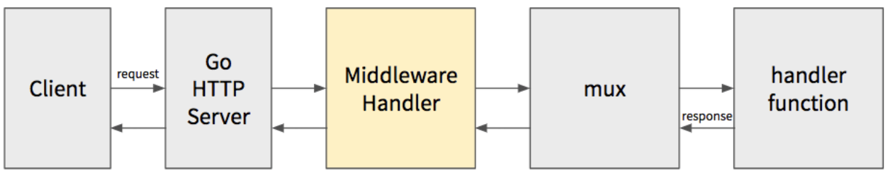
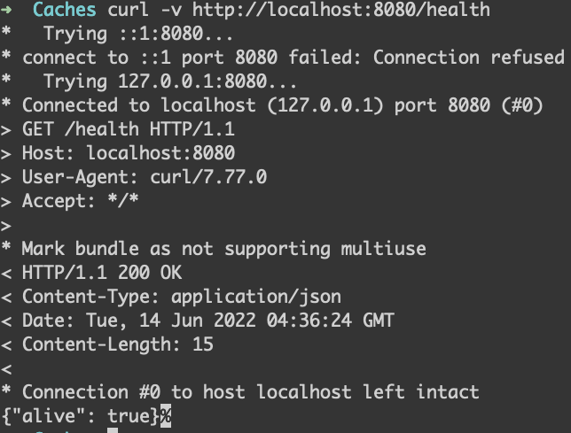
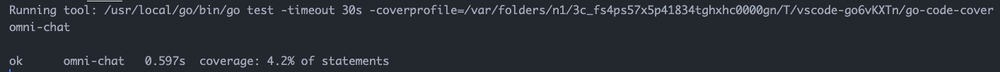
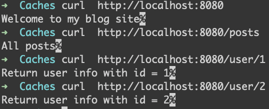
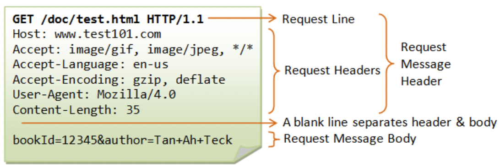
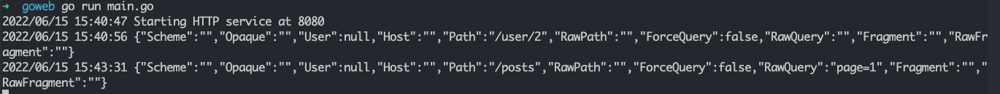
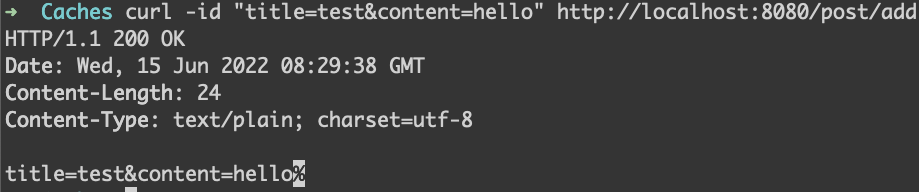

- [gorilla/mux](#gorillamux)
- [mux.Router](#muxrouter)
  - [Custom Handler](#custom-handler)
- [Matching Routes](#matching-routes)
  - [Request Parameters](#request-parameters)
  - [HTTP Methods](#http-methods)
  - [Path Prefix](#path-prefix)
  - [Matching Domain](#matching-domain)
  - [URL Schemes](#url-schemes)
  - [Header Values](#header-values)
  - [Query Values](#query-values)
  - [Custom Matcher Function](#custom-matcher-function)
  - [Subrouting](#subrouting)
  - [Registered URLs](#registered-urls)
- [Middleware](#middleware)
- [Static Files](#static-files)
- [Testing Handlers](#testing-handlers)
- [Directory Structure](#directory-structure)
  - [Project Initial](#project-initial)
  - [Router Implementation](#router-implementation)
  - [Start Web Server](#start-web-server)
  - [Define routes and handler methods](#define-routes-and-handler-methods)
  - [Testing](#testing)
- [Get HTTP Message Body From Request](#get-http-message-body-from-request)
  - [Request Struct](#request-struct)
  - [Request URL](#request-url)
  - [Request Header](#request-header)
  - [Request Body](#request-body)

# gorilla/mux

Go 官方 standard libray `net/http` 通過自帶的 `DefaultServeMux` 提供的 routing handler 雖然簡單, 但存在許多不足:
- 不支持參數設定, 如 `/user/:uid` 這種泛型匹配
- 對 restful api 支持不友善, 無法限制訪問路由的方法
- 對於擁有很多 routing rules 的應用, 編寫大量路由規則非常繁瑣

`gorilla/mux` 提供了更強大的 routing handler, 與 `http.ServeMux` 實現原理相同, `gorilla/mux` 提供的 router implementation type `mux.Router` 也會匹配 user requests 與系統註冊的 routing rules, 並將請求轉發

`mux.Router` 主要有以下特性:
- 實現 `http.Handler` interface, 所以與 `http.ServeMux` 完全兼容
- 可以基於 URL host, path, prefix, scheme, request header, request parameters, request method 進行 routing
- URL host, path, query string 支持可選正則匹配
- 支持構建或反轉已註冊的 URL host, 以便維護對資源的引用
- 支持路由嵌套, 以便不同路由可以共享通用條件, 比如 host, path prefix 等

安裝 `gorilla/mux`:

```go
go get -u github.com/gorilla/mux
```

# mux.Router

```go
package main

import (
    "fmt"
    "github.com/gorilla/mux"
    "log"
    "net/http"
)

func sayHelloWorld(w http.ResponseWriter, r *http.Request)  {
    w.WriteHeader(http.StatusOK)  // set HTTP status code 200
    fmt.Fprintf(w, "Hello, World!")  // send response to client
}

func main()  {
    r := mux.NewRouter()
    r.HandleFunc("/hello", sayHelloWorld)
    log.Fatal(http.ListenAndServe(":8080", r))
}
```

在 `main` 函數中第一行顯式初始化了 `mux.Router` 作為 router, 並在這個 router 中註冊 routing rules, 最後將此 router 傳入 `http.ListenAndServe` 函數

在 broswer 訪問 `http://localhost:8080/hello` 即可渲染出以下結果:

```go
Hello, World!
```

## Custom Handler

與 `http.ServeMux` 相同, 在 `mux.Router` 也可以將請求轉發給自定義 handler 類型:

```go
package main

import (
    "fmt"
    "github.com/gorilla/mux"
    "log"
    "net/http"
)

func sayHelloWorld(w http.ResponseWriter, r *http.Request)  {
    params := mux.Vars(r)
    w.WriteHeader(http.StatusOK)  // set HTTP status code to 200
    fmt.Fprintf(w, "Hello, %s!", params["name"])  // send response to client
}

type HelloWorldHandler struct {}

func (handler *HelloWorldHandler) ServeHTTP(w http.ResponseWriter, r *http.Request)  {
    params := mux.Vars(r)
    w.WriteHeader(http.StatusOK)  // set HTTP status code to 200
    fmt.Fprintf(w, "你好, %s!", params["name"])  // send response to client
}

func main()  {
    r := mux.NewRouter()
    r.HandleFunc("/hello/{name:[a-z]+}", sayHelloWorld)
    r.Handle("/zh/hello/{name}", &HelloWorldHandler{})
    log.Fatal(http.ListenAndServe(":8080", r))
}
```

這裡的 `HelloWorldHandler` 也要實現 `Handler` interface 定義的 `ServeHTTP` 方法, 調用方式與之前相同, 只需要通過 `r.Handle` 方法傳入 Handler instance 即可

# Matching Routes

## Request Parameters

如果想在 router 中設置 routing parameters, 例如 `/hello/world`, `/hello/regy`, 可以通過以下方法實現:

```go
r.HandleFunc("/hello/{name}", sayHelloWorld)
```

或是可以通過正則表達式限制參數字符串:

```go
r.HandleFunc("/hello/{name:[a-z]+}", sayHelloWorld)
```

以上 routing parameters 僅支持小寫字母, 不支持其他字符

相應地在 closure 處理函數中, 需要這樣解析 routing parameters:

```go
func sayHelloWorld(w http.ResponseWriter, r *http.Request)  {
    params := mux.Vars(r)
    w.WriteHeader(http.StatusOK)  // set HTTP status code to 200
    fmt.Fprintf(w, "Hello, %s!", params["name"])  // send response to client
}
```

可以通過 `http://localhost:8080/hello/regy` 這種方式請求路由:

```go
Hello, Regy!
```

>❗️若請求參數中包含中文則會直接返回 404, 表示路由匹配失敗

## HTTP Methods

`gorilla/mux` 支持通過 `Methods` 方法來限定 request methods:

```go
r := mux.NewRouter()
r.HandleFunc("/hello/{name:[a-z]+}", sayHelloWorld).Methods("GET", "POST")
r.Handle("/zh/hello/{name}", &HelloWorldHandler{}).Methods("GET")
log.Fatal(http.ListenAndServe(":8080", r))
```

使用 `curl` 測試, 對 `http://localhost:8080/zh/hello/golang` 發起 `POST` 請求結果為空, 表示不支持此 request method

## Path Prefix

`gorilla/mux` routing 也支持 matching path prefix:

```go
r.PathPrefix("/hello").HandlerFunc(sayHelloWorld)
```

> 通常 matching path prefix 不會單獨使用, 會與 subrouters 結合使用, 從而實現對 router 分組

## Matching Domain

`gorilla/mux` 還支持 matching domain, 只需在原來的 routing rules 追加上 `Host` 方法調用並指定 domain 即可:

```go
r.HandleFunc("/hello/{name:[a-z]+}", sayHelloWorld).Methods("GET").Host("goweb.test")
```

如此一來只有當 request URL domain 為 `goweb.test` 時才會匹配到對應 routing rules

## URL Schemes

`gorilla/mux` router 支持通過 `Schemes` 方法設定 matching URL shemes:

```go
r.Handle("/zh/hello/{name}", &HelloWorldHandler{}).Methods("GET").Host("zh.goweb.test").Schemes("https")
```

如此一來只有 `HTTPS` request 才能訪問對應 routing rules, 對於 `HTTP` request 則會返回 `404` status code

## Header Values

可以在 `gorilla/mux` 路由定義中通過 `Headers` 方法設置 request header matching

下面範例中 request header 必須包含 `X-Requested-With` 且值為 `XMLHttpRequest` 才可以訪問指定路由 `/request/header`:

```go
r.HandleFunc("/request/header", func(w http.ResponseWriter, r *http.Request) {
    header := "X-Requested-With"
    fmt.Fprintf(w, "Including request header[%s=%s]", header, r.Header[header])
}).Headers("X-Requested-With", "XMLHttpRequest")
```

這樣做的意義在於限制 client 只能通過 Ajax request 訪問此路由

## Query Values

除了 request header 之外, 還可以通過 `Queries` 方法限定 query values

下面範例中 query values 必須包含 `token` 且值為 `test` 才能訪問指定路由 `/query/string`:

```go
r.HandleFunc("/query/string", func(w http.ResponseWriter, r *http.Request) {
    query := "token"
    fmt.Fprintf(w, "Including query value[%s=%s]", query, r.FormValue(query))
}).Queries("token", "test")
```

## Custom Matcher Function

`gorilla/mux` router 支持通過 `MatcherFunc` 方法自定義 routing matching rules, 在該方法中可以獲取到 request instance `request`, 這樣就可以取得所有的 user request info 並對其進行判斷, 符合預期的 requests 才能匹配並訪問路由

下面範例限定只有來自 `https://regy.dev` domain 的 requests 才可以匹配到 `/custom/matcher` 路由:

```go
r.HandleFunc("/custom/matcher", func(w http.ResponseWriter, r *http.Request) {
    fmt.Fprintf(w, "Requests from specific domain: %s", r.Referer())
}).MatcherFunc(func(request *http.Request, match *mux.RouteMatch) bool {
    return request.Referer() == "https://regy.dev"
})
```

## Subrouting

`gorilla/mux` 支持路由分組和命名, 以及根據命名路由生成對應 URL

`gorilla/mux` 基於 subrouter 來實現路由分組功能, 下面範例以文章 CRUD 為例, 將文章相關 routing rules 劃分到 routing prefix 為 `/posts` 的 subrouter 中:

```go
func listPosts(w http.ResponseWriter, r *http.Request) {
    fmt.Fprintf(w, "List posts")
}

func createPost(w http.ResponseWriter, r *http.Request) {
    fmt.Fprintf(w, "Create post")
}

func updatePost(w http.ResponseWriter, r *http.Request) {
    fmt.Fprintf(w, "Update post")
}

func deletePost(w http.ResponseWriter, r *http.Request) {
    fmt.Fprintf(w, "Delete post")
}

func showPost(w http.ResponseWriter, r *http.Request) {
    fmt.Fprintf(w, "Show post")
}

...

// group routes（base on subrouter + path prefix）
postRouter := r.PathPrefix("/posts").Subrouter()
postRouter.HandleFunc("/", listPosts).Methods("GET")
postRouter.HandleFunc("/create", createPost).Methods("POST")
postRouter.HandleFunc("/update", updatePost).Methods("PUT")
postRouter.HandleFunc("/delete", deletePost).Methods("DELETE")
postRouter.HandleFunc("/show", showPost).Methods("GET")
```

如此一來 `/posts` prefix 會印用到後面所有基於 `postRouter` subrouter 的 routing rules 上, 且針對不同操作還限制了對應的 request methods, 測試上述路由訪問:

```go
curl http://localhost:8080/posts/posts/
curl http://localhost:8080/posts/posts/create -X POST
curl http://localhost:8080/posts/posts/update -X PUT
curl http://localhost:8080/posts/posts/delete -X DELETE
curl http://localhost:8080/posts/posts/show -X GET
```

若上述 router 是後台管理路由, 還可以結合 subrouter 近一步劃分:

```go
postRouter := r.PathPrefix("/posts").Host("admin.goweb.test").Subrouter()
```

如此一來只有 domain 為 `admin.goweb.test` 時才可以訪問對應路由, 提高了安全性

## Registered URLs

`gorilla/mux` 支援路由命名, 通過 `Name` 方法在 routing rules 中指定:

```go
postRouter := r.PathPrefix("/posts").Subrouter()
postRouter.HandleFunc("/", listPosts).Methods("GET").Name("posts.index")
postRouter.HandleFunc("/create", createPost).Methods("POST").Name("posts.create")
postRouter.HandleFunc("/update", updatePost).Methods("PUT").Name("posts.update")
postRouter.HandleFunc("/delete", deletePost).Methods("DELETE").Name("posts.delete")
postRouter.HandleFunc("/show/{id:[0-9]+}", showPost).Methods("GET").Name("posts.show")
```

可以像下面這樣根據上述路由命名生成與之對應的 URL:

```go
// print matching routes URL
indexUrl, _ := r.Get("posts.index").URL()
log.Println("posts list link: ", indexUrl)

createUrl, _ := r.Get("posts.create").URL()
log.Println("create post link: ", createUrl)

showUrl, _ := r.Get("posts.show").URL("id", "1")
log.Println("show post list: ", showUrl)
```

# Middleware



Middleware 典型的應用場景包含 authentication, logging, request header operations 和 `ResponseWriter Hijack`

一個經典的 Mux routing middleware 通常通過一個 clousure 來定義, 可以在 clousure function 中處理傳入的 request 和 response instances 或增加額外的業務邏輯, 再調用傳入的 handler 繼續後續 request handle

比如可以這樣定義一個 logging middleware:

```go
func loggingMiddleware(next http.Handler) http.Handler {
    return http.HandlerFunc(func(w http.ResponseWriter, r *http.Request) {
        // Do stuff here
        log.Println(r.RequestURI)
        // Call the next handler, which can be another middleware in the chain, or the final handler.
        next.ServeHTTP(w, r)
    })
}
```

要將上述 mux logging middleware apply 到所有 routes 上可以通過 `Use` 方法:

```go
r := mux.NewRouter()
r.Use(loggingMiddleware)
```

也可以將其 apply 到 subrouter 以限制其 scope:

```go
postRouter := r.PathPrefix("/posts").Subrouter()
postRouter.Use(loggingMiddleware)
```

下面範例實現 mux 版本的 token check middleware:

```go
func checkToken(next http.Handler) http.Handler {
    return http.HandlerFunc(func(w http.ResponseWriter, r *http.Request) {
        // Do stuff here
        token := r.FormValue("token")
        if token == "regy.dev" {
            log.Printf("Token check success: %s\n", r.RequestURI)
            // Call the next handler, which can be another middleware in the chain, or the final handler.
            next.ServeHTTP(w, r)
        } else {
            http.Error(w, "Forbidden", http.StatusForbidden)
        }
    })
}

// apply middleware to subrouter
postRouter := r.PathPrefix("/posts").Subrouter()
postRouter.Use(checkToken)
```

這樣只有傳遞了正確的 `token` 參數才可以正常訪問路由

# Static Files

HTTP Server 除了處理動態資源外, 也有處理靜態資源的能力, 如 HTML, CSS, javascript, 圖片等

處理靜態資源需要借助 `PathPrefix()` 方法指定靜態資源所在 path prefix, 然後在 request handler 中通過 `http.FileServer` 直接返回文件內容本身作為響應:

```go
func main()  {
    r := mux.NewRouter()
    r.Use(loggingMiddleware)

    // parsing server start parameters dir as static resources web root path
    // default .
    var dir string
    flag.StringVar(&dir, "dir", ".", "static resources path")
    flag.Parse()

    // handle http://localhost:8000/static/<filename> static routes
    r.PathPrefix("/static/").Handler(http.StripPrefix("/static/", http.FileServer(http.Dir(dir))))    
    
    // other routes
    ...
    
    log.Fatal(http.ListenAndServe(":8080", r))
}
```

當請求 `http://localhost:8080/status/app.js` 文件時, 會到 `static` path 下尋找 `app.js`, 若找不到則會返回 404, 否則返回 file 作為響應

# Testing Handlers

對應用來說, health check 無非是檢查應用本身是否可用, 及其依賴的核心服務是否可用, 這些核心服務通常包括 DB, Cache 等

下面範例為最簡化版本的 health check api, 只檢查了應用本身是否可用, 判斷方式是其是否 正常訪問並 return 200 status code

```go
// server.go

package main

import (
    "github.com/gorilla/mux"
    "io"
    "log"
    "net/http"
)

func HealthCheckHandler(w http.ResponseWriter, r *http.Request) {
    w.Header().Set("Content-Type", "application/json")
    w.WriteHeader(http.StatusOK)
    // Furthermore, we can check DB, Cache status via PING command and return the status within response 
    io.WriteString(w, `{"alive": true}`)
}

func main() {
    r := mux.NewRouter()
    r.HandleFunc("/health", HealthCheckHandler)
    log.Fatal(http.ListenAndServe("localhost:8080", r))
}
```

可以通過 `curl -v http://localhost:8080/health` 測試 api `/health` 是否可用:



除了通過 `curl` 對 HTTP api 進行測試, 也可以編寫測試程式碼對 HTTP api 進行測試, 這裡使用 Go `httptest` package 來編寫

`httptest` 可用於模擬 web server, 來測試 `net/http` package 發送的 HTTP request 和捕獲 HTTP response 的方法, 要編寫一個 HTTP 測試步驟如下:
- create HTTP Multiplexer
- apply testing handler methods to multiplexer and test
- base on `net/http` methods create a `Request` instance to simulate client requests(include request URL and parameters)
- base on `net/http` methods create a `ResponseRecorder` instance and pass to multiplexer `ServeHTTP` method to get responses
- Finally get response status code and instance from `ResponseRecorder` and judge if test case pass

再來按照上述流程編寫 HTTP test, HTTP test 和 Unit Test 約定規則一樣, 因此需要在 `server.go` 同層目錄下創建一個測試文件 `server_test.go` 並編寫測試程式碼:

```go
package main

import (
    "net/http"
    "net/http/httptest"
    "testing"
)

func TestHealthCheckHandler(t *testing.T) {
    // 初始化 router 並添加被測試的 handler methods
    mux := http.NewServeMux()
    mux.HandleFunc("/health", HealthCheckHandler)

    // create 一個 request instance 模擬 client requests, 其中包含 request methods, URL, parameters 等
    req, err := http.NewRequest("GET", "/health", nil)
    if err != nil {
        t.Fatal(err)
    }

    // 創建 ResponseRecorder 捕捉響應
    rr := httptest.NewRecorder()

    // 傳入測試請求和響應實體並執行請求
    mux.ServeHTTP(rr, req)

    // 檢查 status code（通過 ResponseRecorder 獲得）是否為 200, 若不是則測試不通過
    if status := rr.Code; status != http.StatusOK {
        t.Errorf("handler returned wrong status code: got %v want %v",
            status, http.StatusOK)
    }

    // 检查响应实体是否符合预期结果，如果不是，则测试不通过
    expected := `{"alive": true}`
    if rr.Body.String() != expected {
        t.Errorf("handler returned unexpected body: got %v want %v",
            rr.Body.String(), expected)
    }
}
```



# Directory Structure

為了讓程式碼組織更加清晰, 需要將 server, router, routes, handler methods 拆分成, 這樣會使得程式碼更容易維護

## Project Initial

首先創建一個空目錄 `github.com/regy/goweb`, 目錄結構如下:

```
├── handlers
│   ├── common.go
│   ├── post.go
│   └── user.go
├── main.go
└── routes
    ├── router.go
    └── web.go
```

再來初始化 Go Module, 並將模組路徑替換成本地路徑:

```go
go mod init github.com/regy/goweb
go mod edit -replace github.com/regy/goweb=/path/to/goweb
```

## Router Implementation

在 routes path 下創建 `web.go`, 定義所有 web request routes:

```go
package routes

import (
	"net/http"

	"github.com/regy/goweb/handlers"
)

// define WebRoute struct for single route
type WebRoute struct {
    Name        string
    Method      string
    Pattern     string
    HandlerFunc http.HandlerFunc
}

// declare WebRoutes slice to store all web routes
type WebRoutes []WebRoute

// define all web routes variable
var routes = WebRoutes{
    WebRoute{
        "Home",
        "GET",
        "/",
        handlers.Home,
    },
    WebRoute{
        "Posts",
        "GET",
        "/posts",
        handlers.GetPosts,
    },
    WebRoute{
        "User",
        "GET",
        "/user/{id}",
        handlers.GetUser,
    },
}
```

這裡定義的一個 `WebRoute` struct 來表示單個路由, 其中包含 route name, request methods, matching string patterns 及對應的 handler methods, router 可以根據這些配置 requests dispatcher

再來定義一個 `WebRoutes` slice 存放所有 `WebRoute` type routes

並在 `routes` path 下創建一個 `router.go` 用來定義 router, 這裡使用 `gorilla/mux` 中的 implementation:

```go
go get github.com/gorilla/mux
```

然後編寫 `router.go`:

```go
package routes

import "github.com/gorilla/mux"

// return mux.Router type pointer as handler to use
func NewRouter() *mux.Router {

    // create mux.Router
    router := mux.NewRouter().StrictSlash(true)

    // for loop all webRoutes define in web.go
    for _, route := range routes {
        // register web routes to router
        router.Methods(route.Method).
            Path(route.Pattern).
            Name(route.Name).
            Handler(route.HandlerFunc)
    }

    return router
}
```

在 `NewRouter` 函數中創建 `mux.Router` instance 並將 `web.go` 中定義的所有的 web routes 都註冊到 router 中, 以便處理 user requests 的 routes matching 和 dispatch

## Start Web Server

```go
package main

import (
	"log"
	"net/http"

	"github.com/regy/goweb/routes"
)

func main() {
	startWebServer("8080")
}

func startWebServer(port string) {
	r := routes.NewRouter()
	http.Handle("/", r)

	log.Println("Starting HTTP service at " + port)
	err := http.ListenAndServe(":" + port, nil)

	if err != nil {
		log.Println("An error occured starting HTTP listener at port " + port)
		log.Println("Error: " + err.Error())
	}
}
```

將 web server 啟動邏輯封裝到 `startWebServer` 函數中實現, 該函數需要傳入 port 參數

## Define routes and handler methods

最後只需要有 routes 和對應的 handlers 就可以啟動 Web Server 處理 user requests

在 `handlers` path 下創建三個文件: `common.go`, `post.go`, `user.go`, 分別處理通用請求, 文章資源和用戶資源, 首先在 `common.go` 中實現 home page request handler function:

```go
package handlers

import (
    "io"
    "net/http"
)

func Home(w http.ResponseWriter, r *http.Request)  {
    io.WriteString(w, "Welcome to my blog site")
}
```

再來在 `post.go` 定義文章列表對應 handler function:

```go
package handlers

import (
    "io"
    "net/http"
)

func GetPosts(w http.ResponseWriter, r *http.Request)  {
    io.WriteString(w, "All posts")
}
```

以及在 `user.go` 中定義獲取指定 user 對應 handler function:

```go
package handlers

import (
    "github.com/gorilla/mux"
    "io"
    "net/http"
)

func GetUser(w http.ResponseWriter, r *http.Request)  {
    // Get user from DB by id...
    params := mux.Vars(r)
    id := params["id"]
    io.WriteString(w, "Return user info with id = " + id)
}
```

最後就可以在 `routes/web.go` 中添加 routes:

```go
// define all web routes variable
var routes = WebRoutes{
    WebRoute{
        "Home",
        "GET",
        "/",
        handlers.Home,
    },
    WebRoute{
        "Posts",
        "GET",
        "/posts",
        handlers.GetPosts,
    },
    WebRoute{
        "User",
        "GET",
        "/user/{id}",
        handlers.GetUser,
    },
}
```

至此一個完整的 Web Server 即完成

## Testing



# Get HTTP Message Body From Request

首先來看一下 HTTP request, 一個完整的 HTTP GET request mesage 結構如下圖:



其中包含了 `request line`, `request headers` 和 `request message body` 三個部分:
- `request line` 中包含了 request method, URL 和 HTTP 版本
- `request headers` 包含了 HTTP request field
- 對於 GET 請求來說沒有提交 form data, 所以 request body 為空

## Request Struct

Go 通過一個 `Request` struct 來表示 HTTP request message, 在 `net/http` package 中, 其中包含 request URL, request header, request body, form data 等:
- URL: request URL
- Method: request method
- Proto: HTTP 版本
- Header: request header(map 類型 key-value 集合)
- Body: request body(實現了 `io.ReadCloser` interface 的 read-only type)
- Form, PostForm, MultipartForm: request form 相關 field, 用於儲存 request form data

## Request URL

在 Go 中 `http.Request` struct 中, 用於表示請求 URL 的 URL field 是一個 `url.URL` 類型的 pointer:

```go
type URL struct {
	Scheme      string
	Opaque      string    // encoded opaque data
	User        *Userinfo // username and password information
	Host        string    // host or host:port
	Path        string    // path (relative paths may omit leading slash)
	RawPath     string    // encoded path hint (see EscapedPath method)
	ForceQuery  bool      // append a query ('?') even if RawQuery is empty
	RawQuery    string    // encoded query values, without '?'
	Fragment    string    // fragment for references, without '#'
	RawFragment string    // encoded fragment hint (see EscapedFragment method)
}
```

- `Scheme`: 表示使用 `HTTP` 還是 `HTTPS`
- `User`: 對於一些需要 authentication 才能訪問的應用需要提供 `User` 資訊
- `Host`: 表示 domain/host 資訊, 若 server listen port 不是默認的 80 port 還需要通過 `:port` 來補充 port 資訊
- `Path`: 表示 HTTP request path, 一般應用首頁是空字符串, 或 `/`
- `Query`: 表示 URL 中的查詢字符串, 也就是 URL 中 `?` 之後的部分
- `Fragment`: 表示 URL 中的錨點資訊, 也就是 URL 中 `#` 之後的部分

因此常見的 URL 完整格式如下:

```go
scheme://[user@]host/path[?query][#fragment]
```

若不包含 `/` 則 URL 解析後結果如下:

```go
scheme:opaque[?query][#fragment]
```

例如對於 `https://regy.dev/books/golang-tutorials?page=2#comments` 而言:
- `Scheme` 是 `https`
- `Host` 是 `regy.dev`
- `Path` 是 `/books/golang-tutorials`
- `RawQuery` 是 `page=2`
- `Fragment` 是 `comments`

若 request 是從 browser 發出則無法獲取 URL 中 `Fragment` 資訊, 這邊再以 `github.com/regy/goweb` 舉例, 在 `routes/router.go` 新增以下程式碼:

```go
package routes

import (
	"encoding/json"
	"log"
	"net/http"

	"github.com/gorilla/mux"
)

// return mux.Router type pointer as handler to use
func NewRouter() *mux.Router {

	// create mux.Router
	router := mux.NewRouter().StrictSlash(true)

	// registe logging middleware
	router.Use(loggingRequestInfo)

	// for loop all webRoutes define in web.go
	for _, route := range routes {
		// register web routes to router
		router.Methods(route.Method).
			Path(route.Pattern).
			Name(route.Name).
			Handler(route.HandlerFunc)
	}

	return router
}

// record request logging messages middleware
func loggingRequestInfo(next http.Handler) http.Handler {
	return http.HandlerFunc(func(w http.ResponseWriter, r *http.Request) {
		// print request URL
		url, _ := json.Marshal(r.URL)
		log.Println(string(url))
		next.ServeHTTP(w, r)
	})
}
```

通過新增一個 `loggingRequestInfo` middleware 紀錄所有請求 URL detail, 通過 JSON 對 URL 物件進行編碼以提升可讀性

以 `curl http://localhost:8080/posts\?page\=1\#comments` 測結果如下:



可以看到 Scheme, Host 和 Fragment 都是空的, Scheme 需要根據是否啟用 HTTPS 進行設置, Host 為空是因為沒有通過 proxy 訪問 HTTP server, 且在 localhost 環境中 Host 始終為空

## Request Header

Request header 和 response header 都是通過 `http.Request.Header` 類型表示, `Header` 是一個 key-value pair map, key 是 string, value 是 string[] slice

`Header` 提供了 CRUD 方法用於對 request header 進行讀取與設置

要獲取某個 request header value 只需要透過 `Header` 物件提供的 `Get` 方法並傳入對應的 field name 即可, 比如:

```go
r.Header.Get("User-Agent")
```

若要打印整個 request 只需要傳入整個 `r.Header` 物件到打印函數即可

再來修改 `routes/router.go` middleware function `loggingRequestInfo` 並新增打印 request header, 將原本打印 URL struct 改為打印 URL string:

```go
package routes

import (
	"fmt"
	"net/http"

	"github.com/gorilla/mux"
)

// return mux.Router type pointer as handler to use
func NewRouter() *mux.Router {

	// create mux.Router
	router := mux.NewRouter().StrictSlash(true)

	// registe logging middleware
	router.Use(loggingRequestInfo)

	// for loop all webRoutes define in web.go
	for _, route := range routes {
		// register web routes to router
		router.Methods(route.Method).
			Path(route.Pattern).
			Name(route.Name).
			Handler(route.HandlerFunc)
	}

	return router
}

// record request logging messages middleware
func loggingRequestInfo(next http.Handler) http.Handler {
	return http.HandlerFunc(func(w http.ResponseWriter, r *http.Request) {
		fmt.Printf("Request URL: %s\n", r.URL)
		fmt.Printf("User Agent: %s\n", r.Header.Get("User-Agent"))
		fmt.Printf("Request Header: %v\n", r.Header)
		next.ServeHTTP(w, r)
	})
}
```

通過 `Header` 的 `Add` 方法新增 request header:

```go
r.Header.Add("test", "value1")
```

通過 `Header` 提供的 `Set` 方法修改 request header:

```go
r.Header.Set("test", "value2")
```

通過 `Header` 提供的 `Del` 方法刪除 request header:

```go
r.Header.Del("test")
```

## Request Body

Request body 和 response body 都是通過 `Body` field 表示, 該 field 實現了 `ioReader` 和 `ioCloser` interface, 為 `io.ReadCloser` 類型

- `io.Reader` 提供了 `Read` 方法, 用於讀取傳入的 byte slice 並返回讀取的 byte 數及 error
- `io.Closer` 提供了 `Close` 方法, 因此可以在 `Body` 上調用 `Read` 方法讀取 request body 內容, 並調用 `Close` 方法釋放系統資源

對於 request body 來說對應的 `Body` 訪問路徑是 `http.Request.Body`, 下面範例演示 request body 的讀取, 在 `goweb/handlers/post.go` 中新增一個 `AddPost` handler function:

```go
func AddPost(w http.ResponseWriter, r *http.Request)  {
    len := r.ContentLength   // get request body length
    body := make([]byte, len)  // create byte slice to store request bodies
    r.Body.Read(body)        // call Read method to read request body and return bytes to body
    io.WriteString(w, string(body))  // return request body as response body
}
```

由於 GET request 沒有 request body, 所以需要通過 POST/PUT/DELETE 之類的 request 進行測試, 在 `routes/web.go` 中新增一個 Web route:

```go
WebRoute{
    "NewPost",
    "POST",
    "/post/add",
    handlers.AddPost,
},
```

以 `curl -id "title=test&content=hello" http://localhost:8080/post/add` 來測試:



- `-i` 表示輸出 HTTP response 詳細 message
- `-` 表示傳遞的 form data

> 通常不會一次性獲取所有 request body info, 而是通過類似 `FormValue` 之類方法獲取每個 request parameter

