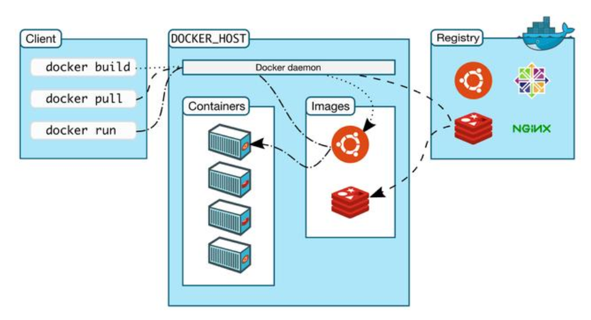
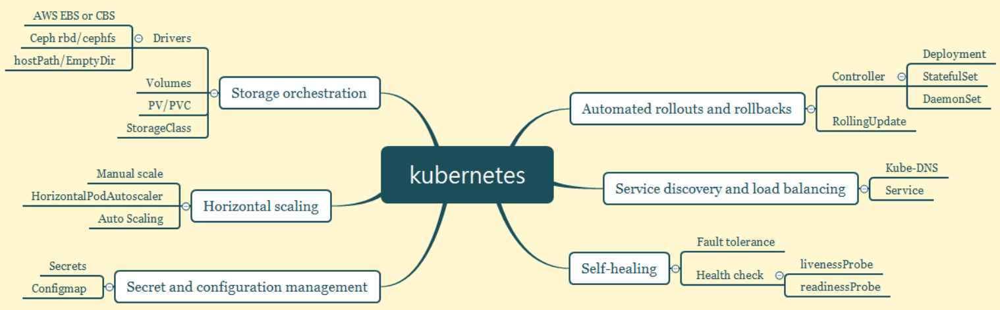
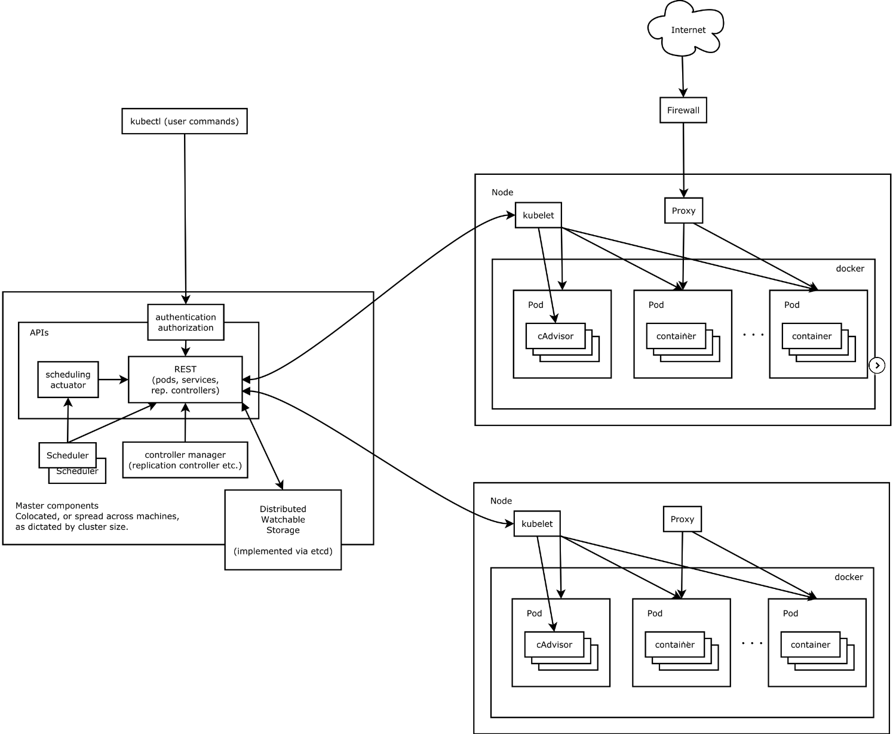

- [Introduction](#introduction)
  - [Docker Container](#docker-container)
  - [Kubernetes Introduction](#kubernetes-introduction)
  - [Kubernetes Architecture](#kubernetes-architecture)

# Introduction

## Docker Container

> Docker provides a way to run applications securely isolated in a container, packaged with all its dependencies and libraries.Build once, Run anywhwere.

`Docker` 提供了一種將應用程式安全且隔離運行的一種方式, 能夠將應用程式 dependency 和 package files 打包於一個容器中, 後續即可在任何地方運行, 達到 **bulild one, run anywhere** 的目的

Docker 組成元件:

- Docker Daemon: 容器管理組件, 負責負載容器, 鏡像, 存儲, 網絡等管理
- Docker Client: 容器客戶端, 負責與 `Docker Daemon` 交互並完成容器生命週期管理
- Docker Registry: 容器鏡像倉庫, 負責儲存, 分發及打包
- Docker Object: 容器物件, 主要包含 `cointainer` 和 `image`

容器為應用程式開發環境帶來極高的便利性, 從根本上解決了容器的環境依賴, 打包等問題

然而容器帶來的便利性同時也夾帶著新的挑戰:

- 容器如何調度, 分發
- 多台機器如何協同工作
- Docker 主機故障時應用如何復原
- 如何保障應用 HA 及實現 autoscaling

## Kubernetes Introduction

> Kubernetes (K8s) is an open-source system for automating deployment, scaling, and management of containerized applications.It groups containers that make up an application into logical units for easy management and discovery. Kubernetes builds upon15 years of experience of running production workloads at Google, combined with best-of-breed ideas and practices from the community.

`Kubernetes` 是 Google 開源的一個容器編排引擎, 提供容器化應用的自動化部署, 水平擴展及管理, 為 Google 內部容器十多年沈澱的結晶, 已經戰勝 `Swarm`, `Mesos`, 成為容器編排界的標準

三大容器編排引擎現況:

- Swarm: Docker 原生提供的容器編排引擎, 隨著 Docker 支持 Kubernetes 而逐漸廢棄
- Mesos: 結合 Marathon 提供容器編排調度的能力, 還能提供其他 framwork 調度
- Kubernetes: 已成為容器編排引擎的唯一標準

Kubernetes 內建有非常多優秀的特性使得開發者能更專注於業務本身, 其包含的功能如下:

- Service discovery and load balancing: 通過 DNS 實現內部解析, service 負載均衡
- Storage orchestration: 通過 plugins 形式支持多種存儲方式, 如 local, nfs, ceph, public cloud storage 等
- Automated rollouts and rollbacks: 通過匹配當前與目標狀態一致, 更新失敗時可回滾
- Automatic bin packing: 自動資源調度, 可以設置 pod 調度所需資源 (requests) 及限制 (limits)
- Self-healing: 自動發現及處理集群內異常, 更換或重啟 pod
- Secret and configuration management: 私鑰配置管理, 對於敏感資訊通過 secret 儲存, 應用的配置文件通過 configmap 儲存, 避免將配置文件寫死於鏡像中以增加容器編排靈活性
- Batch execution: 通過 job 和 cornjob 提供單次批次處理任務和循環計畫任務功能
- Horizontal scaling: 水平擴充功能, 包含 HPA 和 AS, 即應用基於 CPU Usage 的彈性伸縮和基於平台級的彈性伸縮, 如自動增刪 node 節點

## Kubernetes Architecture

`Kubernetes` 包含兩種角色: master node & worker node

`Master node` 為負責 cluster 中控制管理的節點, 為 k8s cluster 的核心:

- kube-apiserver: 負責處理集群所有 requests, 為 cluster 入口
- kube-controller-scheduler: 負責集群資源調度, 通過 `watch` 監控 `pod` 的創建, 負責將 `pod` 調度到合適的 worker node
- kube-controller-manager: 通過多種控制器確保集群一致性, 如 `Node Controller`, `Replication Controller`, `Endpoints Controller` 等
- etcd: metadata storage, 負責儲存集群中 `node`, `pod`, `rc`, `service` 等資料

`Woker node` 為實際的工作節點, 負責集群負載的實際運行, 即 `pod` 運行的載體, 通常包含三個組件: `Container`, `Runtime`, `kubelet` 和 `kube-proxy`

- `Container Runtime` 主要負責實現 container 生命週期管理, 如 `docker`, `containerd`, `rktlet` 等
- `kubelet` 負責 image 和 pod 的管理
- `kube-proxy` 為 service 實現的抽象, 負責維護和轉發 pod 的 routing, 實現集群內部和外部網絡的訪問

其他組件還包括:

- cloud-controller-manager: 用於 public cloud interface, 提供節點管理, 路由管理, 服務管理, 存儲管理等功能, 需由 public cloud 廠商實現具體細節
- DNS: `kube-dns` 或 `coredns` 實現集群內的 domain name parsing
- `kubernetes-dashboard`: 提供 GUI 管理介面
- `kubectl`: 與集群進行交互
- 服務外部接口, 通過 `ingress` 實現第七層接口, 由多種 `controller` 組成:
  - traefik
  - nginx ingress controller
  - haproxy ingress controller
  - public cloud ingress controller
- Methics Monitor:
  - metric-server
  - prometheus
- Log
  - Fluentd
  - Elasticsearch
  - Kibana

