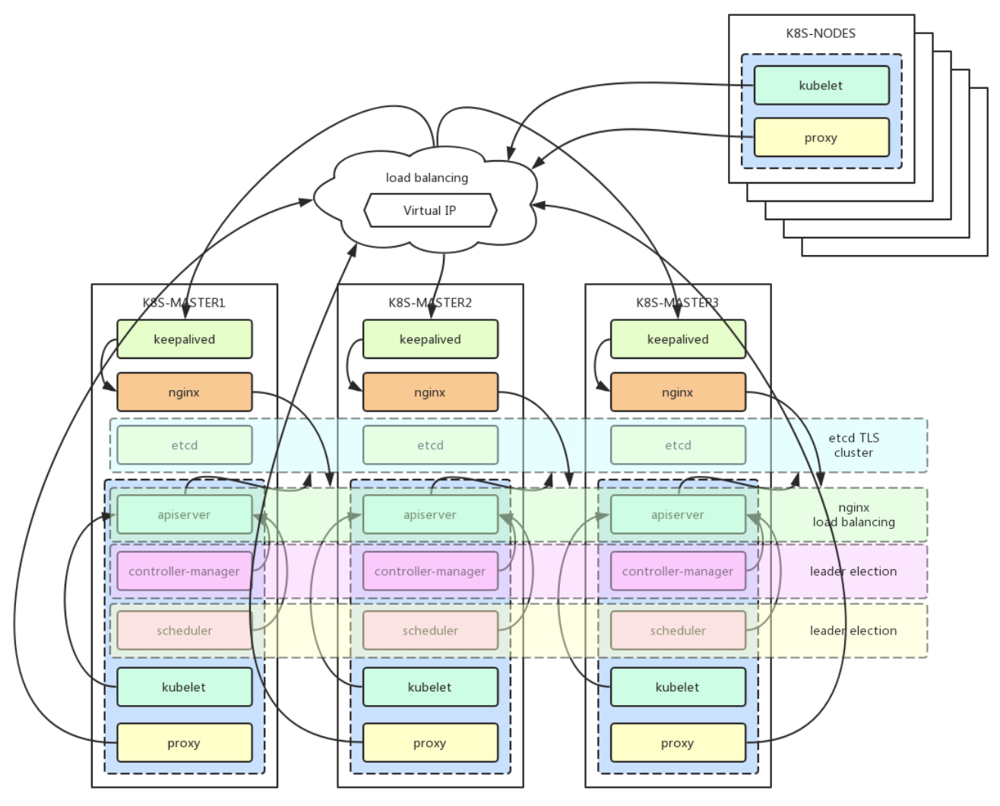
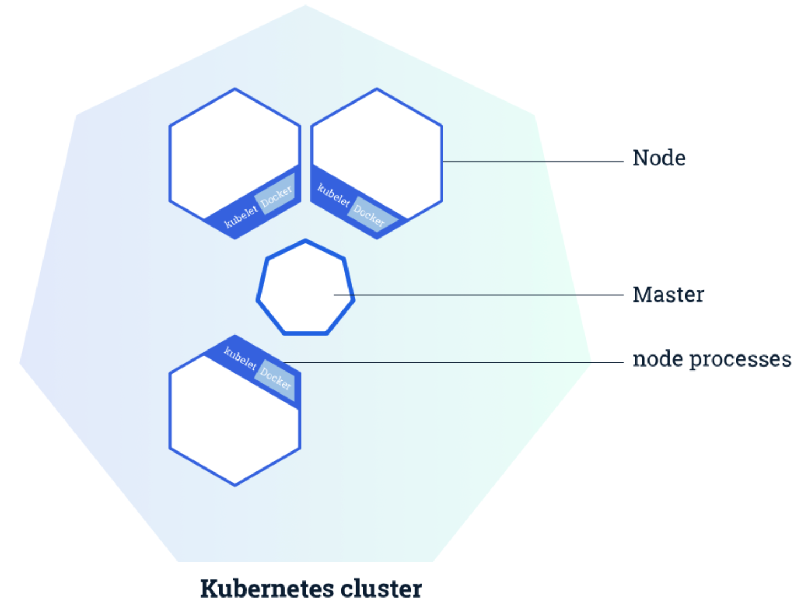
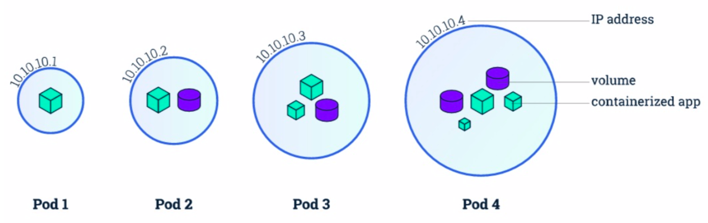
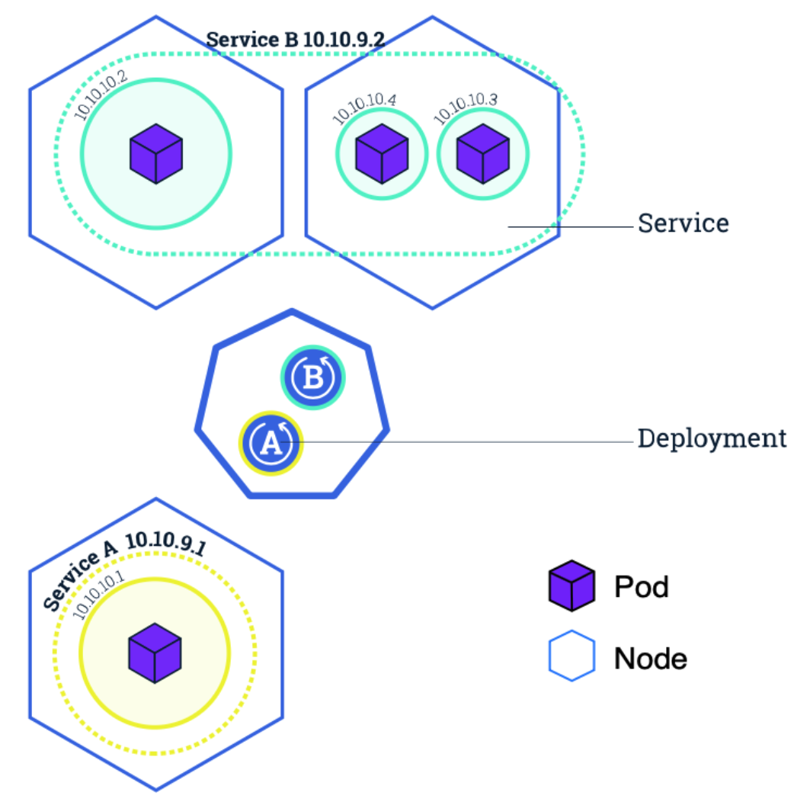
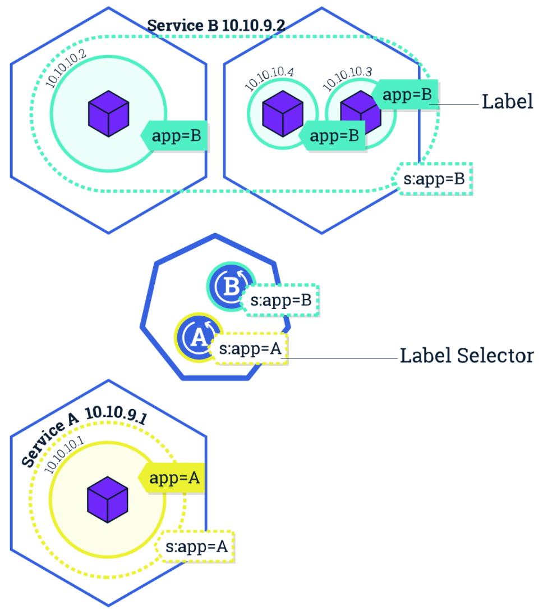

- [Introduction](#introduction)
  - [Docker Container](#docker-container)
  - [Kubernetes Introduction](#kubernetes-introduction)
  - [Kubernetes Architecture](#kubernetes-architecture)
  - [Kubernetes High Availability](#kubernetes-high-availability)
- [Kubernetes Deployment](#kubernetes-deployment)
- [Kubernetes Quick Start](#kubernetes-quick-start)
  - [Basic Concept](#basic-concept)
    - [Cluster & Node](#cluster--node)
    - [Container & Application](#container--application)
    - [Service Access](#service-access)
  - [Create Application](#create-application)

# Introduction

## Docker Container

> Docker provides a way to run applications securely isolated in a container, packaged with all its dependencies and libraries.Build once, Run anywhwere.

`Docker` 提供了一種將應用程式安全且隔離運行的一種方式, 能夠將應用程式 dependency 和 package files 打包於一個容器中, 後續即可在任何地方運行, 達到 **bulild one, run anywhere** 的目的


Docker 組成元件:

- Docker Daemon: 容器管理組件, 負責負載容器, 鏡像, 存儲, 網絡等管理
- Docker Client: 容器客戶端, 負責與 `Docker Daemon` 交互並完成容器生命週期管理
- Docker Registry: 容器鏡像倉庫, 負責儲存, 分發及打包
- Docker Object: 容器物件, 主要包含 `cointainer` 和 `image`

容器為應用程式開發環境帶來極高的便利性, 從根本上解決了容器的環境依賴, 打包等問題

然而容器帶來的便利性同時也夾帶著新的挑戰:

- 容器如何調度, 分發
- 多台機器如何協同工作
- Docker 主機故障時應用如何復原
- 如何保障應用 HA 及實現 autoscaling

## Kubernetes Introduction

> Kubernetes (K8s) is an open-source system for automating deployment, scaling, and management of containerized applications.It groups containers that make up an application into logical units for easy management and discovery. Kubernetes builds upon15 years of experience of running production `workload`s at Google, combined with best-of-breed ideas and practices from the community.

`Kubernetes` 是 Google 開源的一個容器編排引擎, 提供容器化應用的自動化部署, 水平擴展及管理, 為 Google 內部容器十多年沈澱的結晶, 已經戰勝 `Swarm`, `Mesos`, 成為容器編排界的標準

三大容器編排引擎現況:

- Swarm: Docker 原生提供的容器編排引擎, 隨著 Docker 支持 Kubernetes 而逐漸廢棄
- Mesos: 結合 Marathon 提供容器編排調度的能力, 還能提供其他 framwork 調度
- Kubernetes: 已成為容器編排引擎的唯一標準

Kubernetes 內建有非常多優秀的特性使得開發者能更專注於業務本身, 其包含的功能如下:


- Service discovery and load balancing: 通過 DNS 實現內部解析, service 負載均衡
- Storage orchestration: 通過 plugins 形式支持多種存儲方式, 如 local, nfs, ceph, public cloud storage 等
- Automated rollouts and rollbacks: 通過匹配當前與目標狀態一致, 更新失敗時可回滾
- Automatic bin packing: 自動資源調度, 可以設置 pod 調度所需資源 (requests) 及限制 (limits)
- Self-healing: 自動發現及處理集群內異常, 更換或重啟 pod
- Secret and configuration management: 私鑰配置管理, 對於敏感資訊通過 secret 儲存, 應用的配置文件通過 configmap 儲存, 避免將配置文件寫死於鏡像中以增加容器編排靈活性
- Batch execution: 通過 job 和 cornjob 提供單次批次處理任務和循環計畫任務功能
- Horizontal scaling: 水平擴充功能, 包含 HPA 和 AS, 即應用基於 CPU Usage 的彈性伸縮和基於平台級的彈性伸縮, 如自動增刪 node 節點

## Kubernetes Architecture


`Kubernetes` 包含兩種角色: `master` & `node`

`Master` 為負責 cluster 中控制管理的節點, 為 k8s cluster 的核心:

- kube-apiserver: 負責處理集群所有 requests, 為 cluster 入口
- kube-controller-scheduler: 負責集群資源調度, 通過 `watch` 監控 `pod` 的創建, 負責將 `pod` 調度到合適的 worker node
- kube-controller-manager: 通過多種控制器確保集群一致性, 如 `Node Controller`, `Replication Controller`, `Endpoints Controller` 等
- etcd: metadata storage, 負責儲存集群中 `node`, `pod`, `rc`, `service` 等資料

`Node` 為實際的工作節點, 負責集群負載的實際運行, 即 `pod` 運行的載體, 通常包含三個組件: `Container`, `Runtime`, `kubelet` 和 `kube-proxy`

- `Container Runtime` 主要負責實現 container 生命週期管理, 如 `docker`, `containerd`, `rktlet` 等
- `kubelet` 負責 image 和 pod 的管理
- `kube-proxy` 為 service 實現的抽象, 負責維護和轉發 pod 的 routing, 實現集群內部和外部網絡的訪問

其他組件還包括:

- cloud-controller-manager: 用於 public cloud interface, 提供節點管理, 路由管理, 服務管理, 存儲管理等功能, 需由 public cloud 廠商實現具體細節
- DNS: `kube-dns` 或 `coredns` 實現集群內的 domain name parsing
- `kubernetes-dashboard`: 提供 GUI 管理介面
- `kubectl`: 與集群進行交互
- 服務外部接口, 通過 `ingress` 實現第七層接口, 由多種 `controller` 組成:
  - traefik
  - nginx ingress controller
  - haproxy ingress controller
  - public cloud ingress controller
- Methics Monitor:
  - metric-server
  - prometheus
- Log
  - Fluentd
  - Elasticsearch
  - Kibana

## Kubernetes High Availability

K8s HA cluster 通常由 3 ~ 5 個節點組成, 需要保障各個節點的高可用性

- etcd: 內建集群機制, 保障資料持久化儲存
- kube-apiserver: stateless api service, 有 loading balancer 做負載均衡, 如 `haproxy` 或 `nginx`
- kube-scheduler: 內建選舉機制, 保障 scheduler HA, 確保同個時間只有一個 Master Node 運作, 其他處於 blocking 以防止腦裂
- kube-controller-manager: 內建選舉機制保障 controller HA, 機制同 `kube-scheduler`



# Kubernetes Deployment

# Kubernetes Quick Start

## Basic Concept

### Cluster & Node

`Kubernetes` 是一個 open source 的容器引擎管理平台, 用於實現容器的自動化部屬, 任務調度, 彈性伸縮, 負載均衡等功能

`Cluster` 是由 `Master` 和 `Node` 兩種角色組成:

- `Master` 負責管理集群, 包含 `kube-apiserver`, `kube-controller-manager`, `kube-scheduler`, `etcd`
- `Node` 負責運行容器應用, 由 `Container Runtime`, `kubelet` 和 `kube-proxy` 組成, 其中 `Container Runtime` 可能為 `Docker`, `rke`, `containerd`, `Node` 可由實體機或 VM 組成



查看 `Master` component 狀態:

```shell
➜  Go git:(main) ✗ kubectl get componentstatuses 
NAME                 STATUS    MESSAGE             ERROR
scheduler            Healthy   ok                  
controller-manager   Healthy   ok                  
etcd-0               Healthy   {"health":"true"}   
```

查看 `Node` 列表:

```shell
➜  Go git:(main) ✗ kubectl get nodes            
NAME             STATUS   ROLES           AGE   VERSION
docker-desktop   Ready    control-plane   13h   v1.25.0
```

查看 `Node` 詳細資料:

```shell
➜  Go git:(main) ✗ kubectl describe node docker-desktop                         
Name:               docker-desktop
Roles:              control-plane
Labels:             beta.kubernetes.io/arch=arm64
                    beta.kubernetes.io/os=linux
                    kubernetes.io/arch=arm64
                    kubernetes.io/hostname=docker-desktop
                    kubernetes.io/os=linux
                    node-role.kubernetes.io/control-plane=
                    node.kubernetes.io/exclude-from-external-load-balancers=
Annotations:        kubeadm.alpha.kubernetes.io/cri-socket: unix:///var/run/cri-dockerd.sock
                    node.alpha.kubernetes.io/ttl: 0
                    volumes.kubernetes.io/controller-managed-attach-detach: true
CreationTimestamp:  Thu, 08 Sep 2022 09:02:20 +0800
Taints:             <none>
Unschedulable:      false
Lease:
  HolderIdentity:  docker-desktop
  AcquireTime:     <unset>
  RenewTime:       Thu, 08 Sep 2022 23:01:32 +0800
Conditions:
  Type             Status  LastHeartbeatTime                 LastTransitionTime                Reason                       Message
  ----             ------  -----------------                 ------------------                ------                       -------
  MemoryPressure   False   Thu, 08 Sep 2022 23:01:23 +0800   Thu, 08 Sep 2022 09:02:19 +0800   KubeletHasSufficientMemory   kubelet has sufficient memory available
  DiskPressure     False   Thu, 08 Sep 2022 23:01:23 +0800   Thu, 08 Sep 2022 09:02:19 +0800   KubeletHasNoDiskPressure     kubelet has no disk pressure
  PIDPressure      False   Thu, 08 Sep 2022 23:01:23 +0800   Thu, 08 Sep 2022 09:02:19 +0800   KubeletHasSufficientPID      kubelet has sufficient PID available
  Ready            True    Thu, 08 Sep 2022 23:01:23 +0800   Thu, 08 Sep 2022 09:02:51 +0800   KubeletReady                 kubelet is posting ready status
Addresses:
  InternalIP:  192.168.65.4
  Hostname:    docker-desktop
Capacity:
  cpu:                5
  ephemeral-storage:  61202244Ki
  hugepages-1Gi:      0
  hugepages-2Mi:      0
  hugepages-32Mi:     0
  hugepages-64Ki:     0
  memory:             8141992Ki
  pods:               110
Allocatable:
  cpu:                5
  ephemeral-storage:  56403987978
  hugepages-1Gi:      0
  hugepages-2Mi:      0
  hugepages-32Mi:     0
  hugepages-64Ki:     0
  memory:             8039592Ki
  pods:               110
System Info:
  Machine ID:                 9e4f7c24-1e51-4625-96d1-402ad5f48c7b
  System UUID:                9e4f7c24-1e51-4625-96d1-402ad5f48c7b
  Boot ID:                    07acd8a4-aecc-457c-bb74-2fa4a1dce0ae
  Kernel Version:             5.10.124-linuxkit
  OS Image:                   Docker Desktop
  Operating System:           linux
  Architecture:               arm64
  Container Runtime Version:  docker://20.10.17
  Kubelet Version:            v1.25.0
  Kube-Proxy Version:         v1.25.0
Non-terminated Pods:          (11 in total)
  Namespace                   Name                                          CPU Requests  CPU Limits  Memory Requests  Memory Limits  Age
  ---------                   ----                                          ------------  ----------  ---------------  -------------  ---
  kube-system                 coredns-95db45d46-ck87t                       100m (2%)     0 (0%)      70Mi (0%)        170Mi (2%)     13h
  kube-system                 coredns-95db45d46-t24qb                       100m (2%)     0 (0%)      70Mi (0%)        170Mi (2%)     13h
  kube-system                 etcd-docker-desktop                           100m (2%)     0 (0%)      100Mi (1%)       0 (0%)         13h
  kube-system                 kube-apiserver-docker-desktop                 250m (5%)     0 (0%)      0 (0%)           0 (0%)         13h
  kube-system                 kube-controller-manager-docker-desktop        200m (4%)     0 (0%)      0 (0%)           0 (0%)         13h
  kube-system                 kube-proxy-wmms8                              0 (0%)        0 (0%)      0 (0%)           0 (0%)         13h
  kube-system                 kube-scheduler-docker-desktop                 100m (2%)     0 (0%)      0 (0%)           0 (0%)         13h
  kube-system                 storage-provisioner                           0 (0%)        0 (0%)      0 (0%)           0 (0%)         13h
  kube-system                 vpnkit-controller                             0 (0%)        0 (0%)      0 (0%)           0 (0%)         13h
  kubernetes-dashboard        dashboard-metrics-scraper-74cb589b78-x7nwh    0 (0%)        0 (0%)      0 (0%)           0 (0%)         17m
  kubernetes-dashboard        kubernetes-dashboard-58f74559b-pqk5j          0 (0%)        0 (0%)      0 (0%)           0 (0%)         17m
Allocated resources:
  (Total limits may be over 100 percent, i.e., overcommitted.)
  Resource           Requests    Limits
  --------           --------    ------
  cpu                850m (17%)  0 (0%)
  memory             240Mi (3%)  340Mi (4%)
  ephemeral-storage  0 (0%)      0 (0%)
  hugepages-1Gi      0 (0%)      0 (0%)
  hugepages-2Mi      0 (0%)      0 (0%)
  hugepages-32Mi     0 (0%)      0 (0%)
  hugepages-64Ki     0 (0%)      0 (0%)
Events:              <none>
```

### Container & Application

`Kubernetes` 是容器編排引擎, 其負責容器調度, 管理及運行, 但其調度的最小單位並非為 `container`, 而是 `pod`

通常集群中不會直接運行 `pod`, 而是通過各種 `workload` 的控制器如 `Deployments`, `ReplicaSets`, `DaemonSets` 的方式運行, 因為控制器能夠保證 `pod` 狀態的一致性, 簡單來說就是當 `pod` 發生異常, 控制器會在其他節點重建, 以確保集群當前運行的 `pod` 和預期設定的狀態一致

- pod 為 k8s 中運行的最小單位
- pod 中包含一個或多個容器
- pod 不會單獨運行, 需要透過 `workload` 控制器, 如 `Deployments`, `ReplicaSets`, `DaemonSets`, `CronJobs` 等



- Container: 容器是一種輕量化的虛擬化技術, 通過將應用封裝在鏡像中以實現快速部署及應用分發
- Pod: Kubernetes 中最小的調度單位, 用於封裝容器, 包含一個 `pause` 容器和應用容器, 容器間共享相同的 `namespace`, 網絡, storage 和 process
- Deployments: 為一種控制器, 負責控制 `workload` 的 `replicas`, 通過 `kube-controller-manager` 中的 `Depolyments Controller` 實現副本數量狀態的控制

### Service Access

`Kubernetes` 中 `pod` 是實際運行的載體, `pod` 依附於 `node` 中, `node` 可能會出現故障, `kubernetes` 的控制器如 `replicasets` 會在其他 node 上重新建立一個 `pod`, 新的 `pod` 會分配一個新的 IP

應用部署時會包含多個 `replicas`, 如同一個應用部署了 3 個 pod 副本, pod 相當於 backend 中的 real server, 那該如何處理三個應用請求?

一般會在 real server 前加一個 load balancer, 而 `service` 就是 pod 的 load balancer, `service` 將動態的 pod 抽象為一個服務, 應用程式直接請求 service 即, `service` 會負責自動將請求轉發到後端的 pod

負責 `service` 轉發規則有兩種機制: `iptables` 和 `ipvs`, `iptables` 通過設置 `DNAT` 等規則實現 loading balance, `ipvs` 通過 `ipvsadm` 設置轉發規則



根據不同的請求方式, `service` 分為以下幾種類型: `CLusterIP`, `NodePort`, `LoadBalancer` 和 `_ExternalName`, 可通過 `type` 設置:

- ClusterIP: 集群內部請求, 與 DNS 結合實現集群內部的 service discovery
- NodePort: 透過 NAT 的方式將每個 node 暴露一個 port 實現外部訪問
- LoadBalancer: 實現 public cloud 外部接入的 interface
- ExternalName: 將外部請求以 domain name 轉發的方式轉發到集群, 須依附具體的外部實現如 `nginx`, `traefik` 等

pod 是動態變化的, ip address 可能會隨時改變(如 node 故障); replicas 也可能隨著應用 scale up 而改變; `service` 是透過 `labels` 來偵測 pod 的動態變化

`labels` 會自動出某個應用的 endpoints, 當 pod 產生變化時會自動更新 endpoints, 不同的應用由不同的 `label` 組成, 相關文件可以參考: [https://kubernetes.io/docs/concepts/overview/working-with-objects/labels/](https://kubernetes.io/docs/concepts/overview/working-with-objects/labels/)



## Create Application

`Kubernetes` 中包含各種 `workload`, 如無狀態的 `Deployments`, 有狀態的 `StatefulSets`, daemon 的 `DaemonSets` 等

每種 `workload` 都分別對應不同的應用場景, 下面範例以 `Deployments` 為例, 其他 workload 操作方式類似

一般而言在 `kubernetes` 中部署應用均已 yaml 文件方式部署, 但先以簡單的 kubectl command line 的方式實現 API 操作

首先部署 nginx application 並部署三個副本:

```shell
➜  Go git:(main) ✗ kubectl run nginx-app-demo --image=nginx:1.7.9 --port=80 --replicas=3 
kubectl run --generator=deployment/apps.v1 is DEPRECATED and will be removed in a future version. Use kubectl run --generator=run-pod/v1 or kubectl create instead.
deployment.apps/nginx-app-demo created
```

查看 deployments 列表, 可以看到當前 pod 狀態均以正常, `Ready` 為當前狀態, `Availabel` 為目標狀態

查看 deployment 詳細資訊, 可以發現 Deployments 是通過 ReplicaSets 來控制副本數量及 pod 數量:

```shell
➜  Go git:(main) ✗ kubectl describe deployments nginx-app-demo 
Name:                   nginx-app-demo     
Namespace:              default            
CreationTimestamp:      Sun, 11 Aug 2019 21:52:32 +0800
Labels:                 run=nginx-app-demo 
Annotations:            deployment.kubernetes.io/revision: 1
Selector:               run=nginx-app-demo
Replicas:               3 desired | 3 updated | 3 total | 3 available | 0 unavailable
StrategyType:           RollingUpdate     RollingUpdate
MinReadySeconds:        0
RollingUpdateStrategy:  25% max unavailable, 25% max surge 
Pod Template:   
  Labels:  run=nginx-app-demo
  Containers:
   nginx-app-demo:
    Image:        nginx:1.7.9
    Port:         80/TCP
    Host Port:    0/TCP
    Environment:  <none>
    Mounts:       <none>
  Volumes:        <none>
Conditions:  
  Type           Status  Reason
  ----           ------  ------
  Available      True    MinimumReplicasAvailable
  Progressing    True    NewReplicaSetAvailable
OldReplicaSets:  <none>
NewReplicaSet:   nginx-app-demo-7bdfd97dcd (3/3 replicas created) 
Events:  
  Type    Reason             Age    From                   Message
  ----    ------             ----   ----                   -------
  Normal  ScalingReplicaSet  3m24s  deployment-controller  Scaled up replica set nginx-app-demo-7bdfd97dcd to 3
```

查看 `replicasets`, 可以看到 `replicasets` 生成了三個 pod:

```shell
# list replicasets
➜  Go git:(main) ✗ kubectl get replicasets
NAME                        DESIRED   CURRENT   READY   AGE
nginx-app-demo-7bdfd97dcd   3         3         3       9m9s

# check replicasets detail infomation
➜  Go git:(main) ✗ kubectl describe replicasets nginx-app-demo-7bdfd97dcd 
Name:           nginx-app-demo-7bdfd97dcd
Namespace:      default
Selector:       pod-template-hash=7bdfd97dcd,run=nginx-app-demo
Labels:         pod-template-hash=7bdfd97dcd 
                run=nginx-app-demo
Annotations:    deployment.kubernetes.io/desired-replicas: 3 
                deployment.kubernetes.io/max-replicas: 4
                deployment.kubernetes.io/revision: 1
Controlled By:  Deployment/nginx-app-demo 
Replicas:       3 current / 3 desired
Pods Status:    3 Running / 0 Waiting / 0 Succeeded / 0 Failed
Pod Template:  
  Labels:  pod-template-hash=7bdfd97dcd
           run=nginx-app-demo
  Containers:
   nginx-app-demo:
    Image:        nginx:1.7.9
    Port:         80/TCP
    Host Port:    0/TCP
    Environment:  <none>
    Mounts:       <none>
  Volumes:        <none>
Events: 
  Type    Reason            Age    From                   Message
  ----    ------            ----   ----                   -------
  Normal  SuccessfulCreate  9m25s  replicaset-controller  Created pod: nginx-app-demo-7bdfd97dcd-hsrft
  Normal  SuccessfulCreate  9m25s  replicaset-controller  Created pod: nginx-app-demo-7bdfd97dcd-qtbzd
  Normal  SuccessfulCreate  9m25s  replicaset-controller  Created pod: nginx-app-demo-7bdfd97dcd-7t72x
```

查看 `pod` 狀態, 作為實際應用部署的載體, `pod` 中部署了一個 nginx 的 container 並分配了一個 ip, 可通過該 ip 直接訪問應用:

```shell
# list pod
➜  Go git:(main) ✗ kubectl get pods
NAME                              READY   STATUS    RESTARTS   AGE
nginx-app-demo-7bdfd97dcd-7t72x   1/1     Running   0          13m
nginx-app-demo-7bdfd97dcd-hsrft   1/1     Running   0          13m
nginx-app-demo-7bdfd97dcd-qtbzd   1/1     Running   0          13m

# check pod detail infomation

➜  Go git:(main) ✗ kubectl describe pods nginx-app-demo-7bdfd97dcd-7t72x 
Name:               nginx-app-demo-7bdfd97dcd-7t72x
Namespace:          default
Priority:           0
PriorityClassName:  <none>
Node:               node-3/10.254.100.103
Start Time:         Sun, 11 Aug 2019 21:52:32 +0800
Labels:             pod-template-hash=7bdfd97dcd  
                    run=nginx-app-demo
Annotations:        <none>
Status:             Running
IP:                 10.244.2.4 
Controlled By:      ReplicaSet/nginx-app-demo-7bdfd97dcd 
Containers:   
  nginx-app-demo:
    Container ID:   docker://5a0e5560583c5929e9768487cef43b045af4c6d3b7b927d9daf181cb28867766
    Image:          nginx:1.7.9
    Image ID:       docker-pullable://nginx@sha256:e3456c851a152494c3e4ff5fcc26f240206abac0c9d794affb40e0714846c451
    Port:           80/TCP
    Host Port:      0/TCP
    State:          Running
      Started:      Sun, 11 Aug 2019 21:52:40 +0800
    Ready:          True
    Restart Count:  0
    Environment:    <none>
    Mounts:
      /var/run/secrets/kubernetes.io/serviceaccount from default-token-txhkc (ro)
Conditions: 
  Type              Status
  Initialized       True 
  Ready             True 
  ContainersReady   True 
  PodScheduled      True 
Volumes:    
  default-token-txhkc:
    Type:        Secret (a volume populated by a Secret)
    SecretName:  default-token-txhkc
    Optional:    false
QoS Class:       BestEffort 
Node-Selectors:  <none> 
Tolerations:     node.kubernetes.io/not-ready:NoExecute for 300s
                 node.kubernetes.io/unreachable:NoExecute for 300s
Events:  #事件状态，拉镜像，启动容器
  Type    Reason     Age   From               Message
  ----    ------     ----  ----               -------
  Normal  Scheduled  14m   default-scheduler  Successfully assigned default/nginx-app-demo-7bdfd97dcd-7t72x to node-3
  Normal  Pulling    14m   kubelet, node-3    Pulling image "nginx:1.7.9"
  Normal  Pulled     14m   kubelet, node-3    Successfully pulled image "nginx:1.7.9"
  Normal  Created    14m   kubelet, node-3    Created container nginx-app-demo
  Normal  Started    14m   kubelet, node-3    Started container nginx-app-demo
```